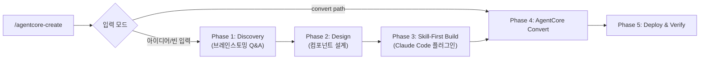

# AgentCore Creator 개요

AgentCore Creator는 Claude Code 플러그인을 Amazon Bedrock AgentCore로 변환하고 배포하는 플러그인입니다. 대화형 5단계 워크플로우를 통해 에이전트를 설계, 빌드, 배포할 수 있습니다. 배포 경로는 두 가지 — **AgentCore harness**(설정만으로 배포, 2026-06 GA: 스킬을 SKILL.md 그대로 git/s3 소스로 attach)와 **AgentCore Runtime**(Strands 코드 생성)을 Phase 2에서 선택합니다.

## 구성 요소

### 에이전트 (1개)

| 에이전트 | 설명 | 출력물 |
|----------|------|--------|
| `agentcore-creator-agent` | 대화형 5단계 에이전트 설계, 빌드, AgentCore 배포 | Strands Agent + 배포 스크립트 |

### 스킬 (1개)

| 스킬 | 설명 |
|------|------|
| `agentcore-create` | 5-Phase 변환 워크플로우: Discovery → Design → Skill-First Build → AgentCore Convert → Deploy |

## 사전 요구사항

- `bedrock-agentcore-mcp-server` MCP 서버 설정 필요
- AWS 계정 및 Bedrock AgentCore 접근 권한

## 워크플로우

### 5-Phase 상세

| Phase | 이름 | 설명 |
|-------|------|------|
| 1 | Discovery | 에이전트 요구사항 브레인스토밍 (목적, 사용자, 도구, 지식) |
| 2 | Design | 컴포넌트 블루프린트 설계 (스킬, 레퍼런스, 메모리, 게이트웨이, Bedrock 모델 선택 — Opus/Sonnet/Haiku/Fable 5) + **배포 타깃 결정(harness vs Runtime)** |
| 3 | Skill-First Build | Claude Code 플러그인으로 먼저 빌드하여 로컬 테스트 |
| 4 | AgentCore Convert | Path A: harness 설정 생성(코드 없음) / Path B: `convert_plugin_to_agentcore.py`로 Strands 코드 생성 |
| 5 | Deploy & Verify | harness: `CreateHarness`→`InvokeHarness` 스모크 / Runtime: `agentcore configure/deploy/invoke` CLI (선택: AgentCore Evaluations) |

## AgentCore 구성 요소

| 기능 | 설명 |
|------|------|
| Harness | 관리형 오케스트레이션 루프 (2026-06 GA) — 모델·instructions·tools·skills를 설정으로 선언, 스킬은 SKILL.md 표준 그대로 git/s3에서 attach, built-in memory, 버저닝/엔드포인트, Step Functions 통합 |
| Runtime | `@app.entrypoint` 래퍼가 포함된 Strands Agent Python 코드 |
| Memory | STM (단기 이벤트) + LTM (장기 시맨틱) 메모리 전략 |
| Gateway | MCP 서버를 Lambda, OpenAPI, Smithy 타겟으로 매핑(HTTP passthrough, Runtime 타겟 등 확장된 타겟 타입도 지원) |
| Tools | AgentCore Tool 포맷으로 변환된 도구 정의 |

## Auto-Invocation 키워드

| 한국어 | English |
|--------|---------|
| 에이전트코어 생성 | agentcore create |
| 에이전트코어 변환 | convert to agentcore |
| 에이전트코어 배포 | agentcore deploy |
| 에이전트 배포 | deploy agent |
| 베드락 에이전트 | bedrock agent |
| 런타임 배포 | runtime deploy |
| 하네스 배포 | agentcore harness |
