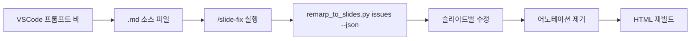

# Slide Fix Skill

Issue annotation 기반 슬라이드 수정 스킬. VSCode Extension의 프롬프트 바에서 삽입된 `<!-- issue: -->` 어노테이션을 읽고, 각 슬라이드를 수정한 뒤 어노테이션을 제거하고 HTML을 재빌드합니다.

## Trigger Keywords

- `/slide-fix`

## 워크플로우



## 작동 방식

### 1. Issue 삽입 (VSCode Extension)

VSCode Extension의 사이드바 프롬프트 바에서 슬라이드별 이슈를 입력하면, 소스 `.md` 파일에 HTML 코멘트로 삽입됩니다:

```markdown
# 슬라이드 제목

<!-- issue: 비교 표가 누락됨 - ECS vs EKS 비교 추가 필요 -->

기존 슬라이드 내용...
```

### 2. Issue 추출

```bash
# JSON 형식으로 이슈 목록 추출
python3 remarp_to_slides.py issues <project-dir>/ --json
```

출력:
```json
[
  {
    "file": "01-introduction.md",
    "slide": 5,
    "issue": "비교 표가 누락됨 - ECS vs EKS 비교 추가 필요"
  }
]
```

### 3. 수정 및 정리

`/slide-fix` 실행 시:
1. `issues --json`으로 전체 이슈 목록을 수집
2. 각 슬라이드를 이슈 내용에 따라 수정
3. `<!-- issue: -->` 코멘트를 소스 파일에서 제거
4. `remarp_to_slides.py build`로 HTML 재빌드

## VSCode Extension 연동

| 기능 | 설명 |
|------|------|
| 프롬프트 바 | 사이드바 하단 입력 필드 → `<!-- issue: -->` 삽입 |
| Issue 배지 | 사이드바에 노란 배지로 이슈 표시, × 버튼으로 제거 |
| Submit Issues | `remarp.submitIssues` 명령 → Claude Code에서 `/slide-fix` 실행 가이드 |

## 사용 예시

```
/slide-fix
```

Claude Code가 자동으로:
1. 프로젝트 디렉토리에서 이슈 어노테이션 검색
2. 각 이슈를 분석하고 슬라이드 수정
3. 어노테이션 제거
4. HTML 재빌드

## Quality Review

수정 후 `content-review-agent`를 통한 품질 검토는 선택적입니다 (이미 개별 슬라이드 수정이므로).
