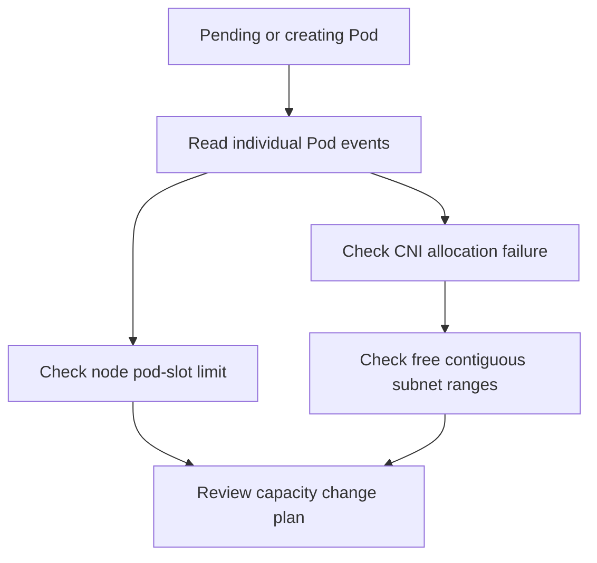
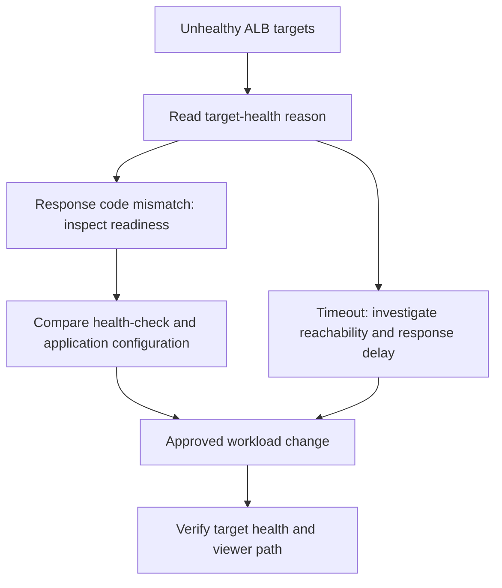

# Network Diagnosis Demo

This is an illustrative diagnosis, not a live assessment or a promise of recovery.
Every output below is synthetic example data. Use the current skill's execution
contract and the selected environment's evidence before approving a change.

## Scenario Overview {#scenario-overview}

Two independent examples distinguish node/subnet capacity from application readiness.
Commands are read-only. First confirm the authorized AWS account, region and Kubernetes
context; replace example resource names and placeholder variables with explicitly
selected resources. Keep those selections throughout the investigation.

## Scenario 1: IP Exhaustion {#scenario-1-ip-exhaustion}

This synthetic case has two constraints: some Pods cannot obtain a scheduler pod
slot, while another scheduled Pod cannot obtain network addresses. Do not merge
these into a single capacity calculation.

### Problem Report {#problem-report}

The example operator reports an unscheduled API Pod and a worker stuck creating its
network sandbox. Read each Pod's own events before selecting a remedy.

### Diagnosis Workflow {#diagnosis-workflow}



### Step 1: Identify the Problem {#step-1-identify-the-problem}

```bash
kubectl get pods -A -o wide
kubectl describe pod api-server-pending -n backend
kubectl describe pod worker-net-pending -n backend
```

Illustrative event excerpts from two different Pods:

```text
api-server-pending:
  FailedScheduling: Insufficient pods
worker-net-pending:
  FailedCreatePodSandBox: failed to assign an IP address to container
```

`Insufficient pods` is scheduler evidence about pod-slot capacity. The sandbox event
is separate evidence of a CNI allocation failure; it does not establish its cause alone.

### Step 2: Check Subnet IP Availability {#step-2-check-subnet-ip-availability}

Select the affected node/pod subnet IDs from the environment's network inventory.

```bash
SUBNET_A="<selected-subnet-a>"
SUBNET_B="<selected-subnet-b>"
SUBNET_C="<selected-subnet-c>"
aws ec2 describe-subnets --subnet-ids "$SUBNET_A" "$SUBNET_B" "$SUBNET_C" \
  --query 'Subnets[].{SubnetId:SubnetId,Available:AvailableIpAddressCount}'
```

Illustrative response:

```json
[
  {"SubnetId": "subnet-example-a", "Available": 3},
  {"SubnetId": "subnet-example-b", "Available": 5},
  {"SubnetId": "subnet-example-c", "Available": 2}
]
```

Prefix allocation requires a free contiguous `/28` block. None of these subnets has
enough free addresses for that block; addresses across different subnets cannot be
combined. A larger free-address count alone would not prove contiguity. See the
[AWS prefix-mode guidance](https://docs.aws.amazon.com/eks/latest/best-practices/prefix-mode-linux.html).

### Step 3: Check Node Pod Limits and ENIs {#step-3-check-eni-allocation}

```bash
kubectl get nodes -o custom-columns=NAME:.metadata.name,ALLOCATABLE_PODS:.status.allocatable.pods
INSTANCE_ID="<selected-node-instance-id>"
aws ec2 describe-network-interfaces --filters "Name=attachment.instance-id,Values=$INSTANCE_ID" \
  --query 'NetworkInterfaces[].{ENI:NetworkInterfaceId,Subnet:SubnetId,Prefixes:Ipv4Prefixes}'
```

Illustrative node excerpt; this is configured capacity, not a universal instance limit:

```text
NAME             ALLOCATABLE_PODS
example-node-a   17
example-node-b   17
example-node-c   17
```

The kubelet pod limit remains 17 in this example. Enabling prefix delegation does
not by itself raise an existing kubelet limit. Review both address capacity and the
node group's kubelet `max-pods` configuration; the
[AWS prefix-mode guidance](https://docs.aws.amazon.com/eks/latest/best-practices/prefix-mode-linux.html) covers that prerequisite.

### Step 4: Check CNI Configuration and IPAMD Logs {#step-4-check-ipamd-logs}

```bash
kubectl get daemonset aws-node -n kube-system -o yaml
kubectl logs -n kube-system -l k8s-app=aws-node -c aws-node --tail=50
```

Illustrative excerpts show prefix mode is already enabled and cannot allocate a block:

```text
Configuration excerpt:
  name: ENABLE_PREFIX_DELEGATION
  value: "true"
Log excerpt:
  InsufficientCidrBlocks: There are not enough free cidr blocks in the specified subnet
```

Correlate the log with the affected subnet and Pod timestamps. Do not assume an
unset toggle is the problem or infer allocated-address totals from subnet size.

### Capacity Diagnosis {#root-cause-analysis}

The synthetic evidence identifies a pod-slot constraint and a failed prefix
allocation. It does not support the old claim that changing a CNI toggle alone
restores scheduling. Do not derive an allocated-IP total or a recovery guarantee
from these excerpts.

### Resolution Planning {#resolution}

Prepare a reviewable change plan with rollback and workload-disruption controls.
Apply it only through the approved IaC and workload rollout process; no resource
mutation command is provided here.

#### Immediate Action: Assess Safe Capacity Options {#immediate-fix-enable-prefix-delegation}

Do not treat prefix delegation as a fix for exhausted or fragmented address space.
Review suitable subnet space, supported node/CNI configuration and the required
kubelet limit before a capacity rollout. AWS recommends new subnets and node groups
when existing subnets cannot supply contiguous blocks; use the linked prefix-mode
guidance and an approved migration plan.

#### Verify the Approved Change {#verify-fix}

After an authorized change, collect new evidence:

```bash
kubectl get pods -A -o wide
kubectl get nodes -o custom-columns=NAME:.metadata.name,ALLOCATABLE_PODS:.status.allocatable.pods
kubectl logs -n kube-system -l k8s-app=aws-node -c aws-node --tail=50
```

Require the intended Pod readiness, the reviewed node capacity and absence of the
original allocation failure over the observation window. Record actual results;
a successful configuration rollout alone is not proof of workload recovery.

#### Long-term: Plan Suitable Address Space {#long-term-fix-add-secondary-cidr}

Size address space from workload demand and network constraints. If new subnets,
node groups or additional VPC CIDR space are needed, review overlap, allocation,
routing and migration in IaC. Reserve contiguous ranges where appropriate; do not
substitute a universal capacity multiplier for that design work.

## Scenario 2: ALB Target Readiness Failures {#scenario-2-alb-502-errors}

This example diagnoses unhealthy targets after a workload rollout. It does not
attribute a viewer-facing 502 to a security group or infer a client-error percentage.
The existing fragment ID is retained for older links.

### Problem Report {#problem-report-1}

Target health reports unsuccessful readiness checks on two replicas. Identify the
exact target group, check path and timestamps before investigating application or
network causes.

### Diagnosis Workflow {#diagnosis-workflow-1}



### Step 1: Check Target Group Health {#step-1-check-target-group-health}

Resolve the exact target-group ARN associated with the selected ingress using the
approved resource inventory. An ALB hostname is not a target-group ARN; do not pick
the first name-substring match.

```bash
TG_ARN="<selected-target-group-arn>"
aws elbv2 describe-target-health --target-group-arn "$TG_ARN"
```

Illustrative response:

```json
{
  "TargetHealthDescriptions": [
    {
      "Target": {"Id": "10.0.1.45", "Port": 8080},
      "TargetHealth": {"State": "unhealthy", "Reason": "Target.ResponseCodeMismatch", "Description": "Health checks failed with these codes: [503]"}
    },
    {
      "Target": {"Id": "10.0.2.78", "Port": 8080},
      "TargetHealth": {"State": "unhealthy", "Reason": "Target.ResponseCodeMismatch", "Description": "Health checks failed with these codes: [503]"}
    },
    {
      "Target": {"Id": "10.0.3.112", "Port": 8080},
      "TargetHealth": {"State": "healthy"}
    }
  ]
}
```

`Target.ResponseCodeMismatch` means a response code did not match the configured
matcher. `Target.Timeout` indicates a timeout instead. A received 503 is not proof
of a security group blocking that same probe. See
[ALB target health checks and reason codes](https://docs.aws.amazon.com/elasticloadbalancing/latest/application/target-group-health-checks.html).

### Step 2: Inspect Workload Readiness {#step-2-check-pod-status}

```bash
POD_NAME="<selected-backend-pod>"
kubectl get pods -n backend -l app=api-server -o wide
kubectl logs "$POD_NAME" -n backend --tail=50
kubectl get deployment api-server -n backend -o json \
  | jq '.spec.template.spec.containers[] | {name, readinessPath:.readinessProbe.httpGet.path, readinessPort:.readinessProbe.httpGet.port}'
```

Illustrative application log excerpt:

```text
readiness path=/ready status=503 reason=dependency_unavailable
```

Inspect readiness probes, Pod readiness and application logs at matching times.
A Running phase alone is not an application-health verdict. Compare the endpoint
actually checked by ALB with the application's readiness contract.

### Step 3: Inspect the Actual Target Network Path {#step-3-check-security-groups}

Identify the security groups attached to the target's actual ENI; do not assume
node and Pod security groups are interchangeable.

```bash
TARGET_SG_ID="<selected-target-security-group-id>"
aws ec2 describe-security-group-rules --filters "Name=group-id,Values=$TARGET_SG_ID"
```

Review the ALB source group, target port, routes and applicable network controls.
The sample's HTTP response does not establish a missing ingress rule. Investigate
a timeout separately instead of treating every health failure as an SG problem.

### Step 4: Check Health Check Configuration {#step-4-check-health-check-configuration}

```bash
aws elbv2 describe-target-groups --target-group-arns "$TG_ARN" \
  --query 'TargetGroups[].{Protocol:HealthCheckProtocol,Port:HealthCheckPort,Path:HealthCheckPath,Matcher:Matcher.HttpCode}'
```

Illustrative configuration:

```json
[
  {"Protocol": "HTTP", "Port": "8080", "Path": "/ready", "Matcher": "200"}
]
```

A 503 response from this readiness path fails the 200 matcher. Correlate application
configuration and dependencies; do not widen the success matcher to hide an
unready application.

### Working Diagnosis {#root-cause-analysis-1}

The synthetic evidence supports an application-readiness investigation: ALB
receives 503 where 200 is expected, and the example application reports an unavailable
dependency. Confirm the underlying dependency/configuration fault before remediation.
Two unhealthy targets out of three does not establish a 66% request-failure rate.

### Resolution Planning {#resolution-1}

Assign the confirmed cause to its owner and prepare an approved workload change.
Preserve rollback, availability and least-privilege requirements.

#### Apply Approved Workload Remediation {#fix-security-group}

Correct the confirmed dependency or readiness configuration through the reviewed
deployment process. A security-group change is not the demonstrated remedy here.
If a separate investigation confirms a network-rule defect, change it only through
approved IaC with narrowly scoped access. Do not use ad-hoc ingress CLI commands or
open the port to the internet.

#### Verify Resolution {#verify-resolution}

Confirm that `TG_ARN` still identifies the intended target group, and reselect
`POD_NAME` from the current replicas after any rollout before collecting evidence.

```bash
aws elbv2 describe-target-health --target-group-arn "$TG_ARN"
kubectl get pods -n backend -l app=api-server -o wide
kubectl logs "$POD_NAME" -n backend --tail=50
```

Observe the configured health-check thresholds and record actual readiness, reasons
and timestamps after the authorized rollout. Verify user-visible behavior through
the approved CloudFront viewer endpoint and its monitoring/logs, not direct access
to the public ALB hostname. Report measured request outcomes rather than deriving
them from the fraction of unhealthy targets.

## Summary Report {#summary-report}

| Scenario | Evidence to report | Follow-up |
| --- | --- | --- |
| Capacity | Per-Pod events, node pod limits, subnet availability and CNI errors | Reviewed IaC/node-group capacity plan and workload verification |
| Target readiness | Exact target group, response reason, check configuration and application logs | Approved workload repair and verification through CloudFront |

Do not mark either scenario resolved until its verification criteria have been
observed. Keep sample identifiers and hypotheses separate from actual evidence.

## Key Points {#key-points}

- Free-address totals do not establish a contiguous prefix block or kubelet capacity.
- Distinguish a received unsuccessful HTTP response from a timeout.
- Keep diagnosis read-only, remediation authorized and declarative, and public
  verification on the approved CloudFront path.
