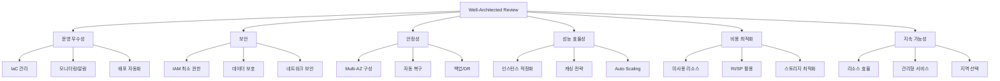

# Ops Well-Architected Review

AWS Well-Architected Framework 6개 필러 기반 인프라 심층 평가 스킬.

## Description

현재 AWS 인프라를 Well-Architected Framework의 6개 필러로 평가하고, 100점 척도의 점수와 심각도별 발견사항, AS-IS → TO-BE 개선 로드맵을 생성합니다.

## Trigger Keywords

- "well-architected", "WAF review"
- "인프라 진단", "아키텍처 리뷰"
- "심층 진단", "WAF 점검"
- "인프라 점수"

## 평가 필러



## 점수 체계

100점 만점, 필러별 가중치:

| 필러 | 가중치 | 평가 항목 |
|------|--------|----------|
| 운영 우수성 | 15점 | IaC, CI/CD, 모니터링, 런북 |
| 보안 | 20점 | IAM, 암호화, 네트워크, 감사 로깅 |
| 안정성 | 20점 | Multi-AZ, 자동 복구, 백업, DR |
| 성능 효율성 | 15점 | 적정 사이징, 캐싱, 오토스케일링 |
| 비용 최적화 | 15점 | 미사용 리소스, RI/SP, 스토리지 티어링 |
| 지속 가능성 | 15점 | 관리형 서비스, Graviton, 리소스 효율 |

### 등급

| 점수 | 등급 | 상태 |
|------|------|------|
| 90-100 | A | EXCELLENT — Well-Architected 모범 사례 준수 |
| 75-89 | B | GOOD — 사소한 개선 권장 |
| 60-74 | C | NEEDS IMPROVEMENT — 여러 영역에서 개선 필요 |
| 40-59 | D | AT RISK — 심각한 아키텍처 갭 |
| 0-39 | F | CRITICAL — 즉각적인 조치 필요 |

## 발견사항 심각도

| 심각도 | 기준 | 예시 |
|--------|------|------|
| CRITICAL | 즉각 조치 필요, 서비스 중단 위험 | 단일 AZ 배포, 암호화 미적용 |
| HIGH | 계획된 조치 필요, 장애 복원력 부족 | 백업 미설정, 오토스케일링 미구성 |
| MEDIUM | 개선 권장, 운영 효율성 관련 | CloudWatch 알람 미설정, 태그 미적용 |
| LOW | 모범 사례 미준수, 낮은 영향 | 이전 세대 인스턴스, 비효율 스토리지 |

## 워크플로우


## 출력 형식

```
# Well-Architected Review Report

## 요약
- 평가일: [timestamp]
- 대상: [cluster/account]
- 종합 점수: XX/100 (등급: X)

## 필러별 점수

| 필러 | 점수 | 등급 | 주요 발견사항 |
|------|------|------|-------------|
| 운영 우수성 | X/15 | | |
| 보안 | X/20 | | |
| 안정성 | X/20 | | |
| 성능 효율성 | X/15 | | |
| 비용 최적화 | X/15 | | |
| 지속 가능성 | X/15 | | |

## 발견사항

| # | 심각도 | 필러 | 발견 | 권장 조치 |
|---|--------|------|------|----------|

## AS-IS → TO-BE 로드맵

### 즉시 (1-2주)
- CRITICAL 발견사항 해결

### 단기 (1-3개월)
- HIGH 발견사항 해결

### 중기 (3-6개월)
- MEDIUM 발견사항 개선
```

## 팀 모드

Well-Architected 리뷰는 `wellarchitected-agent`가 단독 수행합니다. 다른 전문 에이전트의 결과와 교차 검증이 필요한 경우 `ops-coordinator-agent`가 조율합니다.

## 사용 예시

### 전체 리뷰

```
인프라 Well-Architected 리뷰 해줘
```

### 특정 필러 집중

```
보안 필러 중심으로 WAF 점검 해줘
```

### EKS 클러스터 대상

```
EKS 클러스터에 대한 Well-Architected 평가 해줘
```

## Reference Files

- `references/wellarchitected-pillars.md` — 6개 필러 평가 기준 상세
- `references/wellarchitected-checklist.md` — 항목별 체크리스트
- `references/improvement-patterns.md` — AS-IS → TO-BE 개선 패턴
