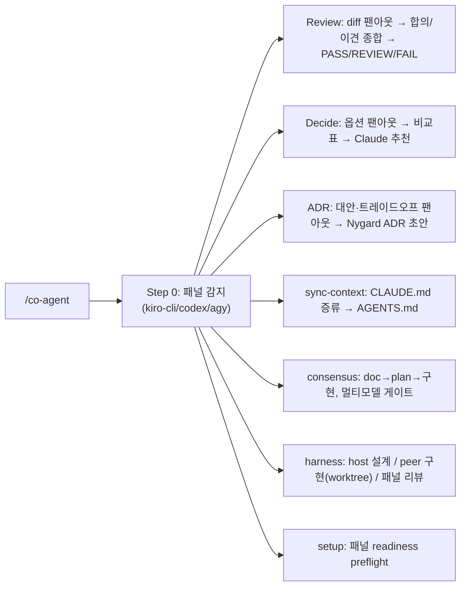

# co-agent 개요

co-agent는 **다른 AI 에이전트(Kiro CLI, Codex, Agy)와 협업**해 second opinion을 받고, **Claude가 의장(chair)으로 최종 종합**하는 플러그인입니다. 7가지 모드를 제공합니다: 멀티-AI 리뷰, 의사결정 보조, ADR 협업, AI 컨텍스트 동기화, 자율 consensus 파이프라인, host-designs/peer-implements harness, 패널 준비도 preflight(setup).

## 구성 요소

### 에이전트 (1개)

| 에이전트 | 설명 | 출력물 |
|----------|------|--------|
| `co-agent` | 멀티-AI 패널 의장 — 리뷰/의사결정/ADR/consensus/harness 프롬프트를 외부 AI에 팬아웃하고 Claude가 종합 | 리뷰 보고서 / 의사결정표 / ADR / 구현 diff / readiness 요약 |

### 스킬 (1개)

| 스킬 | 설명 |
|------|------|
| `co-agent` | 7-모드 멀티-AI 협업 (review · decide · adr · sync-context · consensus · harness · setup) |

### 명령 (5개)

| 명령 | 설명 |
|------|------|
| `/co-agent:configure` | 패널 설정 — AI별 `model`, Codex `effort`, `enabled`, `timeout`, `autosync` 토글 |
| `/co-agent:sync-context` | `CLAUDE.md` 증류 → `AGENTS.md` 생성 + Kiro steering bridge 연결 (Agy는 fan-out 시점에 fold-in) |
| `/co-agent:consensus` | 자율 doc→plan→구현 파이프라인, 멀티모델 합의 게이트 (Stage A/B/C) |
| `/co-agent:harness` | host-designs / peer-implements(격리 worktree) / panel-reviews 오케스트레이터 |
| `/co-agent:setup` | 패널 준비도 preflight — peer별 접근경로 감지 + 실사용 프로브, readiness 요약 기록 |

## 사전 요구사항 (선택적 — 있는 것만 사용)

외부 AI CLI 중 **설치된 것만** 패널로 활용합니다. 하나도 없으면 Claude 단독 수행 + 그 사실을 명시 (절대 hard-fail 안 함). **예외**: `consensus`/`harness`는 멀티모델 게이트가 본질인 non-degraded 모드 — READY peer가 하나도 없으면 solo 강등 대신 멈추고 `/co-agent:setup`을 안내합니다.

| AI | CLI | 비고 |
|----|-----|------|
| Kiro | `kiro-cli` | 인터랙티브 로그인 **또는** `KIRO_API_KEY`로 헤드리스 인증. `chat`은 stdin을 무시하므로 컨텍스트는 argv/`fs_read` 경로로 전달 |
| Codex | `codex` | `codex exec -s read-only` (read-only 샌드박스) |
| Agy | `agy` | **3순위 피어** — `agy -p … --sandbox` (print 모드가 read-only 보장) |

## 일곱 가지 모드

| 모드 | 트리거 | 동작 |
|------|--------|------|
| **Review** | "다른 AI로 리뷰", "second opinion", "멀티 AI" | 같은 리뷰 프롬프트를 패널에 병렬 팬아웃 → Claude가 합의/이견 종합 + Well-Architected → PASS/REVIEW/FAIL |
| **Decide** | "잘 모르겠어", "의사결정 도와", "협업해서 결정" | 결정+옵션을 패널에 질의 → 비교표(옵션×AI) → Claude 단일 추천 + 결정 트레이드오프 |
| **ADR** | "ADR 협업" | 패널에서 대안·트레이드오프·리스크 수집 → Claude가 Nygard ADR 초안 (project-init `/add-adr` 연동) |
| **sync-context** | `/co-agent:sync-context` | `CLAUDE.md`를 증류해 `AGENTS.md` 생성 — Kiro·Codex·Agy가 이 하나의 파일을 공통 참조 |
| **consensus** | `/co-agent:consensus` | Claude/Codex가 직접 코드를 작성(TDD), 패널이 plan(P2)·구현 diff(P4)를 리뷰만 |
| **harness** | `/co-agent:harness` | 크로스벤더 peer(Codex/Agy)가 격리 worktree에서 구현, host가 설계·테스트·커밋 전권 소유 |
| **setup** | `/co-agent:setup` | peer별 plugin→raw→none 접근경로 감지 + 실제 프로브 → readiness 요약 기록 |

> **consensus vs harness**: 둘 다 같은 패널 게이트를 재사용하지만, **누가 코드를 쓰는가**가 다릅니다 — consensus는 host 자신이 작성하고 패널은 리뷰만; harness는 크로스벤더 peer가 격리 worktree에서 작성하고 host는 절대 커밋 권한을 넘기지 않습니다.

## 의장 원칙 (Chair Principle)

- 외부 AI는 **자문**, **Claude가 최종 결정·작성**.
- 핵심 포인트는 **출처 표기**("Agy가 지적함"), **이견은 숨기지 않고 표면화**.
- CLI 누락/에러 → 해당 AI 스킵·기록 후 진행. 단일 AI에 차단되지 않음.
- 모든 AI에 **동일 프롬프트** → 답변 비교 가능.

## 판정 기준 (Review 모드)

| 판정 | 조건 | 결과 |
|------|------|------|
| **PASS** | CRITICAL 0개, HIGH ≤ 2개 | 통과 |
| **REVIEW** | CRITICAL 0개, HIGH ≥ 3개 | 수동 승인 필요 |
| **FAIL** | CRITICAL ≥ 1개 | 머지 차단 + 수정 권고 |

## 패널 설정 (`/co-agent:configure`)

패널을 레이어드 설정으로 튜닝합니다 — `co-agent.defaults.json`(커밋) ← `~/.claude/co-agent.user.json`(유저 스코프) ← `.claude/co-agent.local.json`(레포 로컬, gitignore). **CLI가 헤드리스로 실제 받는 것만** 노출합니다 (죽은 설정 없음).

| 설정 | kiro-cli | codex | agy |
|------|------|-------|-----|
| `model` | `--model` | `-m` | `--model` |
| `effort` (`minimal\|low\|medium\|high`) | — | `-c model_reasoning_effort` | — |
| `enabled` / `timeout` | 지원 | 지원 | 지원 |
| `context_limit` (토큰) | 1,000,000 | 272,000 | 1,000,000 |
| `autosync` (글로벌, on/off) | `CLAUDE.md` 변경 시 `/co-agent:sync-context` 자동 실행 (옵트인, 기본 off) |

> `effort`는 **Codex 전용** — Kiro/Agy는 헤드리스 effort 플래그가 없습니다. `context_limit` 초과 AI는 하드 실패 대신 스킵됩니다(예: 거대 diff에서 Codex 272K 초과 → Kiro/Agy만 실행).

### 현재 기본값 (`co-agent.defaults.json`)

| AI | 단일 `model` (기본 프로필에서 사용 — 예: 하이브리드 게이트 verify 단계) | `effort` |
|----|---------------------------------------------------------------------|----------|
| kiro-cli | `claude-opus-4.8` | — |
| codex | `openai.gpt-5.5` | `high` |
| agy | `Gemini 3.1 Pro (High)` | — |

커밋된 기본 프로필은 `deep`이므로, **kiro-cli의 find(발견) 단계는 `models` 리스트**(`claude-opus-4.8` / `minimax-m2.5` / `glm-5`)를 그대로 씁니다 — 위 표의 단일 `model`은 `models` 리스트가 비어 있는 codex/agy에는 즉시 적용되지만, kiro-cli는 `--profile default`로 명시 호출할 때(예: verify 단계)만 적용됩니다. `codex`의 reasoning-effort 최고 티어는 `high`입니다 — Claude 전용 `xhigh`/`max` 티어는 codex에 없습니다.

## AI 컨텍스트 동기화 (`/co-agent:sync-context`)

외부 AI가 프로젝트 컨벤션으로 리뷰하도록, `CLAUDE.md`를 **한 번만 증류**해 `AGENTS.md`를 생성하고 **Kiro·Codex·Agy가 이 하나의 파일을 공통 참조**합니다(각 AI별 별도 카피 없음).

| AI | 참조 방식 | 생성 |
|----|-----------|------|
| Kiro | `.kiro/steering/project-context.md` → `#[[file:AGENTS.md]]` | steering bridge 생성 |
| Codex | `AGENTS.md` (~32 KiB 캡) 네이티브 자동로드 | 증류 생성 |
| Agy | 자동로드 없음(stateless print 모드) | fan-out 시점에 `AGENTS.md`를 컨텍스트에 fold-in (marker+freshness+secret 검증 통과해야 전송) |

생성 마커(`claude-md-sha`)로 staleness를 추적하고, 마커 없는 수기 파일은 보호합니다. `CLAUDE.md` 편집 시 PostToolUse 훅이 drift를 알리며, `autosync on`이면 재동기화를 지시합니다.

## Auto-Invocation 키워드

| 한국어 | English |
|--------|---------|
| 다른 AI / 다른 AI로 리뷰 | second opinion / multi-AI review |
| AI 협업 / AI 패널 / 멀티 AI | collaborate with other AI |
| 잘 모르겠어 / 의사결정 도와 | help me decide |
| ADR 협업 | co-author ADR |
