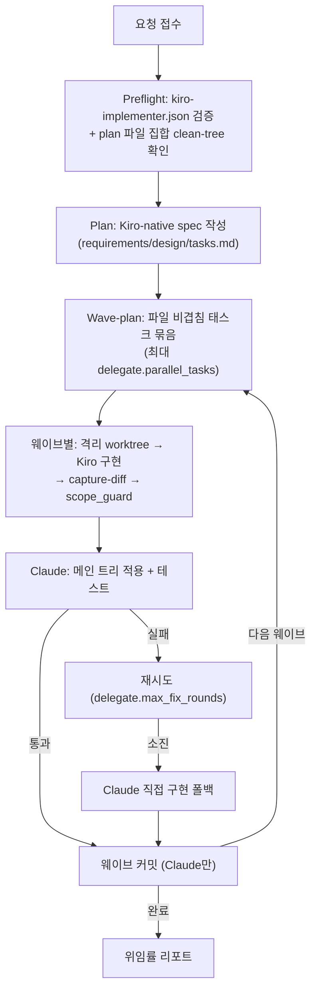

# kiro-delegate-agent

**계획+검증은 Claude, 구현은 Kiro CLI**로 나누는 비용 절감 오케스트레이터입니다.
판단이 필요한 부분(요구사항 해석, 스펙 작성, 결과 검증, 언제 Kiro를 포기하고
직접 구현할지 결정)은 Claude가, 토큰이 많이 드는 부분(실제 코드 작성)은 Kiro가
자기 구독의 정액 크레딧으로 처리합니다.

## 트리거 키워드

- "kiro한테 시켜서 구현", "kiro로 구현", "kiro한테 구현 위임"
- "delegate implementation to kiro", "kiro implement this"
- `/kiro:delegate`

리뷰 트리거는 없습니다 — 읽기 전용 diff 리뷰는 별도의 `/kiro:review` 명령이 담당하며,
이 쓰기 가능한 에이전트를 절대 로드하지 않습니다.

## 신뢰 경계

Kiro는 cwd로 격리되는 쓰기 샌드박스가 없습니다(`--trust-tools`는 자동 승인만 하고
디렉터리 샌드박싱은 하지 않음) — 그래서 `co-agent`의 harness는 Kiro를 구현자에서
배제합니다. 이 에이전트가 실제로 보장하는 것:

1. Kiro는 항상 격리된 git worktree를 cwd로 실행됩니다.
2. `worktree.py capture-diff`가 **그 worktree 안에서** 캡처한 것만 메인 트리에
   반영됩니다.
3. 캡처된 모든 경로는 `scope_guard.py`로 **plan의 전체 선언 파일 집합** 검증을
   통과해야 적용됩니다(현재 태스크만이 아니라 모든 태스크의 합집합).
4. 메인 브랜치 `git commit`은 항상 Claude만 실행합니다.

`kiro-implementer` 커스텀 에이전트 파일은 `fs_write`/`fs_read` 양쪽에 realpath 기반
`preToolUse` 훅을 추가로 가집니다(worktree로 cwd 고정, 위 1-4 위에 얹는 defense-in-depth).
**이 보장이 다루지 않는 것**: worktree 안의 `execute_bash`가 켜져 있으면(기본 off,
`/kiro:setup`에서 명시적 opt-in 필요) 자동 승인된 셸 명령의 호스트 부작용은 전혀
막히지 않습니다.

## 파이프라인 (`/kiro:delegate`)

- **Preflight** — `kiro-implementer.json`이 플러그인이 생성한 것인지 검증(없으면
  `write-agents` 먼저 실행, 변조 의심이면 `--force`로 재생성). 태스크가 선언한
  파일 전체가 clean-tree 상태인지 확인 — Kiro의 미완성 패치와 사용자의 기존
  미커밋 작업을 구분할 방법이 없으므로, 시작 전에 이 상태를 미리 막습니다.
- **Wave-plan** — 파일 집합이 서로 겹치지 않는 태스크만 같은 웨이브에 묶고,
  웨이브가 끝날 때마다 커밋합니다(끝까지 미루지 않음) — 다음 웨이브의 worktree가
  `--base HEAD`로 생성되므로, 이전 웨이브 작업에 의존하는 태스크가 있다면
  이전 웨이브가 먼저 커밋돼 있어야 합니다.
- **폴백** — Kiro의 fix loop(`delegate.max_fix_rounds`)가 소진되면 그 태스크만
  Claude가 직접 구현합니다. 조용히 스킵되지 않고 리포트에 기록됩니다.

## 참고 파일

- `references/kiro-headless.md` — 신뢰 경계 전체 근거, CLI 어댑터 상세
- `references/spec-format.md` — Kiro-native spec 형식, 웨이브 플래닝 규칙
- `references/delegated-implement.md` — worktree 격리·capture-diff·scope_guard 메커니즘

## 다른 에이전트와의 연계

| 상황 | 연계 | 역할 분담 |
|------|------|-----------|
| 세컨드 오피니언이 필요할 때 | `co-agent` | kiro는 비용 절감 위임, co-agent는 멀티 AI 리뷰 — 목적이 다름 |
| 구현 후 리뷰 | `/kiro:review` | kiro-delegate-agent는 구현만, 리뷰는 별도 읽기 전용 명령 |
