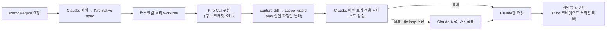

# kiro 개요

kiro는 **비용 절감을 위한 구현 위임** 플러그인입니다. Claude가 계획을 세우고 검증하며,
토큰이 가장 많이 드는 구현/리뷰 단계는 **Kiro CLI가 자기 구독의 정액 크레딧**으로
처리합니다. `co-agent`(멀티 AI 세컨드 오피니언)와는 목적이 다릅니다 — 의견 다양성이
아니라 순수 비용 절감이 이 플러그인의 존재 이유입니다.

## 구성 요소

### 에이전트 (1개)

| 에이전트 | 설명 | 출력물 |
|----------|------|--------|
| `kiro-delegate-agent` | 계획 → 스펙 → 태스크별 Kiro 구현(격리 worktree) → 검증 → 커밋 → 위임률 리포트 오케스트레이터 | 구현 diff · 테스트 통과 확인 · 위임률 리포트 |

### 스킬 (1개)

| 스킬 | 트리거 | 설명 |
|------|--------|------|
| `kiro-delegate` | "kiro한테 시켜서 구현", "kiro로 구현", "kiro한테 구현 위임", "delegate implementation to kiro", "kiro implement this" | 비용 절감 **구현** 위임 (쓰기 가능 — 리뷰는 별도 `/kiro:review` 명령) |

### 명령 (4개)

| 명령 | 설명 |
|------|------|
| `/kiro:setup` | kiro-cli 감지 + 실사용 프로브, 모델 목록, `.kiro/agents/*.json` 생성, default_delegate/review.on_commit 토글 |
| `/kiro:delegate <요청>` | 계획 → 위임 → 검증 → 커밋 전체 파이프라인 실행 |
| `/kiro:review [경로]` | 온디맨드 Kiro 리뷰 (pre-commit 훅과 동일 엔진) |
| `/kiro:configure` | 설정 조회/변경 |

## 동작 방식

Kiro는 커밋 권한이 없습니다 — 계획·검증·커밋은 항상 Claude가 소유하고, Kiro는 격리된
git worktree 안에서 구현만 담당합니다. Kiro가 태스크를 못 끝내면(fix loop 소진) Claude가
그 태스크만 직접 구현으로 폴백합니다.

## 왜 싸지나

토큰이 가장 많이 드는 구현/리뷰 단계가 Kiro 구독의 정액 크레딧으로 빠지고, Claude
세션은 계획·검증·커밋만 담당합니다. Kiro의 **구현(delegate) 모델**은 정액 크레딧이라
per-token 비용 트레이드오프가 없으므로 태스크를 제대로 끝내는 모델이면 무엇이든
괜찮고, **리뷰 모델**은 구현 모델이 가벼워도 항상 Kiro의 최신/최강 모델로 유지하는 것을
권장합니다 — 리뷰가 구현 결과물의 안전망이기 때문입니다.

## 신뢰 경계 (co-agent가 Kiro를 구현자로 거부하는 이유)

Kiro는 cwd로 격리되는 쓰기 샌드박스가 없습니다 — `--trust-tools`는 도구 호출을
자동 승인만 할 뿐 디렉터리로 샌드박싱하지는 않습니다(Codex의 `-s workspace-write`,
Agy의 `--sandbox`와 다름). 그래서 `co-agent`의 harness는 Kiro를 구현자로 아예
배제합니다(`SANDBOX_IMPLEMENTERS = codex, agy`). 이 플러그인이 실제로 보장하는 것은
좁게 정의됩니다:

1. Kiro는 항상 격리된 git worktree를 cwd로 실행됩니다(메인 체크아웃 아님).
2. `worktree.py capture-diff`가 **그 worktree 안에서** 캡처한 것만 메인 트리에 반영될
   수 있습니다 — `..`나 절대경로로 worktree 밖에 쓴 내용은 아예 보이지 않습니다.
3. 캡처된 모든 경로는 `scope_guard.py`로 **plan의 전체 선언 파일 집합**(현재 태스크만이
   아니라 모든 태스크의 합집합) 검증을 통과해야 적용됩니다.
4. 메인 브랜치에 `git commit`을 실행하는 것은 항상 Claude뿐입니다.

**이 보장이 다루지 않는 것: worktree 안의 `execute_bash`.** `execute_bash`는
`kiro-implementer`에서 **기본 off**입니다 — `/kiro:setup`에서 사용자가 명시적으로
opt-in해야 켜집니다. 켜져 있으면 Kiro가 실행하는 자동 승인된 셸 명령이 worktree 밖의
호스트에 영향을 줄 수 있습니다(자격 증명 읽기, 파일 삭제, 네트워크 호출) — 위 1-4번
보장은 이런 종류의 호스트 부작용을 전혀 막지 않습니다. `execute_bash`를 켜는 것은
worktree 격리와는 **별개의 신뢰 결정**이며, `/kiro:setup`이 이 결정을 매번 명시적으로
묻습니다.

## 다음 단계

- [설치](/docs/kiro/installation) — kiro-cli 설치/로그인, 플러그인 추가, `/kiro:setup`
- [사용법 가이드](/docs/kiro/usage-guide) — `/kiro:delegate` 파이프라인, `/kiro:review`,
  `/kiro:configure` 설정 표
- [kiro-delegate-agent](/docs/kiro/agents/kiro-delegate-agent) — 오케스트레이터 상세
- [kiro-delegate 스킬](/docs/kiro/skills/kiro-delegate) — 스킬 트리거·파이프라인
- [명령 목록](/docs/kiro/commands/) — 4개 슬래시 명령 상세
