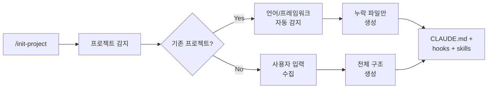
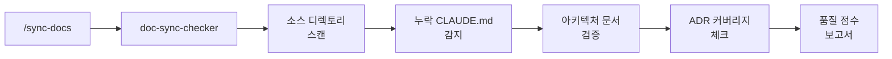

# Project Init 개요

Project Init는 Claude Code 프로젝트 구조 초기화, 문서 품질 스코어링, 자동 동기화 워크플로우를 제공하는 플러그인입니다. 9개의 슬래시 명령으로 프로젝트 설정부터 문서 관리까지 지원합니다.

## 구성 요소

### 에이전트 (3개)

| 에이전트 | 설명 | 출력물 |
|----------|------|--------|
| `doc-sync-checker` | 문서 동기화 분석, 품질 스코어링, 누락 문서 감지 | 품질 점수 보고서 |
| `pr-autofix-planner` | pr-autofix 수정 계획 (read-only 강제, fable/opus) | 구조화된 수정 계획 |
| `pr-autofix-implementer` | pr-autofix 계획 적용 (편집 도구만 강제, sonnet) | worktree 내 파일 편집 |

> `pr-autofix-planner`/`pr-autofix-implementer`는 pr-autofix 스킬 내부 워커로, 키워드 자동 호출을 디스크립션으로 억제합니다(하드 차단은 아니며, 직접 선택되면 blocked를 반환).

### 스킬 (3개)

| 스킬 | 설명 |
|------|------|
| `project-scaffolder` | Claude Code 프로젝트 구조 패턴 및 컨벤션 |
| `pr-autofix` | PR 리뷰 피드백 자동 수정 (AI + 사람 리뷰 polling, 최대 3회 반복) |
| `decision-reconcile` | 누적 ADR 간 모순·ADR vs 현실 drift를 다양성 멀티 에이전트 패널(Claude 모델 티어 ± 외부 CLI)로 검출, 번복 ADR 초안 작성 |

### 명령 (10개)

| 명령 | 설명 |
|------|------|
| `/init-project` | Claude Code 프로젝트 구조 초기화 |
| `/sync-docs` | 문서와 코드 동기화 |
| `/add-adr` | Architecture Decision Record 생성 |
| `/add-module` | 모듈 디렉토리 및 CLAUDE.md 추가 |
| `/add-runbook` | 운영 런북 생성 |
| `/add-reference-doc` | 레이어별 구현 참조 문서 스켈레톤 생성 (`docs/reference/`) |
| `/generate-readme` | 이중 언어 README.md 생성/업데이트 |
| `/generate-changelog` | 이중 언어 CHANGELOG.md 생성/업데이트 |
| `/health-check` | 프로젝트 설정 검증 (200점 척도) |
| `/pr-autofix` | PR 리뷰 피드백(AI + 사람) 자동 수정 (최대 3회) |

## 워크플로우

### 프로젝트 초기화



### 문서 동기화



## 생성되는 구조

```
project/
├── CLAUDE.md                    # 프로젝트 지침 (자동 생성)
├── .claude/
│   ├── settings.json            # 훅 등록
│   ├── hooks/
│   │   ├── check-doc-sync.sh    # PostToolUse 문서 동기화
│   │   ├── secret-scan.sh       # PreToolUse 시크릿 스캔
│   │   ├── session-context.sh   # SessionStart 컨텍스트
│   │   └── notify.sh            # 알림 웹훅
│   ├── skills/                  # 4개 기본 스킬
│   ├── commands/                # 3개 기본 명령
│   └── agents/                  # 2개 기본 에이전트
├── docs/
│   ├── architecture.md          # 이중 언어 아키텍처 문서
│   ├── decisions/               # ADR 디렉토리
│   ├── runbooks/                # 운영 런북
│   └── onboarding.md            # 온보딩 가이드
├── tests/                       # 테스트 프레임워크
│   ├── run-all.sh               # TAP 스타일 테스트 러너
│   └── hooks/                   # 훅 테스트
├── scripts/
│   ├── setup.sh                 # 프로젝트 셋업
│   └── install-hooks.sh         # Git 훅 설치
├── README.md                    # 이중 언어 (EN/KR)
├── CHANGELOG.md                 # 이중 언어 (EN/KR)
└── .editorconfig                # 에디터 설정
```

## Health Check 점수

| 점수 | 등급 | 상태 |
|------|------|------|
| 160-200 | A | HEALTHY — 프로젝트가 잘 설정됨 |
| 120-159 | B | GOOD — 사소한 개선 필요 |
| 80-119 | C | NEEDS ATTENTION — 여러 갭 해결 필요 |
| 40-79 | D | POOR — 중요한 설정 문제 |
| 0-39 | F | CRITICAL — 프로젝트 초기화 필요 |
