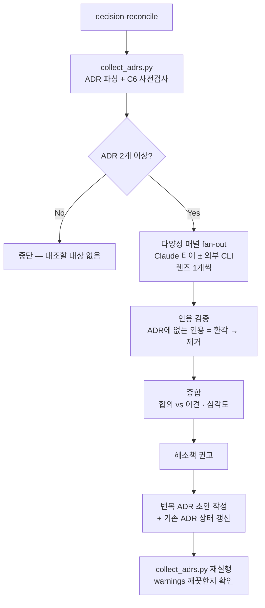

# decision-reconcile Skill

누적된 ADR(ADR-NNN) 사이의 **모순**과 ADR과 현재 코드 사이의 **불일치(drift)**를 찾아내고, 이를 바로잡는 **번복(superseding) ADR 초안**을 작성하는 스킬입니다.

ADR은 시간이 지나며 쌓이고 서로 충돌하기 시작합니다 — 두 Accepted ADR이 정반대를 지시하거나, 새 결정이 옛 결정을 암묵적으로 뒤집었는데 상태는 그대로이거나, ADR이 더 이상 코드와 맞지 않는 경우입니다.

## 핵심 아이디어 — 다양성 패널

단일 모델이 단일 프롬프트로 한 번 훑으면 **뻔한 충돌만** 잡습니다. 이 스킬은 **모델 티어를 바꾸고(opus/sonnet/haiku) 리뷰 렌즈(프롬프트 프레이밍)를 달리한** 여러 에이전트를 병렬로 돌립니다. 그 다양성이 비자명한 모순을 표면화합니다.

선택적으로 외부 AI CLI(Kiro/Codex/Antigravity)까지 fan-out해 **cross-family 신호**를 더합니다. 외부 CLI가 없으면 Claude 단독 패널로 graceful degrade합니다.

## 검출하는 모순 유형

| 코드 | 유형 | 설명 |
|------|------|------|
| C1 | 직접 논리 충돌 | 두 Accepted/Proposed ADR이 상호 배타적 선택을 지시 |
| C2 | 암묵적 번복 | 새 ADR이 옛 결정을 뒤집었으나 옛 ADR 상태가 Superseded로 갱신 안 됨 |
| C3 | 현실 drift | ADR 결정이 현재 코드/`CLAUDE.md`/실제 구현과 어긋남 |
| C4 | 가정 무효화 | 더 이상 양립 못 하는 가정 위에서 각각 유효했던 결정들 |
| C5 | 범위 중첩 | 두 ADR이 같은 관심사를 서로 다른 규칙으로 결정 |
| C6 | 댕글링 번복 | 상태/링크가 내부 불일치 (스크립트가 결정론적으로 사전 검출) |

C6는 `collect_adrs.py`가 LLM 없이 사전 검출합니다. C1–C5는 LLM 패널이 담당합니다.

## 리뷰 렌즈 (에이전트별 1개)

에이전트마다 **렌즈 1개 + 서로 다른 모델 티어**를 배정합니다 — 이것이 "model을 바꾸고 prompt를 달리한다"의 실현입니다.

| 렌즈 | 모델(권장) | 초점 |
|------|-----------|------|
| L1 — 논리 | opus | 상호 배타적 Accepted ADR 쌍 (C1) |
| L2 — 시간순 | sonnet | 암묵적 번복·댕글링 링크 (C2/C6) |
| L3 — 현실 drift | sonnet/opus | ADR vs 코드/CLAUDE.md 괴리, file:line 인용 (C3) |
| L4 — 가정/범위 | haiku/sonnet | 무효화된 가정·범위 중첩 (C4/C5) |

모든 렌즈 공통 규칙: **인용하라, 풀어쓰지 말라.** 주장하는 모든 모순은 ADR 번호 + 충돌 문장을 그대로 인용해야 하며, 인용 불가 = finding 아님.

## 워크플로우



## 종합 원칙

- **vote-count 하지 말고 verify하라.** 각 finding의 인용을 실제 ADR에 대조해 환각을 제거합니다. 다수결이 아닙니다.
- **model family를 가로지른 분열은 그 자체가 신호다.** 한 패밀리(예: Claude)가 "정제 가능"으로 보는 쌍을 다른 패밀리(예: OpenAI/Google)가 모순으로 읽는다면, 그 표현은 실제 리뷰어를 오도할 만큼 모호한 것입니다 — 표현 명확화로 해소합니다.
- **ADR은 불변의 시점 기록이다.** 프로젝트가 성장하며 낡은 **부수적 열거**(예: "스킬 1개")는 결정 자체의 모순과 구분해야 합니다 — 보통 MINOR이며 번복 ADR 대상이 아닙니다.
- **외부 CLI는 다이제스트만 받는다.** repo 접근이 없으므로 C3(현실 drift)는 검출 못 합니다 — C3는 repo를 읽는 Claude 티어 전담입니다.

## 산출물 — 번복(superseding) ADR

확정된 모순에 대해 해소 패턴(supersede / amend / reconcile-to-reality / status-only)을 권고하고, `/add-adr` 컨벤션(이중 언어 EN/KR, Nygard 섹션, 이모지 없음)을 그대로 따르는 번복 ADR을 작성합니다.

- **Status**: `Accepted`
- **Context**: 해소하는 모순과 번복 대상 ADR 번호 + 충돌 인용을 명시
- **Consequences**: "Supersedes ADR-NNN" 명시
- 그 다음 **기존 ADR 편집**: Status를 `Superseded`/`대체됨`으로 바꾸고 `Superseded by ADR-NNN` 줄 추가

## 스크립트

### collect_adrs.py

`docs/decisions/ADR-*.md`(단일/이중 언어 모두)를 구조화 JSON으로 파싱하고, LLM 없이 결정론적 불일치 사전검사(C6)를 수행합니다.

```bash
# 사람용 요약
python3 plugins/project-init/skills/decision-reconcile/scripts/collect_adrs.py --summary docs/decisions

# 패널 입력용 JSON
python3 plugins/project-init/skills/decision-reconcile/scripts/collect_adrs.py docs/decisions
```

결정론적 사전검사가 잡는 것: 상태가 Superseded인데 링크 없음 · 존재하지 않는 superseding ADR 지목 · 비-Accepted ADR로 번복 표기 · ADR 번호 중복 · 미지의 상태값.

## 제약 / 주의

- 외부 CLI fan-out은 ADR 텍스트를 third-party AI 서비스로 전송하므로, 사용 전 scope 확인이 필수입니다(Claude 단독 패널은 불필요).
- Superseded/Deprecated ADR이 Accepted ADR과 충돌하는 것은 정상입니다 — **활성(Accepted/Proposed) 결정 간** 충돌만 flag합니다.
- 의장 원칙: 외부 AI와 서브에이전트는 **자문**, **메인 에이전트가 최종 ADR을 결정·작성**합니다. 사용자 승인 없이 ADR을 덮어쓰지 않습니다.

## 레퍼런스

- `references/contradiction-taxonomy.md` — C1–C6 분류, 4개 리뷰 렌즈(에이전트별 프롬프트), 심각도 루브릭, 해소 패턴, 종합 절차
- `commands/add-adr.md` — 번복 ADR 초안이 따라야 하는 ADR 파일 컨벤션
