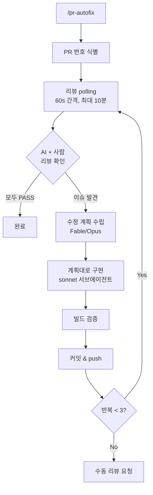

# pr-autofix Skill

PR 리뷰 피드백(AI + 사람)을 자동으로 읽고 코드를 수정하는 스킬입니다. 최대 3회 반복합니다.

## 리뷰 소스

| 모드 | 감지 방식 | 트리거 |
|------|----------|--------|
| **AI 리뷰** | `<!-- bedrock-pr-review -->` 마커 코멘트 polling | PR push → CI 자동 실행 |
| **사람 리뷰** | `gh pr reviews`로 `CHANGES_REQUESTED` 상태 감지 | 리뷰어가 GitHub에서 'Request changes' 제출 |

두 모드 모두 같은 수정-커밋-push 루프를 탑니다. AI/사람 리뷰가 동시에 있으면 둘 다 읽고 통합 수정합니다.

**모델 티어링**: 수정 **계획**(finding별 root cause·정확한 수정·검증 방법)은 Fable/Opus에서
수립하고(호스트가 이미 Fable/Opus면 인라인, 아니면 강한 모델 서브에이전트), **구현**은 그
계획을 그대로 적용하는 sonnet 서브에이전트에 위임합니다 — 판단은 상위 티어, 기계적 적용은
sonnet(CRITICAL → MAJOR → MINOR 우선순위는 계획 단계에서 반영).

## 워크플로우



## 판정 기준

| AI 리뷰 | 사람 리뷰 | 결과 |
|---------|----------|------|
| PASSED | APPROVED 또는 없음 | 완료 |
| BLOCKED | - | 수정 진행 |
| - | CHANGES_REQUESTED | 수정 진행 |
| BLOCKED | CHANGES_REQUESTED | 통합 수정 |

## 제약 사항

- `.github/workflows/*` 파일 수정 금지
- 리뷰에서 언급된 이슈만 수정 (추가 리팩토링 금지)
- 빌드 검증 후에만 커밋
- 최대 3회 반복 후 사용자에게 수동 리뷰 요청

## 레퍼런스

### pr-review-workflow.yml

AI 리뷰를 사용하려면 프로젝트에 GitHub Actions 워크플로우가 필요합니다. `references/pr-review-workflow.yml`을 `.github/workflows/`에 복사하여 사용합니다.

```bash
cp plugins/project-init/skills/pr-autofix/references/pr-review-workflow.yml \
   .github/workflows/pr-review.yml
```

필요한 설정:
- AWS Bedrock 자격 증명 — GitHub Secrets에 `AWS_ACCESS_KEY_ID`, `AWS_SECRET_ACCESS_KEY`, `AWS_REGION` 등록 (또는 `ANTHROPIC_API_KEY`로 직접 API 사용)
- `vars.ANTHROPIC_MODEL` — GitHub Variables에 모델 ID 설정 (기본: `us.anthropic.claude-opus-4-8`)
