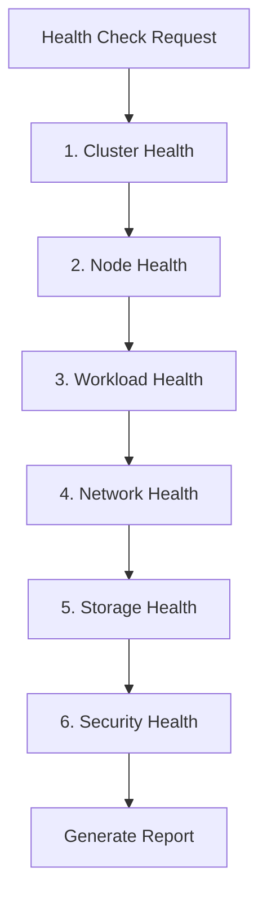

# 상태 점검 따라 하기

이 문서는 설명을 위한 예제입니다. 명령 출력, 식별자, 임계값, 발견 사항은 샘플 데이터이며 실제 평가 결과나 플러그인 기본값이 아닙니다. 실행 규칙은 현재 스킬을 따르고, 제안된 수정을 적용하기 전에 실제 환경을 확인합니다.

6개 영역의 점검 결과와 보고서 템플릿을 포함한 전체 클러스터 상태 점검 예제입니다.

## 시나리오 {#scenario}

운영 EKS 클러스터를 종합 점검하여 인시던트로 이어지기 전에 잠재적 문제를 파악합니다.

## 상태 점검 워크플로 {#health-check-workflow}



## 1단계: 상태 점검 시작 {#step-1-initiate-health-check}

사용자 요청:

```
Please perform a full cluster health check.
```

**ops-health-check** 스킬이 활성화되어 영역별 점검을 순서대로 시작합니다.

## 2단계: 클러스터 상태 점검 {#step-2-cluster-health-check}

```bash
# API server responsiveness
time kubectl get --raw /healthz
```

출력:
```
ok
real    0m0.089s
```

```bash
# Cluster version and status
aws eks describe-cluster --name prod-cluster --query 'cluster.{status:status,version:version,platformVersion:platformVersion}'
```

출력:
```json
{
    "status": "ACTIVE",
    "version": "1.29",
    "platformVersion": "eks.8"
}
```

```bash
# Add-on status
aws eks list-addons --cluster-name prod-cluster --output table
```

출력:
```
----------------------------------
|          ListAddons            |
+--------------------------------+
|  amazon-cloudwatch-observability|
|  coredns                        |
|  kube-proxy                     |
|  vpc-cni                        |
+--------------------------------+
```

**결과**: 클러스터 OK - API 서버 응답 정상(89ms), 최신 버전, 모든 추가 기능 활성 상태입니다.

## 3단계: 노드 상태 점검 {#step-3-node-health-check}

```bash
# Node status
kubectl get nodes -o wide
```

출력:
```
NAME                            STATUS   ROLES    AGE   VERSION   INTERNAL-IP    OS-IMAGE         KERNEL-VERSION
ip-10-0-1-100.ec2.internal     Ready    <none>   45d   v1.29.0   10.0.1.100     Amazon Linux 2   5.10.199-190.747.amzn2.x86_64
ip-10-0-2-150.ec2.internal     Ready    <none>   45d   v1.29.0   10.0.2.150     Amazon Linux 2   5.10.199-190.747.amzn2.x86_64
ip-10-0-3-200.ec2.internal     Ready    <none>   45d   v1.29.0   10.0.3.200     Amazon Linux 2   5.10.199-190.747.amzn2.x86_64
```

```bash
# Resource utilization
kubectl top nodes
```

출력:
```
NAME                            CPU(cores)   CPU%   MEMORY(bytes)   MEMORY%
ip-10-0-1-100.ec2.internal     450m         22%    2100Mi          54%
ip-10-0-2-150.ec2.internal     380m         19%    1850Mi          47%
ip-10-0-3-200.ec2.internal     520m         26%    2400Mi          62%
```

```bash
# Node conditions
kubectl get nodes -o json | jq '.items[] | {name:.metadata.name, conditions:[.status.conditions[] | select(.status!="False") | .type]}'
```

출력:
```json
{"name":"ip-10-0-1-100.ec2.internal","conditions":["Ready"]}
{"name":"ip-10-0-2-150.ec2.internal","conditions":["Ready"]}
{"name":"ip-10-0-3-200.ec2.internal","conditions":["Ready"]}
```

**결과**: 노드 OK - 3/3 Ready, CPU < 30%, 메모리 < 65%입니다.

## 4단계: 워크로드 상태 점검 {#step-4-workload-health-check}

```bash
# Unhealthy pods
kubectl get pods -A --field-selector=status.phase!=Running,status.phase!=Succeeded | head -20
```

출력:
```
NAMESPACE     NAME                      READY   STATUS             RESTARTS   AGE
backend       api-worker-7b9f4-x2k9l    0/1     CrashLoopBackOff   15         2h
monitoring    prometheus-node-exp-abc   0/1     Pending            0          30m
```

```bash
# Deployment health
kubectl get deployments -A -o json | jq '.items[] | select(.status.unavailableReplicas > 0) | {name:.metadata.name, ns:.metadata.namespace, unavailable:.status.unavailableReplicas}'
```

출력:
```json
{"name":"api-worker","ns":"backend","unavailable":1}
```

```bash
# DaemonSet health
kubectl get daemonsets -A -o json | jq '.items[] | select(.status.desiredNumberScheduled != .status.numberReady) | {name:.metadata.name, ns:.metadata.namespace, desired:.status.desiredNumberScheduled, ready:.status.numberReady}'
```

출력:
```json
{"name":"prometheus-node-exporter","ns":"monitoring","desired":3,"ready":2}
```

**결과**: 워크로드 WARNING - 비정상 파드 2개를 발견했습니다.

### 문제 상세 {#issue-details}

**CrashLoopBackOff 파드 분석**:
```bash
kubectl logs api-worker-7b9f4-x2k9l -n backend --previous | tail -20
```

출력:
```
Error: FATAL: password authentication failed for user "api_user"
Connection to database failed, exiting...
```

**근본 원인**: Secret의 데이터베이스 자격 증명이 일치하지 않습니다.

**Pending 파드 분석**:
```bash
kubectl describe pod prometheus-node-exp-abc -n monitoring | grep -A 5 "Events:"
```

출력:
```
Events:
  Warning  FailedScheduling  30m  default-scheduler  0/3 nodes are available: 3 node(s) didn't match Pod's node affinity/selector.
```

**근본 원인**: monitoring 네임스페이스의 노드 선택기가 일치하지 않습니다.

## 5단계: 네트워크 상태 점검 {#step-5-network-health-check}

```bash
# CoreDNS status
kubectl get pods -n kube-system -l k8s-app=kube-dns -o wide
```

출력:
```
NAME                      READY   STATUS    RESTARTS   AGE   IP           NODE
coredns-5d78c9869d-abc    1/1     Running   0          15d   10.0.1.45    ip-10-0-1-100.ec2.internal
coredns-5d78c9869d-def    1/1     Running   0          15d   10.0.2.78    ip-10-0-2-150.ec2.internal
```

```bash
# VPC CNI status
kubectl get pods -n kube-system -l k8s-app=aws-node -o wide
```

출력:
```
NAME             READY   STATUS    RESTARTS   AGE   IP           NODE
aws-node-abc     2/2     Running   0          45d   10.0.1.100   ip-10-0-1-100.ec2.internal
aws-node-def     2/2     Running   0          45d   10.0.2.150   ip-10-0-2-150.ec2.internal
aws-node-ghi     2/2     Running   0          45d   10.0.3.200   ip-10-0-3-200.ec2.internal
```

```bash
# Subnet IP availability
aws ec2 describe-subnets --subnet-ids subnet-abc subnet-def subnet-ghi \
  --query 'Subnets[].{ID:SubnetId,AZ:AvailabilityZone,Available:AvailableIpAddressCount}'
```

출력:
```json
[
    {"ID": "subnet-abc", "AZ": "us-west-2a", "Available": 245},
    {"ID": "subnet-def", "AZ": "us-west-2b", "Available": 198},
    {"ID": "subnet-ghi", "AZ": "us-west-2c", "Available": 312}
]
```

**결과**: 네트워크 OK - CoreDNS 실행 중, VPC CNI 정상, IP 충분입니다.

## 6단계: 스토리지 상태 점검 {#step-6-storage-health-check}

```bash
# PVC status
kubectl get pvc -A --field-selector status.phase!=Bound
```

출력:
```
NAMESPACE   NAME              STATUS    VOLUME   CAPACITY   ACCESS MODES   STORAGECLASS
analytics   data-volume-pvc   Pending                                      gp3
```

```bash
# CSI driver status
kubectl get pods -n kube-system -l app=ebs-csi-controller -o wide
```

출력:
```
NAME                                  READY   STATUS    RESTARTS   AGE
ebs-csi-controller-5f4b7c8d9-abc     6/6     Running   0          30d
ebs-csi-controller-5f4b7c8d9-def     6/6     Running   0          30d
```

```bash
# Check pending PVC events
kubectl describe pvc data-volume-pvc -n analytics | grep -A 5 "Events:"
```

출력:
```
Events:
  Warning  ProvisioningFailed  5m  ebs.csi.aws.com  failed to provision volume: could not create volume in EC2: UnauthorizedOperation
```

**결과**: 스토리지 WARNING - IAM 권한으로 인해 PVC 1개가 대기 중입니다.

## 7단계: 보안 상태 점검 {#step-7-security-health-check}

```bash
# Privileged containers
kubectl get pods -A -o json | jq '[.items[] | select(.spec.containers[].securityContext.privileged==true) | {name:.metadata.name, ns:.metadata.namespace}]'
```

출력:
```json
[
  {"name":"aws-node-abc","ns":"kube-system"},
  {"name":"aws-node-def","ns":"kube-system"},
  {"name":"aws-node-ghi","ns":"kube-system"}
]
```

```bash
# Network policies
kubectl get networkpolicies -A
```

출력:
```
NAMESPACE   NAME              POD-SELECTOR   AGE
backend     backend-policy    app=api        60d
frontend    frontend-policy   app=web        60d
```

```bash
# Namespaces without network policies
for ns in $(kubectl get ns -o jsonpath='{.items[*].metadata.name}'); do
  policies=$(kubectl get networkpolicies -n $ns 2>/dev/null | tail -n +2 | wc -l)
  if [ "$policies" -eq "0" ]; then
    echo "WARNING: $ns has no network policies"
  fi
done
```

출력:
```
WARNING: analytics has no network policies
WARNING: monitoring has no network policies
WARNING: default has no network policies
```

**결과**: 보안 WARNING - 네임스페이스 3개에 네트워크 정책이 없습니다.

---

## 최종 상태 보고서 {#final-health-report}

```markdown
# Infrastructure Health Report

## Summary
- **Overall**: WARNING
- **Checked**: 2026-03-22 14:30:00 UTC
- **Cluster**: prod-cluster (v1.29)

## Results

| Domain | Status | Details |
|--------|--------|---------|
| Cluster | OK | API server responsive (89ms), EKS v1.29, all add-ons active |
| Nodes (3/3 ready) | OK | CPU max 26%, Memory max 62%, all conditions healthy |
| Workloads | WARNING | 2 unhealthy pods: 1 CrashLoopBackOff, 1 Pending |
| Network | OK | CoreDNS 2/2, VPC CNI 3/3, IPs available (755 total) |
| Storage | WARNING | 1 PVC pending (IAM permission issue) |
| Security | WARNING | 3 namespaces without network policies |

## Issues Found

### Issue 1: CrashLoopBackOff Pod (P2 - High)
- **Pod**: backend/api-worker-7b9f4-x2k9l
- **Cause**: Database authentication failure - credential mismatch
- **Fix**: Update Secret `backend/db-credentials` with correct password

### Issue 2: Pending Pod (P3 - Medium)
- **Pod**: monitoring/prometheus-node-exp-abc
- **Cause**: Node affinity mismatch
- **Fix**: Update DaemonSet node selector or add labels to nodes

### Issue 3: PVC Provisioning Failed (P3 - Medium)
- **PVC**: analytics/data-volume-pvc
- **Cause**: EBS CSI driver IAM permission issue
- **Fix**: Add `ec2:CreateVolume` permission to EBS CSI IRSA role

### Issue 4: Missing Network Policies (P4 - Low)
- **Namespaces**: analytics, monitoring, default
- **Risk**: No network segmentation in these namespaces
- **Fix**: Deploy default-deny NetworkPolicy to affected namespaces

## Recommendations

1. **Immediate** (P2): Fix database credentials for api-worker deployment
2. **Today** (P3): Update node affinity for prometheus-node-exporter
3. **Today** (P3): Fix IAM permissions for EBS CSI driver
4. **This Week** (P4): Deploy network policies to all namespaces
5. **Maintenance**: Consider enabling Pod Security Standards (Restricted)
```

---

## 핵심 사항 {#key-points}

:::tip 체계적인 접근
상태 점검은 클러스터 → 노드 → 워크로드 → 네트워크 → 스토리지 → 보안 순서로 일관되게 진행합니다. 영역 누락을 막고 문제의 연관성을 올바르게 파악할 수 있습니다.
:::

:::warning 우선순위 평가
모든 경고의 중요도가 같지는 않습니다. 이 예제에서 CrashLoopBackOff는 서비스 가용성(P2)에 영향을 주고, 네트워크 정책 누락은 보안 모범 사례(P4)에 해당합니다. 영향에 따라 수정 우선순위를 정합니다.
:::

:::info 자동화
상태 점검을 매일 또는 매주 정기 실행하고 상태 변화에 알림을 보내는 방안을 고려합니다. 사용자에게 영향이 발생하기 전에 문제를 선제적으로 감지할 수 있습니다.
:::
