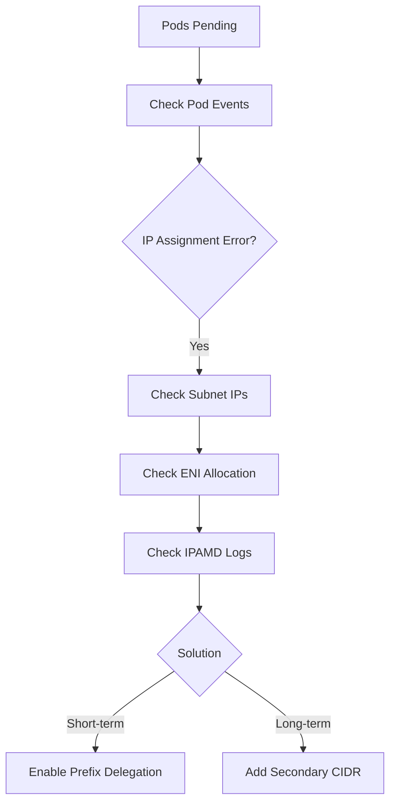
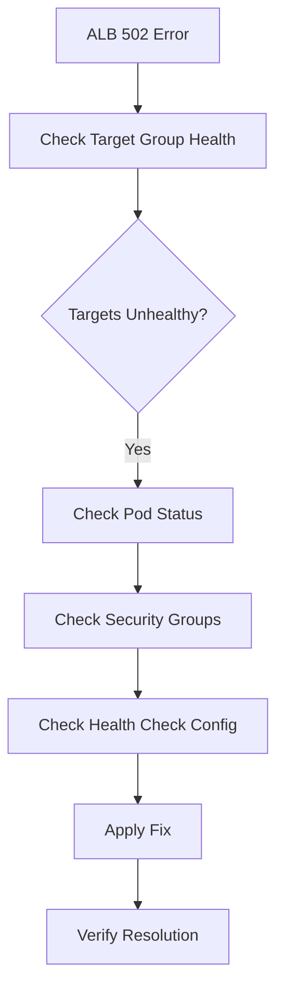

# 네트워크 진단 데모

이 문서는 설명을 위한 예제입니다. 명령 출력, 식별자, 임계값, 발견 사항은 샘플 데이터이며 실제 평가 결과나 플러그인 기본값이 아닙니다. 실행 규칙은 현재 스킬을 따르고, 제안된 수정을 적용하기 전에 실제 환경을 확인합니다.

진단 명령 실행과 해결 과정을 통해 IP 고갈과 ALB 502 오류를 진단하는 예제입니다.

## 시나리오 개요 {#scenario-overview}

이 데모는 두 가지 일반적인 네트워크 문제를 다룹니다:
1. **IP 고갈** - VPC IP 부족으로 파드가 Pending 상태에 머무릅니다.
2. **ALB 502 오류** - Application Load Balancer가 502 Bad Gateway를 반환합니다.

---

## 시나리오 1: IP 고갈 {#scenario-1-ip-exhaustion}

### 문제 보고 {#problem-report}

사용자 보고:

```
New pods are stuck in Pending state. kubectl describe shows "failed to assign IP address" errors.
```

### 진단 워크플로 {#diagnosis-workflow}



### 1단계: 문제 식별 {#step-1-identify-the-problem}

```bash
# Check pending pods
kubectl get pods -A --field-selector=status.phase=Pending
```

출력:
```
NAMESPACE   NAME                        READY   STATUS    RESTARTS   AGE
backend     api-server-7f8b9-abc        0/1     Pending   0          15m
backend     api-server-7f8b9-def        0/1     Pending   0          15m
backend     worker-5c6d7-ghi            0/1     Pending   0          10m
frontend    web-app-8e9f0-jkl           0/1     Pending   0          8m
```

```bash
# Check pod events
kubectl describe pod api-server-7f8b9-abc -n backend | grep -A 10 "Events:"
```

출력:
```
Events:
  Type     Reason            Age   From               Message
  ----     ------            ----  ----               -------
  Warning  FailedScheduling  14m   default-scheduler  0/3 nodes are available: 3 Insufficient pods.
  Warning  FailedCreatePodSandBox  13m  kubelet  Failed to create pod sandbox: rpc error: code = Unknown desc = failed to setup network for sandbox: plugin type="aws-cni" name="aws-cni" failed: add cmd: failed to assign an IP address to container
```

**확인 사항**: VPC CNI의 IP 할당 실패입니다.

### 2단계: 서브넷 가용 IP 확인 {#step-2-check-subnet-ip-availability}

```bash
# Get cluster subnets and available IPs
aws ec2 describe-subnets --filters "Name=tag:kubernetes.io/cluster/prod-cluster,Values=*" \
  --query 'Subnets[].{SubnetId:SubnetId,AZ:AvailabilityZone,CIDR:CidrBlock,Available:AvailableIpAddressCount}'
```

출력:
```json
[
    {
        "SubnetId": "subnet-0a1b2c3d4e5f",
        "AZ": "us-west-2a",
        "CIDR": "10.0.1.0/24",
        "Available": 3
    },
    {
        "SubnetId": "subnet-1b2c3d4e5f6g",
        "AZ": "us-west-2b",
        "CIDR": "10.0.2.0/24",
        "Available": 5
    },
    {
        "SubnetId": "subnet-2c3d4e5f6g7h",
        "AZ": "us-west-2c",
        "CIDR": "10.0.3.0/24",
        "Available": 2
    }
]
```

**발견 사항**: 모든 서브넷의 IP가 심각하게 부족합니다(3개 AZ 전체에서 가용 IP 10개).

### 3단계: ENI 할당 확인 {#step-3-check-eni-allocation}

```bash
# Check per-node IP usage via IPAMD
kubectl exec -n kube-system ds/aws-node -c aws-node -- curl -s http://localhost:61678/v1/enis 2>/dev/null | jq '.ENIs | length'
```

출력:
```
3
```

```bash
# Check node allocatable pods
kubectl get nodes -o json | jq '.items[] | {name:.metadata.name, allocatable_pods:.status.allocatable.pods, capacity_pods:.status.capacity.pods}'
```

출력:
```json
{"name":"ip-10-0-1-100.ec2.internal","allocatable_pods":"17","capacity_pods":"17"}
{"name":"ip-10-0-2-150.ec2.internal","allocatable_pods":"17","capacity_pods":"17"}
{"name":"ip-10-0-3-200.ec2.internal","allocatable_pods":"17","capacity_pods":"17"}
```

**발견 사항**: t3.medium 인스턴스는 각각 최대 17개 파드를 수용하며, 총 용량은 파드 51개입니다.

### 4단계: IPAMD 로그 확인 {#step-4-check-ipamd-logs}

```bash
# Check for IP allocation errors
kubectl logs -n kube-system -l k8s-app=aws-node -c aws-node --tail=50 | grep -i "insufficient\|error\|failed"
```

출력:
```
{"level":"error","ts":"2026-03-22T10:15:23.456Z","msg":"InsufficientFreeAddressesInSubnet: The subnet 'subnet-0a1b2c3d4e5f' has insufficient free addresses to satisfy the request"}
{"level":"error","ts":"2026-03-22T10:15:45.789Z","msg":"Failed to allocate IP address for pod backend/api-server-7f8b9-abc"}
```

### 근본 원인 분석 {#root-cause-analysis}

```
## Root Cause Analysis

### Summary
IP exhaustion in all EKS subnets preventing new pod scheduling.

### Details
- VPC CIDR: 10.0.0.0/16
- Subnet CIDRs: 3 x /24 (254 usable IPs each, 762 total)
- Current allocation: ~752 IPs in use
- Available: 10 IPs total (critical)

### Contributing Factors
1. Subnet sizing too small for workload growth
2. No prefix delegation enabled
3. WARM_IP_TARGET not tuned (over-allocation)
```

### 해결 {#resolution}

#### 즉시 조치: Prefix Delegation 활성화 {#immediate-fix-enable-prefix-delegation}

```bash
# Enable prefix delegation for 16x more IPs per slot
kubectl set env daemonset aws-node -n kube-system \
  ENABLE_PREFIX_DELEGATION=true \
  WARM_PREFIX_TARGET=1

# Restart aws-node to apply
kubectl rollout restart daemonset/aws-node -n kube-system

# Verify rollout
kubectl rollout status daemonset/aws-node -n kube-system
```

출력:
```
daemonset "aws-node" successfully rolled out
```

#### 수정 검증 {#verify-fix}

```bash
# Check pods are now scheduling
kubectl get pods -A --field-selector=status.phase=Pending
```

출력:
```
No resources found
```

```bash
# Verify all pods running
kubectl get pods -n backend
```

출력:
```
NAME                        READY   STATUS    RESTARTS   AGE
api-server-7f8b9-abc        1/1     Running   0          20m
api-server-7f8b9-def        1/1     Running   0          20m
worker-5c6d7-ghi            1/1     Running   0          15m
```

#### 장기 조치: 보조 CIDR 추가 {#long-term-fix-add-secondary-cidr}

```bash
# Add secondary CIDR for dedicated pod subnets
aws ec2 associate-vpc-cidr-block --vpc-id vpc-0123456789abcdef0 --cidr-block 100.64.0.0/16

# Create new subnets in secondary CIDR
aws ec2 create-subnet --vpc-id vpc-0123456789abcdef0 --cidr-block 100.64.0.0/19 --availability-zone us-west-2a
aws ec2 create-subnet --vpc-id vpc-0123456789abcdef0 --cidr-block 100.64.32.0/19 --availability-zone us-west-2b
aws ec2 create-subnet --vpc-id vpc-0123456789abcdef0 --cidr-block 100.64.64.0/19 --availability-zone us-west-2c
```

---

## 시나리오 2: ALB 502 오류 {#scenario-2-alb-502-errors}

### 문제 보고 {#problem-report-1}

사용자 보고:

```
Application returns 502 Bad Gateway intermittently. Started after recent deployment.
```

### 진단 워크플로 {#diagnosis-workflow-1}



### 1단계: 대상 그룹 상태 확인 {#step-1-check-target-group-health}

```bash
# Get target group ARN from Ingress
kubectl get ingress api-ingress -n backend -o jsonpath='{.status.loadBalancer.ingress[0].hostname}'
```

출력:
```
k8s-backend-apiingr-abc123-456789.us-west-2.elb.amazonaws.com
```

```bash
# Find target group ARN
TG_ARN=$(aws elbv2 describe-target-groups --query "TargetGroups[?contains(TargetGroupName, 'backend')].TargetGroupArn" --output text)

# Check target health
aws elbv2 describe-target-health --target-group-arn $TG_ARN
```

출력:
```json
{
    "TargetHealthDescriptions": [
        {
            "Target": {"Id": "10.0.1.45", "Port": 8080},
            "HealthCheckPort": "8080",
            "TargetHealth": {"State": "unhealthy", "Reason": "Target.FailedHealthChecks", "Description": "Health checks failed with these codes: [503]"}
        },
        {
            "Target": {"Id": "10.0.2.78", "Port": 8080},
            "HealthCheckPort": "8080",
            "TargetHealth": {"State": "unhealthy", "Reason": "Target.FailedHealthChecks", "Description": "Health checks failed with these codes: [503]"}
        },
        {
            "Target": {"Id": "10.0.3.112", "Port": 8080},
            "HealthCheckPort": "8080",
            "TargetHealth": {"State": "healthy"}
        }
    ]
}
```

**발견 사항**: 대상 3개 중 2개가 비정상이며 상태 확인이 503을 반환합니다.

### 2단계: 파드 상태 확인 {#step-2-check-pod-status}

```bash
# Check backend pods
kubectl get pods -n backend -l app=api-server -o wide
```

출력:
```
NAME                        READY   STATUS    RESTARTS   AGE   IP           NODE
api-server-7f8b9-abc        1/1     Running   0          30m   10.0.1.45    ip-10-0-1-100.ec2.internal
api-server-7f8b9-def        1/1     Running   0          30m   10.0.2.78    ip-10-0-2-150.ec2.internal
api-server-7f8b9-ghi        1/1     Running   0          30m   10.0.3.112   ip-10-0-3-200.ec2.internal
```

```bash
# Test health endpoint from within pod
kubectl exec -it api-server-7f8b9-abc -n backend -- curl -s localhost:8080/health
```

출력:
```json
{"status": "healthy", "version": "2.1.0"}
```

**발견 사항**: 파드는 실행 중이며 상태 확인 엔드포인트는 로컬에서 정상 작동합니다.

### 3단계: 보안 그룹 확인 {#step-3-check-security-groups}

```bash
# Get node security group
NODE_SG=$(aws ec2 describe-instances --filters "Name=private-ip-address,Values=10.0.1.100" --query 'Reservations[].Instances[].SecurityGroups[].GroupId' --output text)

# Check inbound rules
aws ec2 describe-security-group-rules --filter Name=group-id,Values=$NODE_SG --query 'SecurityGroupRules[?!IsEgress].{FromPort:FromPort,ToPort:ToPort,Source:CidrIpv4,SourceSG:ReferencedGroupInfo.GroupId}'
```

출력:
```json
[
    {"FromPort": 443, "ToPort": 443, "Source": null, "SourceSG": "sg-alb12345"},
    {"FromPort": 10250, "ToPort": 10250, "Source": "10.0.0.0/16", "SourceSG": null}
]
```

**발견 사항**: ALB 보안 그룹에서 오는 포트 8080 트래픽이 허용되지 않습니다.

### 4단계: 상태 확인 설정 점검 {#step-4-check-health-check-configuration}

```bash
# Check Ingress annotations
kubectl get ingress api-ingress -n backend -o yaml | grep -A 10 "annotations:"
```

출력:
```yaml
annotations:
  alb.ingress.kubernetes.io/scheme: internet-facing
  alb.ingress.kubernetes.io/target-type: ip
  alb.ingress.kubernetes.io/healthcheck-path: /health
  alb.ingress.kubernetes.io/healthcheck-port: "8080"
```

**발견 사항**: 상태 확인은 포트 8080으로 설정되어 있지만 SG가 차단합니다.

### 근본 원인 분석 {#root-cause-analysis-1}

```
## Root Cause Analysis

### Summary
ALB health checks failing due to missing Security Group rule for port 8080.

### Timeline
- T-1h: Deployment updated to use target-type: ip (previously instance)
- T-45m: First 502 errors reported
- T-30m: Target health degraded to 1/3 healthy

### Root Cause
Security Group migration incomplete when switching from instance to ip target type.
- Instance mode: ALB routes to NodePort, SG allows NodePort range
- IP mode: ALB routes directly to pod IP:port, SG must allow pod port

### Impact
- 66% of requests hitting unhealthy targets
- Intermittent 502 errors for end users
```

### 해결 {#resolution-1}

#### 보안 그룹 수정 {#fix-security-group}

```bash
# Get ALB security group
ALB_SG=$(aws ec2 describe-security-groups --filters "Name=tag:ingress.k8s.aws/stack,Values=backend/api-ingress" --query 'SecurityGroups[].GroupId' --output text)

# Add rule allowing ALB to reach pod port 8080
aws ec2 authorize-security-group-ingress \
  --group-id $NODE_SG \
  --protocol tcp \
  --port 8080 \
  --source-group $ALB_SG \
  --description "ALB to backend pods"
```

출력:
```json
{
    "Return": true,
    "SecurityGroupRules": [
        {
            "SecurityGroupRuleId": "sgr-0abc123def456",
            "GroupId": "sg-node12345",
            "IpProtocol": "tcp",
            "FromPort": 8080,
            "ToPort": 8080,
            "ReferencedGroupInfo": {"GroupId": "sg-alb12345"}
        }
    ]
}
```

#### 해결 결과 검증 {#verify-resolution}

```bash
# Wait for health checks to pass (30-60 seconds)
sleep 60

# Check target health
aws elbv2 describe-target-health --target-group-arn $TG_ARN --query 'TargetHealthDescriptions[].TargetHealth.State'
```

출력:
```json
["healthy", "healthy", "healthy"]
```

```bash
# Test ALB endpoint
curl -s -o /dev/null -w "%{http_code}" https://k8s-backend-apiingr-abc123-456789.us-west-2.elb.amazonaws.com/api/health
```

출력:
```
200
```

---

## 요약 보고서 {#summary-report}

```markdown
## Network Diagnosis Report

### Scenario 1: IP Exhaustion
- **Issue**: Pods stuck in Pending due to IP exhaustion
- **Layer**: L3 (IP)
- **Severity**: P2 - High
- **Root Cause**: Subnet CIDR too small, no prefix delegation
- **Resolution**: Enabled prefix delegation, planned secondary CIDR
- **Prevention**: Monitor subnet IP availability, alert at < 20%

### Scenario 2: ALB 502 Errors
- **Issue**: Intermittent 502 Bad Gateway
- **Layer**: L7 (Application)
- **Severity**: P2 - High
- **Root Cause**: Security Group missing rule for pod port
- **Resolution**: Added SG rule for ALB to pod communication
- **Prevention**: Include SG updates in deployment checklist for target-type changes
```

---

## 핵심 사항 {#key-points}

:::tip IP 계획
예상 파드 수의 3-5배를 수용하도록 서브넷 CIDR을 계획합니다. Prefix Delegation은 중단 없이 용량을 크게 늘릴 수 있으므로 초기에 활성화합니다.
:::

:::warning 대상 유형 전환
대상 유형을 `instance`에서 `ip`로 전환할 때는 ALB가 파드 포트에 직접 접근할 수 있도록 보안 그룹을 반드시 갱신해야 합니다. 이 설정은 자주 누락됩니다.
:::

:::info 상태 확인 테스트
네트워크·SG 문제를 파악하려면 파드 내부(`localhost`)와 외부 출발지(다른 파드, ALB) 양쪽에서 상태 확인 경로를 항상 테스트합니다.
:::
