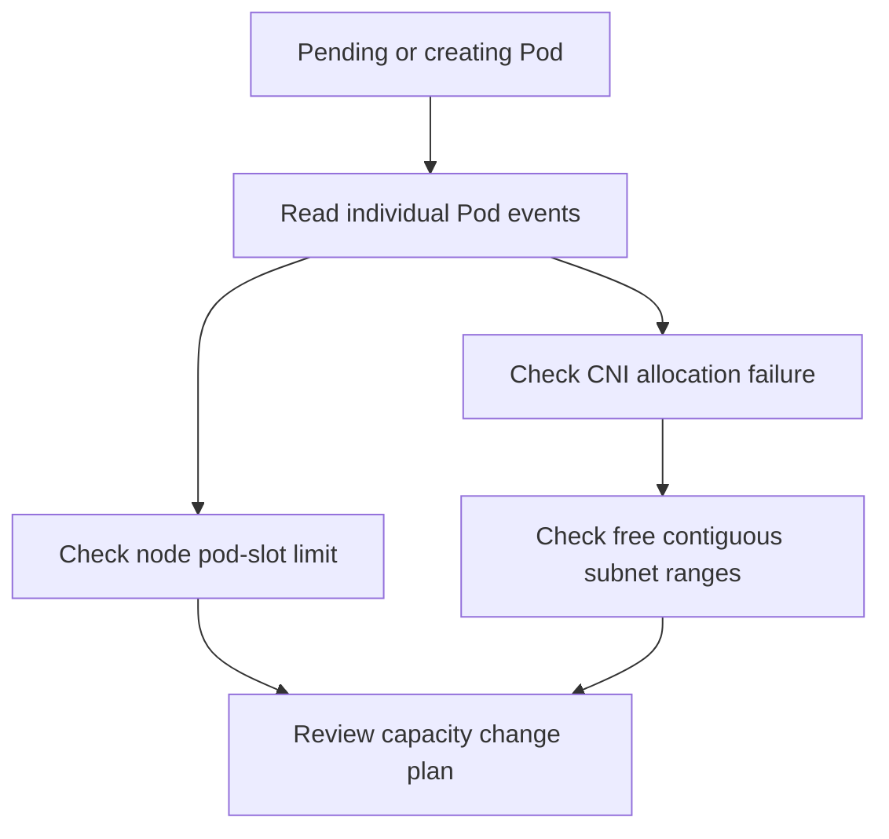
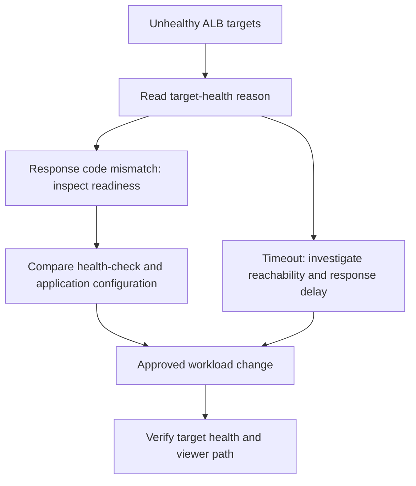

# 네트워크 진단 데모

이 문서는 진단 방법을 설명하는 예제이며 실제 평가나 복구 보장이 아닙니다.
아래 출력은 모두 가상 예제 데이터입니다. 변경을 승인하기 전에 현재 스킬의 실행
계약과 선택한 환경의 근거를 확인합니다.

## 시나리오 개요 {#scenario-overview}

서로 독립적인 두 예제로 노드·서브넷 용량과 애플리케이션 준비 상태를 구분합니다.
명령은 모두 읽기 전용입니다. 먼저 승인된 AWS 계정, 리전과 Kubernetes 컨텍스트를
확인하고 예제 리소스 이름과 변수의 자리 표시자를 명시적으로 선택한 리소스로 바꿉니다.
조사하는 동안 해당 선택을 유지합니다.

## 시나리오 1: IP 고갈 {#scenario-1-ip-exhaustion}

이 가상 사례에는 두 가지 제약이 있습니다. 일부 Pod는 스케줄러의 Pod 수용 한도에
걸리고, 이미 스케줄링된 다른 Pod는 네트워크 주소를 할당받지 못합니다. 두 제약을
하나의 용량 계산으로 합치지 않습니다.

### 문제 보고 {#problem-report}

예제 운영자는 스케줄링되지 않은 API Pod와 네트워크 샌드박스 생성 중 멈춘 worker를
보고합니다. 조치를 선택하기 전에 각 Pod의 이벤트를 확인합니다.

### 진단 워크플로 {#diagnosis-workflow}



### 1단계: 문제 식별 {#step-1-identify-the-problem}

```bash
kubectl get pods -A -o wide
kubectl describe pod api-server-pending -n backend
kubectl describe pod worker-net-pending -n backend
```

서로 다른 두 Pod의 가상 이벤트 발췌입니다:

```text
api-server-pending:
  FailedScheduling: Insufficient pods
worker-net-pending:
  FailedCreatePodSandBox: failed to assign an IP address to container
```

`Insufficient pods`는 Pod 수용 한도에 관한 스케줄러 근거입니다. 샌드박스 이벤트는
별도의 CNI 할당 실패 근거이며, 이 이벤트만으로 원인까지 확정할 수는 없습니다.

### 2단계: 서브넷 가용 IP 확인 {#step-2-check-subnet-ip-availability}

환경의 네트워크 인벤토리에서 영향을 받는 노드·Pod의 서브넷 ID를 선택합니다.

```bash
SUBNET_A="<selected-subnet-a>"
SUBNET_B="<selected-subnet-b>"
SUBNET_C="<selected-subnet-c>"
aws ec2 describe-subnets --subnet-ids "$SUBNET_A" "$SUBNET_B" "$SUBNET_C" \
  --query 'Subnets[].{SubnetId:SubnetId,Available:AvailableIpAddressCount}'
```

가상 응답 예시입니다:

```json
[
  {"SubnetId": "subnet-example-a", "Available": 3},
  {"SubnetId": "subnet-example-b", "Available": 5},
  {"SubnetId": "subnet-example-c", "Available": 2}
]
```

접두사 할당에는 비어 있는 연속된 `/28` 블록이 필요합니다. 이 서브넷들은 모두 해당
블록을 확보할 만큼 가용 주소가 충분하지 않으며, 서로 다른 서브넷의 주소를 합칠 수는
없습니다. 가용 주소 수가 더 많더라도 연속된 블록이 있다는 보장은 없습니다.
[AWS 접두사 모드 지침](https://docs.aws.amazon.com/eks/latest/best-practices/prefix-mode-linux.html)을 참고합니다.

### 3단계: 노드 Pod 한도와 ENI 확인 {#step-3-check-eni-allocation}

```bash
kubectl get nodes -o custom-columns=NAME:.metadata.name,ALLOCATABLE_PODS:.status.allocatable.pods
INSTANCE_ID="<selected-node-instance-id>"
aws ec2 describe-network-interfaces --filters "Name=attachment.instance-id,Values=$INSTANCE_ID" \
  --query 'NetworkInterfaces[].{ENI:NetworkInterfaceId,Subnet:SubnetId,Prefixes:Ipv4Prefixes}'
```

다음은 노드 출력의 가상 발췌입니다. 설정된 용량이며 인스턴스의 보편적인 한도가 아닙니다:

```text
NAME             ALLOCATABLE_PODS
example-node-a   17
example-node-b   17
example-node-c   17
```

이 예제의 kubelet Pod 한도는 여전히 17입니다. 접두사 위임을 켜는 것만으로 기존
kubelet 한도가 늘어나지는 않습니다. 주소 용량과 노드 그룹의 kubelet `max-pods`
설정을 함께 검토합니다. 이 사전 조건은
[AWS 접두사 모드 지침](https://docs.aws.amazon.com/eks/latest/best-practices/prefix-mode-linux.html)에서 설명합니다.

### 4단계: CNI 설정과 IPAMD 로그 확인 {#step-4-check-ipamd-logs}

가상 발췌에서는 접두사 모드가 이미 켜져 있지만 블록을 할당하지 못합니다.

```bash
kubectl get daemonset aws-node -n kube-system -o yaml
kubectl logs -n kube-system -l k8s-app=aws-node -c aws-node --tail=50
```

```text
Configuration excerpt:
  name: ENABLE_PREFIX_DELEGATION
  value: "true"
Log excerpt:
  InsufficientCidrBlocks: There are not enough free cidr blocks in the specified subnet
```

영향받는 서브넷 및 Pod의 시각 정보와 로그를 대조합니다. 설정을 켜지 않은 것이
원인이라고 가정하거나 서브넷 크기로 할당된 주소 총량을 추정하지 않습니다.

### 용량 진단 {#root-cause-analysis}

가상 근거는 Pod 수용 한도와 접두사 할당 실패를 보여 줍니다. CNI 설정 하나만 바꾸면
스케줄링이 복구된다는 결론을 뒷받침하지는 않습니다. 이 발췌로 할당된 IP 총량이나
복구 보장을 도출하지 않습니다.

### 해결 계획 {#resolution}

롤백과 워크로드 중단 통제를 포함해 검토 가능한 변경 계획을 준비합니다. 승인된
IaC 및 워크로드 배포 절차로만 적용합니다. 여기서는 리소스를 변경하는 명령을
제공하지 않습니다.

#### 즉시 조치: 안전한 용량 확보 방안 검토 {#immediate-fix-enable-prefix-delegation}

주소 공간이 고갈되거나 조각난 상황에서 접두사 위임 자체를 해결책으로 삼지 않습니다.
용량 변경을 배포하기 전에 적합한 서브넷 공간, 지원되는 노드·CNI 구성과 필요한
kubelet 한도를 검토합니다. AWS는 기존 서브넷에서 연속된 블록을 확보할 수 없을 때
새 서브넷과 노드 그룹을 권장합니다. 앞서 연결한 접두사 모드 지침과 승인된
마이그레이션 계획을 따릅니다.

#### 승인된 변경 검증 {#verify-fix}

승인된 변경 후 새로운 근거를 수집합니다:

```bash
kubectl get pods -A -o wide
kubectl get nodes -o custom-columns=NAME:.metadata.name,ALLOCATABLE_PODS:.status.allocatable.pods
kubectl logs -n kube-system -l k8s-app=aws-node -c aws-node --tail=50
```

의도한 Pod 준비 상태, 검토한 노드 용량과 관찰 기간 중 기존 할당 실패의 재발 여부를
확인합니다. 실제 결과를 기록합니다. 설정 배포가 성공했다는 사실만으로 워크로드가
복구되었다고 판단하지 않습니다.

#### 장기 조치: 적합한 주소 공간 계획 {#long-term-fix-add-secondary-cidr}

워크로드 수요와 네트워크 제약을 바탕으로 주소 공간을 설계합니다. 새 서브넷,
노드 그룹이나 추가 VPC CIDR 공간이 필요하면 중복, 할당, 라우팅과 마이그레이션을
IaC에서 검토합니다. 필요한 경우 연속된 범위를 예약합니다. 일률적인 용량 배수로
설계 검토를 대신하지 않습니다.

## 시나리오 2: ALB 대상 준비 상태 실패 {#scenario-2-alb-502-errors}

이 예제는 워크로드 배포 후 비정상 상태가 된 대상을 진단합니다. 사용자에게 보인
502의 원인을 보안 그룹으로 단정하거나 클라이언트 오류 비율을 추정하지 않습니다.
기존 링크를 위해 이전 앵커 ID는 유지합니다.

### 문제 보고 {#problem-report-1}

대상 상태에서 복제본 두 개의 준비 상태 확인 실패가 보고됩니다. 애플리케이션이나
네트워크 원인을 조사하기 전에 정확한 대상 그룹, 확인 경로와 시각을 식별합니다.

### 진단 워크플로 {#diagnosis-workflow-1}



### 1단계: 대상 그룹 상태 확인 {#step-1-check-target-group-health}

승인된 리소스 인벤토리에서 선택한 Ingress에 연결된 정확한 대상 그룹 ARN을 확인합니다.
ALB 호스트 이름은 대상 그룹 ARN이 아닙니다. 이름의 일부가 일치한다는 이유로 첫 항목을
선택하지 않습니다.

```bash
TG_ARN="<selected-target-group-arn>"
aws elbv2 describe-target-health --target-group-arn "$TG_ARN"
```

가상 응답 예시입니다:

```json
{
  "TargetHealthDescriptions": [
    {
      "Target": {"Id": "10.0.1.45", "Port": 8080},
      "TargetHealth": {"State": "unhealthy", "Reason": "Target.ResponseCodeMismatch", "Description": "Health checks failed with these codes: [503]"}
    },
    {
      "Target": {"Id": "10.0.2.78", "Port": 8080},
      "TargetHealth": {"State": "unhealthy", "Reason": "Target.ResponseCodeMismatch", "Description": "Health checks failed with these codes: [503]"}
    },
    {
      "Target": {"Id": "10.0.3.112", "Port": 8080},
      "TargetHealth": {"State": "healthy"}
    }
  ]
}
```

`Target.ResponseCodeMismatch`는 응답 코드가 설정된 일치 조건에 맞지 않았다는 뜻입니다.
`Target.Timeout`은 시간 초과를 나타냅니다. 503을 수신했다는 사실은 보안 그룹이 같은
검사 요청을 차단했다는 근거가 아닙니다.
[ALB 대상 상태 확인과 원인 코드](https://docs.aws.amazon.com/elasticloadbalancing/latest/application/target-group-health-checks.html)를 참고합니다.

### 2단계: 워크로드 준비 상태 확인 {#step-2-check-pod-status}

```bash
POD_NAME="<selected-backend-pod>"
kubectl get pods -n backend -l app=api-server -o wide
kubectl logs "$POD_NAME" -n backend --tail=50
kubectl get deployment api-server -n backend -o json \
  | jq '.spec.template.spec.containers[] | {name, readinessPath:.readinessProbe.httpGet.path, readinessPort:.readinessProbe.httpGet.port}'
```

애플리케이션 로그의 가상 발췌입니다:

```text
readiness path=/ready status=503 reason=dependency_unavailable
```

같은 시각의 준비 상태 프로브, Pod 준비 상태와 애플리케이션 로그를 확인합니다.
Running phase만으로 애플리케이션 상태를 판정할 수는 없습니다. ALB가 실제로 확인하는
엔드포인트와 애플리케이션의 준비 상태 계약을 비교합니다.

### 3단계: 실제 대상 네트워크 경로 확인 {#step-3-check-security-groups}

대상의 실제 ENI에 연결된 보안 그룹을 식별합니다. 노드와 Pod의 보안 그룹이
같다고 가정하지 않습니다.

```bash
TARGET_SG_ID="<selected-target-security-group-id>"
aws ec2 describe-security-group-rules --filters "Name=group-id,Values=$TARGET_SG_ID"
```

ALB 출발지 그룹, 대상 포트, 경로와 적용되는 네트워크 통제를 검토합니다. 예제의
HTTP 응답은 인바운드 규칙 누락을 입증하지 않습니다. 모든 상태 확인 실패를 SG 문제로
취급하지 말고 시간 초과는 별도로 조사합니다.

### 4단계: 상태 확인 설정 점검 {#step-4-check-health-check-configuration}

```bash
aws elbv2 describe-target-groups --target-group-arns "$TG_ARN" \
  --query 'TargetGroups[].{Protocol:HealthCheckProtocol,Port:HealthCheckPort,Path:HealthCheckPath,Matcher:Matcher.HttpCode}'
```

가상 설정 예시입니다:

```json
[
  {"Protocol": "HTTP", "Port": "8080", "Path": "/ready", "Matcher": "200"}
]
```

이 준비 상태 경로의 503 응답은 200 일치 조건을 통과하지 못합니다. 애플리케이션 설정과
의존성을 함께 확인합니다. 준비되지 않은 애플리케이션을 숨기기 위해 성공 코드 범위를
넓히지 않습니다.

### 잠정 진단 {#root-cause-analysis-1}

가상 근거는 애플리케이션 준비 상태 조사를 뒷받침합니다. ALB는 200을 기대하는 경로에서
503을 수신하고, 예제 애플리케이션은 의존 대상의 사용 불가를 보고합니다. 조치 전에
실제 의존성·설정 결함을 확인합니다. 대상 세 개 중 두 개가 비정상이라는 사실만으로
요청의 66%가 실패한다고 판단할 수는 없습니다.

### 해결 계획 {#resolution-1}

확인된 원인을 담당자에게 배정하고 승인된 워크로드 변경을 준비합니다. 롤백,
가용성과 최소 권한 요구 사항을 유지합니다.

#### 승인된 워크로드 시정 조치 적용 {#fix-security-group}

확인된 의존성 또는 준비 상태 설정 문제를 검토된 배포 절차로 수정합니다. 이 예제가
뒷받침하는 조치는 보안 그룹 변경이 아닙니다. 별도 조사에서 네트워크 규칙 결함을
확인했다면 접근 범위를 좁게 제한한 승인된 IaC로만 변경합니다. 임시 인바운드 CLI
명령을 사용하거나 인터넷 전체에 포트를 개방하지 않습니다.

#### 해결 결과 검증 {#verify-resolution}

```bash
aws elbv2 describe-target-health --target-group-arn "$TG_ARN"
kubectl get pods -n backend -l app=api-server -o wide
kubectl logs "$POD_NAME" -n backend --tail=50
```

승인된 배포 후 설정된 상태 확인 임계값을 관찰하고 실제 준비 상태, 원인 코드와 시각을
기록합니다. 사용자 동작은 공개 ALB 호스트에 직접 접근하지 말고 승인된 CloudFront
사용자 엔드포인트와 모니터링·로그로 검증합니다. 비정상 대상의 비율로 요청 결과를
추정하지 말고 실제로 측정한 결과를 보고합니다.

## 요약 보고서 {#summary-report}

| 시나리오 | 보고할 근거 | 후속 조치 |
| --- | --- | --- |
| 용량 | Pod별 이벤트, 노드 Pod 한도, 서브넷 가용량과 CNI 오류 | 검토된 IaC·노드 그룹 용량 계획과 워크로드 검증 |
| 대상 준비 상태 | 정확한 대상 그룹, 응답 원인, 검사 설정과 애플리케이션 로그 | 승인된 워크로드 수정과 CloudFront 경로 검증 |

검증 기준을 실제로 확인하기 전에는 어느 시나리오도 해결된 것으로 표시하지 않습니다.
예제 식별자와 가설을 실제 근거와 구분합니다.

## 핵심 사항 {#key-points}

- 가용 주소 총량만으로 연속된 접두사 블록이나 kubelet 용량을 입증할 수 없습니다.
- 실패한 HTTP 응답을 수신한 경우와 시간 초과를 구분합니다.
- 진단은 읽기 전용으로, 시정 조치는 승인된 선언적 절차로 수행하며 공개 경로 검증은
  승인된 CloudFront를 사용합니다.
