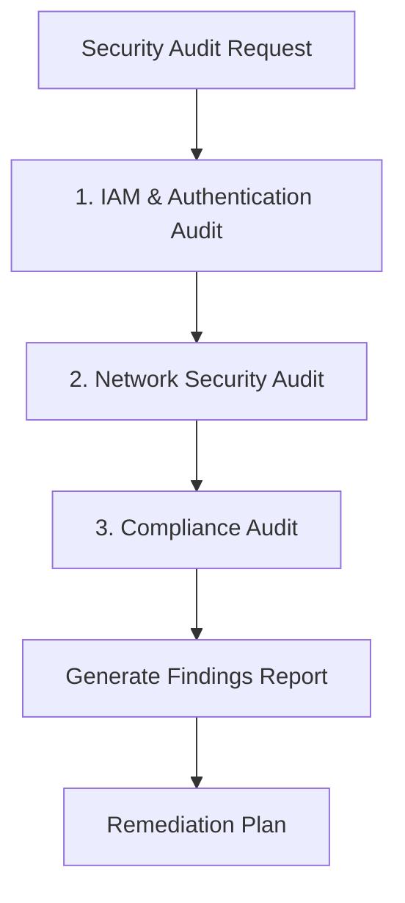

# 보안 감사 데모

이 문서는 설명을 위한 예제입니다. 명령 출력, 식별자, 임계값, 발견 사항은 샘플 데이터이며 실제 평가 결과나 플러그인 기본값이 아닙니다. 실행 규칙은 현재 스킬을 따르고, 제안된 수정을 적용하기 전에 실제 환경을 확인합니다.

IAM, 네트워크, 규정 준수 감사 결과와 발견 사항 보고서를 다루는 보안 감사 예제입니다.

## 시나리오 {#scenario}

보안 검토 전에 EKS 클러스터를 종합 감사하여 취약점과 규정 준수의 공백을 파악합니다.

대상 AWS 계정, 리전과 Kubernetes 컨텍스트를 확인합니다. 아래 명령 예제는 읽기 전용이며, 변경은 승인된 시정 조치 절차로만 적용합니다.

## 감사 워크플로 {#audit-workflow}



## 1단계: 보안 감사 시작 {#step-1-initiate-security-audit}

사용자 요청:

```
Please run a comprehensive security audit on the cluster.
```

**ops-security-audit** 스킬이 활성화되어 체계적인 보안 점검을 시작합니다.

---

## 페이즈 1: IAM 및 인증 감사 {#phase-1-iam--authentication-audit}

### 1.1 IRSA 설정 점검 {#11-irsa-configuration-check}

```bash
# List all IRSA-annotated service accounts
kubectl get sa -A -o json | jq '.items[] | select(.metadata.annotations["eks.amazonaws.com/role-arn"] != null) | {namespace:.metadata.namespace, name:.metadata.name, role:.metadata.annotations["eks.amazonaws.com/role-arn"]}'
```

출력:
```json
{"namespace":"kube-system","name":"aws-load-balancer-controller","role":"arn:aws:iam::123456789012:role/eks-lb-controller-role"}
{"namespace":"kube-system","name":"ebs-csi-controller-sa","role":"arn:aws:iam::123456789012:role/eks-ebs-csi-role"}
{"namespace":"backend","name":"api-service-account","role":"arn:aws:iam::123456789012:role/api-backend-role"}
{"namespace":"analytics","name":"data-processor","role":"arn:aws:iam::123456789012:role/analytics-full-access"}
```

### 1.2 신뢰 정책 검증 {#12-verify-trust-policies}

```bash
# Check trust policy for suspicious role
aws iam get-role --role-name analytics-full-access --query 'Role.AssumeRolePolicyDocument'
```

출력:
```json
{
    "Version": "2012-10-17",
    "Statement": [
        {
            "Effect": "Allow",
            "Principal": {
                "Federated": "arn:aws:iam::123456789012:oidc-provider/oidc.eks.us-west-2.amazonaws.com/id/ABC123"
            },
            "Action": "sts:AssumeRoleWithWebIdentity",
            "Condition": {
                "StringLike": {
                    "oidc.eks.us-west-2.amazonaws.com/id/ABC123:sub": "system:serviceaccount:*:*"
                }
            }
        }
    ]
}
```

**발견 사항 (CRITICAL)**: 신뢰 정책이 와일드카드 `*:*`를 사용하므로 모든 서비스 계정이 이 역할을 수임할 수 있습니다.

### 1.3 IAM 권한 점검 {#13-check-iam-permissions}

```bash
# Check for overly permissive policies
aws iam list-attached-role-policies --role-name analytics-full-access
```

출력:
```json
{
    "AttachedPolicies": [
        {"PolicyName": "AmazonS3FullAccess", "PolicyArn": "arn:aws:iam::aws:policy/AmazonS3FullAccess"},
        {"PolicyName": "AmazonDynamoDBFullAccess", "PolicyArn": "arn:aws:iam::aws:policy/AmazonDynamoDBFullAccess"}
    ]
}
```

**발견 사항 (HIGH)**: 역할에 FullAccess 정책이 연결되어 최소 권한 원칙을 위반합니다.

### 1.4 RBAC 감사 {#14-rbac-audit}

```bash
# Find cluster-admin bindings
kubectl get clusterrolebindings -o json | jq '.items[] | select(.roleRef.name=="cluster-admin") | {name:.metadata.name, subjects:.subjects}'
```

출력:
```json
{
  "name": "cluster-admin-binding",
  "subjects": [
    {"kind": "User", "name": "admin@company.com"},
    {"kind": "User", "name": "developer@company.com"},
    {"kind": "Group", "name": "system:masters"}
  ]
}
{
  "name": "emergency-access",
  "subjects": [
    {"kind": "ServiceAccount", "name": "default", "namespace": "kube-system"}
  ]
}
```

**발견 사항 (HIGH)**: 개발자 사용자에게 cluster-admin 바인딩이 있고 기본 서비스 계정도 cluster-admin 권한을 가집니다.

### 1.5 aws-auth ConfigMap 점검 {#15-aws-auth-configmap-check}

```bash
kubectl get configmap aws-auth -n kube-system -o yaml
```

출력:
```yaml
apiVersion: v1
kind: ConfigMap
metadata:
  name: aws-auth
  namespace: kube-system
data:
  mapRoles: |
    - rolearn: arn:aws:iam::123456789012:role/eks-node-role
      username: system:node:{{EC2PrivateDNSName}}
      groups:
        - system:bootstrappers
        - system:nodes
    - rolearn: arn:aws:iam::123456789012:role/admin-role
      username: admin
      groups:
        - system:masters
    - rolearn: arn:aws:iam::123456789012:role/developer-role
      username: developer
      groups:
        - system:masters
```

**발견 사항 (HIGH)**: 개발자 역할이 system:masters 그룹에 매핑되어 있습니다.

---

## 페이즈 2: 네트워크 보안 감사 {#phase-2-network-security-audit}

### 2.1 보안 그룹 분석 {#21-security-group-analysis}

```bash
# Get cluster security group
CLUSTER_SG=$(aws eks describe-cluster --name prod-cluster --query 'cluster.resourcesVpcConfig.clusterSecurityGroupId' --output text)

# Check inbound rules
aws ec2 describe-security-group-rules --filter Name=group-id,Values=$CLUSTER_SG --query 'SecurityGroupRules[?!IsEgress].{FromPort:FromPort,ToPort:ToPort,Source:CidrIpv4}'
```

출력:
```json
[
    {"FromPort": 443, "ToPort": 443, "Source": "0.0.0.0/0"},
    {"FromPort": 22, "ToPort": 22, "Source": "0.0.0.0/0"}
]
```

**발견 사항 (CRITICAL)**: SSH(포트 22)가 0.0.0.0/0에 개방되어 있습니다.

### 2.2 네트워크 정책 적용 범위 {#22-network-policy-coverage}

```bash
# Check namespaces without network policies
for ns in $(kubectl get ns -o jsonpath='{.items[*].metadata.name}'); do
  policies=$(kubectl get networkpolicies -n $ns 2>/dev/null | tail -n +2 | wc -l)
  pods=$(kubectl get pods -n $ns 2>/dev/null | tail -n +2 | wc -l)
  if [ "$policies" -eq "0" ] && [ "$pods" -gt "0" ]; then
    echo "WARNING: $ns has $pods pods but no network policies"
  fi
done
```

출력:
```
WARNING: backend has 6 pods but no network policies
WARNING: analytics has 4 pods but no network policies
WARNING: monitoring has 8 pods but no network policies
WARNING: default has 2 pods but no network policies
```

**발견 사항 (MEDIUM)**: 워크로드가 있는 네임스페이스 4개에 네트워크 정책이 없습니다.

### 2.3 클러스터 엔드포인트 접근 {#23-cluster-endpoint-access}

```bash
aws eks describe-cluster --name prod-cluster --query 'cluster.resourcesVpcConfig.{publicAccess:endpointPublicAccess,privateAccess:endpointPrivateAccess,publicCIDRs:publicAccessCidrs}'
```

출력:
```json
{
    "publicAccess": true,
    "privateAccess": true,
    "publicCIDRs": ["0.0.0.0/0"]
}
```

**발견 사항 (HIGH)**: 클러스터 API 엔드포인트에 어디서나 공개적으로 접근할 수 있습니다.

### 2.4 VPC 엔드포인트 점검 {#24-vpc-endpoints-check}

```bash
# Check existing VPC endpoints
VPC_ID=$(aws eks describe-cluster --name prod-cluster --query 'cluster.resourcesVpcConfig.vpcId' --output text)
aws ec2 describe-vpc-endpoints --filters Name=vpc-id,Values=$VPC_ID --query 'VpcEndpoints[].ServiceName'
```

출력:
```json
[
    "com.amazonaws.us-west-2.s3",
    "com.amazonaws.us-west-2.ecr.api"
]
```

**발견 사항 (MEDIUM)**: 권장 VPC 엔드포인트(ecr.dkr, sts, logs, ec2)가 없습니다.

---

## 페이즈 3: 규정 준수 감사 {#phase-3-compliance-audit}

### 3.1 특권 컨테이너 {#31-privileged-containers}

```bash
kubectl get pods -A -o json | jq '[.items[] | select(.spec.containers[].securityContext.privileged==true) | {name:.metadata.name, ns:.metadata.namespace}]'
```

출력:
```json
[
  {"name":"aws-node-abc","ns":"kube-system"},
  {"name":"aws-node-def","ns":"kube-system"},
  {"name":"debug-pod","ns":"default"},
  {"name":"data-processor-xyz","ns":"analytics"}
]
```

**발견 사항 (HIGH)**: 시스템용이 아닌 네임스페이스(default, analytics)에 특권 컨테이너 2개가 있습니다.

### 3.2 root 컨테이너 {#32-root-containers}

일반 컨테이너에 명시된 UID 설정을 확인합니다. 컨테이너 설정이 파드 설정보다 우선하며, UID가 없으면 이미지·런타임 확인이 필요합니다. 이 쿼리는 init·ephemeral 컨테이너와 실제 프로세스 UID를 검사하지 않습니다. [Kubernetes 보안 컨텍스트](https://kubernetes.io/docs/tasks/configure-pod-container/security-context/)를 참고하세요.

```bash
kubectl get pods -A -o json | jq '[
  .items[] as $pod
  | select(any($pod.spec.containers[];
      (.securityContext.runAsUser // $pod.spec.securityContext.runAsUser // null) == 0))
  | {name: $pod.metadata.name, ns: $pod.metadata.namespace}
]'
```

출력:
```json
[
  {"name":"api-server-abc","ns":"backend"},
  {"name":"worker-def","ns":"backend"},
  {"name":"data-processor-xyz","ns":"analytics"},
  {"name":"web-app-ghi","ns":"frontend"}
]
```

**발견 사항 (MEDIUM)**: 파드 4개에 UID 0으로 명시적으로 설정된 일반 컨테이너가 있습니다.

### 3.3 Pod Security Standards {#33-pod-security-standards}

```bash
# Check namespace labels for Pod Security Standards
kubectl get ns -o json | jq '.items[] | select(.metadata.labels["pod-security.kubernetes.io/enforce"] != null) | {name:.metadata.name, enforce:.metadata.labels["pod-security.kubernetes.io/enforce"]}'
```

출력:
```json
```

**발견 사항 (MEDIUM)**: Pod Security Standards가 적용된 네임스페이스가 없습니다.

### 3.4 컨트롤 플레인 로깅 {#34-control-plane-logging}

```bash
aws eks describe-cluster --name prod-cluster --query 'cluster.logging.clusterLogging[?enabled==`true`].types[]'
```

출력:
```json
["api"]
```

**발견 사항 (MEDIUM)**: API 로깅만 활성화되어 있으며 audit 및 authenticator 로그가 없습니다.

### 3.5 봉투 암호화와 키 소유권 {#35-secrets-encryption}

```bash
aws eks describe-cluster --name prod-cluster \
  --query 'cluster.{version:version,encryptionConfig:encryptionConfig}'
```

가상 응답 예시입니다:
```json
{"version": "1.29", "encryptionConfig": null}
```

**관찰 사항 (INFORMATIONAL)**: 이 EKS 1.29 예제의 `encryptionConfig: null`은
고객 관리형 KMS 구성이 없다는 뜻이며, Secret이 암호화되지 않았다는 의미가 아닙니다.
EKS 1.28 이상은 고객 관리형 키를 구성하지 않은 경우 AWS 소유 KMS 키로 모든
Kubernetes API 데이터에 기본 봉투 암호화를 제공합니다. 실제 버전과 키 소유권을
확인하고 워크로드별 CMK 요구 사항은 별도로 평가합니다.
[AWS 기본 봉투 암호화](https://docs.aws.amazon.com/eks/latest/userguide/envelope-encryption.html)를 참고합니다.

아래 보고서의 #14는 정보 항목입니다. 조직별 CMK 요구 사항이 주어지지 않았으므로
발견 사항을 만들기 위해 해당 요구 사항을 임의로 가정하지 않습니다.

---

## 보안 감사 보고서 {#security-audit-report}

```markdown
# Security Audit Report

## Summary
- **Audit Date**: 2026-03-22 15:00:00 UTC
- **Cluster**: prod-cluster (us-west-2)
- **EKS Version**: 1.29
- **Overall Risk**: CRITICAL

## Executive Summary
This illustrative report records 16 assessed items: 15 security findings and one informational encryption observation.
The security findings comprise 2 Critical, 6 High, 5 Medium, and 2 Low items.
The absence of a customer-managed KMS key is not counted as unencrypted data or an automatic policy violation.

## Assessed Items by Severity

### CRITICAL (2)

| # | Domain | Finding | Risk | Remediation |
|---|--------|---------|------|-------------|
| 1 | IAM | IRSA trust policy with wildcard (`*:*`) | Any pod can assume analytics-full-access role | Scope trust policy to specific namespace:serviceaccount |
| 2 | Network | SSH (22) open to 0.0.0.0/0 | Direct SSH access from internet | Remove through the owning IaC definition; preserve approved administrative access |

### HIGH (6)

| # | Domain | Finding | Risk | Remediation |
|---|--------|---------|------|-------------|
| 3 | IAM | S3/DynamoDB FullAccess policies | Excessive permissions | Create scoped IAM policies |
| 4 | IAM | Developer has cluster-admin | Excessive cluster access | Create limited developer role |
| 5 | IAM | Default SA has cluster-admin | Privilege escalation risk | Remove emergency-access binding |
| 6 | IAM | Developer role in system:masters | Full cluster admin via aws-auth | Map to limited group |
| 7 | Network | API endpoint open to 0.0.0.0/0 | Publicly reachable API endpoint | Plan private endpoint access or verified public egress CIDRs |
| 8 | Compliance | Privileged containers in workloads | Container escape risk | Remove privileged flag |

### MEDIUM (5)

| # | Domain | Finding | Risk | Remediation |
|---|--------|---------|------|-------------|
| 9 | Network | 4 namespaces without NetworkPolicy | Unrestricted pod communication | Deploy default-deny policies |
| 10 | Network | Missing VPC endpoints | Traffic via internet | Add ecr.dkr, sts, logs endpoints |
| 11 | Compliance | 4 Pods with explicit UID 0 in regular containers | Container privilege abuse | Set runAsNonRoot: true |
| 12 | Compliance | No Pod Security Standards | No policy enforcement | Enable PSS restricted mode |
| 13 | Compliance | Incomplete control plane logging | Limited audit trail | Enable audit + authenticator logs |

### INFORMATIONAL (1)

| # | Domain | Observation | Interpretation | Follow-up |
|---|--------|-------------|----------------|-----------|
| 14 | Compliance | No customer-managed KMS configuration | EKS 1.29 has default AWS-owned envelope encryption | Assess a CMK requirement separately; do not infer unencrypted Secrets |

### LOW (2)

| # | Domain | Finding | Risk | Remediation |
|---|--------|---------|------|-------------|
| 15 | Compliance | Debug pod in default namespace | Potential backdoor | Remove debug pod |
| 16 | Network | Unused security groups | Management overhead | Clean up stale SGs |

## Compliance Checklist

| Requirement | Status | Notes |
|-------------|--------|-------|
| No privileged containers in workloads | FAIL | 2 found in default, analytics |
| Regular containers configured as nonroot | FAIL | 4 Pods explicitly configure UID 0 |
| Network policies in all namespaces | FAIL | 4 namespaces missing |
| IRSA/Pod Identity for AWS access | PARTIAL | IRSA used but misconfigured |
| Default API-data envelope encryption | PASS | AWS-owned KMS key applies to this EKS 1.29 sample; no CMK configured |
| Customer-managed key requirement | REVIEW | No organization-specific requirement supplied; assess separately |
| Control plane audit logging | PARTIAL | Only api logs enabled |
| VPC endpoints for AWS services | PARTIAL | 2 of 6 recommended |
| Cluster endpoint private access | PASS | Private access enabled |
| Restricted public access CIDRs | FAIL | Open to 0.0.0.0/0 |

## Remediation Priority

### Immediate (24 hours)
1. Fix IRSA trust policy wildcard (Critical #1)
2. Remove the SSH 0.0.0.0/0 rule through approved IaC (Critical #2)
3. Establish authorized private endpoint access before disabling public access (High #7)
4. Remove privileged flag from workload containers (High #8)

### This Week
5. Create scoped IAM policies (High #3)
6. Fix developer RBAC permissions (High #4, #6)
7. Remove default SA cluster-admin binding (High #5)
8. Deploy default-deny NetworkPolicies (Medium #9)

### This Month
9. Add missing VPC endpoints (Medium #10)
10. Implement Pod Security Standards (Medium #12)
11. Enable full control plane logging (Medium #13)
12. Assess a customer-managed key only if workload policy requires it (Informational #14)

### Ongoing
13. Enforce runAsNonRoot for all workloads (Medium #11)
14. Clean up debug resources (Low #15)
15. Security group hygiene (Low #16)
```

---

## 승인된 시정 조치와 검증 {#remediation-commands}

### Critical #1: IRSA 신뢰 정책 수정 {#critical-1-fix-irsa-trust-policy}

이 가상 신뢰 문서를 실제 OIDC 발급자, 네임스페이스와 서비스 계정에 대조해 검토합니다.
승인된 IAM/IaC 변경은 롤백과 워크로드 검증을 포함한 정상 검토 절차로 적용합니다.
이 페이지에서는 IAM 갱신을 실행하지 않습니다.

```json
{
    "Version": "2012-10-17",
    "Statement": [
        {
            "Effect": "Allow",
            "Principal": {
                "Federated": "arn:aws:iam::123456789012:oidc-provider/oidc.eks.us-west-2.amazonaws.com/id/ABC123"
            },
            "Action": "sts:AssumeRoleWithWebIdentity",
            "Condition": {
                "StringEquals": {
                    "oidc.eks.us-west-2.amazonaws.com/id/ABC123:aud": "sts.amazonaws.com",
                    "oidc.eks.us-west-2.amazonaws.com/id/ABC123:sub": "system:serviceaccount:analytics:data-processor"
                }
            }
        }
    ]
}
```

### Critical #2: SSH 규칙 제거 {#critical-2-remove-ssh-rule}

공개 SSH 규칙을 관리하는 CDK/Terraform 정의에서 제거하고 승인된 IaC 배포 절차로
적용합니다. 관리 접근 경로와 롤백을 먼저 확인하고 배포된 규칙을 검사하여 이후 배포가
노출을 다시 만들지 않도록 합니다. 임시 보안 그룹 CLI 변경으로 대신하지 않습니다.

감사에서 선택한 그룹에 대해 읽기 전용으로 검증합니다:

```bash
aws ec2 describe-security-group-rules \
  --filters "Name=group-id,Values=$CLUSTER_SG"
```

### High #7: API 엔드포인트 제한 {#high-7-restrict-api-endpoint}

이 예제에서는 프라이빗 엔드포인트 작업 흐름을 사용합니다. 공개 접근을 끄기 전에
VPC 또는 연결된 네트워크에서 운영자, 노드와 자동화의 접근을 확보하고 DNS, 경로,
범위를 제한한 보안 그룹 규칙과 IAM/RBAC를 검증합니다. 롤백을 포함한 승인된
클러스터·IaC 절차로 엔드포인트를 변경한 뒤, 확보한 프라이빗 접근 경로에서 읽기 전용
검사를 다시 수행합니다.

```bash
aws eks describe-cluster --name prod-cluster \
  --query 'cluster.resourcesVpcConfig.{publicAccess:endpointPublicAccess,privateAccess:endpointPrivateAccess,publicCIDRs:publicAccessCidrs}'
```

`publicAccessCidrs`는 프라이빗 엔드포인트가 아닌 공개 엔드포인트를 제어합니다.
승인된 설계에서 공개 접근을 유지한다면 필요에 따라 NAT 송신 주소를 포함하여
엔드포인트에 실제로 보이는 공인 송신 주소를 허용해야 합니다. 사내 RFC1918 범위로
대체하지 않습니다. [EKS 엔드포인트 접근](https://docs.aws.amazon.com/eks/latest/userguide/cluster-endpoint.html)과
[공개 접근 출발지 CIDR](https://docs.aws.amazon.com/help-panel/eks/latest/console/hp-public-access-iprange.html)을 참고합니다.

---

## 핵심 사항 {#key-points}

:::danger Critical 발견 사항
IRSA 와일드카드 신뢰 정책과 인터넷에 개방된 SSH는 클러스터 침해로 이어질 수 있는 심각한 취약점입니다. 즉시 시정합니다.
:::

:::warning 최소 권한
여러 발견 사항이 과도한 권한(FullAccess 정책, system:masters 매핑)과 관련되어 있습니다. IAM과 RBAC 전반에 최소 권한을 적용합니다.
:::

:::tip 심층 방어
네트워크 분리를 위한 NetworkPolicies, 워크로드 보안 강화를 위한 Pod Security Standards, 데이터 보호를 위한 암호화 등 여러 보안 계층을 활성화합니다.
:::
