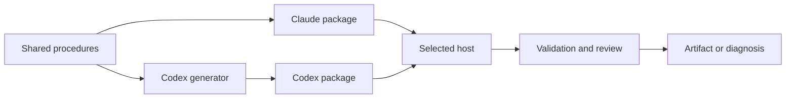

# Architecture

oh-my-cloud-skills is a Claude Code and Codex plugin marketplace with eight plugins.
It ships Markdown procedures and Python/Bash/Node helpers, with no application server.
Internal docs live in `docs/`; the public Docusaurus site lives in `doc-sites/`.

## Inventory

Counts below are derived from shared `skills/*/SKILL.md`, `commands/*.md`,
`agents/*.md`, generated `.codex-plugin/inventory.json`, and command hooks in each
Claude manifest (2026-09-13). Project-init uses convention-based source discovery.

| Plugin | Purpose | Source skills | Commands | Agents | Codex entries | Plugin hooks |
|---|---|---:|---:|---:|---:|---:|
| aws-content-plugin | Presentations, diagrams, documents, workshops | 9 | 0 | 9 | 18 | 6 |
| aws-ops-plugin | AWS infrastructure diagnosis and review | 6 | 0 | 10 | 16 | 2 |
| kiro-power-converter | Plugin to Kiro Power conversion | 1 | 0 | 1 | 2 | 1 |
| agentcore-creator | Agent design and AgentCore conversion/deployment | 1 | 0 | 1 | 2 | 1 |
| co-agent | Multi-AI review, decisions, ADRs and implementation workflows | 3 | 6 | 5 | 12 | 8 |
| project-init | Project scaffolding and documentation management | 1 | 9 | 1 | 11 | 0 |
| kiro | Host-planned implementation delegated to Kiro CLI | 1 | 4 | 1 | 6 | 5 |
| atlas | Per-topic documentation drift detection and optional repair | 1 | 5 | 1 | 7 | 2 |
| **Total** | | **23** | **24** | **29** | **74** | **25** |

The **76 source procedures** map to **74 Codex entry skills** because some entries
combine sources. Specialist entries are procedures, not native Codex agent roles.
The **25 plugin hook commands** exclude repository hooks and project-init's
separately installed project templates. These counts do not measure CI review cells:
the default CI panel has one full-scope prompt and three enabled cells.

## Delivery and execution

- Each plugin has Claude and Codex `plugin.json` manifests. Registries are
  `.claude-plugin/marketplace.json` and `.agents/plugins/marketplace.json`.
  All share the release version and `v{version}` tag.
- `scripts/codex/` owns host adaptations. Generated entries link back to shared
  procedures; edit the source or adapter and regenerate instead of editing overlays.
  Project-init's upstream source and generated Codex overlay have separate ownership.
- Codex translates source tool/path conventions through its adapters. Hook execution
  requires supported events and actual trust; a manifest or installed file alone
  does not prove execution. Project-init templates need separate installation.
- In co-agent, the current host chairs and excludes itself from peer selection.
  Review/decide/ADR can fall back to solo with notice; consensus/harness require a
  READY peer with raw CLI access. Local optional hooks have their own opt-in and
  failure rules; they do not replace mandatory CI review.
- Kiro delegation confines the diff landing in the main tree through worktree and
  scope checks. It does not sandbox arbitrary `execute_bash` inside that worktree;
  see the trust decision in `plugins/kiro/CLAUDE.md`.

## Artifact and review boundaries

Content artifacts require the applicable content-review gate: normally 85/100,
or 77/90 when Visual Testing is exempt. Diagram and Remarp validation precede export
or build. Native editable PPTX uses `aws-light-fcd`; web-deck PPTX export captures
slide images. Both use the shared icon library. Archify diagrams embed through
Remarp's `:::archify` path ([ADR-020](decisions/ADR-020-archify-interactive-diagrams.md)).
Mixed changes require every applicable gate in [review routing](reference/review-routing.md).
AWS security mandates remain binding even when an implementation differs from them.

PR acceptance requires a review of the latest HEAD, no unresolved Critical/Major
findings, complete configured review coverage, and all required checks. The semantic
review gate validates final Issues and coverage; a lexical `VERDICT: PASS`, a missing
review, or a local hook's fail-open result cannot establish acceptance.

Privileged `pull_request_target` review executes trusted base scripts and treats the
PR tree as data. Separate [Codex package validation](../.github/workflows/codex-validation.yml)
checks the PR HEAD's generator, generated output, manifests and inventory in isolated
CI. It must pass alongside AI review; generation freshness has no plugin exemption.
See [ADR-021](decisions/ADR-021-english-docs-current-review-authority.md) for authority
and historical ADR scope, and [runtime verification](reference/codex-runtime-verification.md)
for evidence beyond static validation.

## Maintenance

[Onboarding](onboarding.md) lists validation commands; host/hook changes also need
runtime checks. Keep maintained internal docs concise and English. User artifact language and
functional literals remain independent. Read scoped `CLAUDE.md` files before editing.
