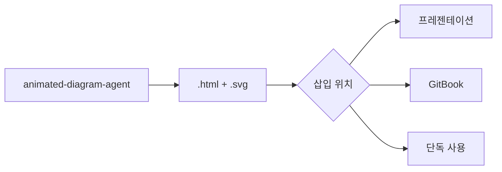

# Animated Diagram Agent

SMIL 애니메이션을 사용한 동적 SVG 다이어그램을 생성하는 전문 에이전트입니다. 트래픽 흐름 시각화, 서비스 인터랙션 다이어그램, 펄싱 효과와 인터랙티브 범례가 포함된 아키텍처 애니메이션을 만듭니다.

## 기본 정보

| 항목 | 값 |
|------|-----|
| **도구** | Read, Write, Glob, Grep, Bash |

## 트리거 키워드

다음 키워드가 감지되면 자동으로 활성화됩니다:

| 키워드 | 설명 |
|--------|------|
| "animated diagram", "traffic flow" | 애니메이션 다이어그램 |
| "animated architecture", "dynamic diagram" | 동적 아키텍처 |
| "SMIL animation", "animated SVG" | SMIL 애니메이션 |

## 핵심 기능

1. **SMIL Animation** — `<animateMotion>`을 사용한 직교 경로 트래픽 흐름
2. **Pulsing Effects** — 반경/투명도 애니메이션으로 글로우 및 하이라이트 효과
3. **Static Background + Animation Overlay** — Draw.io PNG 배경 + SVG 애니메이션 레이어
4. **Interactive Legends** — JavaScript 토글로 애니메이션 레이어 제어
5. **Color Coding** — Red 아웃바운드, Blue 인바운드, Orange AWS 내부
6. **Responsive HTML Wrapper** — 16:9 비율 자동 스케일링

## 아키텍처 패턴

```
┌─────────────────────────────────────────────┐
│              HTML Wrapper                    │
│  ┌───────────────────────────────────────┐  │
│  │         Background Layer              │  │
│  │   (Draw.io PNG or inline SVG)         │  │
│  ├───────────────────────────────────────┤  │
│  │         Animation Layer               │  │
│  │   (SVG with SMIL animations)          │  │
│  ├───────────────────────────────────────┤  │
│  │         Interactive Legend             │  │
│  │   (JS toggle for animation groups)    │  │
│  └───────────────────────────────────────┘  │
└─────────────────────────────────────────────┘
```

## 색상 코딩 표준

| 트래픽 타입 | 색상 | Hex | 사용 케이스 |
|-------------|------|-----|-------------|
| Outbound | Red | `#DD344C` | 경계를 벗어나는 트래픽 |
| Inbound | Blue | `#147EBA` | 경계로 들어오는 트래픽 |
| AWS Internal | Orange | `#FF9900` | AWS 서비스 간 트래픽 |
| Success | Green | `#1B660F` | 정상/활성 경로 |
| Warning | Yellow | `#F2C94C` | 저하된 경로 |
| Background | Squid Ink | `#232F3E` | 다크 테마 배경 |

## 워크플로우

### Step 1: Requirements Analysis

- 다이어그램 타입 식별 (트래픽 흐름, 서비스 인터랙션, 배포 파이프라인)
- 컴포넌트와 연결 목록 작성
- 애니메이션 시퀀스 결정 (무엇이 어디로 이동하는지)
- 트래픽 타입별 색상 코딩 계획

### Step 2: Static Background

**Option A — Draw.io PNG 배경:**
1. architecture-diagram-agent로 정적 아키텍처 생성
2. PNG 내보내기: `drawio -x -f png -s 2 -t -o background.png input.drawio`
3. HTML wrapper에서 배경 이미지로 사용

**Option B — Inline SVG 배경:**
HTML 파일에 직접 정적 SVG 요소 생성 (박스, 라벨, 아이콘)

### Step 3: Animation Layer

SMIL 애니메이션이 포함된 SVG 오버레이 추가:

```xml
<svg viewBox="0 0 1600 900" xmlns="http://www.w3.org/2000/svg">
  <!-- 트래픽 흐름 경로 정의 -->
  <path id="path-user-to-alb" d="M 100,450 L 300,450 L 300,300 L 500,300"
        fill="none" stroke="none" />

  <!-- 경로를 따라 이동하는 애니메이션 점 -->
  <circle r="5" fill="#147EBA" opacity="0.9">
    <animateMotion dur="3s" repeatCount="indefinite" rotate="auto">
      <mpath href="#path-user-to-alb" />
    </animateMotion>
  </circle>
</svg>
```

### Step 4: Interactive Legend

```html
<div class="legend">
  <label><input type="checkbox" checked onchange="toggleGroup('inbound')">
    <span style="color:#147EBA">● Inbound Traffic</span></label>
  <label><input type="checkbox" checked onchange="toggleGroup('outbound')">
    <span style="color:#DD344C">● Outbound Traffic</span></label>
</div>
```

## 애니메이션 타이밍 가이드라인

| 애니메이션 타입 | 지속 시간 | 반복 |
|-----------------|----------|------|
| 트래픽 점 (짧은 경로) | 2-3s | indefinite |
| 트래픽 점 (긴 경로) | 4-6s | indefinite |
| 펄싱 글로우 | 2s | indefinite |
| 하이라이트 플래시 | 1s | 3 times |
| 순차 스태거 | dur/3 offset | indefinite |

## 출력물

| 산출물 | 형식 | 위치 |
|--------|------|------|
| Animated Diagram | .html | `[project]/diagrams/[name]-animated.html` |
| Background Image | .png | `[project]/diagrams/[name]-background.png` |
| Source Draw.io | .drawio | `[project]/diagrams/[name].drawio` |

## 사용 예시

```
사용자: "VPC 트래픽 흐름 애니메이션 다이어그램 만들어줘"

에이전트:
1. 요구사항 분석 (인바운드/아웃바운드 트래픽 경로)
2. 정적 배경 생성 (Draw.io 또는 inline SVG)
3. SMIL 애니메이션 추가
4. 인터랙티브 범례 추가
5. content-review-agent로 품질 검토
```

## 협업 워크플로우



출력물은 다음에 삽입 가능:
- **프레젠테이션**: reactive-presentation HTML 슬라이드에 `<iframe>`으로 삽입
- **GitBook**: 문서 페이지에 `<iframe>` 임베드
- **단독**: 브라우저에서 직접 보기
