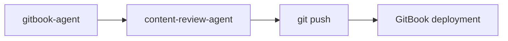

# GitBook Agent

GitBook 문서화 사이트를 생성하는 전문 에이전트입니다. 적절한 네비게이션, 컴포넌트, 콘텐츠 구성으로 구조화된 GitBook 프로젝트를 만듭니다.

## 기본 정보

| 항목 | 값 |
|------|-----|
| **모델** | sonnet |
| **도구** | Read, Write, Glob, Grep, AskUserQuestion |

## 트리거 키워드

다음 키워드가 감지되면 자동으로 활성화됩니다:

| 키워드 | 설명 |
|--------|------|
| "gitbook", "documentation site" | GitBook 사이트 |
| "create docs site", "gitbook project" | 문서 사이트 생성 |
| "knowledge base" | 지식 베이스 |

## 핵심 기능

1. **Project Initialization** — SUMMARY.md, .gitbook.yaml, book.json 설정
2. **Page Structure** — 적절한 frontmatter, 제목 계층, 네비게이션
3. **Navigation Management** — SUMMARY.md 계층 구조, 상호 참조
4. **Rich Components** — Hints, tabs, code blocks, expandable sections
5. **Diagram Integration** — Draw.io PNG와 animated SVG 출력물 삽입

## 프로젝트 구조

```
docs/
├── .gitbook.yaml           # GitBook 설정
├── SUMMARY.md              # 네비게이션 구조 (필수)
├── README.md               # 랜딩 페이지
├── chapter-1/
│   ├── README.md           # 챕터 인덱스
│   ├── page-1.md
│   └── page-2.md
├── chapter-2/
│   ├── README.md
│   └── page-1.md
└── .gitbook/
    └── assets/             # 이미지와 다이어그램
```

## 설정 파일

### .gitbook.yaml

```yaml
root: ./

structure:
  readme: README.md
  summary: SUMMARY.md
```

### SUMMARY.md (Navigation)

```markdown
# Table of contents

* [Introduction](README.md)

## Getting Started

* [Prerequisites](getting-started/prerequisites.md)
* [Quick Start](getting-started/quick-start.md)

## Architecture

* [Overview](architecture/overview.md)
* [Components](architecture/components.md)
```

## GitBook 컴포넌트

### Hints (Callouts)

```markdown


정보성 힌트입니다.



경고 메시지입니다.



위험 알림입니다.



성공 메시지입니다.


```

### Tabs

````markdown



```bash
sudo apt install kubectl
```



```bash
brew install kubectl
```



````

### Code Blocks

````markdown
```yaml
apiVersion: v1
kind: Service
metadata:
  name: my-service
```
````

제목 포함:

````markdown


```yaml
apiVersion: apps/v1
kind: Deployment
```


````

### Expandable Sections

```markdown

<details>
<summary>클릭하여 펼치기</summary>

상세 내용입니다.

</details>

```

### Images

```markdown


<!-- 캡션 포함 -->
<figure><figcaption><p>Figure 1: System Architecture</p></figcaption></figure>
```

## 페이지 템플릿

```markdown
---
description: SEO와 네비게이션을 위한 간략한 페이지 설명
---

# Page Title

## Overview

주제에 대한 간략한 소개 (2-3 문장).

## Section 1

적절한 포맷팅의 콘텐츠:
- 목록을 위한 bullet points
- 강조를 위한 **Bold**
- 명령어를 위한 `inline code`

### Subsection

상세 내용...



독자를 위한 중요 노트.



## Section 2

| Column 1 | Column 2 | Column 3 |
|----------|----------|----------|
| Data | Data | Data |

## Next Steps

* [Related Page 1](../chapter/page.md)
* [Related Page 2](../chapter/page.md)
```

## 네비게이션 베스트 프랙티스

- `SUMMARY.md`를 네비게이션의 단일 진실 소스로 사용
- 섹션 헤더(`## Section Name`)로 논리적 챕터 그룹화
- 각 챕터에 `README.md`를 인덱스 페이지로 포함
- 네비게이션 깊이는 최대 3 레벨
- 설명적인 페이지 제목 사용 ("Page 1" 금지)

## 다이어그램 통합

### Draw.io PNG (Static Architecture)

```markdown

```

architecture-diagram-agent로 생성 후 2x 스케일로 PNG 내보내기.

### Animated SVG (Dynamic Diagrams)

```markdown
<!-- 애니메이션 지원을 위한 iframe 삽입 -->
<iframe src="../assets/traffic-flow.html" width="100%" height="500" frameborder="0"></iframe>
```

animated-diagram-agent로 생성.

## 출력물

| 산출물 | 형식 | 위치 |
|--------|------|------|
| GitBook Project | Directory | `[project]/docs/` |
| SUMMARY.md | .md | `[project]/docs/SUMMARY.md` |
| Pages | .md | `[project]/docs/{chapter}/{page}.md` |
| Assets | .png, .html | `[project]/docs/.gitbook/assets/` |

## 사용 예시

```
사용자: "EKS 운영 가이드 GitBook 만들어줘"

에이전트:
1. 요구사항 수집 (주제, 대상, 챕터 구조)
2. 프로젝트 초기화
3. SUMMARY.md 생성
4. 챕터별 콘텐츠 작성
5. 다이어그램 통합
6. content-review-agent로 품질 검토
```

## 협업 워크플로우


