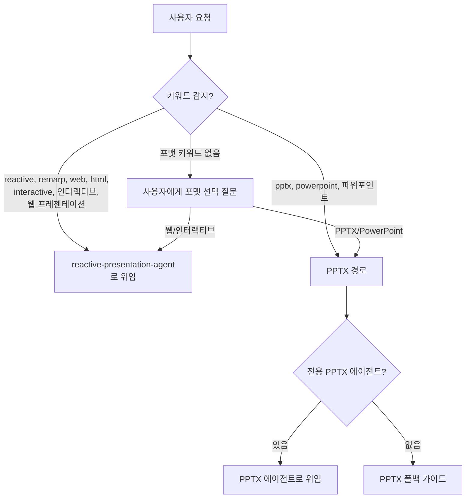

# Presentation Agent (Dispatcher)

프레젠테이션 포맷을 결정하고 적절한 전문 에이전트로 라우팅하는 경량 디스패처입니다.

## 기본 정보

| 항목 | 값 |
|------|-----|
| **도구** | AskUserQuestion |
| **역할** | 포맷 디스패처 |

## 트리거 키워드

다음 키워드가 감지되면 자동으로 활성화됩니다:

| 키워드 | 설명 |
|--------|------|
| "create presentation", "create slides", "make slideshow" | 프레젠테이션 생성 |
| "프레젠테이션 만들어", "슬라이드 만들어", "발표 자료" | 한국어 트리거 |

## 라우팅 로직

## 키워드 분류

### Web/Interactive (즉시 위임)
- English: "reactive", "remarp", "web", "html", "interactive", "web-based", "browser", "canvas animation"
- Korean: "인터랙티브", "웹 프레젠테이션", "웹 슬라이드", "리마프", "HTML 슬라이드"

Web/Interactive 키워드가 감지되면 질문 없이 **즉시 `reactive-presentation-agent`로 위임**합니다.

### PPTX (PPTX 경로)
- English: "pptx", "powerpoint", "ppt", "office", "download as file"
- Korean: "파워포인트", "PPT", "피피티"

## 포맷 선택 질문

포맷 키워드가 없으면 사용자에게 질문합니다:

> 프레젠테이션 형식을 선택해 주세요:
>
> 1. **웹 기반 인터랙티브** — 브라우저에서 실행되는 HTML 프레젠테이션. Canvas 애니메이션, 퀴즈, 탭 전환 등 인터랙티브 요소 지원. GitHub Pages로 즉시 배포 가능.
> 2. **PPTX (파워포인트)** — 다운로드 가능한 .pptx 파일. 오프라인 발표, 사내 공유에 적합.

## reactive-presentation-agent와의 관계

`presentation-agent`는 포맷 선택만 담당하고, 실제 HTML 프레젠테이션 생성은 `reactive-presentation-agent`가 수행합니다.

실제 프레젠테이션 생성 기능(Remarp 작성, HTML 빌드, 테마 추출 등)은 [Reactive Presentation Agent](./reactive-presentation-agent)를 참조하세요.
