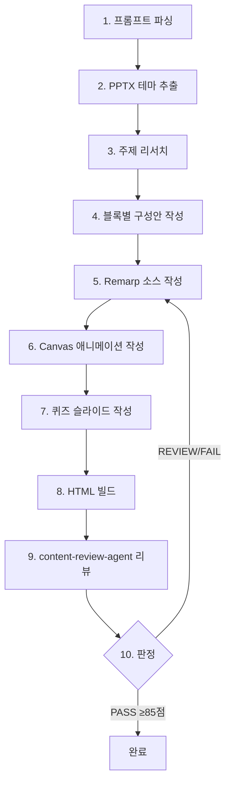

import DemoEmbed from '@site/src/components/DemoEmbed';

# 실전 프레젠테이션 데모

실제 프롬프트 하나로 90분짜리 AIOps Deep Dive 프레젠테이션을 생성한 실전 사례입니다.

---

## 데모 프롬프트

아래 프롬프트를 그대로 입력하면 전체 프레젠테이션이 생성됩니다:

```
새로 프레젠테이션을 만들어줘 aiops에 관하여 90분간 세션을 진행할거야
고객은 300레벨 수준이야.
theme는 "example.pptx"를 가지고 사용하면 되고
스피커는 Junseok Oh, Sr. Solutions Architect, AWS
청중은 AnyCompany
```

---

## 프롬프트 분석

에이전트는 이 프롬프트에서 다음 정보를 자동으로 추출합니다:

| 항목 | 추출값 | 활용 |
|------|--------|------|
| **주제** | AIOps | 콘텐츠 리서치 및 구성 |
| **시간** | 90분 → 3블록 (각 30분) | 블록 수 자동 결정 |
| **난이도** | 300 레벨 (심화) | 콘텐츠 깊이 조절 |
| **테마** | `example.pptx` → PPTX 테마 추출 | 색상/폰트/로고 적용 |
| **스피커** | Junseok Oh, Sr. Solutions Architect, AWS | 커버 슬라이드 표시 |
| **청중** | AnyCompany | 커버 슬라이드 표시 |

:::tip 프롬프트에 포함하지 않은 정보
퀴즈 포함 여부, Canvas 애니메이션 사용 여부 등은 에이전트가 대화형으로 질문합니다.
:::

---

## 에이전트 워크플로우

프롬프트를 받은 후 에이전트가 수행하는 10단계 과정입니다:



---

## 결과물 구조

90분 세션은 3개 블록으로 분할되며, 각 블록이 독립 HTML 파일로 빌드됩니다:

```
aiops-deep-dive/
├── _presentation.md                    # 공통 메타데이터
├── 01-foundations.md                    # Block 1: AIOps Foundations & Observability
├── 02-ml-operations.md                 # Block 2: ML-Powered Operations
├── 03-automation-maturity.md           # Block 3: Automation & Maturity Model
└── (build output)
    ├── index.html                      # 전체 블록 네비게이션 (TOC)
    ├── 01-foundations.html             # Block 1 HTML
    ├── 02-ml-operations.html           # Block 2 HTML
    └── 03-automation-maturity.html     # Block 3 HTML
```

각 블록은 약 10-15개 슬라이드로 구성되며 다음을 포함합니다:
- 커버 슬라이드 (스피커/청중 정보)
- 콘텐츠 슬라이드 (Fragment 순차 표시)
- Canvas 애니메이션 슬라이드 (아키텍처 시각화)
- 퀴즈 슬라이드 (인터랙티브 4지선다)

---

## 라이브 데모

아래는 위 프롬프트로 생성된 **AIOps Deep Dive** 전체 프레젠테이션입니다. 네비게이션 페이지에서 3개 블록으로 이동할 수 있습니다.

<DemoEmbed
  src="/oh-my-cloud-skills/demos/aiops-deep-dive/index.html"
  title="AIOps Deep Dive — 90min L300 (3블록 네비게이션)"
  height="600px"
  command="python3 remarp_to_slides.py build aiops-deep-dive/"
  remarpSource="01-foundations.md, 02-ml-operations.md, 03-automation-maturity.md"
/>

:::info 블록 구성
- **Block 1**: AIOps Foundations & Observability — 전통 운영 vs AIOps, AWS Observability 서비스 맵
- **Block 2**: ML-Powered Operations — ML 기반 이상 탐지, 근본 원인 분석
- **Block 3**: Automation & Maturity Model — 자동 복구, AIOps 성숙도 모델
:::

---

## Remarp 소스 예시

### 커버 슬라이드

```markdown
---
remarp: true
block: foundations
---

---
@type: cover
@background: linear-gradient(135deg, #232F3E 0%, #0a1628 50%, #1a1a2e 100%)

# AIOps Deep Dive
AI-Powered Cloud Operations — 90min L300

Junseok Oh, Sr. Solutions Architect, AWS
```

### Canvas 애니메이션 슬라이드

```markdown
@type: canvas
@canvas-id: obs-service-map

## AWS Observability 서비스 맵

:::canvas
icon cw "CloudWatch" at 100,150 size 48 step 1
box cwLabel "Amazon CloudWatch" at 60,210 size 130,30 color #FF4F8B step 1

icon dg "DevOps-Guru" at 300,80 size 48 step 2
box dgLabel "DevOps Guru" at 265,140 size 120,30 color #FF4F8B step 2

icon xray "X-Ray" at 300,230 size 48 step 2
box xrayLabel "AWS X-Ray" at 265,290 size 120,30 color #FF4F8B step 2

arrow cwLabel -> dgLabel "anomalies" step 2
arrow cwLabel -> xrayLabel "traces" step 2
arrow dgLabel -> ebLabel "insights" step 3
:::
```

### 퀴즈 슬라이드

```markdown
@type: quiz

## Knowledge Check

**Q1: AIOps의 4가지 핵심 축(Pillar)이 아닌 것은?**
- [ ] Observe (관찰)
- [ ] Analyze (분석)
- [x] Deploy (배포)
- [ ] Act (조치)
```

---

## 커스터마이징 가이드

위 프롬프트를 변형하여 다양한 프레젠테이션을 만들 수 있습니다:

### 주제 변경
```
새로 프레젠테이션을 만들어줘 서버리스 아키텍처에 관하여 60분간 세션을 진행할거야
```

### 난이도 변경
```
고객은 200레벨 수준이야  → 기본 개념 중심, 데모 위주
고객은 400레벨 수준이야  → 내부 구현, 성능 튜닝, 실전 트러블슈팅
```

### 테마 없이 기본 스타일
```
새로 프레젠테이션을 만들어줘 컨테이너 보안에 관하여
```
PPTX 테마를 지정하지 않으면 기본 AWS 다크 테마 (Squid Ink #232F3E)가 적용됩니다.

### 영어 프레젠테이션
```
Create a presentation about AWS cost optimization for a 45-minute session.
Level 300, speaker: Jane Smith, Solutions Architect, AWS
```

---

## 관련 문서

- [사용법 가이드](../usage-guide) — 전체 플러그인 사용법
- [Presentation Agent](../agents/presentation-agent) — 에이전트 상세 문서
- [Reactive Presentation](../skills/reactive-presentation) — 프레임워크 상세 문서
- [기본 프레젠테이션 데모](./basic-presentation) — Block 1 상세 데모
