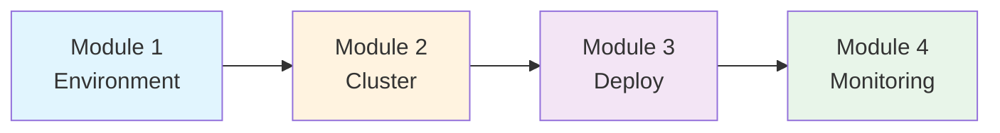
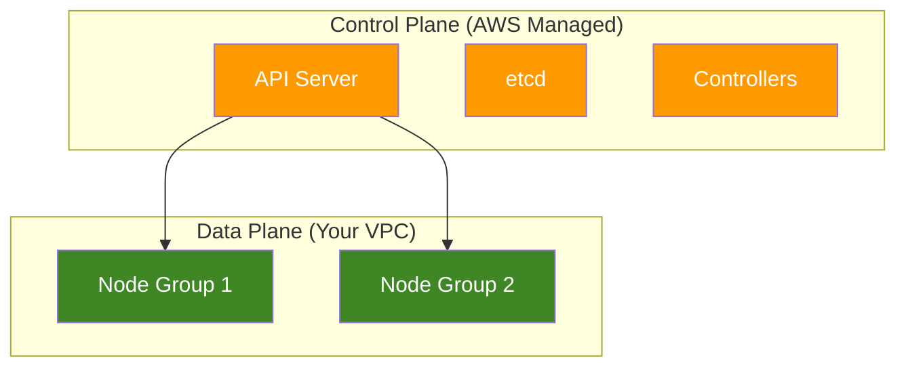

# Workshop Demo

AWS Workshop Studio 형식으로 EKS 워크샵을 생성하는 데모입니다. workshop-agent가 프로젝트 구조, contentspec.yaml, 모듈 콘텐츠, CloudFormation 템플릿을 생성합니다.

## 생성 프롬프트

```
"EKS 기초 워크샵을 만들어줘.
대상: 클라우드 엔지니어 (Kubernetes 기초 지식 있음)
시간: 3시간
모듈: 환경 설정, 클러스터 생성, 애플리케이션 배포, 모니터링
한국어/영어 이중 언어로 만들어줘."
```

## 생성된 프로젝트 구조

```
eks-basics-workshop/
├── contentspec.yaml                    # Workshop Studio 설정
├── content/
│   ├── index.ko.md                    # 홈페이지 (한국어)
│   ├── index.en.md                    # 홈페이지 (영어)
│   ├── introduction/
│   │   ├── index.ko.md
│   │   └── index.en.md
│   ├── module1-environment/           # 모듈 1: 환경 설정
│   │   ├── index.ko.md
│   │   ├── index.en.md
│   │   └── cloud9-setup/
│   │       ├── index.ko.md
│   │       └── index.en.md
│   ├── module2-cluster/               # 모듈 2: 클러스터 생성
│   │   ├── index.ko.md
│   │   ├── index.en.md
│   │   ├── create-cluster/
│   │   └── verify-cluster/
│   ├── module3-deploy/                # 모듈 3: 앱 배포
│   │   ├── index.ko.md
│   │   ├── index.en.md
│   │   ├── containerize/
│   │   └── kubernetes-deploy/
│   ├── module4-monitoring/            # 모듈 4: 모니터링
│   │   ├── index.ko.md
│   │   ├── index.en.md
│   │   ├── cloudwatch/
│   │   └── container-insights/
│   └── summary/
│       ├── index.ko.md
│       └── index.en.md
├── static/
│   ├── images/
│   │   ├── module-1/
│   │   ├── module-2/
│   │   ├── module-3/
│   │   └── module-4/
│   ├── code/
│   │   ├── deployment.yaml
│   │   └── service.yaml
│   ├── workshop.yaml                  # CloudFormation 템플릿
│   └── iam-policy.json               # 참가자 IAM 정책
└── assets/
```

---

## contentspec.yaml

```yaml
version: 2.0
defaultLocaleCode: ko-KR
localeCodes:
  - ko-KR
  - en-US

# 워크샵 내에서 사용할 파라미터
params:
  clusterName: eks-workshop-cluster
  region: ap-northeast-2
  nodeCount: 2

# 추가 링크 (네비게이션에 표시)
additionalLinks:
  - title: EKS Documentation
    link: https://docs.aws.amazon.com/eks/
  - title: eksctl Guide
    link: https://eksctl.io/

awsAccountConfig:
  accountSources:
    - workshop_studio

  # EKS 서비스 연결 역할 자동 생성
  serviceLinkedRoles:
    - eks.amazonaws.com

  # 참가자 역할 설정
  participantRole:
    iamPolicies:
      - static/iam-policy.json
    trustedPrincipals:
      service:
        - ec2.amazonaws.com
        - eks.amazonaws.com

  # EC2 키페어 자동 생성
  ec2KeyPair: true

  # 리전 설정
  regionConfiguration:
    minAccessibleRegions: 1
    maxAccessibleRegions: 1
    deployableRegions:
      recommended:
        - ap-northeast-2
        - us-east-1
      optional:
        - us-west-2
        - eu-west-1

# 인프라 프로비저닝
infrastructure:
  cloudformationTemplates:
    - templateLocation: static/workshop.yaml
      label: Workshop Infrastructure
      participantVisibleStackOutputs:
        - Cloud9URL
        - ClusterName
      parameters:
        - templateParameter: InstanceType
          defaultValue: "t3.medium"
        - templateParameter: ParticipantRoleArn
          defaultValue: "{{.ParticipantRoleArn}}"
```

---

## Homepage (index.en.md)

```markdown
---
title: "EKS Basics Workshop"
weight: 0
---

Welcome to the Amazon EKS Basics Workshop!

## What You'll Build

By the end of this workshop, you'll have:
- A fully functional EKS cluster
- A containerized application deployed on Kubernetes
- CloudWatch Container Insights for monitoring

## Your Learning Journey



## Module Overview

### Module 1: Environment Setup (30 min)
Set up your Cloud9 development environment with all required tools.

### Module 2: Create EKS Cluster (45 min)
Create an EKS cluster using eksctl and verify the configuration.

### Module 3: Deploy Application (45 min)
Containerize a sample application and deploy it to your cluster.

### Module 4: Monitoring (45 min)
Set up CloudWatch Container Insights for observability.

## Technologies You'll Master

::::tabs

:::tab{label="AWS Services"}
- Amazon EKS
- Amazon ECR
- AWS Cloud9
- Amazon CloudWatch
:::

:::tab{label="Tools"}
- kubectl
- eksctl
- Docker
- Helm
:::

::::

## Prerequisites

::alert[Basic Kubernetes knowledge is recommended but not required.]{type="info"}

- AWS account with administrator access
- Modern web browser (Chrome, Firefox, Safari)

## Time Required

**Total Duration:** 3 hours

| Module | Duration |
|--------|----------|
| Environment Setup | 30 min |
| Create Cluster | 45 min |
| Deploy App | 45 min |
| Monitoring | 45 min |
| Cleanup | 15 min |

---

`[Get Started →](/introduction/)`
```

---

## Module Index (module2-cluster/index.en.md)

```markdown
---
title: "Module 2: Create EKS Cluster"
weight: 30
---

In this module, you'll create a production-ready EKS cluster.

## Learning Objectives

By the end of this module, you will:

- **Understand EKS architecture** — Control plane and data plane components
- **Create an EKS cluster** — Using eksctl with best practices
- **Verify cluster health** — Using kubectl commands
- **Configure kubectl** — Connect to your cluster securely

## Module Overview

#### 1. Create Cluster
Use eksctl to create a managed EKS cluster with node groups.

#### 2. Verify Cluster
Confirm cluster health and explore the components.

## Architecture



## Prerequisites Check

Before proceeding, verify your environment:

:::code{language=bash showCopyAction=true}
# Check eksctl version
eksctl version

# Check kubectl version
kubectl version --client

# Verify AWS credentials
aws sts get-caller-identity
:::

::alert[If any command fails, return to Module 1 to complete the environment setup.]{type="warning"}

---

`[Next: Create Cluster →](./create-cluster)`
```

---

## Lab Content (create-cluster/index.en.md)

```markdown
---
title: "Create EKS Cluster"
weight: 31
---

Let's create your EKS cluster using eksctl.

## Step 1: Review Cluster Configuration

First, examine the cluster configuration file:

:::code{language=yaml showCopyAction=true}
# cluster-config.yaml
apiVersion: eksctl.io/v1alpha5
kind: ClusterConfig

metadata:
  name: eks-workshop-cluster
  region: ap-northeast-2
  version: "1.29"

managedNodeGroups:
  - name: ng-1
    instanceType: t3.medium
    desiredCapacity: 2
    minSize: 1
    maxSize: 4
    volumeSize: 30
    ssh:
      allow: false
    labels:
      role: worker
    tags:
      Environment: Workshop

cloudWatch:
  clusterLogging:
    enableTypes: ["api", "audit", "authenticator"]
:::

::alert[This configuration creates a cluster with managed node groups and CloudWatch logging enabled.]{type="info"}

## Step 2: Create the Cluster

Run the following command to create your cluster:

:::code{language=bash showCopyAction=true}
eksctl create cluster -f cluster-config.yaml
:::

::alert[Cluster creation takes approximately 15-20 minutes. This is a good time for a break!]{header="Time Estimate" type="info"}

## Step 3: Monitor Progress

While the cluster is being created, you can monitor the progress:

::::tabs

:::tab{label="eksctl Output"}
Watch the terminal for status updates:
```
[i]  building cluster stack "eksctl-eks-workshop-cluster-cluster"
[i]  creating CloudFormation stack
[i]  waiting for CloudFormation stack...
[✔]  EKS cluster "eks-workshop-cluster" in "ap-northeast-2" region is ready
```
:::

:::tab{label="CloudFormation Console"}
1. Open the [CloudFormation console](https://console.aws.amazon.com/cloudformation)
2. Look for stacks starting with `eksctl-eks-workshop-cluster`
3. Watch the Events tab for progress
:::

:::tab{label="EKS Console"}
1. Open the [EKS console](https://console.aws.amazon.com/eks)
2. Select your region (ap-northeast-2)
3. Watch for your cluster to appear
:::

::::

## Step 4: Verify Creation

After the cluster is created, verify it:

:::code{language=bash showCopyAction=true}
# Check cluster status
aws eks describe-cluster \
  --name eks-workshop-cluster \
  --query "cluster.status"
:::

Expected output:
```
"ACTIVE"
```

:::code{language=bash showCopyAction=true}
# Verify kubectl connection
kubectl get nodes
:::

You should see your worker nodes:
```text
NAME                                               STATUS   ROLES    AGE   VERSION
ip-192-168-xx-xx.ap-northeast-2.compute.internal   Ready    none     5m    v1.29.0-eks-xxxx
ip-192-168-xx-xx.ap-northeast-2.compute.internal   Ready    none     5m    v1.29.0-eks-xxxx
```

::alert[Your EKS cluster is ready!]{header="Success" type="success"}

## Key Takeaways

- **eksctl simplifies cluster creation** — handles VPC, IAM, and node groups
- **Managed node groups** — AWS manages node provisioning and updates
- **CloudWatch logging** — enables audit and diagnostic logs

---

`[Next: Verify Cluster →](../verify-cluster)`
```

---

## CloudFormation Template (static/workshop.yaml)

```yaml
AWSTemplateFormatVersion: '2010-09-09'
Description: EKS Workshop Infrastructure

Parameters:
  InstanceType:
    Type: String
    Default: t3.medium
    AllowedValues:
      - t3.small
      - t3.medium
      - t3.large
  ParticipantRoleArn:
    Type: String
    Default: "{{.ParticipantRoleArn}}"

Resources:
  # Cloud9 Environment
  Cloud9Environment:
    Type: AWS::Cloud9::EnvironmentEC2
    Properties:
      Name: !Sub ${AWS::StackName}-cloud9
      Description: EKS Workshop Development Environment
      InstanceType: !Ref InstanceType
      ImageId: amazonlinux-2023-x86_64
      AutomaticStopTimeMinutes: 60
      ConnectionType: CONNECT_SSM
      Tags:
        - Key: Environment
          Value: Workshop

  # IAM Role for Cloud9
  Cloud9Role:
    Type: AWS::IAM::Role
    Properties:
      RoleName: !Sub ${AWS::StackName}-cloud9-role
      AssumeRolePolicyDocument:
        Version: '2012-10-17'
        Statement:
          - Effect: Allow
            Principal:
              Service: !Sub ec2.${AWS::URLSuffix}
            Action: sts:AssumeRole
      ManagedPolicyArns:
        - !Sub arn:${AWS::Partition}:iam::aws:policy/AmazonSSMManagedInstanceCore
        - !Sub arn:${AWS::Partition}:iam::aws:policy/AmazonEKSClusterPolicy

  # SSM Document for Bootstrap
  BootstrapDocument:
    Type: AWS::SSM::Document
    Properties:
      DocumentType: Command
      Content:
        schemaVersion: "2.2"
        description: Bootstrap Cloud9 for EKS Workshop
        mainSteps:
          - name: InstallTools
            action: aws:runShellScript
            inputs:
              timeoutSeconds: 600
              runCommand:
                - "#!/bin/bash"
                - set -euo pipefail
                - |
                  # Install eksctl
                  curl -sL "https://github.com/eksctl-io/eksctl/releases/latest/download/eksctl_Linux_amd64.tar.gz" | tar xz -C /tmp
                  sudo mv /tmp/eksctl /usr/local/bin

                  # Install kubectl
                  curl -LO "https://dl.k8s.io/release/$(curl -L -s https://dl.k8s.io/release/stable.txt)/bin/linux/amd64/kubectl"
                  chmod +x kubectl
                  sudo mv kubectl /usr/local/bin

                  # Install Helm
                  curl https://raw.githubusercontent.com/helm/helm/main/scripts/get-helm-3 | bash

                  # Verify installations
                  eksctl version
                  kubectl version --client
                  helm version

Outputs:
  Cloud9URL:
    Description: Cloud9 IDE URL
    Value: !Sub https://${AWS::Region}.console.aws.amazon.com/cloud9/ide/${Cloud9Environment}

  ClusterName:
    Description: EKS Cluster Name (to be created)
    Value: eks-workshop-cluster
```

---

## IAM Policy (static/iam-policy.json)

```json
{
  "Version": "2012-10-17",
  "Statement": [
    {
      "Sid": "EKSFullAccess",
      "Effect": "Allow",
      "Action": [
        "eks:*"
      ],
      "Resource": "*"
    },
    {
      "Sid": "EC2ForEKS",
      "Effect": "Allow",
      "Action": [
        "ec2:Describe*",
        "ec2:CreateSecurityGroup",
        "ec2:CreateTags",
        "ec2:AuthorizeSecurityGroupIngress",
        "ec2:AuthorizeSecurityGroupEgress"
      ],
      "Resource": "*"
    },
    {
      "Sid": "IAMForEKS",
      "Effect": "Allow",
      "Action": [
        "iam:CreateServiceLinkedRole",
        "iam:GetRole",
        "iam:ListAttachedRolePolicies",
        "iam:PassRole"
      ],
      "Resource": "*"
    },
    {
      "Sid": "CloudFormation",
      "Effect": "Allow",
      "Action": [
        "cloudformation:*"
      ],
      "Resource": "*"
    },
    {
      "Sid": "CloudWatchLogs",
      "Effect": "Allow",
      "Action": [
        "logs:CreateLogGroup",
        "logs:CreateLogStream",
        "logs:PutLogEvents",
        "logs:DescribeLogGroups"
      ],
      "Resource": "*"
    }
  ]
}
```

---

## Workshop Directive 사용 예시

### Alert Types

```markdown
<!-- Info -->
::alert[Cluster creation takes about 15 minutes.]{type="info"}

<!-- Warning -->
::alert[Remember to clean up resources after the workshop.]{header="Cost Warning" type="warning"}

<!-- Error -->
::alert[Do not delete the VPC before the EKS cluster.]{type="error"}

<!-- Success -->
::alert[Your cluster is ready!]{header="Congratulations" type="success"}
```

### Code with Copy Button

```markdown
:::code{language=bash showCopyAction=true}
kubectl get pods -A
:::
```

### Tabs for Multi-Option Content

```markdown
::::tabs
:::tab{label="eksctl"}
eksctl create cluster --name my-cluster
:::
:::tab{label="Console"}
Navigate to EKS console and click Create cluster.
:::
::::
```

---

## 주요 포인트

1. **Directive 문법**: Workshop Studio는 자체 Directive 문법 사용 (Hugo shortcode 금지)
2. **이중 언어**: 모든 페이지에 `.ko.md`와 `.en.md` 쌍으로 작성
3. **Magic Variables**: CloudFormation에서 `{{.ParticipantRoleArn}}` 등 사용
4. **모듈 구조**: 논리적 단위로 모듈 분리, 각 모듈에 학습 목표 명시
5. **검증 단계**: 모든 실습 후 결과 확인 명령 포함
