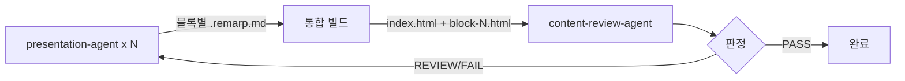
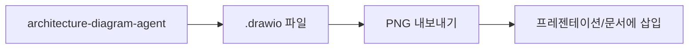
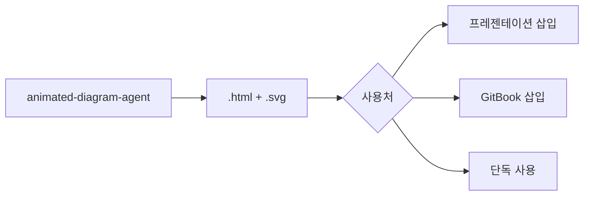
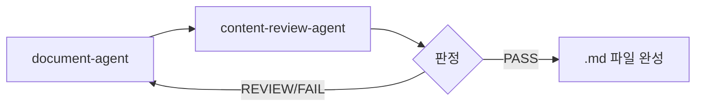
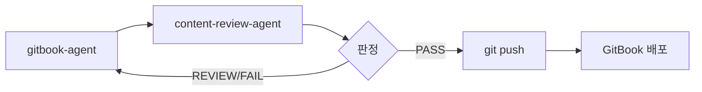
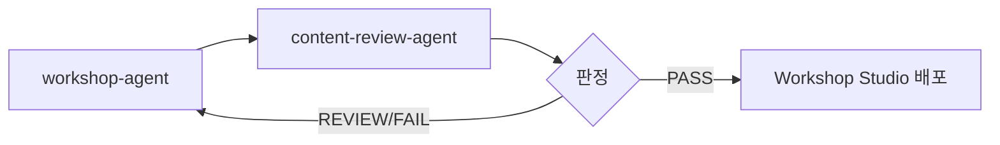

# AWS Content Plugin 개요

AWS Content Plugin은 AWS 클라우드 관련 콘텐츠 제작을 위한 전문 플러그인입니다. 프레젠테이션, 아키텍처 다이어그램, 문서, GitBook 사이트, 워크샵 콘텐츠를 생성할 수 있습니다.

## 구성 요소

### 에이전트 (8개)

| 에이전트 | 설명 | 출력물 |
|----------|------|--------|
| `presentation-agent` | 프레젠테이션 포맷 디스패처 (PPTX vs Web) | 라우팅 |
| `reactive-presentation-agent` | Interactive HTML 슬라이드쇼 생성 (Remarp) | `.html` 프레젠테이션 |
| `architecture-diagram-agent` | Draw.io XML 아키텍처 다이어그램 생성 | `.drawio`, `.png` |
| `animated-diagram-agent` | SVG + SMIL 애니메이션 다이어그램 | `.html` (애니메이션) |
| `document-agent` | 마크다운 기술 문서 생성 | `.md` 문서 |
| `gitbook-agent` | GitBook 문서화 사이트 생성 | GitBook 프로젝트 |
| `workshop-agent` | AWS Workshop Studio 콘텐츠 생성 | Workshop 프로젝트 |
| `content-review-agent` | 모든 콘텐츠 타입의 품질 검토 | 리뷰 리포트 |

### 스킬 (5개)

| 스킬 | 설명 |
|------|------|
| `reactive-presentation` | 프레젠테이션 프레임워크, 스크립트, AWS 아이콘 |
| `architecture-diagram` | Draw.io 템플릿, AWS 아이콘 참조, 레이아웃 패턴 |
| `animated-diagram` | SMIL 애니메이션 가이드, HTML 템플릿 |
| `gitbook` | GitBook 구조 가이드, 컴포넌트 패턴 |
| `workshop-creator` | Workshop Studio 디렉티브, 템플릿, 참조 문서 |

## 워크플로우

### 프레젠테이션 워크플로우

### 다이어그램 워크플로우

### 애니메이션 다이어그램 워크플로우

### 문서 워크플로우

### GitBook 워크플로우

### Workshop 워크플로우

## Quality Gate (필수)

:::warning 필수 규칙
모든 콘텐츠는 배포/완료 선언 전에 반드시 `content-review-agent`를 통과해야 합니다. 이 규칙은 생략할 수 없습니다.
:::

### 판정 기준

| 판정 | 조건 | 결과 |
|------|------|------|
| **PASS** | Critical 0, Warning 3개 이하, 점수 85점 이상 | 승인 |
| **REVIEW** | Critical 0, Warning 4-10개, 점수 70-84점 | 수정 후 재리뷰 |
| **FAIL** | Critical 1개 이상 또는 Warning 10개 초과 또는 점수 70점 미만 | 진행 불가 |

### 리뷰 루프

1. 콘텐츠 에이전트가 콘텐츠 생성 완료
2. `content-review-agent` 호출하여 리뷰 리포트 생성
3. FAIL/REVIEW 판정 시 수정 후 재리뷰 (최대 3회)
4. PASS (85점 이상) 획득 후에만 완료/배포 선언
5. 3회 리뷰 후에도 PASS 미달 시 사용자에게 판단 요청

## 다이어그램 에이전트 선택 가이드

| 필요 사항 | 에이전트 | 출력물 |
|-----------|----------|--------|
| 정적 AWS 아키텍처 | `architecture-diagram-agent` | .drawio → .png |
| 애니메이션 트래픽 흐름 | `animated-diagram-agent` | .html (SVG + SMIL) |
| Workshop 인라인 다이어그램 | `workshop-agent` (Mermaid) | Mermaid in markdown |
| 프레젠테이션 Canvas 애니메이션 | `reactive-presentation-agent` | Canvas JS in HTML |

## AWS 아이콘

AWS Architecture Icons는 `skills/reactive-presentation/assets/aws-icons/`에 위치합니다:

- `Architecture-Service-Icons_07312025/` — 서비스 레벨 아이콘 (121개 카테고리)
- `Architecture-Group-Icons_07312025/` — 그룹 아이콘 (Cloud, VPC, Region, Subnet)
- `Category-Icons_07312025/` — 카테고리 레벨 아이콘 (4개 크기)
- `Resource-Icons_07312025/` — 리소스 레벨 아이콘 (22개 카테고리)
- `others/` — 서드파티 아이콘 (LangChain, Grafana 등)
