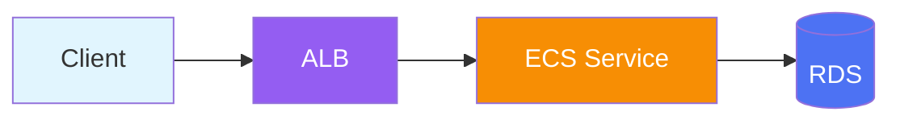

# GitBook Skill

Create structured GitBook documentation sites with proper navigation, components, and content organization.

## Trigger Keywords

Activated by the following keywords:
- "gitbook", "documentation site"
- "create docs site", "gitbook project"
- "knowledge base"

## Use Cases

- AWS architecture or service documentation sites
- Technical knowledge bases
- Project documentation with rich formatting
- Multi-chapter guides with navigation

## Provided Resources

### references/

| Reference Doc | Description |
|---------------|-------------|
| `structure-guide.md` | Project structure patterns and conventions |
| `component-patterns.md` | GitBook component syntax and usage |

---

## Project Structure

```
docs/
├── .gitbook.yaml           # GitBook configuration
├── SUMMARY.md              # Navigation structure (required)
├── README.md               # Landing page
├── chapter-1/
│   ├── README.md           # Chapter index
│   ├── page-1.md
│   └── page-2.md
└── .gitbook/
    └── assets/             # Images and diagrams
```

---

## Component Patterns Detail

### Hints (Callouts)

Four styles available for different purposes:

````text

**Tip**: General information or helpful tip.



**Done**: Confirmation that an action succeeded.



**Warning**: Something to be cautious about.



**Critical**: Breaking change or security concern.

````

**Usage Guidelines:**

| Scenario | Recommended Style |
|----------|-------------------|
| Step completion confirmation | `success` |
| Cost or billing warnings | `warning` |
| Prerequisite requirements | `warning` |
| Helpful tips | `info` |
| Configuration errors | `danger` |
| Security considerations | `warning` or `danger` |

### Tabs

Group related content into switchable tabs:

````markdown


```bash
sudo apt install kubectl
curl -LO https://dl.k8s.io/release/stable.txt
```



```bash
brew install kubectl
```



```powershell
choco install kubernetes-cli
```


````

**Best practices:**
- Use for OS-specific instructions
- Use for language-specific code examples
- Keep tab titles short (1-2 words)
- Ensure content in each tab is parallel in structure

### Code Blocks

#### Basic Code Block

````markdown
```yaml
apiVersion: v1
kind: Service
metadata:
  name: my-service
```
````

#### Code with Title and Line Numbers

````text

```yaml
apiVersion: apps/v1
kind: Deployment
metadata:
  name: web-app
spec:
  replicas: 3
```

````

#### Supported Languages (40+)

| Category | Languages |
|----------|-----------|
| Web | `html`, `css`, `javascript`, `typescript`, `json` |
| Config | `yaml`, `toml`, `ini`, `properties` |
| Shell | `bash`, `shell`, `powershell`, `batch` |
| Backend | `python`, `go`, `java`, `ruby`, `php`, `csharp` |
| Data | `sql`, `graphql`, `xml` |
| Cloud | `hcl` (Terraform), `dockerfile` |

### Expandable Sections

```markdown
<details>
<summary>Advanced Configuration Options</summary>

You can configure additional parameters:

| Parameter | Default | Description |
|-----------|---------|-------------|
| `timeout` | `30s` | Request timeout |
| `retries` | `3` | Max retry attempts |

</details>
```

**Use for:**
- FAQ sections
- Optional detailed explanations
- Troubleshooting steps
- Long code examples

### Embedded Content

#### File Download

````text

Download the CloudFormation template

````

#### Video Embed

````text

Demo walkthrough video

````

#### External Page Embed

````text

AWS Lambda Documentation

````

### Images with Caption

```markdown
<figure>
  
  <figcaption><p>Figure 1: System Architecture Overview</p></figcaption>
</figure>
```

#### Sized Image

```markdown
<figure>
  
  <figcaption><p>Monitoring Dashboard</p></figcaption>
</figure>
```

---

## SUMMARY.md Writing Guide

The `SUMMARY.md` file controls the left sidebar navigation. It is the **single source of truth** for page ordering and hierarchy.

### Basic Structure

```markdown
# Table of contents

* [Welcome](README.md)

## Getting Started

* [Prerequisites](getting-started/prerequisites.md)
* [Quick Start](getting-started/quick-start.md)
* [Configuration](getting-started/configuration.md)

## Architecture

* [Overview](architecture/README.md)
  * [Components](architecture/components.md)
  * [Data Flow](architecture/data-flow.md)
* [Networking](architecture/networking.md)

## Operations

* [Deployment](operations/deployment.md)
* [Monitoring](operations/monitoring.md)
* [Troubleshooting](operations/troubleshooting.md)
```

### Syntax Rules

| Element | Syntax | Purpose |
|---------|--------|---------|
| `# Title` | First line | Book title |
| `## Section` | Header line | Section divider in sidebar |
| `* [Page](path.md)` | Bullet item | Regular page |
| `  * [Subpage](path.md)` | Indented bullet | Nested page (2 spaces) |

### Multi-Level Hierarchy Example

```markdown
# EKS Operations Guide

* [Introduction](README.md)

## Fundamentals

* [EKS Overview](fundamentals/README.md)
  * [Control Plane](fundamentals/control-plane.md)
  * [Data Plane](fundamentals/data-plane.md)
    * [Managed Node Groups](fundamentals/managed-nodes.md)
    * [Fargate](fundamentals/fargate.md)
  * [Networking](fundamentals/networking.md)

## Operations

* [Day 2 Operations](operations/README.md)
  * [Scaling](operations/scaling.md)
  * [Upgrades](operations/upgrades.md)
  * [Monitoring](operations/monitoring.md)
    * [CloudWatch](operations/cloudwatch.md)
    * [Prometheus](operations/prometheus.md)

## Troubleshooting

* [Common Issues](troubleshooting/README.md)
* [Pod Issues](troubleshooting/pods.md)
* [Network Issues](troubleshooting/network.md)
```

### Best Practices

- Maximum 3 levels of nesting recommended
- Every `.md` file must be referenced to appear in navigation
- Use `README.md` as chapter index pages
- Use descriptive titles ("VPC Networking Setup" not "Page 3")

---

## Multi-Language Setup

### Directory Structure for Korean/English

```
docs/
├── SUMMARY.md              # English navigation
├── README.md               # English landing
├── ko/
│   ├── SUMMARY.md          # Korean navigation
│   ├── README.md           # Korean landing
│   └── getting-started/
│       └── ...
└── getting-started/
    └── ...
```

### .gitbook.yaml for Multi-Language

```yaml
root: ./

structure:
  readme: README.md
  summary: SUMMARY.md

# For Korean variant
variants:
  - slug: ko
    title: 한국어
    root: ./ko
```

### Content Parity Rules

| Element | Korean (.md) | English (.md) |
|---------|--------------|---------------|
| Technical terms | Keep in English | As-is |
| Explanatory text | Korean | English |
| Commands/code | Identical | Identical |
| Screenshots | Can differ (localized UI) | English UI |
| Page structure | Mirror structure | Mirror structure |

---

## Diagram Integration

### Draw.io PNG

```markdown

```

### Animated SVG (iframe)

```html
<iframe src="../assets/traffic-flow.html"
        width="100%" height="500" frameborder="0"
        style="border-radius: 8px; border: 1px solid #3d4f5f;">
</iframe>
```

### Mermaid (Inline)

GitBook supports Mermaid diagrams natively:

````markdown

````

---

## Korean Heading Anchors

GitBook generates anchors from headings. For Korean headings:

| Heading | Generated Anchor |
|---------|------------------|
| `## VPC Setup` | `#vpc-setup` |
| `## 1. 관측성 스택 아키텍처` | `#1-관측성-스택-아키텍처` |
| `## AWS Lambda 설정` | `#aws-lambda-설정` |

**Rules:**
- Spaces become hyphens
- Korean characters preserved
- Dots after numbers removed
- English lowercased

---

## Quick Start Commands

```bash
# Initialize GitBook project
mkdir docs && cd docs
git init
echo "root: ./" > .gitbook.yaml

# Create minimal structure
touch README.md SUMMARY.md
mkdir -p getting-started guides reference .gitbook/assets

# Create chapter index files
for dir in getting-started guides reference; do
  echo "# ${dir^}" > "$dir/README.md"
done

# Verify structure
find . -name "*.md" | head -20
```

---

## Usage Example

```
User: "Create an EKS operations guide GitBook"

1. gitbook-agent called
2. Requirements gathered (topic, audience, chapter structure)
3. Project initialized
4. SUMMARY.md created
5. Chapter content written
6. content-review-agent review
7. git push → GitBook deployment
```

---

## Quality Review (Required)

After content completion:
1. Call `content-review-agent`
2. Achieve PASS (85+ score) before completion

:::warning Required
Skipping this step and deploying is prohibited.
:::
