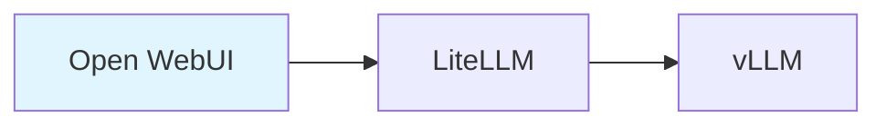

# Workshop Creator Skill

AWS Workshop Studio 프로젝트 구조를 생성하고 콘텐츠를 작성하는 스킬입니다.

## 트리거 키워드

다음 키워드로 활성화됩니다:
- "워크샵 만들어", "workshop init"
- "랩 작성", "hands-on guide"

## 명령어

| 명령어 | 설명 | 예시 |
|--------|------|------|
| `init` | 새 워크샵 프로젝트 초기화 | `/workshop-creator init my-workshop` |
| `add-module` | 모듈 추가 | `/workshop-creator add-module --title "EKS 설정"` |
| `add-lab` | 랩 추가 | `/workshop-creator add-lab --module 030 --title "클러스터 생성"` |
| `translate` | 번역 (ko↔en) | `/workshop-creator translate --from ko --to en` |
| `validate` | 구조 검증 | `/workshop-creator validate` |

## 제공 리소스

### reference/

| 참조 문서 | 설명 |
|----------|------|
| `alert-reference.md` | Alert directive 상세 |
| `code-reference.md` | Code directive 상세 (40+ 언어) |
| `tabs-reference.md` | Tabs directive 상세 |
| `image-reference.md` | Image directive 상세 |
| `front-matter.md` | Front Matter 속성 |
| `contentspec-complete.md` | contentspec.yaml 전체 설정 |
| `cloudformation-reference.md` | CloudFormation 인프라 템플릿 가이드 |

## 디렉토리 구조

```
workshop-name/
├── contentspec.yaml              # Workshop Studio 설정
├── content/                      # 워크샵 콘텐츠
│   ├── index.ko.md              # 홈페이지 (한국어)
│   ├── index.en.md              # 홈페이지 (영어)
│   ├── introduction/            # 소개
│   ├── module1-topic/           # 모듈 1
│   │   ├── index.ko.md
│   │   ├── index.en.md
│   │   └── subtopic1/
│   └── summary/                 # 요약
├── static/                      # 정적 파일
│   ├── images/
│   ├── code/
│   ├── workshop.yaml            # CloudFormation 템플릿
│   └── iam-policy.json          # IAM 정책
└── assets/
```

## Workshop Studio 디렉티브

:::danger 중요
Workshop Studio는 자체 Directive 문법을 사용합니다. Hugo shortcode (`{}`)가 아닙니다!
:::

### Alert

```markdown
::alert[This is correct!]{type="info"}
::alert[With header]{header="Important" type="warning"}

:::alert{header="Prerequisites" type="warning"}
Complex content
:::
```

| Type | 용도 |
|------|------|
| `info` | 일반 정보 (기본값) |
| `success` | 성공/완료 |
| `warning` | 주의/경고 |
| `error` | 에러/위험 |

### Code

```markdown
:::code{language=bash showCopyAction=true}
kubectl get pods -n vllm
:::

::code[aws s3 ls]{showCopyAction=true copyAutoReturn=true}
```

### Tabs

```markdown
::::tabs
:::tab{label="Console"}
Console instructions
:::
:::tab{label="CLI"}
CLI instructions
:::
::::
```

### Image

```markdown
:image[Alt text]{src="/static/images/module-1/screenshot.png" width=800}
```

### Mermaid

````markdown

````

## Front Matter

```yaml
---
title: "Page Title"
weight: 10
---
```

:::warning 주의
`chapter: true`는 Workshop Studio에서 지원하지 않습니다. 절대 사용하지 마세요.
:::

## contentspec.yaml

```yaml
version: 2.0
defaultLocaleCode: en-US
localeCodes:
  - en-US
  - ko-KR

awsAccountConfig:
  accountSources:
    - WorkshopStudio

infrastructure:
  cloudformationTemplates:
    - templateLocation: static/workshop.yaml
      label: Workshop Infrastructure
```

## Magic Variables

CloudFormation과 IAM Policy에서 사용:

| 변수 | 설명 |
|------|------|
| `{{.ParticipantRoleArn}}` | 참가자 IAM 역할 ARN |
| `{{.AssetsBucketName}}` | 자산 S3 버킷 이름 |
| `{{.AccountId}}` | AWS 계정 ID |
| `{{.AWSRegion}}` | 배포된 AWS 리전 |

## 베스트 프랙티스

### DO

- Mermaid 다이어그램으로 아키텍처 시각화
- 섹션 헤더에 이모지 사용
- `showCopyAction=true`로 복사 가능한 명령어
- 각 액션 후 검증 단계 포함
- 섹션 끝에 Key Takeaways
- 명확한 Previous/Next 네비게이션

### DON'T

- Hugo shortcode 사용 (`{}`)
- `chapter: true` 사용
- 계정 ID나 자격 증명 하드코딩
- 검증 없는 단계 작성

## 이중언어 콘텐츠

| 요소 | 한국어 (.ko.md) | 영어 (.en.md) |
|------|-----------------|---------------|
| 기술 용어 | 영어 유지 | 그대로 |
| 설명 텍스트 | 한국어 | 영어 |
| 명령어/코드 | 동일 | 동일 |
| Front matter weight | 일치 | 일치 |

## 사용 예시

```
사용자: "EKS 기초 워크샵 만들어줘"

1. workshop-agent 호출
2. 요구사항 수집 (주제, 대상, 시간, 모듈)
3. contentspec.yaml 생성
4. 모듈별 콘텐츠 작성
5. CloudFormation 템플릿 작성
6. content-review-agent 검토
7. Workshop Studio 배포
```

## Quality Review (필수)

콘텐츠 완성 후 반드시:
1. `content-review-agent` 호출
2. PASS (85점 이상) 획득 후에만 완료 선언
