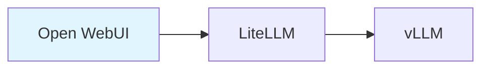
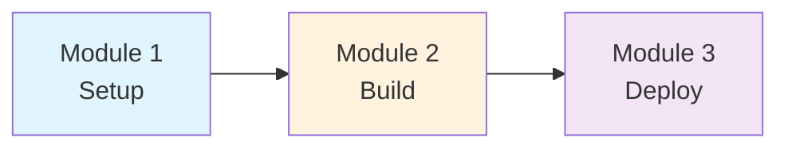

# Workshop Creator Skill

Create AWS Workshop Studio project structures and content.

## Trigger Keywords

Activated by the following keywords:
- "create workshop", "workshop init"
- "write lab", "hands-on guide"

## Commands

| Command | Description | Example |
|---------|-------------|---------|
| `init` | Initialize new workshop project | `/workshop-creator init my-workshop` |
| `add-module` | Add module | `/workshop-creator add-module --title "EKS Setup"` |
| `add-lab` | Add lab | `/workshop-creator add-lab --module 030 --title "Create Cluster"` |
| `translate` | Translate (ko↔en) | `/workshop-creator translate --from ko --to en` |
| `validate` | Validate structure | `/workshop-creator validate` |

## Provided Resources

### references/

| Reference Doc | Description |
|---------------|-------------|
| `alert-reference.md` | Alert directive details |
| `code-reference.md` | Code directive details (40+ languages) |
| `tabs-reference.md` | Tabs directive details |
| `image-reference.md` | Image directive details |
| `front-matter.md` | Front Matter attributes |
| `directives-complete.md` | Complete directive list |
| `contentspec-complete.md` | Full contentspec.yaml configuration |
| `infrastructure-guide.md` | Contentspec.yaml, Magic Variables, CloudFormation |
| `cloudformation-reference.md` | CloudFormation infrastructure template guide |
| `workshop-templates.md` | Content templates (Homepage, Module, Lab) |

---

## Directory Structure

```
workshop-name/
├── contentspec.yaml              # Workshop Studio configuration
├── content/                      # Workshop content
│   ├── index.ko.md              # Homepage (Korean)
│   ├── index.en.md              # Homepage (English)
│   ├── introduction/            # Introduction
│   ├── module1-topic/           # Module 1
│   │   ├── index.ko.md
│   │   ├── index.en.md
│   │   └── subtopic1/
│   └── summary/                 # Summary
├── static/                      # Static files
│   ├── images/
│   ├── code/
│   ├── workshop.yaml            # CloudFormation template
│   └── iam-policy.json          # IAM policy
└── assets/
```

---

## Workshop Studio Directives Detail

:::danger Important
Workshop Studio uses its own Directive syntax. Hugo shortcodes (`{}`) are NOT supported!
:::

### Alert Directive

#### Leaf Syntax (Simple Messages)

```markdown
::alert[This is correct!]{type="info"}
::alert[With header]{header="Important" type="warning"}
```

#### Container Syntax (Complex Content)

```markdown
:::alert{header="Prerequisites" type="warning"}
Before starting this lab, ensure you have:

1. An AWS account with administrator access
2. AWS CLI installed and configured
3. Node.js 18+ installed

```bash
# Verify your setup
aws sts get-caller-identity
node --version
```
:::
```

#### Alert Types

| Type | Purpose | Use When |
|------|---------|----------|
| `info` | General information | Providing helpful tips or additional context |
| `success` | Positive confirmation | Indicating successful completion or correct setup |
| `warning` | Caution notice | Highlighting potential issues, prerequisites, cost warnings |
| `error` | Critical alert | Showing errors, blockers, or dangerous actions |

#### Common Alert Patterns

```markdown
<!-- Prerequisite Alert -->
:::alert{header="Prerequisites" type="warning"}
This module requires:
- Completion of Module 1
- An active AWS account
- Basic knowledge of Amazon S3
:::

<!-- Cost Warning -->
::alert[This lab may incur AWS charges. Remember to clean up resources after completion.]{header="Cost Warning" type="warning"}

<!-- Success Confirmation -->
::alert[Your CloudFormation stack has been successfully deployed!]{header="Deployment Complete" type="success"}
```

### Code Directive

```markdown
:::code{language=bash showCopyAction=true}
kubectl get pods -n vllm
:::

:::code{language=yaml highlightLines=4-6}
apiVersion: v1
kind: Service
metadata:
  name: my-service
  namespace: production
spec:
  type: LoadBalancer
:::

::code[aws s3 ls]{showCopyAction=true copyAutoReturn=true}
```

#### Code Properties

| Property | Description | Example |
|----------|-------------|---------|
| `language` | Syntax highlighting language | `bash`, `python`, `yaml` |
| `showCopyAction` | Show copy button | `true` |
| `highlightLines` | Lines to highlight | `4-6,10` |
| `copyAutoReturn` | Auto-add newline on copy | `true` |

#### Supported Languages (40+)

| Category | Languages |
|----------|-----------|
| Shell | `bash`, `shell`, `sh`, `zsh`, `powershell` |
| Config | `yaml`, `json`, `toml`, `ini`, `properties`, `hcl` |
| Web | `html`, `css`, `javascript`, `typescript`, `jsx`, `tsx` |
| Backend | `python`, `go`, `java`, `ruby`, `php`, `csharp`, `rust` |
| Data | `sql`, `graphql`, `xml` |
| AWS | `cloudformation` (alias for yaml) |

### Tabs Directive

For code blocks inside tabs, increase colon count:

```markdown
::::tabs
:::tab{label="Console"}
Navigate to the EKS console and click **Create cluster**.
:::
:::tab{label="CLI"}
:::code{language=bash showCopyAction=true}
eksctl create cluster --name my-cluster
:::
:::
::::
```

For deeply nested content:

```markdown
:::::tabs
::::tab{label="Option A"}
:::code{language=yaml}
apiVersion: v1
kind: ConfigMap
:::
::::
:::::
```

### Image Directive

```markdown
:image[Architecture diagram]{src="/static/images/module-1/arch.png"}
:image[Dashboard screenshot]{src="/static/images/module-1/dashboard.png" width=800}
```

### Expand Directive

```markdown
::::expand{header="Advanced Configuration"}
Additional details that can be collapsed...

:::code{language=yaml}
advanced:
  setting: value
:::
::::
```

### Mermaid Diagrams

````markdown

````

---

## contentspec.yaml Guide

### Basic Configuration

```yaml
version: 2.0
defaultLocaleCode: en-US
localeCodes:
  - en-US
  - ko-KR

awsAccountConfig:
  accountSources:
    - workshop_studio        # Workshop Studio provides account
    # - customer_provided    # Participant uses own account
```

### Full Configuration Options

```yaml
version: 2.0
defaultLocaleCode: ko-KR
localeCodes:
  - ko-KR
  - en-US

# Custom parameters accessible in content
params:
  clusterName: my-eks-cluster
  region: ap-northeast-2

# Additional navigation links
additionalLinks:
  - title: AWS Documentation
    link: https://docs.aws.amazon.com/

awsAccountConfig:
  accountSources:
    - workshop_studio

  # Auto-create service-linked roles
  serviceLinkedRoles:
    - eks.amazonaws.com
    - ecs.amazonaws.com

  # Participant role configuration
  participantRole:
    iamPolicies:
      - static/iam-policy.json
    managedPolicies:
      - "arn:aws:iam::aws:policy/IAMReadOnlyAccess"
    trustedPrincipals:
      service:
        - ec2.amazonaws.com
        - eks.amazonaws.com

  # Auto-create EC2 key pair
  ec2KeyPair: true

  # Region configuration
  regionConfiguration:
    minAccessibleRegions: 1
    maxAccessibleRegions: 3
    deployableRegions:
      required:
        - ap-northeast-2
      recommended:
        - us-east-1
      optional:
        - us-west-2

# Infrastructure provisioning
infrastructure:
  cloudformationTemplates:
    - templateLocation: static/workshop.yaml
      label: Workshop Infrastructure
      parameters:
        - templateParameter: VPCCidr
          defaultValue: "10.0.0.0/16"
        - templateParameter: ParticipantRoleArn
          defaultValue: "{{.ParticipantRoleArn}}"
```

### Magic Variables

Use these variables in CloudFormation templates and IAM policies:

| Variable | Description | Example Value |
|----------|-------------|---------------|
| `{{.ParticipantRoleArn}}` | Participant IAM role ARN | `arn:aws:iam::123456789012:role/WSParticipantRole` |
| `{{.AssetsBucketName}}` | Assets S3 bucket name | `ws-event-2009c59b-6c7-us-east-1` |
| `{{.AssetsBucketPrefix}}` | Assets bucket prefix | `371c6734-2735-4958/assets/` |
| `{{.AccountId}}` | AWS account ID | `123456789012` |
| `{{.AWSRegion}}` | Deployed AWS region | `ap-northeast-2` |
| `{{.EC2KeyPairName}}` | EC2 key pair name | `ws-default-keypair` |
| `{{.TeamID}}` | Unique team identifier | `d30035ed-7bef-405a-8741` |

Usage in CloudFormation:

```yaml
Parameters:
  ParticipantRoleArn:
    Type: String
    Default: "{{.ParticipantRoleArn}}"

Resources:
  MyBucket:
    Type: AWS::S3::Bucket
    Properties:
      BucketName: !Sub workshop-${AWS::AccountId}-${AWS::Region}
```

Usage in IAM policy:

```json
{
  "Effect": "Allow",
  "Action": ["iam:PassRole"],
  "Resource": "{{.ParticipantRoleArn}}"
}
```

---

## CloudFormation Infrastructure Patterns

### VPC + EKS Pattern

```yaml
Description: EKS Workshop Infrastructure

Parameters:
  ClusterName:
    Type: String
    Default: workshop-cluster

Resources:
  VPC:
    Type: AWS::EC2::VPC
    Properties:
      CidrBlock: 10.0.0.0/16
      EnableDnsHostnames: true
      EnableDnsSupport: true
      Tags:
        - Key: Name
          Value: !Sub ${AWS::StackName}-vpc

  EKSCluster:
    Type: AWS::EKS::Cluster
    Properties:
      Name: !Ref ClusterName
      RoleArn: !GetAtt EKSRole.Arn
      ResourcesVpcConfig:
        SubnetIds:
          - !Ref PrivateSubnet1
          - !Ref PrivateSubnet2
        SecurityGroupIds:
          - !Ref ClusterSecurityGroup

Outputs:
  ClusterName:
    Value: !Ref EKSCluster
  ClusterEndpoint:
    Value: !GetAtt EKSCluster.Endpoint
```

### Serverless Pattern

```yaml
Description: Serverless Workshop Infrastructure

Resources:
  ApiGateway:
    Type: AWS::ApiGatewayV2::Api
    Properties:
      Name: !Sub ${AWS::StackName}-api
      ProtocolType: HTTP

  LambdaFunction:
    Type: AWS::Lambda::Function
    Properties:
      FunctionName: !Sub ${AWS::StackName}-handler
      Runtime: python3.12
      Handler: index.handler
      Role: !GetAtt LambdaRole.Arn
      Code:
        ZipFile: |
          def handler(event, context):
              return {'statusCode': 200, 'body': 'Hello'}

  DynamoDBTable:
    Type: AWS::DynamoDB::Table
    Properties:
      TableName: !Sub ${AWS::StackName}-data
      BillingMode: PAY_PER_REQUEST
      AttributeDefinitions:
        - AttributeName: pk
          AttributeType: S
      KeySchema:
        - AttributeName: pk
          KeyType: HASH
```

### Best Practices

```yaml
# DO: Use partition-aware ARNs
!Sub arn:${AWS::Partition}:iam::aws:policy/AmazonSSMManagedInstanceCore

# DO: Use URL suffix for service endpoints
!Sub ec2.${AWS::URLSuffix}

# DO: Use SSM Parameter Store for AMI IDs
ImageId: "{{resolve:ssm:/aws/service/ami-amazon-linux-latest/al2023-ami-kernel-default-arm64}}"

# DO: Enable encryption
Ebs:
  Encrypted: true

# DON'T: Hardcode account IDs
# Bad: arn:aws:s3:::bucket-123456789012
# Good: !Sub arn:${AWS::Partition}:s3:::bucket-${AWS::AccountId}
```

---

## Workshop Templates

### Homepage Template

```markdown
---
title: "Workshop Title"
weight: 0
---

Welcome to this hands-on workshop!

## What You'll Build

By the end of this workshop, you'll have:
- Accomplishment 1
- Accomplishment 2

## Your Learning Journey



## Prerequisites

::alert[**No AI/ML expertise required!** We'll explain concepts as we build.]{type="info"}

---

**[Get Started →](/introduction/)**
```

### Module Index Template

```markdown
---
title: "Module 1: Interacting with Models"
weight: 20
---

## Learning Objectives

By the end of this module, you will:
- **Objective 1** - Description
- **Objective 2** - Description

## Module Overview

#### 1. [First Topic](./topic1)
Description of what they'll learn...

#### 2. [Second Topic](./topic2)
Description of what they'll learn...

## Prerequisites Check

:::code{language=bash showCopyAction=true}
kubectl get pods -n workshop
aws sts get-caller-identity
:::

---

**[Next: First Topic →](./topic1)**
```

### Lab Content Template

```markdown
---
title: "vLLM - Self-Hosted Model Serving"
weight: 22
---

## Hands-On: Explore Your Running Models

### Step 1: See Your Models in Action

:::code{language=bash showCopyAction=true}
kubectl get pods -n vllm
kubectl get deployments -n vllm -o wide
:::

You should see pods like `model-xxx` - these are your running models!

### Step 2: Examine Configuration

:::code{language=bash showCopyAction=true}
cat /workshop/components/model.yaml
:::

### Step 3: Watch Logs

:::code{language=bash showCopyAction=true}
kubectl logs -f --tail=0 -n vllm deployment/model-name
:::


## Key Takeaways

- **Kubernetes Native**: Models deployed using standard K8s resources
- **Observable**: Real-time logs show model processing

---

**[Next: AWS Bedrock →](../bedrock)**
```

---

## Front Matter

```yaml
---
title: "Page Title"
weight: 10
---
```

| Attribute | Required | Description |
|-----------|----------|-------------|
| `title` | **Required** | Page title (shown in navigation) |
| `weight` | Optional | Sort order (lower = first) |
| `hidden` | Optional | `true` to hide from navigation |

:::warning Note
The `chapter` attribute is NOT supported in Workshop Studio.
:::

---

## Best Practices

### DO

1. **Mermaid diagrams** — Visualize architecture
2. **Copyable commands** — `showCopyAction=true`
3. **Verification steps** — Include validation after each action
4. **Key Takeaways** — Summary at end of each section
5. **Navigation links** — Clear Previous/Next links

### DON'T

1. Hugo shortcodes: `{}`
2. `chapter: true` attribute
3. Hardcoded account IDs or credentials
4. Steps without verification
5. Long code as heredoc

---

## Bilingual Content

| Element | Korean (.ko.md) | English (.en.md) |
|---------|-----------------|------------------|
| Technical terms | Keep in English | As-is |
| Explanatory text | Korean | English |
| Commands/code | Identical | Identical |
| Front matter weight | Must match | Must match |

---

## Usage Example

```
User: "Create an EKS basics workshop"

1. workshop-agent called
2. Requirements gathered (topic, audience, duration, modules)
3. contentspec.yaml created
4. Module content written
5. CloudFormation template created
6. content-review-agent review
7. Workshop Studio deployment
```

---

## Quality Review (Required)

After content completion:
1. Call `content-review-agent`
2. Achieve PASS (85+ score) before completion

:::warning Required
Skipping this step and deploying is prohibited.
:::
