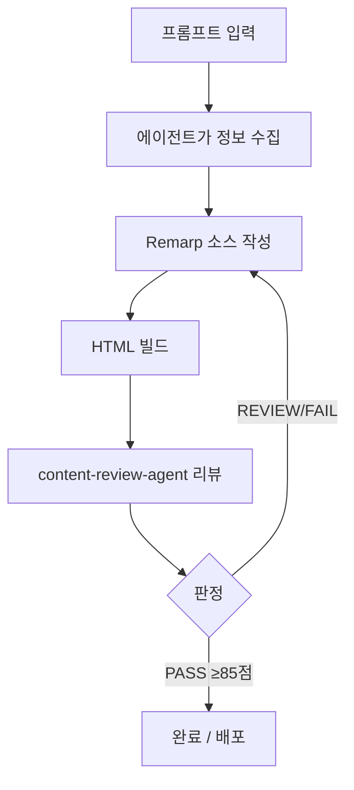

# 사용법 가이드

AWS Content Plugin으로 프레젠테이션, 다이어그램, 문서를 만드는 방법을 안내합니다.

## 빠른 시작

```
1. 설치         →  /plugin marketplace add https://github.com/Atom-oh/oh-my-cloud-skills
                    /plugin install aws-content-plugin@oh-my-cloud-skills
2. 프롬프트     →  "AWS 마이크로서비스 아키텍처 프레젠테이션 만들어줘"
3. 결과물       →  인터랙티브 HTML 슬라이드쇼 (.html)
```

설치 후 자연어 프롬프트만으로 콘텐츠를 생성할 수 있습니다. 키워드에 따라 적절한 에이전트가 자동으로 활성화됩니다.

---

## 에이전트 자동 호출

프롬프트에 특정 키워드가 포함되면 해당 에이전트가 자동으로 활성화됩니다.

| 키워드 | 에이전트 | 출력물 |
|--------|----------|--------|
| "프레젠테이션 만들어", "create slides", "training slides" | `presentation-agent` | HTML 슬라이드쇼 |
| "아키텍처 다이어그램", "infrastructure diagram", "draw.io" | `architecture-diagram-agent` | Draw.io XML |
| "애니메이션 다이어그램", "traffic flow", "SMIL animation" | `animated-diagram-agent` | SVG + SMIL HTML |
| "문서 작성", "write report", "technical report" | `document-agent` | Markdown 문서 |
| "gitbook", "documentation site" | `gitbook-agent` | GitBook 프로젝트 |
| "workshop", "hands-on guide", "랩 작성" | `workshop-agent` | Workshop Studio 콘텐츠 |
| "review content", "quality check" | `content-review-agent` | 리뷰 리포트 |

:::tip 한국어/영어 혼용
모든 에이전트는 한국어와 영어 키워드를 모두 지원합니다. "프레젠테이션 만들어줘"와 "create presentation"은 동일하게 동작합니다.
:::

---

## 프레젠테이션 만들기

프레젠테이션은 가장 핵심적인 워크플로우입니다. 단순한 프롬프트부터 상세한 프롬프트까지 다양하게 사용할 수 있습니다.

### 프롬프트 예시

**단순 프롬프트:**
```
AWS 서버리스 아키텍처 프레젠테이션 만들어줘
```

**상세 프롬프트:**
```
새로 프레젠테이션을 만들어줘 aiops에 관하여 90분간 세션을 진행할거야
고객은 300레벨 수준이야.
theme는 "example.pptx"를 가지고 사용하면 되고
스피커는 Junseok Oh, Sr. Solutions Architect, AWS
청중은 AnyCompany
```

### 에이전트 질문 항목

프롬프트에서 명시하지 않은 정보는 에이전트가 대화형으로 질문합니다:

| 항목 | 설명 | 예시 |
|------|------|------|
| 주제 | 프레젠테이션 주제 | AIOps, 서버리스, 컨테이너 |
| 시간 | 세션 총 시간 | 30분, 60분, 90분 |
| 블록 수 | 시간 기반 자동 분할 | 90분 → 3블록 (각 30분) |
| PPTX 테마 | 기업 브랜딩 템플릿 | `corporate.pptx` |
| 스피커 | 발표자 정보 | 이름, 직함, 소속 |
| 퀴즈 | 인터랙티브 퀴즈 포함 여부 | 블록별 3-5문제 |

### 워크플로우



### PPTX 테마 적용

기업 PPTX 템플릿에서 색상과 폰트를 추출하여 프레젠테이션에 적용합니다:

```
프레젠테이션 만들어줘, theme는 "corporate.pptx"를 사용해줘
```

에이전트가 PPTX 파일에서 다음을 자동 추출합니다:
- 배경색, 텍스트 색상, 강조색
- 폰트 패밀리
- 로고 이미지 (있는 경우)

### Remarp 포맷

프레젠테이션 소스는 **Remarp** 포맷(`.remarp.md`)으로 작성됩니다. Remarp는 Marp 호환 마크다운을 확장한 DSL로, Fragment 애니메이션, Canvas 다이어그램, 스피커 노트 등 인터랙티브 기능을 마크다운 안에서 선언적으로 작성할 수 있습니다.

#### 파일 구조

**단일 파일** (30분 이하):
```
my-presentation.remarp.md
```

**멀티블록 프로젝트** (30분 초과):
```
my-presentation/
├── _presentation.remarp.md     # 공통 메타데이터 (제목, 테마, 스피커)
├── 01-introduction.remarp.md   # Block 1
├── 02-deep-dive.remarp.md      # Block 2
├── 03-hands-on.remarp.md       # Block 3
└── build/                      # 빌드 결과 (.html)
```

#### 핵심 문법

**슬라이드 구분** — `---`로 슬라이드를 나눕니다:
```markdown
# 첫 번째 슬라이드

---

# 두 번째 슬라이드
```

**Fragment 애니메이션** — `{.click}` 인라인 또는 `:::click` 블록으로 클릭 시 순차 표시:

인라인 (개별 항목):
```markdown
- 첫 번째 포인트{.click}
- 두 번째 포인트{.click}
- 세 번째 포인트{.click animation=fade-up}
```

블록 (여러 요소를 그룹으로):
```markdown
:::click
### 핵심 기능
- 자동 스케일링
- 고가용성
:::

:::click animation=fade-up
### 부가 기능
- 모니터링
- 로깅
:::
```

**Canvas DSL** — 인라인 아키텍처 다이어그램:
```markdown
:::canvas width=960 height=400
box "API GW" at 50,170 size 130x60 color=accent
box "Lambda" at 260,170 size 130x60 color=green
arrow from "API GW" to "Lambda" at step=1 animate=draw
:::
```

**스피커 노트** — 발표자 전용 메모와 타이밍:
```markdown
:::notes
{timing: 3min}
이 슬라이드에서는 아키텍처 개요를 설명합니다.
{cue: demo} 대시보드 데모를 보여주세요.
:::
```

**레이아웃** — 2단 컬럼, 비교 뷰:
```markdown
@layout two-column

::: left
### Option A
- 빠른 배포
:::

::: right
### Option B
- 높은 확장성
:::
```

#### Frontmatter

```yaml
---
remarp: true
title: "프레젠테이션 제목"
author: "발표자 이름"

# Marp 호환 디렉티브 (top-level)
footer: "© 2025 AnyCompany"
paginate: true
backgroundColor: "#1a1d2e"
header: "AWS Architecture Workshop"
color: "#ffffff"

# Remarp 네이티브 (동일 기능, 중첩 구조)
theme:
  source: "./corporate.pptx"
  primary: "#232F3E"
  accent: "#FF9900"
  footer: "© 2025 AnyCompany"   # ← 이것도 동일하게 동작
  pagination: true               # ← 이것도 동일하게 동작
transition:
  type: fade
  duration: 350
---
```

> **Marp 호환성:** `footer`, `paginate`, `backgroundColor`, `backgroundImage`, `header`, `color` 디렉티브를 top-level에서 직접 사용할 수 있습니다. Remarp 네이티브 형식(`theme.footer`, `theme.pagination`)과 동일하게 동작하며, 둘 다 지정된 경우 `theme.*` 값이 우선합니다.

#### 빌드

```bash
python3 remarp_to_slides.py build <project-dir>/
```

수정 후 증분 빌드:
```
"remarp 반영해줘" 또는 "rebuild"
```

:::info Remarp 전체 가이드
문법, 슬라이드 타입, 테마, Canvas DSL 등 상세 레퍼런스는 [Remarp Guide](/docs/remarp-guide/introduction)를 참조하세요.
:::

---

## 아키텍처 다이어그램

AWS 서비스 구성도를 Draw.io XML 형식으로 생성합니다.

**프롬프트 예시:**
```
3-tier 웹 애플리케이션 아키텍처 다이어그램 그려줘
VPC, ALB, ECS Fargate, Aurora PostgreSQL 포함
```

**출력:** `.drawio` XML 파일 → Draw.io에서 열어 PNG/SVG로 내보내기

---

## 애니메이션 다이어그램

트래픽 흐름이나 서비스 간 상호작용을 SMIL 애니메이션으로 시각화합니다.

**프롬프트 예시:**
```
API Gateway → Lambda → DynamoDB 트래픽 흐름 애니메이션 다이어그램 만들어줘
```

**출력:** 자체 포함 HTML 파일 (SVG + SMIL 애니메이션, 인터랙티브 범례)

---

## 문서 생성

기술 문서, 비교 분석 리포트, 솔루션 가이드를 마크다운으로 생성합니다.

**프롬프트 예시:**
```
ECS vs EKS 비교 문서 작성해줘. 운영 복잡도, 비용, 유연성 관점에서 비교
```

**출력:** 전문적인 마크다운 문서 (`.md`)

---

## GitBook / Workshop

### GitBook 문서 사이트

```
GitBook 문서 사이트 만들어줘 - AWS Well-Architected Framework 가이드
```

구조화된 GitBook 프로젝트를 생성합니다 (SUMMARY.md, 챕터별 페이지, 컴포넌트).

### AWS Workshop Studio

```
EKS 핸즈온 워크샵 만들어줘, 3개 모듈 구성
```

Workshop Studio 형식의 콘텐츠를 생성합니다 (디렉티브, 다국어 지원, CloudFormation 인프라).

---

## Quality Gate

모든 콘텐츠는 배포 전 `content-review-agent`의 품질 검토를 거칩니다.

| 판정 | 점수 | 조건 | 결과 |
|------|------|------|------|
| **PASS** | 85점 이상 | Critical 0, Warning ≤3 | 승인 — 배포 가능 |
| **REVIEW** | 70-84점 | Critical 0, Warning 4-10 | 수정 후 재리뷰 |
| **FAIL** | 70점 미만 | Critical ≥1 또는 Warning >10 | 진행 불가 — 재작성 |

리뷰 항목: 레이아웃, 용어 정확도, 할루시네이션, 언어 일관성, PII/민감 정보, 가독성, 접근성, 구조 완성도

:::warning 필수 규칙
Quality Gate를 통과하지 않고 배포/완료를 선언할 수 없습니다. 최대 3회 리뷰 사이클 후에도 PASS 미달 시 사용자에게 판단을 요청합니다.
:::

---

## 키보드 단축키

생성된 HTML 프레젠테이션에서 사용할 수 있는 키보드 단축키입니다.

| 키 | 동작 |
|----|------|
| `←` `→` | 이전/다음 슬라이드 |
| `Space` | 다음 Fragment 또는 다음 슬라이드 |
| `F` | 전체 화면 토글 |
| `P` | 프레젠터 뷰 (노트 + 타이밍) |
| `O` | 개요 모드 (슬라이드 그리드) |
| `Esc` | 모드 종료 |
| `Home` / `End` | 처음/마지막 슬라이드 |

---

## 팁 & 트릭

### 블록 편집

이미 생성된 프레젠테이션의 특정 블록만 수정할 수 있습니다:

```
Block 2의 슬라이드 5에 "비용 최적화 사례" 추가해줘
```

### 증분 빌드

전체를 다시 만들지 않고 수정된 부분만 반영합니다:

```
"remarp 반영해줘" 또는 "다시 빌드해줘"
```

### 한국어/영어 혼용 규칙

- 프롬프트: 한국어와 영어 모두 사용 가능
- 콘텐츠: 프롬프트 언어에 맞춰 자동 생성
- 기술 용어: 원문 영어를 유지하되 설명은 요청 언어로 작성

### 다이어그램 에이전트 선택

| 필요 사항 | 에이전트 |
|-----------|----------|
| 정적 AWS 아키텍처 | `architecture-diagram-agent` |
| 애니메이션 트래픽 흐름 | `animated-diagram-agent` |
| Workshop 인라인 다이어그램 | `workshop-agent` (Mermaid) |
| 프레젠테이션 Canvas 애니메이션 (박스 4개 이하) | `reactive-presentation-agent` (`:::canvas` DSL) |
| 프레젠테이션 HTML 아키텍처 (박스 5개 이상) | `reactive-presentation-agent` (`:::html` + `:::css`) |

### Canvas vs HTML 선택 기준 (v1.2.3)

:::warning STOP Gate
프레젠테이션에서 다이어그램/흐름도 슬라이드를 만들 때 박스/아이콘 개수에 따라 방식이 달라집니다:
- **≤4개**: `:::canvas` DSL 사용 가능 (단순 A→B→C 흐름)
- **5개 이상**: `:::canvas` 금지 → `:::html` + `:::css` 필수 (flow-h, flow-group 클래스)
- **인터랙션 필요**: `:::html` + `:::script` 사용 (슬라이더, 시뮬레이터 등)
:::
