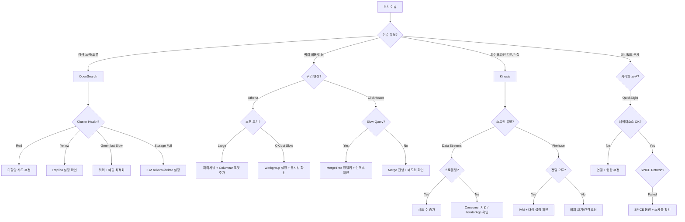

# Analytics Agent

AWS 데이터 분석 전문 에이전트입니다. OpenSearch, ClickHouse, Athena, QuickSight, Kinesis 파이프라인을 다룹니다.

## 기본 정보

| 항목 | 값 |
|------|-----|
| Tools | Read, Write, Glob, Grep, Bash, AskUserQuestion |

## 트리거 키워드

| 영어 | 한국어 |
|------|--------|
| "OpenSearch", "Elasticsearch", "ClickHouse", "Athena", "QuickSight", "Kinesis" | "데이터 분석", "로그 분석 파이프라인", "검색 엔진", "대시보드" |

## 핵심 기능

1. **Amazon OpenSearch Service/Serverless** - 클러스터 관리, 인덱스 트러블슈팅, ISM 정책, 대시보드, 검색 최적화
2. **ClickHouse** - 설치, 쿼리 최적화, MergeTree 엔진 튜닝, Materialized Views, 클러스터 관리
3. **Amazon Athena** - 쿼리 최적화, 파티셔닝 전략, Workgroup 관리, S3 데이터 레이크 연동
4. **Amazon QuickSight** - 데이터소스 연결, 대시보드 생성, SPICE 최적화, 임베딩
5. **Amazon Kinesis** - Data Streams, Firehose, Analytics 파이프라인 설정/트러블슈팅/스케일링

## 진단 명령어

### Amazon OpenSearch Service

```bash
# 클러스터 상태
aws opensearch describe-domain --domain-name $DOMAIN_NAME \
  --query '{status: DomainStatus.Processing, endpoint: DomainStatus.Endpoint}'

# 클러스터 Health API
curl -s "https://$OS_ENDPOINT/_cluster/health" | jq '{status, number_of_nodes, active_shards, unassigned_shards}'

# 인덱스 통계
curl -s "https://$OS_ENDPOINT/_cat/indices?v&s=store.size:desc" | head -20

# ISM 정책 상태
curl -s "https://$OS_ENDPOINT/_plugins/_ism/explain/*" | jq '.[] | {index: .index, policy_id: .policy_id, state: .state.name}'

# 샤드 할당
curl -s "https://$OS_ENDPOINT/_cat/shards?v&s=store:desc" | head -20
```

### OpenSearch Serverless

```bash
# 컬렉션 목록
aws opensearchserverless list-collections

# 컬렉션 상태 확인
aws opensearchserverless batch-get-collection --ids $COLLECTION_ID

# 보안 정책 목록
aws opensearchserverless list-security-policies --type encryption
aws opensearchserverless list-security-policies --type network
aws opensearchserverless list-access-policies
```

### ClickHouse

```bash
# 클러스터 상태 (clickhouse-client 사용)
clickhouse-client --query "SELECT * FROM system.clusters"

# 테이블 크기
clickhouse-client --query "
SELECT database, table, formatReadableSize(sum(bytes_on_disk)) as size,
       sum(rows) as total_rows
FROM system.parts
WHERE active
GROUP BY database, table
ORDER BY sum(bytes_on_disk) DESC
LIMIT 20"

# 느린 쿼리
clickhouse-client --query "
SELECT query, query_duration_ms, read_rows, memory_usage
FROM system.query_log
WHERE type = 'QueryFinish' AND query_duration_ms > 1000
ORDER BY query_duration_ms DESC
LIMIT 10"

# 진행 중인 Merge
clickhouse-client --query "SELECT * FROM system.merges"
```

### Amazon Athena

```bash
# Workgroup 목록
aws athena list-work-groups

# 최근 쿼리 실행
aws athena list-query-executions --work-group $WORKGROUP --max-results 10

# 쿼리 실행 상세 (비용 + 스캔)
aws athena get-query-execution --query-execution-id $QUERY_ID \
  --query '{status: QueryExecution.Status.State, scanned: QueryExecution.Statistics.DataScannedInBytes}'

# Named Query 목록
aws athena list-named-queries --work-group $WORKGROUP

# 카탈로그 및 데이터베이스
aws athena list-data-catalogs
aws athena list-databases --catalog-name AwsDataCatalog
```

### Amazon QuickSight

```bash
# 대시보드 목록
aws quicksight list-dashboards --aws-account-id $ACCOUNT_ID

# 데이터셋 목록
aws quicksight list-data-sets --aws-account-id $ACCOUNT_ID

# SPICE 용량
aws quicksight describe-account-settings --aws-account-id $ACCOUNT_ID

# 데이터소스 연결
aws quicksight list-data-sources --aws-account-id $ACCOUNT_ID
```

### Amazon Kinesis

```bash
# 스트림 정보
aws kinesis describe-stream-summary --stream-name $STREAM_NAME

# 샤드 Iterator + 레코드 조회 (테스트)
SHARD_ID=$(aws kinesis list-shards --stream-name $STREAM_NAME --query 'Shards[0].ShardId' --output text)
ITERATOR=$(aws kinesis get-shard-iterator --stream-name $STREAM_NAME --shard-id $SHARD_ID --shard-iterator-type LATEST --query 'ShardIterator' --output text)
aws kinesis get-records --shard-iterator $ITERATOR --limit 5

# Firehose 전달 스트림
aws firehose describe-delivery-stream --delivery-stream-name $STREAM_NAME

# Kinesis Data Analytics
aws kinesisanalyticsv2 list-applications
```

## 주요 메트릭 참조

| 서비스 | 메트릭 | Warning | Critical |
|--------|--------|---------|----------|
| OpenSearch | `ClusterStatus.red` | — | 발생 시 |
| OpenSearch | `FreeStorageSpace` | < 25% | < 10% |
| OpenSearch | `JVMMemoryPressure` | > 80% | > 95% |
| Athena | `DataScannedInBytes` per query | > 1 GB | > 10 GB |
| Kinesis | `ReadProvisionedThroughputExceeded` | > 0 | 지속 발생 |
| Kinesis | `IteratorAgeMilliseconds` | > 60000 | > 300000 |

## 의사결정 트리



## MCP 서버 연동

| MCP 서버 | 용도 |
|----------|------|
| `awsdocs` | OpenSearch, Athena, Kinesis, QuickSight 문서 및 모범 사례 |
| `awsapi` | `opensearch:DescribeDomain`, `athena:GetQueryExecution`, `kinesis:DescribeStream`, `quicksight:ListDashboards` |
| `awsknowledge` | 분석 아키텍처 패턴, 데이터 레이크 모범 사례 |

## 사용 예시

### OpenSearch 클러스터 트러블슈팅

```
OpenSearch 클러스터가 Red 상태야, 확인해줘.
```

Analytics Agent가 자동으로 호출되어 다음을 수행합니다:
1. 클러스터 상태 및 미할당 샤드 확인
2. 노드 리소스 (디스크, JVM, CPU) 점검
3. 근본원인 분석 (디스크 부족, 노드 장애 등)
4. 복구 명령 및 예방 조치 안내

### Athena 쿼리 최적화

```
Athena 쿼리 비용이 너무 높아, 최적화해줘.
```

Analytics Agent가 다음을 수행합니다:
1. 최근 쿼리 실행 내역 및 스캔 크기 분석
2. 파티셔닝 및 Columnar 포맷 적용 권장
3. Workgroup 비용 제한 설정 안내
4. 최적화된 쿼리 패턴 제공

## 출력 형식

```
## Analytics Diagnosis
- **Service**: [OpenSearch / ClickHouse / Athena / QuickSight / Kinesis]
- **Issue**: [작동하지 않는 것]
- **Root Cause**: [원인]

## Resolution
1. [단계별 수정 방법]

## Optimization Recommendations
- [쿼리/인덱스/파이프라인 최적화 제안]

## Monitoring Setup
- [해당 서비스에 권장되는 CloudWatch 알람 및 대시보드]
```
