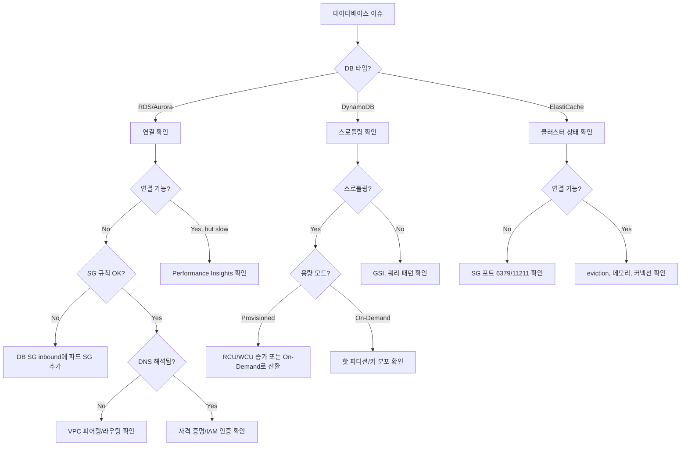

# Database Agent

AWS 데이터베이스 운영 전문 에이전트입니다. RDS, Aurora, DynamoDB, ElastiCache를 다룹니다.

## 기본 정보

| 항목 | 값 |
|------|-----|
| Model | sonnet |
| Tools | Read, Write, Glob, Grep, Bash, AskUserQuestion |

## 트리거 키워드

| 영어 | 한국어 |
|------|--------|
| "RDS", "Aurora", "DynamoDB", "ElastiCache", "database connection", "throttling" | "DB 연결", "데이터베이스 오류", "스로틀링" |

## 핵심 기능

1. **RDS/Aurora** - 파드에서의 연결, 프록시 설정, 페일오버, Performance Insights
2. **DynamoDB** - 스로틀링 진단, 용량 계획, GSI 최적화
3. **ElastiCache** - Redis/Memcached 연결, 클러스터 모드, 페일오버
4. **연결 트러블슈팅** - Security Groups, VPC 라우팅, DNS 해석, IAM 인증
5. **성능 분석** - 느린 쿼리, 커넥션 풀 튜닝, 읽기 복제본 라우팅

## 진단 명령어

### RDS/Aurora 연결

```bash
# RDS 엔드포인트 확인
aws rds describe-db-instances --db-instance-identifier <id> --query 'DBInstances[].{Endpoint:Endpoint.Address,Port:Endpoint.Port,Status:DBInstanceStatus,VPC:DBSubnetGroup.VpcId}'

# 파드에서 연결 테스트
kubectl run -it --rm db-test --image=mysql:8 --restart=Never -- mysql -h <endpoint> -P 3306 -u <user> -p

# Security Groups 확인
aws rds describe-db-instances --db-instance-identifier <id> --query 'DBInstances[].VpcSecurityGroups'
aws ec2 describe-security-group-rules --filter Name=group-id,Values=<sg-id>

# 서브넷 그룹 확인
aws rds describe-db-subnet-groups --db-subnet-group-name <name>
```

### DynamoDB

```bash
# 테이블 상태 및 메트릭
aws dynamodb describe-table --table-name <name> --query 'Table.{Status:TableStatus,ItemCount:ItemCount,RCU:ProvisionedThroughput.ReadCapacityUnits,WCU:ProvisionedThroughput.WriteCapacityUnits}'

# 스로틀링 확인
aws cloudwatch get-metric-statistics --namespace AWS/DynamoDB --metric-name ThrottledRequests \
  --dimensions Name=TableName,Value=<table> --start-time $(date -u -d '1 hour ago' +%Y-%m-%dT%H:%M:%SZ) \
  --end-time $(date -u +%Y-%m-%dT%H:%M:%SZ) --period 300 --statistics Sum

# GSI 상태
aws dynamodb describe-table --table-name <name> --query 'Table.GlobalSecondaryIndexes[].{Name:IndexName,Status:IndexStatus,RCU:ProvisionedThroughput.ReadCapacityUnits}'
```

### ElastiCache

```bash
# 클러스터 상태
aws elasticache describe-cache-clusters --cache-cluster-id <id> --show-cache-node-info

# Replication Group (Redis 클러스터 모드)
aws elasticache describe-replication-groups --replication-group-id <id>

# 파드에서 Redis 연결 테스트
kubectl run -it --rm redis-test --image=redis:7 --restart=Never -- redis-cli -h <endpoint> -p 6379 ping
```

## 의사결정 트리



## 일반적인 오류와 해결책

| 오류 | 원인 | 해결책 |
|------|------|--------|
| 연결 타임아웃 (RDS) | SG 규칙, VPC 라우팅 | DB SG inbound에 파드 CIDR 추가 |
| Access denied (RDS) | 잘못된 자격 증명 | Secret 확인, IAM 인증 토큰 확인 |
| `ProvisionedThroughputExceededException` | DynamoDB 스로틀링 | 용량 증가 또는 On-Demand로 전환 |
| ElastiCache 연결 거부 | SG가 포트 6379 차단 | Redis 포트 inbound 규칙 추가 |
| Aurora 페일오버 이슈 | Reader 엔드포인트 미갱신 | 클러스터 엔드포인트 사용, 재시도 로직 구현 |
| 높은 지연 (DynamoDB) | Query 대신 Scan, GSI 없음 | GSI 추가, 액세스 패턴 최적화 |

## MCP 서버 연동

| MCP 서버 | 용도 |
|----------|------|
| `awsdocs` | RDS/Aurora/DynamoDB/ElastiCache 문서 및 모범 사례 |
| `awsapi` | `rds:DescribeDBInstances`, `dynamodb:DescribeTable`, `elasticache:DescribeCacheClusters` |
| `awsknowledge` | 데이터베이스 아키텍처 권장사항 |

## 사용 예시

### RDS 연결 문제 해결

```
파드에서 RDS에 연결하려는데 타임아웃이 발생해.
```

Database Agent가 자동으로 호출되어 다음을 수행합니다:
1. RDS 인스턴스 상태 확인
2. Security Group 규칙 검증
3. VPC 라우팅 확인
4. 연결 테스트 명령 제공
5. 문제 해결 단계 안내

### DynamoDB 스로틀링 진단

```
DynamoDB에서 ThrottlingException이 자주 발생해.
```

Database Agent가 다음을 수행합니다:
1. 테이블 용량 모드 확인
2. CloudWatch 스로틀링 메트릭 분석
3. 핫 파티션 여부 검토
4. 용량 조정 권장사항 제공

## 출력 형식

```
## Database Diagnosis
- **Service**: [RDS / Aurora / DynamoDB / ElastiCache]
- **Issue**: [연결 / 성능 / 스로틀링]
- **Root Cause**: [파악된 원인]

## Resolution
1. [단계별 수정 방법]

## Verification
```bash
[연결 테스트 명령어]
```

## Performance Recommendations
- [쿼리 최적화, 용량 계획, 아키텍처 제안]
```
