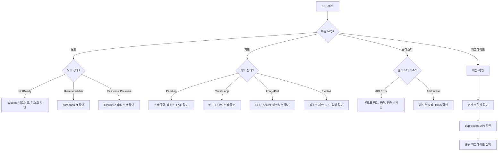

# EKS Agent

Amazon EKS 클러스터 운영 및 트러블슈팅 전문 에이전트입니다.

## 기본 정보

| 항목 | 값 |
|------|-----|
| Tools | Read, Write, Glob, Grep, Bash, AskUserQuestion |

## 트리거 키워드

| 영어 | 한국어 |
|------|--------|
| "EKS troubleshoot", "cluster issue", "node NotReady", "pod crash", "EKS upgrade", "add-on" | "노드 문제", "클러스터 장애", "EKS 업그레이드" |

## 핵심 기능

1. **클러스터 관리** - 상태 모니터링, 구성, 엔드포인트 액세스, 로깅
2. **노드 그룹 운영** - Managed/Self-managed 노드 그룹, 스케일링, AMI 업데이트
3. **애드온 관리** - VPC CNI, CoreDNS, kube-proxy, EBS CSI driver 수명주기
4. **업그레이드 계획** - 버전 호환성, deprecated API 확인, 롤링 업그레이드 실행
5. **트러블슈팅** - 5분 트리아지, 파드 디버깅, 노드 진단

## 진단 명령어

### 클러스터 상태

```bash
# 클러스터 상태
kubectl cluster-info
aws eks describe-cluster --name $CLUSTER_NAME --query 'cluster.{status:status,version:version,endpoint:endpoint}'

# 노드 상태
kubectl get nodes -o wide
kubectl describe node <node-name> | grep -A 20 "Conditions:"

# 시스템 파드
kubectl get pods -n kube-system -o wide
kubectl get pods -n amazon-vpc-cni-system -o wide

# 이벤트
kubectl get events -A --sort-by='.lastTimestamp' | tail -30
```

### 노드 트러블슈팅

```bash
# 노드 컨디션
kubectl get nodes -o json | jq '.items[] | {name:.metadata.name, conditions:[.status.conditions[] | select(.status!="False") | .type]}'

# NotReady 노드
kubectl get nodes --field-selector=status.conditions.type=Ready,status.conditions.status!=True

# 노드 리소스 압박
kubectl describe node <node> | grep -E "(MemoryPressure|DiskPressure|PIDPressure|NetworkUnavailable)"

# kubelet 로그 (SSM 또는 직접)
journalctl -u kubelet -n 100 --no-pager
```

### 파드 트러블슈팅

```bash
# CrashLoopBackOff 파드
kubectl get pods -A --field-selector=status.phase!=Running,status.phase!=Succeeded

# 파드 상세
kubectl describe pod <pod> -n <namespace>
kubectl logs <pod> -n <namespace> --previous
kubectl logs <pod> -n <namespace> -c <container>

# 리소스 사용량
kubectl top pods -n <namespace> --sort-by=memory
```

### 애드온 관리

```bash
# 애드온 목록
aws eks list-addons --cluster-name $CLUSTER_NAME

# 애드온 상태 확인
aws eks describe-addon --cluster-name $CLUSTER_NAME --addon-name <addon-name>

# 애드온 업데이트
aws eks update-addon --cluster-name $CLUSTER_NAME --addon-name vpc-cni --addon-version <version> --resolve-conflicts PRESERVE
```

## 의사결정 트리



## 일반적인 오류와 해결책

| 오류 | 원인 | 해결책 |
|------|------|--------|
| `NodeNotReady` | kubelet 크래시, 네트워크 이슈 | kubelet 로그 확인, kubelet 재시작, ENI 검증 |
| `CrashLoopBackOff` | 앱 오류, OOM, 설정 이슈 | `logs --previous` 확인, 리소스 제한 확인 |
| `ImagePullBackOff` | ECR 인증, 잘못된 이미지 태그 | imagePullSecrets 검증, ECR 정책 확인 |
| `Pending (no nodes)` | 리소스 부족 | 노드 그룹 스케일, 노드 셀렉터/taint 확인 |
| `Pending (PVC)` | StorageClass, AZ 불일치 | StorageClass 확인, PVC와 노드의 AZ 검증 |
| `Evicted` | 노드 리소스 압박 | 노드 크기 증가, 리소스 제한 설정 |
| `FailedScheduling` | Taint/toleration, affinity | 노드 taint, 파드 toleration, affinity 규칙 확인 |

## MCP 서버 연동

| MCP 서버 | 용도 |
|----------|------|
| `awsdocs` | EKS 공식 문서, 업그레이드 가이드, 모범 사례 |
| `awsapi` | `eks:DescribeCluster`, `eks:ListNodegroups`, `ec2:DescribeInstances` |
| `awsknowledge` | EKS 아키텍처 권장사항 |
| `awsiac` | EKS 스택 CloudFormation 템플릿 검증 |

## 사용 예시

### 노드 NotReady 트러블슈팅

```
노드가 NotReady 상태야. 확인해줘.
```

EKS Agent가 자동으로 호출되어 다음을 수행합니다:
1. 노드 상태 및 컨디션 확인
2. kubelet 로그 분석
3. ENI/네트워크 상태 검증
4. 근본 원인 파악 및 해결책 제시

### 파드 CrashLoop 분석

```
production 네임스페이스의 api-server 파드가 CrashLoopBackOff 상태야.
```

EKS Agent가 다음을 수행합니다:
1. 파드 이벤트 및 상태 확인
2. 이전 컨테이너 로그 분석
3. 리소스 제한 및 OOM 여부 확인
4. 문제 해결 단계 안내

## 출력 형식

```
## Diagnosis
- **Component**: [Cluster/Node/Pod/Add-on]
- **Symptom**: [관찰된 현상]
- **Root Cause**: [파악된 원인]

## Resolution
1. [단계별 수정 방법]

## Verification
```bash
[수정 검증 명령어]
```

## Prevention
- [재발 방지 권장사항]
```
