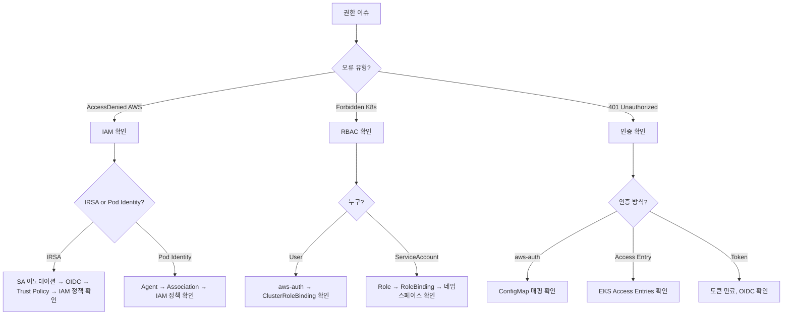

# IAM Agent

AWS IAM 및 Kubernetes RBAC 트러블슈팅 전문 에이전트입니다.

## 기본 정보

| 항목 | 값 |
|------|-----|
| Model | sonnet |
| Tools | Read, Write, Glob, Grep, Bash, AskUserQuestion |

## 트리거 키워드

| 영어 | 한국어 |
|------|--------|
| "IRSA", "Pod Identity", "RBAC", "aws-auth", "IAM role", "permission denied", "AccessDenied" | "권한 오류", "인증 실패", "보안 설정" |

## 핵심 기능

1. **IRSA (IAM Roles for Service Accounts)** - OIDC 프로바이더, Trust Policy, 어노테이션 검증
2. **EKS Pod Identity** - Pod Identity Association, 에이전트 상태, IRSA에서 마이그레이션
3. **RBAC** - ClusterRole/Role, 바인딩, 권한 감사
4. **aws-auth ConfigMap** - 노드 역할 매핑, 사용자/그룹 액세스 관리
5. **정책 검증** - IAM 정책 분석, 최소 권한 평가

## 진단 명령어

### IRSA

```bash
# OIDC 프로바이더 확인
aws eks describe-cluster --name $CLUSTER_NAME --query 'cluster.identity.oidc.issuer'
aws iam list-open-id-connect-providers

# Service Account 확인
kubectl get sa <sa-name> -n <namespace> -o yaml | grep eks.amazonaws.com/role-arn

# Trust Policy 검증
aws iam get-role --role-name <role-name> --query 'Role.AssumeRolePolicyDocument'

# 파드에서 테스트
kubectl exec -it <pod> -- aws sts get-caller-identity
kubectl exec -it <pod> -- env | grep AWS_
```

### Pod Identity

```bash
# Pod Identity Agent 확인
kubectl get pods -n kube-system -l app.kubernetes.io/name=eks-pod-identity-agent

# Association 목록
aws eks list-pod-identity-associations --cluster-name $CLUSTER_NAME

# Association 상세
aws eks describe-pod-identity-association --cluster-name $CLUSTER_NAME --association-id <id>
```

### RBAC

```bash
# 권한 확인
kubectl auth can-i <verb> <resource> --as=<user> -n <namespace>
kubectl auth can-i --list --as=<user>

# Role과 Binding 목록
kubectl get clusterroles,clusterrolebindings
kubectl get roles,rolebindings -n <namespace>

# Role 상세
kubectl describe clusterrole <role>
kubectl describe clusterrolebinding <binding>
```

### aws-auth ConfigMap

```bash
# aws-auth 확인
kubectl get configmap aws-auth -n kube-system -o yaml

# Access Entries 확인 (EKS API)
aws eks list-access-entries --cluster-name $CLUSTER_NAME
aws eks describe-access-entry --cluster-name $CLUSTER_NAME --principal-arn <arn>
```

## 의사결정 트리



## 일반적인 오류와 해결책

| 오류 | 원인 | 해결책 |
|------|------|--------|
| `AccessDenied` (AWS API) | IAM 정책 누락 | Role에 필요한 권한 추가 |
| `Forbidden` (K8s API) | RBAC 바인딩 누락 | Role/ClusterRole + 바인딩 생성 |
| `401 Unauthorized` | 토큰 만료, aws-auth 오류 | 토큰 갱신, aws-auth 매핑 수정 |
| IRSA 미작동 | OIDC 오류, 어노테이션 누락 | OIDC 프로바이더 검증, SA 어노테이션 확인 |
| Pod Identity 실패 | Agent 미실행 | Pod Identity Agent 설치/재시작 |
| 노드 조인 실패 | aws-auth 항목 누락 | aws-auth ConfigMap에 노드 역할 추가 |

## MCP 서버 연동

| MCP 서버 | 용도 |
|----------|------|
| `awsdocs` | IAM 모범 사례, IRSA 설정, Pod Identity 문서 |
| `awsapi` | `iam:GetRole`, `iam:SimulatePrincipalPolicy`, `eks:ListAccessEntries` |
| `awsknowledge` | 보안 아키텍처 권장사항 |

## 사용 예시

### IRSA AccessDenied 문제 해결

```
파드에서 S3에 접근하려는데 AccessDenied 오류가 발생해.
```

IAM Agent가 자동으로 호출되어 다음을 수행합니다:
1. Service Account 어노테이션 확인
2. OIDC 프로바이더 설정 검증
3. IAM Role Trust Policy 분석
4. IAM Policy 권한 확인
5. 문제 해결 단계 안내

### RBAC Forbidden 진단

```
kubectl로 파드 목록을 보려는데 Forbidden 오류가 나와.
```

IAM Agent가 다음을 수행합니다:
1. 현재 사용자/ServiceAccount 식별
2. RBAC 바인딩 확인
3. 필요한 권한 분석
4. Role/RoleBinding 생성 가이드 제공

## 출력 형식

```
## Permission Diagnosis
- **Layer**: [AWS IAM / Kubernetes RBAC / Authentication]
- **Principal**: [User/Role/ServiceAccount]
- **Action**: [시도한 작업]
- **Root Cause**: [거부된 이유]

## Resolution
1. [단계별 수정 방법]

## Verification
```bash
kubectl auth can-i <verb> <resource> --as=<principal>
kubectl exec -it <pod> -- aws sts get-caller-identity
```

## Least Privilege Review
- [최소 권한 권장사항]
```
