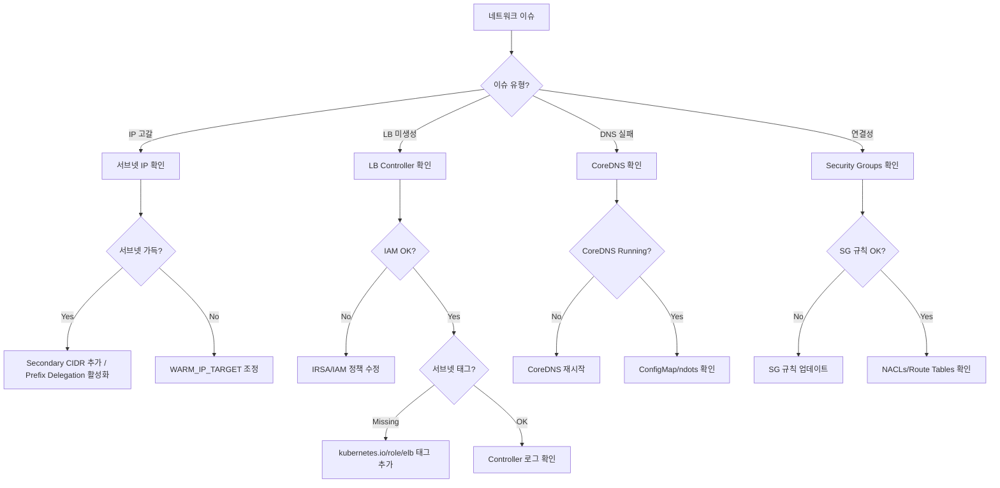

# Network Agent

AWS/EKS 네트워킹 진단 전문 에이전트입니다. VPC CNI, 로드 밸런서, DNS, Security Group 문제를 다룹니다.

## 기본 정보

| 항목 | 값 |
|------|-----|
| Tools | Read, Write, Glob, Grep, Bash, AskUserQuestion |

## 트리거 키워드

| 영어 | 한국어 |
|------|--------|
| "VPC CNI", "IP exhaustion", "load balancer", "ALB", "NLB", "DNS resolution", "security group" | "네트워크 오류", "IP 부족", "로드밸런서", "연결 문제" |

## 핵심 기능

1. **VPC CNI 진단** - IP 관리, ENI 할당, Prefix Delegation, IPAMD 트러블슈팅
2. **로드 밸런서 운영** - ALB/NLB 생성, 타겟 헬스, 어노테이션, 트러블슈팅
3. **DNS 해석** - CoreDNS, Route 53, external-dns, 해석 실패
4. **Security Groups** - Ingress/egress 규칙, Pod Security Groups, 크로스 VPC 통신
5. **IP 주소 관리** - 서브넷 용량, Secondary CIDR, Custom Networking

## 진단 명령어

### VPC CNI

```bash
# CNI 버전 및 설정
kubectl describe daemonset aws-node -n kube-system | grep Image
kubectl get ds aws-node -n kube-system -o json | jq '.spec.template.spec.containers[0].env'

# IPAMD 로그
kubectl logs -n kube-system -l k8s-app=aws-node -c aws-node | grep -i "insufficient\|error\|failed"

# 노드별 IP 사용량
kubectl get nodes -o json | jq '.items[] | {name:.metadata.name, pods:.status.allocatable.pods}'

# ENI 상세
aws ec2 describe-network-interfaces --filters Name=attachment.instance-id,Values=<instance-id> --query 'NetworkInterfaces[].{ID:NetworkInterfaceId,PrivateIPs:PrivateIpAddresses|length(@),SubnetId:SubnetId}'

# 서브넷 가용 IP
aws ec2 describe-subnets --subnet-ids <subnet-id> --query 'Subnets[].{ID:SubnetId,CIDR:CidrBlock,Available:AvailableIpAddressCount}'

# IPAMD 메트릭
kubectl exec -n kube-system ds/aws-node -c aws-node -- curl -s http://localhost:61678/v1/enis 2>/dev/null | jq .
```

### 로드 밸런서

```bash
# LB Controller 상태
kubectl get deployment -n kube-system aws-load-balancer-controller
kubectl logs -n kube-system -l app.kubernetes.io/name=aws-load-balancer-controller --tail=50

# Ingress 상태
kubectl get ingress -A -o wide
kubectl describe ingress <name> -n <namespace>

# 타겟 헬스
aws elbv2 describe-target-health --target-group-arn <tg-arn>

# LB 상세
aws elbv2 describe-load-balancers --query 'LoadBalancers[?contains(LoadBalancerName,`k8s`)]'
```

### DNS

```bash
# CoreDNS 상태
kubectl get pods -n kube-system -l k8s-app=kube-dns
kubectl logs -n kube-system -l k8s-app=kube-dns --tail=30

# DNS 해석 테스트
kubectl run -it --rm dns-test --image=busybox:1.28 --restart=Never -- nslookup kubernetes.default
kubectl exec -it <pod> -- nslookup <service-name>.<namespace>.svc.cluster.local

# CoreDNS 설정
kubectl get configmap coredns -n kube-system -o yaml
```

### Security Groups

```bash
# 노드 Security Groups
aws ec2 describe-instances --instance-ids <id> --query 'Reservations[].Instances[].SecurityGroups'

# SG 규칙
aws ec2 describe-security-group-rules --filter Name=group-id,Values=<sg-id>

# Pod Security Group 정책
kubectl get securitygrouppolicies -A
```

## 의사결정 트리



## 일반적인 오류와 해결책

| 오류 | 원인 | 해결책 |
|------|------|--------|
| `InsufficientFreeAddressesInSubnet` | 서브넷 IP 고갈 | Secondary CIDR 추가, Prefix Delegation 활성화 |
| `ENI limit reached` | 인스턴스 ENI 제한 | 더 큰 인스턴스 타입 사용 또는 Prefix Delegation |
| ALB 미생성 | IRSA 누락, 서브넷 태그 누락 | IAM 정책 수정, 서브넷 태그 추가 |
| Target unhealthy | SG 규칙, 헬스 체크 경로 | SG ingress 수정, 헬스 체크 엔드포인트 검증 |
| DNS 해석 타임아웃 | CoreDNS 과부하, ndots | CoreDNS 스케일, ndots 설정 최적화 |
| `502 Bad Gateway` | 파드 미준비, SG 차단 | 파드 readiness 확인, ALB→파드 SG 규칙 |

## MCP 서버 연동

| MCP 서버 | 용도 |
|----------|------|
| `awsdocs` | VPC CNI 문서, LB Controller 문서, DNS 트러블슈팅 가이드 |
| `awsapi` | `ec2:DescribeSubnets`, `ec2:DescribeNetworkInterfaces`, `elbv2:DescribeTargetHealth` |
| `awsknowledge` | VPC 네트워킹 모범 사례 |

## 사용 예시

### IP 고갈 문제 해결

```
파드가 Pending 상태고 IP 할당이 안 돼. 확인해줘.
```

Network Agent가 자동으로 호출되어 다음을 수행합니다:
1. 서브넷 가용 IP 확인
2. IPAMD 로그 분석
3. ENI 할당 상태 검증
4. Prefix Delegation 또는 Secondary CIDR 권장

### ALB 타겟 Unhealthy 진단

```
ALB 타겟이 unhealthy로 표시돼.
```

Network Agent가 다음을 수행합니다:
1. 타겟 그룹 헬스 체크 확인
2. Security Group 규칙 검증
3. 파드 readiness probe 상태 확인
4. 문제 해결 단계 안내

## 출력 형식

```
## Network Diagnosis
- **Layer**: [L3-IP / L4-Transport / L7-Application / DNS]
- **Symptom**: [관찰된 현상]
- **Root Cause**: [파악된 원인]

## Resolution
1. [명령어와 함께 단계별 수정 방법]

## Verification
```bash
[연결성 검증 명령어]
```
```
