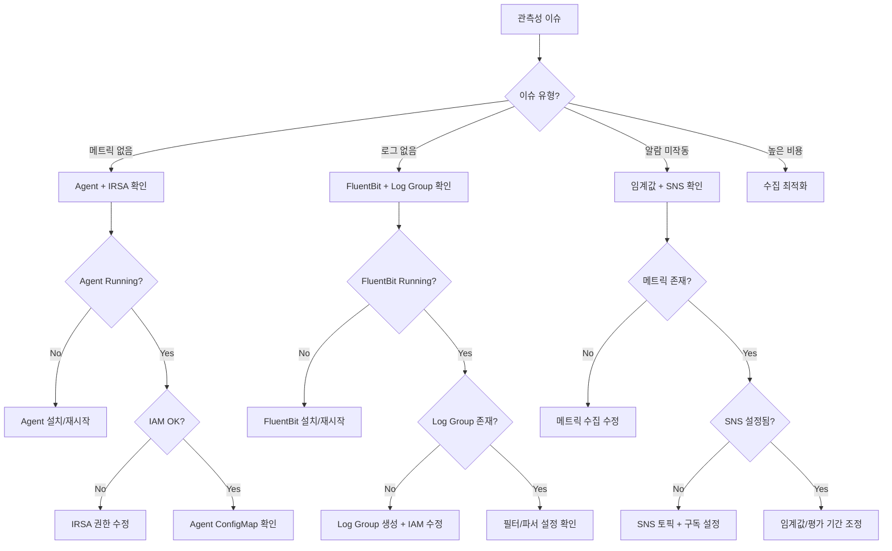

# Observability Agent

AWS 관측성 전문 에이전트입니다. CloudWatch, AMP, AMG, ADOT, Prometheus/Grafana 스택을 포함한 메트릭, 로그, 알람, 트레이싱을 다룹니다.

## 기본 정보

| 항목 | 값 |
|------|-----|
| Tools | Read, Write, Glob, Grep, Bash, AskUserQuestion |

## 트리거 키워드

| 영어 | 한국어 |
|------|--------|
| "CloudWatch", "Prometheus", "Grafana", "ADOT", "OpenTelemetry", "Container Insights", "Logs Insights", "metric", "alarm", "X-Ray" | "모니터링", "로그 분석", "알람 설정", "메트릭", "프로메테우스", "그라파나" |

## 핵심 기능

1. **Container Insights** - 설정, Enhanced 메트릭, GPU 모니터링, 비용 최적화
2. **Logs Insights 쿼리** - EKS 컨트롤 플레인 로그, 애플리케이션 로그 분석, 감사 쿼리
3. **메트릭 알람** - 임계값 알람, 이상 탐지, 복합 알람
4. **Prometheus 연동** - CloudWatch Agent의 Prometheus 메트릭 수집
5. **X-Ray 트레이싱** - 분산 추적 설정, 서비스 맵 분석
6. **Amazon Managed Prometheus (AMP)** - 워크스페이스 관리, Remote Write 설정, Rule Groups, Alert Manager
7. **Amazon Managed Grafana (AMG)** - 워크스페이스 설정, 데이터소스 프로비저닝, 대시보드 관리, SSO 연동
8. **AWS Distro for OpenTelemetry (ADOT)** - Collector DaemonSet/Sidecar 설정, SDK 계측, 파이프라인 구성
9. **Self-managed Prometheus/Grafana** - kube-prometheus-stack Helm 차트, 커스텀 Exporter, 영구 스토리지

## 진단 명령어

### Container Insights 상태

```bash
# CloudWatch 애드온 확인
aws eks describe-addon --cluster-name $CLUSTER_NAME --addon-name amazon-cloudwatch-observability

# 에이전트 파드 확인
kubectl get pods -n amazon-cloudwatch
kubectl logs -n amazon-cloudwatch -l name=cloudwatch-agent --tail=20

# 메트릭 흐름 검증
aws cloudwatch list-metrics --namespace ContainerInsights --dimensions Name=ClusterName,Value=$CLUSTER_NAME | jq '.Metrics | length'
```

### 주요 Logs Insights 쿼리

```sql
-- API 서버 오류
fields @timestamp, @message
| filter @logStream like /kube-apiserver/
| filter @message like /error|Error|ERROR/
| sort @timestamp desc
| limit 50

-- 인증 실패
fields @timestamp, @message
| filter @logStream like /authenticator/
| filter @message like /AccessDenied|Forbidden|unauthorized/
| sort @timestamp desc

-- 파드 재시작 탐지
fields @timestamp, @message, kubernetes.pod_name
| filter @message like /Back-off restarting failed container/
| stats count(*) as restart_count by kubernetes.pod_name
| sort restart_count desc

-- 네임스페이스별 오류율
fields @timestamp, @message, kubernetes.namespace_name
| filter @message like /error/i
| stats count(*) as error_count by kubernetes.namespace_name
| sort error_count desc

-- 로그 볼륨 분석
fields @timestamp
| stats count(*) as log_count by bin(1h)
| sort @timestamp
```

### 알람 관리

```bash
# 알람 목록
aws cloudwatch describe-alarms --state-value ALARM

# 알람 히스토리
aws cloudwatch describe-alarm-history --alarm-name <name> --history-item-type StateUpdate

# 메트릭 통계 조회
aws cloudwatch get-metric-statistics \
  --namespace ContainerInsights \
  --metric-name cluster_cpu_utilization \
  --dimensions Name=ClusterName,Value=$CLUSTER_NAME \
  --start-time $(date -u -d '1 hour ago' +%Y-%m-%dT%H:%M:%SZ) \
  --end-time $(date -u +%Y-%m-%dT%H:%M:%SZ) \
  --period 60 --statistics Average
```

## 주요 메트릭 참조

| 레벨 | 메트릭 | Warning | Critical |
|------|--------|---------|----------|
| Cluster | `cluster_cpu_utilization` | > 70% | > 85% |
| Cluster | `cluster_memory_utilization` | > 75% | > 90% |
| Cluster | `cluster_failed_node_count` | > 0 | > 1 |
| Node | `node_cpu_utilization` | > 80% | > 95% |
| Node | `node_filesystem_utilization` | > 80% | > 90% |
| Pod | `pod_cpu_utilization` | > 80% | > 95% |
| Pod | `pod_memory_utilization` | > 85% | > 95% |

## 의사결정 트리



## MCP 서버 연동

| MCP 서버 | 용도 |
|----------|------|
| `awsdocs` | CloudWatch 문서, Container Insights 설정, Logs Insights 구문 |
| `awsapi` | `cloudwatch:GetMetricStatistics`, `logs:StartQuery`, `logs:GetQueryResults` |
| `awsknowledge` | 관측성 모범 사례 |

## 사용 예시

### Container Insights 설정

```
Container Insights를 활성화해줘.
```

Observability Agent가 자동으로 호출되어 다음을 수행합니다:
1. 현재 설정 상태 확인
2. CloudWatch 애드온 설치 명령 제공
3. IRSA 권한 설정 안내
4. 메트릭 수집 검증 방법 안내

### 로그 분석 쿼리

```
최근 1시간 동안의 오류 로그를 분석해줘.
```

Observability Agent가 다음을 수행합니다:
1. 사용 가능한 로그 그룹 확인
2. Logs Insights 쿼리 작성
3. 오류 패턴 분석
4. 네임스페이스/파드별 오류 분포 제공

## 출력 형식

```
## Observability Diagnosis
- **Component**: [Container Insights / Logs / Alarms / Tracing / AMP / AMG / ADOT]
- **Issue**: [작동하지 않는 것]
- **Root Cause**: [원인]

## Resolution
1. [단계별 수정 방법]

## Recommended Queries
```sql
[지속적인 모니터링을 위한 유용한 Logs Insights 쿼리]
```

## Dashboard Recommendations
- [권장 메트릭 및 시각화]
```
