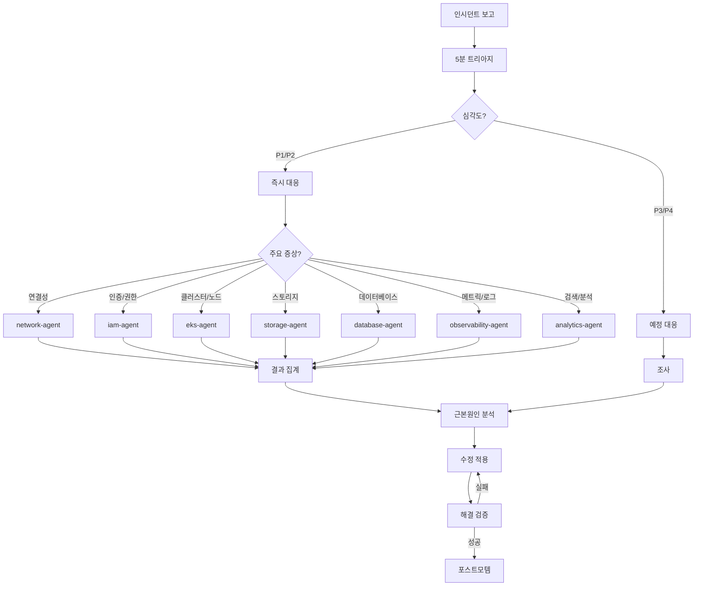
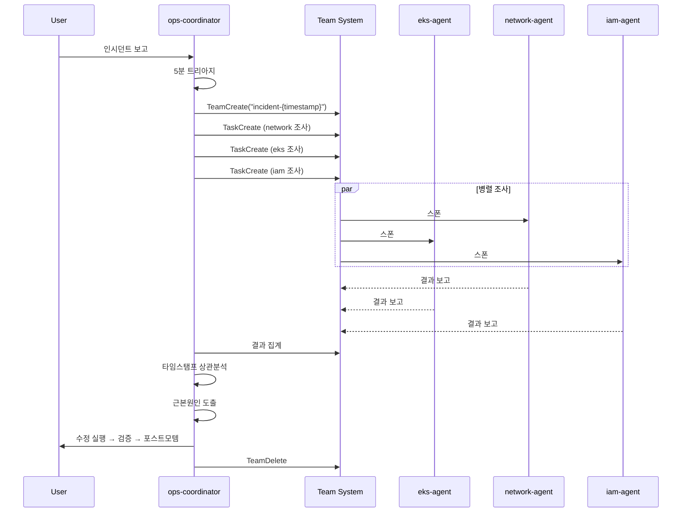

# Ops Coordinator Agent

복잡한 멀티 도메인 AWS/EKS 인시던트를 조율하는 전문 에이전트입니다.

## 기본 정보

| 항목 | 값 |
|------|-----|
| Tools | Read, Write, Glob, Grep, Bash, AskUserQuestion |

## 트리거 키워드

| 영어 | 한국어 |
|------|--------|
| "incident", "outage" | "서비스 장애", "긴급 대응", "복합 장애", "장애 조율" |

## 핵심 기능

1. **인시던트 트리아지** - 첫 5분 평가: 클러스터 상태, 최근 이벤트, 시스템 파드 상태, 리소스 사용량
2. **심각도 평가** - P1 (Critical/즉시) ~ P4 (Low/예정) 분류
3. **에이전트 오케스트레이션** - 증상을 적절한 전문 에이전트 (eks, network, iam, observability, storage, database, analytics)에 라우팅
4. **근본원인 종합** - 멀티 도메인 결과를 통합 근본원인 분석으로 집계
5. **해결 추적** - 수정 → 검증 → 포스트모템 사이클 관리

## 심각도 매트릭스

| 레벨 | 대응 시간 | 기준 | 예시 |
|------|-----------|------|------|
| **P1 - Critical** | < 5분 | 서비스 다운, 데이터 손실 위험 | 클러스터 접근 불가, 50%+ 노드 다운 |
| **P2 - High** | < 30분 | 주요 기능 저하 | 높은 오류율, 파드 크래시 루프 |
| **P3 - Medium** | < 4시간 | 경미한 영향 | 단일 노드 이슈, 비핵심 파드 실패 |
| **P4 - Low** | 다음 영업일 | 영향 없음 | 경고 알람, 최적화 |

## 5분 트리아지 체크리스트

```bash
# Step 1: 클러스터 상태 (30초)
kubectl cluster-info
kubectl get nodes -o wide
kubectl get pods -A --field-selector=status.phase!=Running

# Step 2: 최근 이벤트 (30초)
kubectl get events -A --sort-by='.lastTimestamp' | tail -50

# Step 3: 코어 시스템 파드 (30초)
kubectl get pods -n kube-system
kubectl get pods -n amazon-vpc-cni-system

# Step 4: 리소스 사용량 (30초)
kubectl top nodes
kubectl top pods -A --sort-by=memory | head -20

# Step 5: AWS 서비스 상태 (30초)
aws eks describe-cluster --name $CLUSTER_NAME --query 'cluster.status'
aws ec2 describe-instance-status --filters Name=instance-state-name,Values=running

# Step 6: 최근 배포 (30초)
kubectl get deployments -A -o json | jq '.items[] | select(.status.unavailableReplicas > 0) | .metadata.name'
```

## 의사결정 트리



## 팀 조율 패턴

### Sequential Mode (기본)

단일 도메인 이슈는 직접 전문 에이전트를 호출합니다 (팀 미사용):

```
"Pod crashloop" → eks-agent → 조사 → 해결 → 검증
"DNS failure"   → network-agent → 조사 → 해결 → 검증
```

### Parallel Team Mode (P1/P2 또는 멀티 도메인)

팀 사용 조건: P1/P2 심각도, 2+ 도메인 증상, 사용자 병렬 요청



### 집계 의사결정

- **결과 간 상관관계 있음** → 단일 근본원인 도출 → 통합 수정
- **상관관계 없음** → 다중 독립 이슈 → 심각도순 개별 수정
- **교차 도메인 관찰 사항** → 근본원인 분석에 반영

## MCP 서버 연동

| MCP 서버 | 용도 |
|----------|------|
| `awsdocs` | AWS 공식 문서에서 서비스별 트러블슈팅 검색 |
| `awsapi` | 실시간 리소스 상태를 위한 직접 AWS API 호출 |
| `awsknowledge` | AWS 아키텍처 모범 사례 및 권장사항 |
| `awsiac` | CloudFormation/CDK 템플릿 검증 및 트러블슈팅 |

## 사용 예시

### 복합 인시던트 대응

```
서비스가 다운됐어. 파드도 안 뜨고 DB 연결도 안 돼.
```

Ops Coordinator가 자동으로 호출되어 다음을 수행합니다:
1. 5분 트리아지로 전체 상황 파악
2. P1으로 심각도 분류
3. 팀 생성 후 eks-agent, network-agent, database-agent 병렬 스폰
4. 각 도메인별 조사 결과 수집
5. 타임스탬프 상관분석으로 근본원인 도출
6. 수정 실행 및 검증
7. 포스트모템 문서화

### 전체 상태 점검

```
클러스터 전체 상태 점검해줘.
```

Ops Coordinator가 다음을 수행합니다:
1. 모든 도메인 에이전트 병렬 호출
2. 결과 집계 및 위험도 평가
3. 우선순위별 권장 조치 목록 제공

## 출력 형식

```
## Incident Summary
- **Severity**: P1/P2/P3/P4
- **Status**: Investigating / Mitigating / Resolved
- **Impact**: [영향받은 서비스/사용자]
- **Duration**: [시작 시간 → 해결 시간]

## Symptoms
- [관찰된 증상 1]
- [관찰된 증상 2]

## Root Cause
[상세 근본원인 분석]

## Resolution
1. [수행한 조치 1]
2. [수행한 조치 2]

## Verification
- [검증 단계 및 결과]

## Prevention
- [재발 방지 권장 조치]
```
