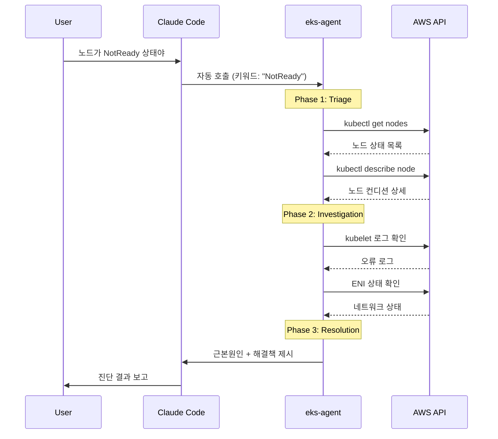

# EKS 트러블슈팅 워크플로우

노드 NotReady 상태를 트러블슈팅하는 단계별 예시입니다.

## 시나리오

EKS 클러스터의 노드가 NotReady 상태가 되어 파드가 스케줄링되지 않는 상황입니다.

## 워크플로우



## Step 1: 문제 보고

사용자가 문제를 보고합니다:

```
노드가 NotReady 상태야. 확인해줘.
```

**eks-agent**가 "NotReady" 키워드를 감지하여 자동으로 호출됩니다.

## Step 2: 5분 트리아지

eks-agent가 빠른 상황 파악을 수행합니다:

```bash
# 노드 상태 확인
kubectl get nodes -o wide
```

출력 예시:
```
NAME                          STATUS     ROLES    AGE   VERSION
ip-10-0-1-100.ec2.internal   Ready      <none>   30d   v1.28.5
ip-10-0-2-200.ec2.internal   NotReady   <none>   30d   v1.28.5
ip-10-0-3-300.ec2.internal   Ready      <none>   30d   v1.28.5
```

```bash
# NotReady 노드 상세 확인
kubectl describe node ip-10-0-2-200.ec2.internal | grep -A 20 "Conditions:"
```

출력 예시:
```
Conditions:
  Type             Status  Reason
  ----             ------  ------
  MemoryPressure   False   KubeletHasSufficientMemory
  DiskPressure     False   KubeletHasNoDiskPressure
  PIDPressure      False   KubeletHasSufficientPID
  Ready            False   KubeletNotReady
```

## Step 3: 근본원인 조사

kubelet 상태를 확인합니다:

```bash
# SSM을 통해 노드에 접근하여 kubelet 로그 확인
aws ssm start-session --target i-0123456789abcdef0

# 노드 내부에서
journalctl -u kubelet -n 100 --no-pager | grep -i "error\|failed"
```

출력 예시:
```
Mar 04 10:15:23 ip-10-0-2-200 kubelet[1234]: E0304 10:15:23.456789 node_status.go:123] Error updating node status, will retry: failed to patch status for node "ip-10-0-2-200.ec2.internal": the server could not find the requested resource
Mar 04 10:15:25 ip-10-0-2-200 kubelet[1234]: E0304 10:15:25.789012 kubelet_node_status.go:456] Unable to register node with API server
```

## Step 4: 진단 결과

eks-agent가 분석 결과를 보고합니다:

```
## Diagnosis
- **Component**: Node
- **Symptom**: 노드 ip-10-0-2-200.ec2.internal이 NotReady 상태
- **Root Cause**: kubelet이 API 서버와 통신 실패.
  - 네트워크 연결 문제 또는 kubelet 인증서 만료 가능성

## Investigation Details
1. 노드 컨디션: Ready=False, KubeletNotReady
2. kubelet 로그: API 서버 등록 실패
3. 최근 변경: 클러스터 업그레이드 후 발생
```

## Step 5: 해결책 제시

```
## Resolution
1. kubelet 재시작
   ```bash
   # SSM을 통해 노드 접속 후
   sudo systemctl restart kubelet
   ```

2. 재시작 후에도 문제가 지속되면 노드 교체
   ```bash
   # 노드 드레인
   kubectl drain ip-10-0-2-200.ec2.internal --ignore-daemonsets --delete-emptydir-data

   # 노드 그룹에서 인스턴스 종료 (Auto Scaling이 새 노드 생성)
   aws ec2 terminate-instances --instance-ids i-0123456789abcdef0
   ```

## Verification
```bash
# 노드 상태 확인
kubectl get nodes -o wide

# 노드 컨디션 확인
kubectl describe node ip-10-0-2-200.ec2.internal | grep "Ready"
```

## Prevention
- kubelet 모니터링 알람 설정
- 정기적인 노드 교체 (Node Refresh)
- 클러스터 업그레이드 시 노드 그룹 순차 업그레이드
```

## Step 6: 검증

해결책 적용 후 검증합니다:

```bash
kubectl get nodes -o wide
```

출력:
```
NAME                          STATUS   ROLES    AGE   VERSION
ip-10-0-1-100.ec2.internal   Ready    <none>   30d   v1.28.5
ip-10-0-2-200.ec2.internal   Ready    <none>   30d   v1.28.5
ip-10-0-3-300.ec2.internal   Ready    <none>   30d   v1.28.5
```

## 핵심 포인트

:::tip 빠른 트리아지
노드 NotReady 문제는 다음 순서로 빠르게 확인합니다:
1. `kubectl get nodes` - 어떤 노드가 문제인지 확인
2. `kubectl describe node` - 노드 컨디션 확인
3. kubelet 로그 - 실제 오류 원인 파악
:::

:::warning 노드 드레인 주의
노드를 드레인할 때는 `--ignore-daemonsets`와 `--delete-emptydir-data` 플래그를 사용하여 DaemonSet 파드와 emptyDir 볼륨을 가진 파드도 처리할 수 있도록 합니다.
:::
