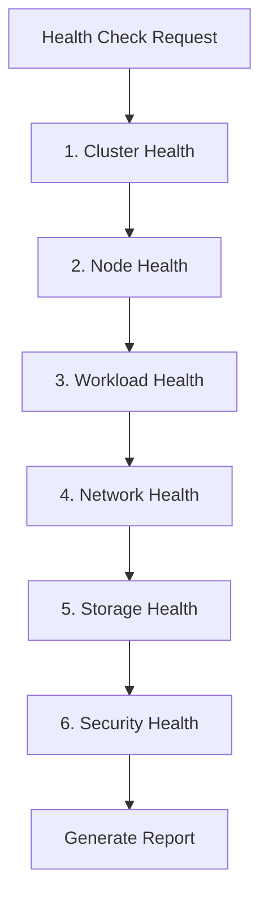

# Health Check Walkthrough

A complete cluster health check demonstration with 6 domain check results and report template.

## Scenario

Perform a comprehensive health check on a production EKS cluster to identify potential issues before they cause incidents.

## Health Check Workflow



## Step 1: Initiate Health Check

User request:

```
Please perform a full cluster health check.
```

**ops-health-check** skill activates and begins systematic domain checks.

## Step 2: Cluster Health Check

```bash
# API server responsiveness
time kubectl get --raw /healthz
```

Output:
```
ok
real    0m0.089s
```

```bash
# Cluster version and status
aws eks describe-cluster --name prod-cluster --query 'cluster.{status:status,version:version,platformVersion:platformVersion}'
```

Output:
```json
{
    "status": "ACTIVE",
    "version": "1.29",
    "platformVersion": "eks.8"
}
```

```bash
# Add-on status
aws eks list-addons --cluster-name prod-cluster --output table
```

Output:
```
----------------------------------
|          ListAddons            |
+--------------------------------+
|  amazon-cloudwatch-observability|
|  coredns                        |
|  kube-proxy                     |
|  vpc-cni                        |
+--------------------------------+
```

**Result**: Cluster OK - API server responsive (89ms), version current, all add-ons active.

## Step 3: Node Health Check

```bash
# Node status
kubectl get nodes -o wide
```

Output:
```
NAME                            STATUS   ROLES    AGE   VERSION   INTERNAL-IP    OS-IMAGE         KERNEL-VERSION
ip-10-0-1-100.ec2.internal     Ready    <none>   45d   v1.29.0   10.0.1.100     Amazon Linux 2   5.10.199-190.747.amzn2.x86_64
ip-10-0-2-150.ec2.internal     Ready    <none>   45d   v1.29.0   10.0.2.150     Amazon Linux 2   5.10.199-190.747.amzn2.x86_64
ip-10-0-3-200.ec2.internal     Ready    <none>   45d   v1.29.0   10.0.3.200     Amazon Linux 2   5.10.199-190.747.amzn2.x86_64
```

```bash
# Resource utilization
kubectl top nodes
```

Output:
```
NAME                            CPU(cores)   CPU%   MEMORY(bytes)   MEMORY%
ip-10-0-1-100.ec2.internal     450m         22%    2100Mi          54%
ip-10-0-2-150.ec2.internal     380m         19%    1850Mi          47%
ip-10-0-3-200.ec2.internal     520m         26%    2400Mi          62%
```

```bash
# Node conditions
kubectl get nodes -o json | jq '.items[] | {name:.metadata.name, conditions:[.status.conditions[] | select(.status!="False") | .type]}'
```

Output:
```json
{"name":"ip-10-0-1-100.ec2.internal","conditions":["Ready"]}
{"name":"ip-10-0-2-150.ec2.internal","conditions":["Ready"]}
{"name":"ip-10-0-3-200.ec2.internal","conditions":["Ready"]}
```

**Result**: Nodes OK - 3/3 Ready, CPU < 30%, Memory < 65%.

## Step 4: Workload Health Check

```bash
# Unhealthy pods
kubectl get pods -A --field-selector=status.phase!=Running,status.phase!=Succeeded | head -20
```

Output:
```
NAMESPACE     NAME                      READY   STATUS             RESTARTS   AGE
backend       api-worker-7b9f4-x2k9l    0/1     CrashLoopBackOff   15         2h
monitoring    prometheus-node-exp-abc   0/1     Pending            0          30m
```

```bash
# Deployment health
kubectl get deployments -A -o json | jq '.items[] | select(.status.unavailableReplicas > 0) | {name:.metadata.name, ns:.metadata.namespace, unavailable:.status.unavailableReplicas}'
```

Output:
```json
{"name":"api-worker","ns":"backend","unavailable":1}
```

```bash
# DaemonSet health
kubectl get daemonsets -A -o json | jq '.items[] | select(.status.desiredNumberScheduled != .status.numberReady) | {name:.metadata.name, ns:.metadata.namespace, desired:.status.desiredNumberScheduled, ready:.status.numberReady}'
```

Output:
```json
{"name":"prometheus-node-exporter","ns":"monitoring","desired":3,"ready":2}
```

**Result**: Workloads WARNING - 2 unhealthy pods detected.

### Issue Details

**CrashLoopBackOff Pod Analysis**:
```bash
kubectl logs api-worker-7b9f4-x2k9l -n backend --previous | tail -20
```

Output:
```
Error: FATAL: password authentication failed for user "api_user"
Connection to database failed, exiting...
```

**Root Cause**: Database credential mismatch in Secret.

**Pending Pod Analysis**:
```bash
kubectl describe pod prometheus-node-exp-abc -n monitoring | grep -A 5 "Events:"
```

Output:
```
Events:
  Warning  FailedScheduling  30m  default-scheduler  0/3 nodes are available: 3 node(s) didn't match Pod's node affinity/selector.
```

**Root Cause**: Node selector mismatch for monitoring namespace.

## Step 5: Network Health Check

```bash
# CoreDNS status
kubectl get pods -n kube-system -l k8s-app=kube-dns -o wide
```

Output:
```
NAME                      READY   STATUS    RESTARTS   AGE   IP           NODE
coredns-5d78c9869d-abc    1/1     Running   0          15d   10.0.1.45    ip-10-0-1-100.ec2.internal
coredns-5d78c9869d-def    1/1     Running   0          15d   10.0.2.78    ip-10-0-2-150.ec2.internal
```

```bash
# VPC CNI status
kubectl get pods -n kube-system -l k8s-app=aws-node -o wide
```

Output:
```
NAME             READY   STATUS    RESTARTS   AGE   IP           NODE
aws-node-abc     2/2     Running   0          45d   10.0.1.100   ip-10-0-1-100.ec2.internal
aws-node-def     2/2     Running   0          45d   10.0.2.150   ip-10-0-2-150.ec2.internal
aws-node-ghi     2/2     Running   0          45d   10.0.3.200   ip-10-0-3-200.ec2.internal
```

```bash
# Subnet IP availability
aws ec2 describe-subnets --subnet-ids subnet-abc subnet-def subnet-ghi \
  --query 'Subnets[].{ID:SubnetId,AZ:AvailabilityZone,Available:AvailableIpAddressCount}'
```

Output:
```json
[
    {"ID": "subnet-abc", "AZ": "us-west-2a", "Available": 245},
    {"ID": "subnet-def", "AZ": "us-west-2b", "Available": 198},
    {"ID": "subnet-ghi", "AZ": "us-west-2c", "Available": 312}
]
```

**Result**: Network OK - CoreDNS running, VPC CNI healthy, sufficient IPs.

## Step 6: Storage Health Check

```bash
# PVC status
kubectl get pvc -A --field-selector status.phase!=Bound
```

Output:
```
NAMESPACE   NAME              STATUS    VOLUME   CAPACITY   ACCESS MODES   STORAGECLASS
analytics   data-volume-pvc   Pending                                      gp3
```

```bash
# CSI driver status
kubectl get pods -n kube-system -l app=ebs-csi-controller -o wide
```

Output:
```
NAME                                  READY   STATUS    RESTARTS   AGE
ebs-csi-controller-5f4b7c8d9-abc     6/6     Running   0          30d
ebs-csi-controller-5f4b7c8d9-def     6/6     Running   0          30d
```

```bash
# Check pending PVC events
kubectl describe pvc data-volume-pvc -n analytics | grep -A 5 "Events:"
```

Output:
```
Events:
  Warning  ProvisioningFailed  5m  ebs.csi.aws.com  failed to provision volume: could not create volume in EC2: UnauthorizedOperation
```

**Result**: Storage WARNING - 1 PVC pending due to IAM permissions.

## Step 7: Security Health Check

```bash
# Privileged containers
kubectl get pods -A -o json | jq '[.items[] | select(.spec.containers[].securityContext.privileged==true) | {name:.metadata.name, ns:.metadata.namespace}]'
```

Output:
```json
[
  {"name":"aws-node-abc","ns":"kube-system"},
  {"name":"aws-node-def","ns":"kube-system"},
  {"name":"aws-node-ghi","ns":"kube-system"}
]
```

```bash
# Network policies
kubectl get networkpolicies -A
```

Output:
```
NAMESPACE   NAME              POD-SELECTOR   AGE
backend     backend-policy    app=api        60d
frontend    frontend-policy   app=web        60d
```

```bash
# Namespaces without network policies
for ns in $(kubectl get ns -o jsonpath='{.items[*].metadata.name}'); do
  policies=$(kubectl get networkpolicies -n $ns 2>/dev/null | tail -n +2 | wc -l)
  if [ "$policies" -eq "0" ]; then
    echo "WARNING: $ns has no network policies"
  fi
done
```

Output:
```
WARNING: analytics has no network policies
WARNING: monitoring has no network policies
WARNING: default has no network policies
```

**Result**: Security WARNING - 3 namespaces lack network policies.

---

## Final Health Report

```markdown
# Infrastructure Health Report

## Summary
- **Overall**: WARNING
- **Checked**: 2026-03-22 14:30:00 UTC
- **Cluster**: prod-cluster (v1.29)

## Results

| Domain | Status | Details |
|--------|--------|---------|
| Cluster | OK | API server responsive (89ms), EKS v1.29, all add-ons active |
| Nodes (3/3 ready) | OK | CPU max 26%, Memory max 62%, all conditions healthy |
| Workloads | WARNING | 2 unhealthy pods: 1 CrashLoopBackOff, 1 Pending |
| Network | OK | CoreDNS 2/2, VPC CNI 3/3, IPs available (755 total) |
| Storage | WARNING | 1 PVC pending (IAM permission issue) |
| Security | WARNING | 3 namespaces without network policies |

## Issues Found

### Issue 1: CrashLoopBackOff Pod (P2 - High)
- **Pod**: backend/api-worker-7b9f4-x2k9l
- **Cause**: Database authentication failure - credential mismatch
- **Fix**: Update Secret `backend/db-credentials` with correct password

### Issue 2: Pending Pod (P3 - Medium)
- **Pod**: monitoring/prometheus-node-exp-abc
- **Cause**: Node affinity mismatch
- **Fix**: Update DaemonSet node selector or add labels to nodes

### Issue 3: PVC Provisioning Failed (P3 - Medium)
- **PVC**: analytics/data-volume-pvc
- **Cause**: EBS CSI driver IAM permission issue
- **Fix**: Add `ec2:CreateVolume` permission to EBS CSI IRSA role

### Issue 4: Missing Network Policies (P4 - Low)
- **Namespaces**: analytics, monitoring, default
- **Risk**: No network segmentation in these namespaces
- **Fix**: Deploy default-deny NetworkPolicy to affected namespaces

## Recommendations

1. **Immediate** (P2): Fix database credentials for api-worker deployment
2. **Today** (P3): Update node affinity for prometheus-node-exporter
3. **Today** (P3): Fix IAM permissions for EBS CSI driver
4. **This Week** (P4): Deploy network policies to all namespaces
5. **Maintenance**: Consider enabling Pod Security Standards (Restricted)
```

---

## Key Points

:::tip Systematic Approach
Health checks should follow a consistent order: Cluster → Nodes → Workloads → Network → Storage → Security. This ensures no domain is missed and issues are correlated properly.
:::

:::warning Priority Assessment
Not all warnings are equal. CrashLoopBackOff affects service availability (P2), while missing network policies is a security best practice (P4). Prioritize fixes by impact.
:::

:::info Automation
Consider running health checks on a schedule (daily/weekly) and alerting on status changes. This enables proactive issue detection before user impact.
:::
