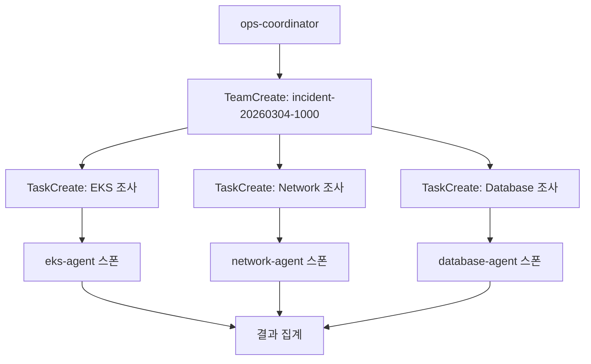

# 인시던트 대응 예시

멀티 도메인 인시던트에 대한 ops-coordinator를 활용한 대응 예시입니다.

## 시나리오

프로덕션 서비스가 갑자기 다운되었습니다. 증상으로는:
- API 응답 없음
- 일부 파드 CrashLoopBackOff
- 데이터베이스 연결 오류

여러 도메인에 걸친 복합 장애 상황입니다.

## 인시던트 타임라인

```mermaid
gantt
    title 인시던트 대응 타임라인
    dateFormat HH:mm
    axisFormat %H:%M

    section Triage
    5분 트리아지           :t1, 10:00, 5m

    section Investigation
    병렬 조사 (EKS)        :i1, 10:05, 10m
    병렬 조사 (Network)    :i2, 10:05, 10m
    병렬 조사 (Database)   :i3, 10:05, 10m

    section Resolution
    결과 집계              :r1, 10:15, 5m
    수정 적용              :r2, 10:20, 10m
    검증                   :r3, 10:30, 5m

    section Postmortem
    문서화                 :p1, 10:35, 15m
```



## Step 1: 인시던트 보고

```
서비스가 다운됐어. 파드도 크래시하고 DB 연결도 안 돼. 긴급 대응 필요해.
```

**ops-coordinator-agent**가 "서비스 장애", "긴급 대응" 키워드를 감지하여 자동으로 호출됩니다.

## Step 2: 5분 트리아지

ops-coordinator가 빠른 상황 파악을 수행합니다:

```bash
# Step 1: 클러스터 상태 (30초)
kubectl cluster-info
kubectl get nodes -o wide
kubectl get pods -A --field-selector=status.phase!=Running

# Step 2: 최근 이벤트 (30초)
kubectl get events -A --sort-by='.lastTimestamp' | tail -50

# Step 3: 코어 시스템 파드 (30초)
kubectl get pods -n kube-system

# Step 4: 리소스 사용량 (30초)
kubectl top nodes
kubectl top pods -A --sort-by=memory | head -20
```

### 트리아지 결과

```
## Triage Summary (5분)

### 클러스터 상태
- API 서버: 정상
- 노드: 3/3 Ready
- 비정상 파드: 12개 (api-server, worker 네임스페이스)

### 주요 이벤트
- 10:00:15 - api-server-xxx CrashLoopBackOff
- 10:00:18 - worker-xxx connection refused to database
- 10:00:20 - Multiple pods failing liveness probe

### 증상 분류
1. **Workload**: 다수 파드 CrashLoopBackOff
2. **Database**: RDS 연결 실패
3. **Network**: 가능한 연결 문제

### 심각도 평가
**P1 - Critical**: 프로덕션 서비스 다운, 즉시 대응 필요
```

## Step 3: 팀 생성 및 병렬 조사

P1 심각도와 멀티 도메인 증상으로 인해 팀 모드가 활성화됩니다:



### eks-agent 조사 결과

```
## [EKS] 조사 완료

| Check | Status | Details |
|-------|--------|---------|
| Cluster API | OK | API 서버 응답 정상 |
| Node Health | OK | 3/3 노드 Ready |
| System Pods | OK | kube-system 정상 |
| Workloads | CRIT | 12개 파드 CrashLoopBackOff |

### 발견사항
- api-server 파드들이 DB 연결 실패로 크래시
- 로그: "Error: connect ECONNREFUSED 10.0.1.50:5432"
- 원인: 애플리케이션 레벨 문제 (DB 연결)

### 권장 조치
- Database 도메인 조사 결과 확인 필요
- 네트워크 연결성 검증 필요
```

### network-agent 조사 결과

```
## [Network] 조사 완료

| Check | Status | Details |
|-------|--------|---------|
| VPC CNI | OK | IP 할당 정상 |
| Load Balancer | WARN | 타겟 unhealthy |
| DNS Resolution | OK | CoreDNS 정상 |
| Security Groups | CRIT | 최근 변경 감지 |

### 발견사항
- 09:55에 Security Group 규칙 변경됨
- RDS Security Group에서 파드 CIDR inbound 규칙이 삭제됨
- 변경자: terraform-automation

### 근본원인 후보
- SG 변경으로 인한 DB 연결 차단

### 권장 조치
- RDS SG에 파드 CIDR (10.0.0.0/16) inbound 규칙 복원
```

### database-agent 조사 결과

```
## [Database] 조사 완료

| Check | Status | Details |
|-------|--------|---------|
| RDS Status | OK | 인스턴스 available |
| Connection | CRIT | 파드에서 연결 불가 |
| Performance | OK | CPU/메모리 정상 |

### 발견사항
- RDS 인스턴스 자체는 정상
- 동일 VPC 내 EC2에서는 연결 가능
- 파드에서만 연결 실패

### 교차 도메인 관찰
- Network 도메인 조사 필요 (SG 관련 가능성)
```

## Step 4: 결과 집계 및 근본원인 분석

ops-coordinator가 모든 결과를 집계하고 타임스탬프 상관분석을 수행합니다:

```
## Root Cause Analysis

### 타임라인 상관분석
- 09:55:00 - Security Group 규칙 변경 (terraform-automation)
- 10:00:10 - 첫 번째 DB 연결 실패 로그
- 10:00:15 - api-server 파드 CrashLoopBackOff 시작
- 10:00:18 - 서비스 다운 (사용자 보고)

### 근본원인
**Security Group 규칙 변경**으로 인한 파드→RDS 연결 차단

terraform-automation이 09:55에 RDS Security Group을 수정하면서
파드 CIDR (10.0.0.0/16)에서의 inbound 규칙이 삭제됨.
이로 인해 모든 파드에서 RDS 연결이 차단되어 애플리케이션 크래시 발생.

### 영향 범위
- api-server 네임스페이스: 6개 파드
- worker 네임스페이스: 6개 파드
- 총 영향 사용자: 모든 프로덕션 트래픽
```

## Step 5: 수정 및 검증

```
## Resolution

### 즉시 조치
1. RDS Security Group에 파드 CIDR inbound 규칙 복원

```bash
aws ec2 authorize-security-group-ingress \
  --group-id sg-0123456789abcdef0 \
  --protocol tcp \
  --port 5432 \
  --cidr 10.0.0.0/16 \
  --description "EKS pods to RDS"
```

### 검증
```bash
# 파드에서 연결 테스트
kubectl run -it --rm db-test --image=postgres:15 --restart=Never -- \
  psql -h mydb.xxx.rds.amazonaws.com -U admin -c "SELECT 1"

# 파드 상태 확인
kubectl get pods -n api-server
kubectl get pods -n worker
```

### 결과
- 10:25 - SG 규칙 복원 완료
- 10:27 - DB 연결 복구 확인
- 10:30 - 모든 파드 Running 상태 복구
- 10:32 - 서비스 정상화 확인
```

## Step 6: 포스트모템

```
## Incident Postmortem

### Summary
- **Incident ID**: INC-2026-0304-001
- **Severity**: P1 - Critical
- **Duration**: 32분 (10:00 ~ 10:32)
- **Impact**: 프로덕션 서비스 전체 다운

### Timeline
| 시간 | 이벤트 |
|------|--------|
| 09:55 | Terraform이 RDS SG 규칙 변경 |
| 10:00 | 파드 DB 연결 실패 시작 |
| 10:00 | 사용자 인시던트 보고 |
| 10:05 | 5분 트리아지 완료 |
| 10:05 | 병렬 조사 시작 |
| 10:15 | 근본원인 식별 |
| 10:25 | SG 규칙 복원 |
| 10:32 | 서비스 정상화 |

### Root Cause
Terraform automation이 RDS Security Group 업데이트 시
파드 CIDR inbound 규칙을 실수로 삭제

### Resolution
RDS Security Group에 파드 CIDR inbound 규칙 복원

### Prevention
1. **IaC 변경 리뷰 강화**
   - Security Group 변경 시 필수 리뷰어 지정
   - Terraform plan 결과 자동 알림

2. **모니터링 개선**
   - SG 변경 CloudTrail 알람 설정
   - DB 연결 실패 메트릭 알람 추가

3. **변경 관리 프로세스**
   - 프로덕션 SG 변경 시 변경 승인 프로세스 적용
   - 변경 전 영향 범위 분석 필수화
```

## 핵심 포인트

:::tip 병렬 조사의 가치
복합 장애 시 병렬 조사로 MTTR(평균 복구 시간)을 크게 단축할 수 있습니다. 이 예시에서는 10분 내에 3개 도메인 조사를 완료했습니다.
:::

:::warning 근본원인 vs 증상
증상(파드 크래시)만 보면 EKS 문제로 보일 수 있지만, 타임스탬프 상관분석을 통해 실제 근본원인(SG 변경)을 식별했습니다.
:::

:::info 예방이 핵심
포스트모템의 예방 조치가 가장 중요합니다. 동일한 문제가 반복되지 않도록 프로세스와 모니터링을 개선해야 합니다.
:::
