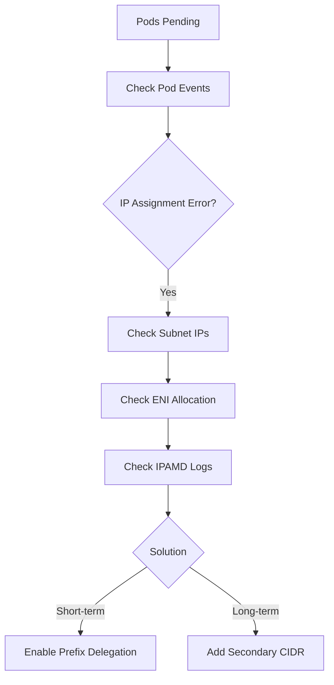
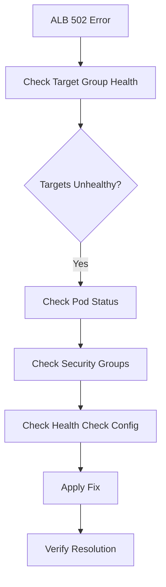

# Network Diagnosis Demo

IP exhaustion and ALB 502 error diagnosis walkthrough with diagnostic command execution and resolution process.

## Scenario Overview

This demo covers two common network issues:
1. **IP Exhaustion** - Pods stuck in Pending due to insufficient VPC IPs
2. **ALB 502 Errors** - Application Load Balancer returning 502 Bad Gateway

---

## Scenario 1: IP Exhaustion

### Problem Report

User reports:

```
New pods are stuck in Pending state. kubectl describe shows "failed to assign IP address" errors.
```

### Diagnosis Workflow



### Step 1: Identify the Problem

```bash
# Check pending pods
kubectl get pods -A --field-selector=status.phase=Pending
```

Output:
```
NAMESPACE   NAME                        READY   STATUS    RESTARTS   AGE
backend     api-server-7f8b9-abc        0/1     Pending   0          15m
backend     api-server-7f8b9-def        0/1     Pending   0          15m
backend     worker-5c6d7-ghi            0/1     Pending   0          10m
frontend    web-app-8e9f0-jkl           0/1     Pending   0          8m
```

```bash
# Check pod events
kubectl describe pod api-server-7f8b9-abc -n backend | grep -A 10 "Events:"
```

Output:
```
Events:
  Type     Reason            Age   From               Message
  ----     ------            ----  ----               -------
  Warning  FailedScheduling  14m   default-scheduler  0/3 nodes are available: 3 Insufficient pods.
  Warning  FailedCreatePodSandBox  13m  kubelet  Failed to create pod sandbox: rpc error: code = Unknown desc = failed to setup network for sandbox: plugin type="aws-cni" name="aws-cni" failed: add cmd: failed to assign an IP address to container
```

**Identified**: IP assignment failure from VPC CNI.

### Step 2: Check Subnet IP Availability

```bash
# Get cluster subnets and available IPs
aws ec2 describe-subnets --filters "Name=tag:kubernetes.io/cluster/prod-cluster,Values=*" \
  --query 'Subnets[].{SubnetId:SubnetId,AZ:AvailabilityZone,CIDR:CidrBlock,Available:AvailableIpAddressCount}'
```

Output:
```json
[
    {
        "SubnetId": "subnet-0a1b2c3d4e5f",
        "AZ": "us-west-2a",
        "CIDR": "10.0.1.0/24",
        "Available": 3
    },
    {
        "SubnetId": "subnet-1b2c3d4e5f6g",
        "AZ": "us-west-2b",
        "CIDR": "10.0.2.0/24",
        "Available": 5
    },
    {
        "SubnetId": "subnet-2c3d4e5f6g7h",
        "AZ": "us-west-2c",
        "CIDR": "10.0.3.0/24",
        "Available": 2
    }
]
```

**Finding**: All subnets critically low on IPs (total 10 available across 3 AZs).

### Step 3: Check ENI Allocation

```bash
# Check per-node IP usage via IPAMD
kubectl exec -n kube-system ds/aws-node -c aws-node -- curl -s http://localhost:61678/v1/enis 2>/dev/null | jq '.ENIs | length'
```

Output:
```
3
```

```bash
# Check node allocatable pods
kubectl get nodes -o json | jq '.items[] | {name:.metadata.name, allocatable_pods:.status.allocatable.pods, capacity_pods:.status.capacity.pods}'
```

Output:
```json
{"name":"ip-10-0-1-100.ec2.internal","allocatable_pods":"17","capacity_pods":"17"}
{"name":"ip-10-0-2-150.ec2.internal","allocatable_pods":"17","capacity_pods":"17"}
{"name":"ip-10-0-3-200.ec2.internal","allocatable_pods":"17","capacity_pods":"17"}
```

**Finding**: t3.medium instances with max 17 pods each. Total capacity: 51 pods.

### Step 4: Check IPAMD Logs

```bash
# Check for IP allocation errors
kubectl logs -n kube-system -l k8s-app=aws-node -c aws-node --tail=50 | grep -i "insufficient\|error\|failed"
```

Output:
```
{"level":"error","ts":"2026-03-22T10:15:23.456Z","msg":"InsufficientFreeAddressesInSubnet: The subnet 'subnet-0a1b2c3d4e5f' has insufficient free addresses to satisfy the request"}
{"level":"error","ts":"2026-03-22T10:15:45.789Z","msg":"Failed to allocate IP address for pod backend/api-server-7f8b9-abc"}
```

### Root Cause Analysis

```
## Root Cause Analysis

### Summary
IP exhaustion in all EKS subnets preventing new pod scheduling.

### Details
- VPC CIDR: 10.0.0.0/16
- Subnet CIDRs: 3 x /24 (254 usable IPs each, 762 total)
- Current allocation: ~752 IPs in use
- Available: 10 IPs total (critical)

### Contributing Factors
1. Subnet sizing too small for workload growth
2. No prefix delegation enabled
3. WARM_IP_TARGET not tuned (over-allocation)
```

### Resolution

#### Immediate Fix: Enable Prefix Delegation

```bash
# Enable prefix delegation for 16x more IPs per slot
kubectl set env daemonset aws-node -n kube-system \
  ENABLE_PREFIX_DELEGATION=true \
  WARM_PREFIX_TARGET=1

# Restart aws-node to apply
kubectl rollout restart daemonset/aws-node -n kube-system

# Verify rollout
kubectl rollout status daemonset/aws-node -n kube-system
```

Output:
```
daemonset "aws-node" successfully rolled out
```

#### Verify Fix

```bash
# Check pods are now scheduling
kubectl get pods -A --field-selector=status.phase=Pending
```

Output:
```
No resources found
```

```bash
# Verify all pods running
kubectl get pods -n backend
```

Output:
```
NAME                        READY   STATUS    RESTARTS   AGE
api-server-7f8b9-abc        1/1     Running   0          20m
api-server-7f8b9-def        1/1     Running   0          20m
worker-5c6d7-ghi            1/1     Running   0          15m
```

#### Long-term Fix: Add Secondary CIDR

```bash
# Add secondary CIDR for dedicated pod subnets
aws ec2 associate-vpc-cidr-block --vpc-id vpc-0123456789abcdef0 --cidr-block 100.64.0.0/16

# Create new subnets in secondary CIDR
aws ec2 create-subnet --vpc-id vpc-0123456789abcdef0 --cidr-block 100.64.0.0/19 --availability-zone us-west-2a
aws ec2 create-subnet --vpc-id vpc-0123456789abcdef0 --cidr-block 100.64.32.0/19 --availability-zone us-west-2b
aws ec2 create-subnet --vpc-id vpc-0123456789abcdef0 --cidr-block 100.64.64.0/19 --availability-zone us-west-2c
```

---

## Scenario 2: ALB 502 Errors

### Problem Report

User reports:

```
Application returns 502 Bad Gateway intermittently. Started after recent deployment.
```

### Diagnosis Workflow



### Step 1: Check Target Group Health

```bash
# Get target group ARN from Ingress
kubectl get ingress api-ingress -n backend -o jsonpath='{.status.loadBalancer.ingress[0].hostname}'
```

Output:
```
k8s-backend-apiingr-abc123-456789.us-west-2.elb.amazonaws.com
```

```bash
# Find target group ARN
TG_ARN=$(aws elbv2 describe-target-groups --query "TargetGroups[?contains(TargetGroupName, 'backend')].TargetGroupArn" --output text)

# Check target health
aws elbv2 describe-target-health --target-group-arn $TG_ARN
```

Output:
```json
{
    "TargetHealthDescriptions": [
        {
            "Target": {"Id": "10.0.1.45", "Port": 8080},
            "HealthCheckPort": "8080",
            "TargetHealth": {"State": "unhealthy", "Reason": "Target.FailedHealthChecks", "Description": "Health checks failed with these codes: [503]"}
        },
        {
            "Target": {"Id": "10.0.2.78", "Port": 8080},
            "HealthCheckPort": "8080",
            "TargetHealth": {"State": "unhealthy", "Reason": "Target.FailedHealthChecks", "Description": "Health checks failed with these codes: [503]"}
        },
        {
            "Target": {"Id": "10.0.3.112", "Port": 8080},
            "HealthCheckPort": "8080",
            "TargetHealth": {"State": "healthy"}
        }
    ]
}
```

**Finding**: 2 of 3 targets unhealthy, health checks returning 503.

### Step 2: Check Pod Status

```bash
# Check backend pods
kubectl get pods -n backend -l app=api-server -o wide
```

Output:
```
NAME                        READY   STATUS    RESTARTS   AGE   IP           NODE
api-server-7f8b9-abc        1/1     Running   0          30m   10.0.1.45    ip-10-0-1-100.ec2.internal
api-server-7f8b9-def        1/1     Running   0          30m   10.0.2.78    ip-10-0-2-150.ec2.internal
api-server-7f8b9-ghi        1/1     Running   0          30m   10.0.3.112   ip-10-0-3-200.ec2.internal
```

```bash
# Test health endpoint from within pod
kubectl exec -it api-server-7f8b9-abc -n backend -- curl -s localhost:8080/health
```

Output:
```json
{"status": "healthy", "version": "2.1.0"}
```

**Finding**: Pods are running and health endpoint works locally.

### Step 3: Check Security Groups

```bash
# Get node security group
NODE_SG=$(aws ec2 describe-instances --filters "Name=private-ip-address,Values=10.0.1.100" --query 'Reservations[].Instances[].SecurityGroups[].GroupId' --output text)

# Check inbound rules
aws ec2 describe-security-group-rules --filter Name=group-id,Values=$NODE_SG --query 'SecurityGroupRules[?!IsEgress].{FromPort:FromPort,ToPort:ToPort,Source:CidrIpv4,SourceSG:ReferencedGroupInfo.GroupId}'
```

Output:
```json
[
    {"FromPort": 443, "ToPort": 443, "Source": null, "SourceSG": "sg-alb12345"},
    {"FromPort": 10250, "ToPort": 10250, "Source": "10.0.0.0/16", "SourceSG": null}
]
```

**Finding**: Port 8080 not allowed from ALB security group!

### Step 4: Check Health Check Configuration

```bash
# Check Ingress annotations
kubectl get ingress api-ingress -n backend -o yaml | grep -A 10 "annotations:"
```

Output:
```yaml
annotations:
  alb.ingress.kubernetes.io/scheme: internet-facing
  alb.ingress.kubernetes.io/target-type: ip
  alb.ingress.kubernetes.io/healthcheck-path: /health
  alb.ingress.kubernetes.io/healthcheck-port: "8080"
```

**Finding**: Health check configured for port 8080, but SG blocks it.

### Root Cause Analysis

```
## Root Cause Analysis

### Summary
ALB health checks failing due to missing Security Group rule for port 8080.

### Timeline
- T-1h: Deployment updated to use target-type: ip (previously instance)
- T-45m: First 502 errors reported
- T-30m: Target health degraded to 1/3 healthy

### Root Cause
Security Group migration incomplete when switching from instance to ip target type.
- Instance mode: ALB routes to NodePort, SG allows NodePort range
- IP mode: ALB routes directly to pod IP:port, SG must allow pod port

### Impact
- 66% of requests hitting unhealthy targets
- Intermittent 502 errors for end users
```

### Resolution

#### Fix Security Group

```bash
# Get ALB security group
ALB_SG=$(aws ec2 describe-security-groups --filters "Name=tag:ingress.k8s.aws/stack,Values=backend/api-ingress" --query 'SecurityGroups[].GroupId' --output text)

# Add rule allowing ALB to reach pod port 8080
aws ec2 authorize-security-group-ingress \
  --group-id $NODE_SG \
  --protocol tcp \
  --port 8080 \
  --source-group $ALB_SG \
  --description "ALB to backend pods"
```

Output:
```json
{
    "Return": true,
    "SecurityGroupRules": [
        {
            "SecurityGroupRuleId": "sgr-0abc123def456",
            "GroupId": "sg-node12345",
            "IpProtocol": "tcp",
            "FromPort": 8080,
            "ToPort": 8080,
            "ReferencedGroupInfo": {"GroupId": "sg-alb12345"}
        }
    ]
}
```

#### Verify Resolution

```bash
# Wait for health checks to pass (30-60 seconds)
sleep 60

# Check target health
aws elbv2 describe-target-health --target-group-arn $TG_ARN --query 'TargetHealthDescriptions[].TargetHealth.State'
```

Output:
```json
["healthy", "healthy", "healthy"]
```

```bash
# Test ALB endpoint
curl -s -o /dev/null -w "%{http_code}" https://k8s-backend-apiingr-abc123-456789.us-west-2.elb.amazonaws.com/api/health
```

Output:
```
200
```

---

## Summary Report

```markdown
## Network Diagnosis Report

### Scenario 1: IP Exhaustion
- **Issue**: Pods stuck in Pending due to IP exhaustion
- **Layer**: L3 (IP)
- **Severity**: P2 - High
- **Root Cause**: Subnet CIDR too small, no prefix delegation
- **Resolution**: Enabled prefix delegation, planned secondary CIDR
- **Prevention**: Monitor subnet IP availability, alert at < 20%

### Scenario 2: ALB 502 Errors
- **Issue**: Intermittent 502 Bad Gateway
- **Layer**: L7 (Application)
- **Severity**: P2 - High
- **Root Cause**: Security Group missing rule for pod port
- **Resolution**: Added SG rule for ALB to pod communication
- **Prevention**: Include SG updates in deployment checklist for target-type changes
```

---

## Key Points

:::tip IP Planning
Plan subnet CIDRs for 3-5x expected pod count. Enable prefix delegation early - it's non-disruptive and provides significant capacity increase.
:::

:::warning Target Type Migration
When switching from `instance` to `ip` target type, Security Groups must be updated to allow ALB direct access to pod ports. This is a common oversight.
:::

:::info Health Check Testing
Always test health check paths from both inside the pod (`localhost`) and from external sources (another pod, ALB) to identify network/SG issues.
:::
