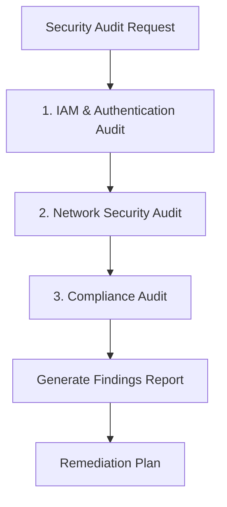

# Security Audit Demo

Security audit walkthrough covering IAM, Network, and Compliance audit results with findings report.

## Scenario

Perform a comprehensive security audit on an EKS cluster to identify vulnerabilities and compliance gaps before a security review.

## Audit Workflow



## Step 1: Initiate Security Audit

User request:

```
Please run a comprehensive security audit on the cluster.
```

**ops-security-audit** skill activates and begins systematic security checks.

---

## Phase 1: IAM & Authentication Audit

### 1.1 IRSA Configuration Check

```bash
# List all IRSA-annotated service accounts
kubectl get sa -A -o json | jq '.items[] | select(.metadata.annotations["eks.amazonaws.com/role-arn"] != null) | {namespace:.metadata.namespace, name:.metadata.name, role:.metadata.annotations["eks.amazonaws.com/role-arn"]}'
```

Output:
```json
{"namespace":"kube-system","name":"aws-load-balancer-controller","role":"arn:aws:iam::123456789012:role/eks-lb-controller-role"}
{"namespace":"kube-system","name":"ebs-csi-controller-sa","role":"arn:aws:iam::123456789012:role/eks-ebs-csi-role"}
{"namespace":"backend","name":"api-service-account","role":"arn:aws:iam::123456789012:role/api-backend-role"}
{"namespace":"analytics","name":"data-processor","role":"arn:aws:iam::123456789012:role/analytics-full-access"}
```

### 1.2 Verify Trust Policies

```bash
# Check trust policy for suspicious role
aws iam get-role --role-name analytics-full-access --query 'Role.AssumeRolePolicyDocument'
```

Output:
```json
{
    "Version": "2012-10-17",
    "Statement": [
        {
            "Effect": "Allow",
            "Principal": {
                "Federated": "arn:aws:iam::123456789012:oidc-provider/oidc.eks.us-west-2.amazonaws.com/id/ABC123"
            },
            "Action": "sts:AssumeRoleWithWebIdentity",
            "Condition": {
                "StringLike": {
                    "oidc.eks.us-west-2.amazonaws.com/id/ABC123:sub": "system:serviceaccount:*:*"
                }
            }
        }
    ]
}
```

**FINDING (CRITICAL)**: Trust policy uses wildcard `*:*` - any service account can assume this role!

### 1.3 Check IAM Permissions

```bash
# Check for overly permissive policies
aws iam list-attached-role-policies --role-name analytics-full-access
```

Output:
```json
{
    "AttachedPolicies": [
        {"PolicyName": "AmazonS3FullAccess", "PolicyArn": "arn:aws:iam::aws:policy/AmazonS3FullAccess"},
        {"PolicyName": "AmazonDynamoDBFullAccess", "PolicyArn": "arn:aws:iam::aws:policy/AmazonDynamoDBFullAccess"}
    ]
}
```

**FINDING (HIGH)**: Role has FullAccess policies attached - violates least privilege.

### 1.4 RBAC Audit

```bash
# Find cluster-admin bindings
kubectl get clusterrolebindings -o json | jq '.items[] | select(.roleRef.name=="cluster-admin") | {name:.metadata.name, subjects:.subjects}'
```

Output:
```json
{
  "name": "cluster-admin-binding",
  "subjects": [
    {"kind": "User", "name": "admin@company.com"},
    {"kind": "User", "name": "developer@company.com"},
    {"kind": "Group", "name": "system:masters"}
  ]
}
{
  "name": "emergency-access",
  "subjects": [
    {"kind": "ServiceAccount", "name": "default", "namespace": "kube-system"}
  ]
}
```

**FINDING (HIGH)**: Developer user has cluster-admin binding. Default service account has cluster-admin.

### 1.5 aws-auth ConfigMap Check

```bash
kubectl get configmap aws-auth -n kube-system -o yaml
```

Output:
```yaml
apiVersion: v1
kind: ConfigMap
metadata:
  name: aws-auth
  namespace: kube-system
data:
  mapRoles: |
    - rolearn: arn:aws:iam::123456789012:role/eks-node-role
      username: system:node:{{EC2PrivateDNSName}}
      groups:
        - system:bootstrappers
        - system:nodes
    - rolearn: arn:aws:iam::123456789012:role/admin-role
      username: admin
      groups:
        - system:masters
    - rolearn: arn:aws:iam::123456789012:role/developer-role
      username: developer
      groups:
        - system:masters
```

**FINDING (HIGH)**: Developer role mapped to system:masters group.

---

## Phase 2: Network Security Audit

### 2.1 Security Group Analysis

```bash
# Get cluster security group
CLUSTER_SG=$(aws eks describe-cluster --name prod-cluster --query 'cluster.resourcesVpcConfig.clusterSecurityGroupId' --output text)

# Check inbound rules
aws ec2 describe-security-group-rules --filter Name=group-id,Values=$CLUSTER_SG --query 'SecurityGroupRules[?!IsEgress].{FromPort:FromPort,ToPort:ToPort,Source:CidrIpv4}'
```

Output:
```json
[
    {"FromPort": 443, "ToPort": 443, "Source": "0.0.0.0/0"},
    {"FromPort": 22, "ToPort": 22, "Source": "0.0.0.0/0"}
]
```

**FINDING (CRITICAL)**: SSH (port 22) open to 0.0.0.0/0!

### 2.2 Network Policy Coverage

```bash
# Check namespaces without network policies
for ns in $(kubectl get ns -o jsonpath='{.items[*].metadata.name}'); do
  policies=$(kubectl get networkpolicies -n $ns 2>/dev/null | tail -n +2 | wc -l)
  pods=$(kubectl get pods -n $ns 2>/dev/null | tail -n +2 | wc -l)
  if [ "$policies" -eq "0" ] && [ "$pods" -gt "0" ]; then
    echo "WARNING: $ns has $pods pods but no network policies"
  fi
done
```

Output:
```
WARNING: backend has 6 pods but no network policies
WARNING: analytics has 4 pods but no network policies
WARNING: monitoring has 8 pods but no network policies
WARNING: default has 2 pods but no network policies
```

**FINDING (MEDIUM)**: 4 namespaces with workloads lack network policies.

### 2.3 Cluster Endpoint Access

```bash
aws eks describe-cluster --name prod-cluster --query 'cluster.resourcesVpcConfig.{publicAccess:endpointPublicAccess,privateAccess:endpointPrivateAccess,publicCIDRs:publicAccessCidrs}'
```

Output:
```json
{
    "publicAccess": true,
    "privateAccess": true,
    "publicCIDRs": ["0.0.0.0/0"]
}
```

**FINDING (HIGH)**: Cluster API endpoint publicly accessible from anywhere.

### 2.4 VPC Endpoints Check

```bash
# Check existing VPC endpoints
VPC_ID=$(aws eks describe-cluster --name prod-cluster --query 'cluster.resourcesVpcConfig.vpcId' --output text)
aws ec2 describe-vpc-endpoints --filters Name=vpc-id,Values=$VPC_ID --query 'VpcEndpoints[].ServiceName'
```

Output:
```json
[
    "com.amazonaws.us-west-2.s3",
    "com.amazonaws.us-west-2.ecr.api"
]
```

**FINDING (MEDIUM)**: Missing recommended VPC endpoints (ecr.dkr, sts, logs, ec2).

---

## Phase 3: Compliance Audit

### 3.1 Privileged Containers

```bash
kubectl get pods -A -o json | jq '[.items[] | select(.spec.containers[].securityContext.privileged==true) | {name:.metadata.name, ns:.metadata.namespace}]'
```

Output:
```json
[
  {"name":"aws-node-abc","ns":"kube-system"},
  {"name":"aws-node-def","ns":"kube-system"},
  {"name":"debug-pod","ns":"default"},
  {"name":"data-processor-xyz","ns":"analytics"}
]
```

**FINDING (HIGH)**: 2 privileged containers in non-system namespaces (default, analytics).

### 3.2 Root Containers

```bash
kubectl get pods -A -o json | jq '[.items[] | select(.spec.securityContext.runAsUser==0 or .spec.containers[].securityContext.runAsUser==0) | {name:.metadata.name, ns:.metadata.namespace}]'
```

Output:
```json
[
  {"name":"api-server-abc","ns":"backend"},
  {"name":"worker-def","ns":"backend"},
  {"name":"data-processor-xyz","ns":"analytics"},
  {"name":"web-app-ghi","ns":"frontend"}
]
```

**FINDING (MEDIUM)**: 4 pods running as root user.

### 3.3 Pod Security Standards

```bash
# Check namespace labels for Pod Security Standards
kubectl get ns -o json | jq '.items[] | select(.metadata.labels["pod-security.kubernetes.io/enforce"] != null) | {name:.metadata.name, enforce:.metadata.labels["pod-security.kubernetes.io/enforce"]}'
```

Output:
```json
```

**FINDING (MEDIUM)**: No namespaces have Pod Security Standards enforced.

### 3.4 Control Plane Logging

```bash
aws eks describe-cluster --name prod-cluster --query 'cluster.logging.clusterLogging[?enabled==`true`].types[]'
```

Output:
```json
["api"]
```

**FINDING (MEDIUM)**: Only API logging enabled. Missing audit and authenticator logs.

### 3.5 Secrets Encryption

```bash
aws eks describe-cluster --name prod-cluster --query 'cluster.encryptionConfig'
```

Output:
```json
null
```

**FINDING (MEDIUM)**: EKS secrets encryption not enabled (secrets stored unencrypted in etcd).

---

## Security Audit Report

```markdown
# Security Audit Report

## Summary
- **Audit Date**: 2026-03-22 15:00:00 UTC
- **Cluster**: prod-cluster (us-west-2)
- **EKS Version**: 1.29
- **Overall Risk**: CRITICAL

## Executive Summary
The audit identified 15 security findings across IAM, Network, and Compliance domains.
2 Critical, 5 High, 6 Medium, 2 Low severity issues require remediation.

## Findings by Severity

### CRITICAL (2)

| # | Domain | Finding | Risk | Remediation |
|---|--------|---------|------|-------------|
| 1 | IAM | IRSA trust policy with wildcard (`*:*`) | Any pod can assume analytics-full-access role | Scope trust policy to specific namespace:serviceaccount |
| 2 | Network | SSH (22) open to 0.0.0.0/0 | Direct SSH access from internet | Remove rule, use SSM Session Manager |

### HIGH (5)

| # | Domain | Finding | Risk | Remediation |
|---|--------|---------|------|-------------|
| 3 | IAM | S3/DynamoDB FullAccess policies | Excessive permissions | Create scoped IAM policies |
| 4 | IAM | Developer has cluster-admin | Excessive cluster access | Create limited developer role |
| 5 | IAM | Default SA has cluster-admin | Privilege escalation risk | Remove emergency-access binding |
| 6 | IAM | Developer role in system:masters | Full cluster admin via aws-auth | Map to limited group |
| 7 | Network | API endpoint open to 0.0.0.0/0 | API accessible from internet | Restrict publicAccessCidrs |
| 8 | Compliance | Privileged containers in workloads | Container escape risk | Remove privileged flag |

### MEDIUM (6)

| # | Domain | Finding | Risk | Remediation |
|---|--------|---------|------|-------------|
| 9 | Network | 4 namespaces without NetworkPolicy | Unrestricted pod communication | Deploy default-deny policies |
| 10 | Network | Missing VPC endpoints | Traffic via internet | Add ecr.dkr, sts, logs endpoints |
| 11 | Compliance | 4 pods running as root | Container privilege abuse | Set runAsNonRoot: true |
| 12 | Compliance | No Pod Security Standards | No policy enforcement | Enable PSS restricted mode |
| 13 | Compliance | Incomplete control plane logging | Limited audit trail | Enable audit + authenticator logs |
| 14 | Compliance | Secrets not encrypted | Data at rest exposure | Enable KMS encryption |

### LOW (2)

| # | Domain | Finding | Risk | Remediation |
|---|--------|---------|------|-------------|
| 15 | Compliance | Debug pod in default namespace | Potential backdoor | Remove debug pod |
| 16 | Network | Unused security groups | Management overhead | Clean up stale SGs |

## Compliance Checklist

| Requirement | Status | Notes |
|-------------|--------|-------|
| No privileged containers in workloads | FAIL | 2 found in default, analytics |
| All pods run as non-root | FAIL | 4 pods running as root |
| Network policies in all namespaces | FAIL | 4 namespaces missing |
| IRSA/Pod Identity for AWS access | PARTIAL | IRSA used but misconfigured |
| Secrets encrypted with KMS | FAIL | Not enabled |
| Control plane audit logging | PARTIAL | Only api logs enabled |
| VPC endpoints for AWS services | PARTIAL | 2 of 6 recommended |
| Cluster endpoint private access | PASS | Private access enabled |
| Restricted public access CIDRs | FAIL | Open to 0.0.0.0/0 |

## Remediation Priority

### Immediate (24 hours)
1. Fix IRSA trust policy wildcard (Critical #1)
2. Remove SSH 0.0.0.0/0 rule (Critical #2)
3. Restrict API endpoint CIDRs (High #7)
4. Remove privileged flag from workload containers (High #8)

### This Week
5. Create scoped IAM policies (High #3)
6. Fix developer RBAC permissions (High #4, #6)
7. Remove default SA cluster-admin binding (High #5)
8. Deploy default-deny NetworkPolicies (Medium #9)

### This Month
9. Add missing VPC endpoints (Medium #10)
10. Implement Pod Security Standards (Medium #12)
11. Enable full control plane logging (Medium #13)
12. Enable secrets encryption (Medium #14)

### Ongoing
13. Enforce runAsNonRoot for all workloads (Medium #11)
14. Clean up debug resources (Low #15)
15. Security group hygiene (Low #16)
```

---

## Remediation Commands

### Critical #1: Fix IRSA Trust Policy

```bash
# Create scoped trust policy
cat > trust-policy.json << 'EOF'
{
    "Version": "2012-10-17",
    "Statement": [
        {
            "Effect": "Allow",
            "Principal": {
                "Federated": "arn:aws:iam::123456789012:oidc-provider/oidc.eks.us-west-2.amazonaws.com/id/ABC123"
            },
            "Action": "sts:AssumeRoleWithWebIdentity",
            "Condition": {
                "StringEquals": {
                    "oidc.eks.us-west-2.amazonaws.com/id/ABC123:sub": "system:serviceaccount:analytics:data-processor"
                }
            }
        }
    ]
}
EOF

aws iam update-assume-role-policy --role-name analytics-full-access --policy-document file://trust-policy.json
```

### Critical #2: Remove SSH Rule

```bash
# Remove SSH 0.0.0.0/0 rule
aws ec2 revoke-security-group-ingress --group-id $CLUSTER_SG --protocol tcp --port 22 --cidr 0.0.0.0/0
```

### High #7: Restrict API Endpoint

```bash
# Restrict to corporate IPs only
aws eks update-cluster-config --name prod-cluster \
  --resources-vpc-config publicAccessCidrs="10.0.0.0/8","192.168.1.0/24"
```

---

## Key Points

:::danger Critical Findings
IRSA wildcard trust policies and SSH open to internet are critical vulnerabilities that could lead to cluster compromise. Remediate immediately.
:::

:::warning Least Privilege
Multiple findings relate to excessive permissions (FullAccess policies, system:masters mappings). Implement least privilege across IAM and RBAC.
:::

:::tip Defense in Depth
Enable multiple security layers: NetworkPolicies for network segmentation, Pod Security Standards for workload hardening, and encryption for data protection.
:::
