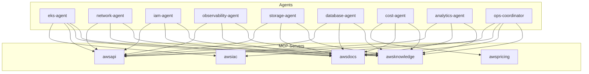

# MCP 서버

AWS Ops Plugin에서 사용하는 5개의 MCP 서버를 설명합니다.

## 개요

| 서버 | 타입 | 용도 | 사용 에이전트 |
|------|------|------|---------------|
| `awsknowledge` | HTTP | AWS 아키텍처 지식, 권장사항, 리전 정보 | 모든 에이전트 |
| `awsdocs` | stdio/uvx | AWS 공식 문서 검색/읽기 | 모든 에이전트 |
| `awsapi` | stdio/uvx | AWS API 직접 호출 (describe, list 등) | eks, network, iam, storage, database, observability, analytics |
| `awspricing` | stdio/uvx | 비용 분석, 가격 조회 | cost-agent |
| `awsiac` | stdio/uvx | CloudFormation/CDK 검증, 트러블슈팅 | eks-agent, ops-coordinator |

## 서버 상세

### awsknowledge

AWS 아키텍처 지식과 모범 사례를 제공하는 HTTP 기반 MCP 서버입니다.

**설정:**
```json
{
  "awsknowledge": {
    "type": "http",
    "url": "https://knowledge-mcp.global.api.aws"
  }
}
```

**기능:**
- AWS 아키텍처 권장사항
- 서비스별 모범 사례
- 리전 가용성 정보
- Well-Architected Framework 가이드

**사용 에이전트:** 모든 에이전트

---

### awsdocs

AWS 공식 문서를 검색하고 읽을 수 있는 stdio 기반 MCP 서버입니다.

**설정:**
```json
{
  "awsdocs": {
    "command": "uvx",
    "args": ["awslabs.aws-documentation-mcp-server@latest"],
    "type": "stdio",
    "timeout": 60000,
    "env": { "FASTMCP_LOG_LEVEL": "ERROR" }
  }
}
```

**기능:**
- AWS 공식 문서 검색
- 문서 콘텐츠 읽기
- 관련 문서 추천
- 서비스별 가이드 접근

**주요 명령:**
- `search_documentation` - 문서 검색
- `read_documentation` - 문서 읽기
- `recommend` - 관련 콘텐츠 추천

**사용 에이전트:** 모든 에이전트

---

### awsapi

AWS API를 직접 호출할 수 있는 stdio 기반 MCP 서버입니다.

**설정:**
```json
{
  "awsapi": {
    "command": "uvx",
    "args": ["awslabs.aws-api-mcp-server@latest"],
    "type": "stdio",
    "timeout": 120000,
    "env": { "FASTMCP_LOG_LEVEL": "ERROR" }
  }
}
```

**기능:**
- AWS API 직접 호출
- 리소스 상태 조회
- 설정 정보 검색
- 실시간 데이터 수집

**주요 API 호출 예시:**
| 에이전트 | API 호출 |
|----------|----------|
| eks-agent | `eks:DescribeCluster`, `eks:ListNodegroups` |
| network-agent | `ec2:DescribeSubnets`, `ec2:DescribeNetworkInterfaces`, `elbv2:DescribeTargetHealth` |
| iam-agent | `iam:GetRole`, `iam:SimulatePrincipalPolicy`, `eks:ListAccessEntries` |
| storage-agent | `ec2:DescribeVolumes`, `efs:DescribeMountTargets` |
| database-agent | `rds:DescribeDBInstances`, `dynamodb:DescribeTable`, `elasticache:DescribeCacheClusters` |
| observability-agent | `cloudwatch:GetMetricStatistics`, `logs:StartQuery`, `logs:GetQueryResults`, `amp:ListWorkspaces`, `grafana:ListWorkspaces` |
| analytics-agent | `opensearch:DescribeDomain`, `athena:GetQueryExecution`, `kinesis:DescribeStream`, `quicksight:ListDashboards` |

**사용 에이전트:** eks, network, iam, storage, database, observability, analytics

---

### awspricing

AWS 서비스 가격 정보를 조회하고 비용을 분석하는 stdio 기반 MCP 서버입니다.

**설정:**
```json
{
  "awspricing": {
    "command": "uvx",
    "args": ["awslabs.aws-pricing-mcp-server@latest"],
    "type": "stdio",
    "timeout": 120000,
    "env": { "FASTMCP_LOG_LEVEL": "ERROR" }
  }
}
```

**기능:**
- 서비스 가격 조회
- 비용 추정
- 가격 비교
- Savings Plans 분석

**주요 명령:**
- `get_pricing` - 서비스별 가격 조회
- `get_pricing_service_codes` - 사용 가능한 서비스 코드 목록
- `get_pricing_service_attributes` - 서비스 필터 속성
- `analyze_cdk_project` - CDK 프로젝트 비용 분석

**사용 에이전트:** cost-agent

---

### awsiac

CloudFormation 및 CDK 템플릿을 검증하고 트러블슈팅하는 stdio 기반 MCP 서버입니다.

**설정:**
```json
{
  "awsiac": {
    "command": "uvx",
    "args": ["awslabs.aws-iac-mcp-server@latest"],
    "type": "stdio"
  }
}
```

**기능:**
- CloudFormation 템플릿 검증 (cfn-lint)
- 보안 및 컴플라이언스 규칙 검증 (cfn-guard)
- 배포 실패 트러블슈팅
- CDK 문서 검색
- CDK 샘플 및 Construct 검색

**주요 명령:**
- `validate_cloudformation_template` - 템플릿 구문 및 스키마 검증
- `check_cloudformation_template_compliance` - 보안/컴플라이언스 규칙 검증
- `troubleshoot_cloudformation_deployment` - 배포 실패 진단
- `search_cdk_documentation` - CDK 문서 검색
- `search_cdk_samples_and_constructs` - CDK 샘플 코드 검색

**사용 에이전트:** eks-agent, ops-coordinator

## 에이전트별 MCP 사용



## 트러블슈팅

### uvx 명령을 찾을 수 없음

```bash
# PATH에 uv 추가
export PATH="$HOME/.local/bin:$PATH"
```

### MCP 서버 타임아웃

첫 실행 시 패키지 다운로드로 시간이 소요될 수 있습니다. `timeout` 값을 늘리거나 다시 시도하세요.

### AWS 자격 증명 오류

awsapi, awspricing 서버 사용 시 AWS 자격 증명이 필요합니다.

```bash
# 자격 증명 확인
aws sts get-caller-identity

# 프로필 설정
export AWS_PROFILE=your-profile
```

### 로그 레벨 조정

디버깅을 위해 로그 레벨을 변경할 수 있습니다.

```json
{
  "env": { "FASTMCP_LOG_LEVEL": "DEBUG" }
}
```
