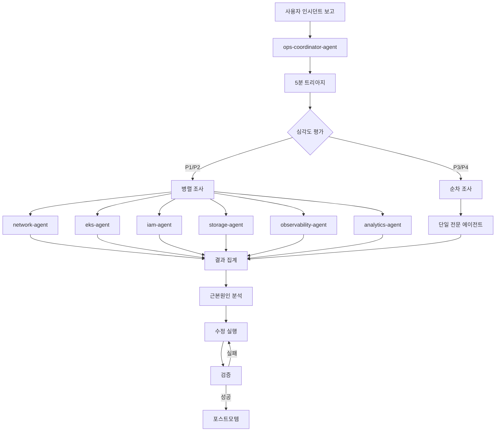
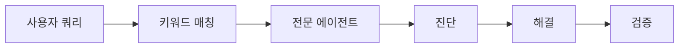

# AWS Ops Plugin 개요

AWS Ops Plugin은 AWS/EKS 인프라 운영 및 트러블슈팅을 위한 Claude Code 플러그인입니다. 클러스터 관리, 네트워킹 진단, IAM/RBAC, 모니터링, 스토리지, 데이터베이스, 비용 최적화를 통합 지원합니다.

## 구성 요소

| 카테고리 | 수량 | 설명 |
|---------|------|------|
| Agents | 9 | 도메인별 전문 에이전트 |
| Skills | 5 | 워크플로우 기반 스킬 |
| MCP Servers | 5 | AWS 서비스 연동 서버 |

## 에이전트 목록

| Agent | Model | 용도 |
|-------|-------|------|
| `eks-agent` | sonnet | EKS 클러스터 관리, 노드 그룹, 업그레이드, 애드온, 5분 트리아지 |
| `network-agent` | sonnet | VPC CNI, ALB/NLB, DNS, Security Groups, IP 고갈 |
| `iam-agent` | sonnet | IRSA, Pod Identity, RBAC, aws-auth, 정책 검증 |
| `observability-agent` | sonnet | CloudWatch, AMP, AMG, ADOT, Prometheus/Grafana, X-Ray |
| `storage-agent` | sonnet | EBS/EFS/FSx CSI, PVC 바인딩, 마운트 오류 |
| `database-agent` | sonnet | RDS/Aurora 연결, DynamoDB 스로틀링, ElastiCache |
| `cost-agent` | sonnet | awspricing MCP 비용 분석, 절감 전략 |
| `analytics-agent` | sonnet | OpenSearch, ClickHouse, Athena, QuickSight, Kinesis |
| `ops-coordinator-agent` | opus | 멀티 도메인 인시던트 조율, 심각도 평가, 팀 오케스트레이션 |

## 스킬 목록

| Skill | 트리거 | 용도 |
|-------|--------|------|
| `ops-troubleshoot` | "troubleshoot", "debug", "장애", "문제 해결" | 5분 트리아지 → 조사 → 해결 → 포스트모템 |
| `ops-health-check` | "health check", "상태 점검", "헬스체크" | 전체 인프라 상태 점검 (분석 포함) |
| `ops-network-diagnosis` | "network issue", "네트워크 오류", "연결 문제" | VPC CNI, LB, DNS 심층 진단 |
| `ops-observability` | "monitoring", "모니터링", "로그 분석", "알람" | CloudWatch 설정, PromQL, 로그 분석 |
| `ops-security-audit` | "security audit", "보안 점검", "compliance" | IAM 감사, 네트워크 보안, 컴플라이언스 |

## 인시던트 대응 워크플로우

## 단일 도메인 트러블슈팅 플로우

단일 도메인 이슈는 팀을 사용하지 않고 직접 전문 에이전트가 처리합니다.

## 팀 워크플로우 트리거

기본값은 순차 워크플로우입니다. 아래 조건 충족 시에만 팀 기반 병렬 실행을 사용합니다.

| 트리거 조건 | 팀 이름 | 구성 |
|-------------|---------|------|
| P1/P2 인시던트, 2+ 도메인 증상 | `ops-incident-response` | ops-coordinator + 전문 에이전트 병렬 |
| "health check" 전체 점검 요청 | `ops-health-check` | eks + network + iam + storage + observability + analytics 병렬 |
| "security audit" 보안 감사 요청 | `ops-security-audit` | iam + network + storage 병렬 감사 |

:::info 순차 워크플로우 보존
- 단일 도메인 이슈는 팀을 사용하지 않습니다 (오버헤드 방지)
- 사용자가 "병렬", "동시에", "in parallel"을 명시적으로 요청한 경우에만 팀 사용
:::

## 자동 호출 키워드

각 에이전트는 특정 키워드가 감지되면 자동으로 호출됩니다. 영어와 한국어 키워드를 모두 지원합니다.

| 도메인 | 영어 키워드 | 한국어 키워드 |
|--------|-------------|---------------|
| EKS | "EKS troubleshoot", "cluster issue", "node NotReady", "pod crash" | "노드 문제", "클러스터 장애", "EKS 업그레이드" |
| Network | "VPC CNI", "IP exhaustion", "load balancer", "ALB", "NLB" | "네트워크 오류", "IP 부족", "로드밸런서" |
| IAM | "IRSA", "Pod Identity", "RBAC", "aws-auth", "AccessDenied" | "권한 오류", "인증 실패", "보안 설정" |
| Observability | "CloudWatch", "Prometheus", "Grafana", "ADOT", "Container Insights", "alarm" | "모니터링", "로그 분석", "알람 설정", "프로메테우스", "그라파나" |
| Analytics | "OpenSearch", "Elasticsearch", "ClickHouse", "Athena", "QuickSight", "Kinesis" | "데이터 분석", "로그 분석 파이프라인", "검색 엔진", "대시보드" |
| Storage | "EBS CSI", "EFS CSI", "FSx", "PVC", "mount error" | "스토리지 오류", "볼륨 마운트", "PVC 바인딩" |
| Database | "RDS", "Aurora", "DynamoDB", "ElastiCache", "throttling" | "DB 연결", "데이터베이스 오류", "스로틀링" |
| Cost | "cost analysis", "cost optimization", "billing", "savings plan" | "비용 분석", "비용 절감", "요금" |
| Incident | "incident", "outage" | "서비스 장애", "긴급 대응", "복합 장애" |
