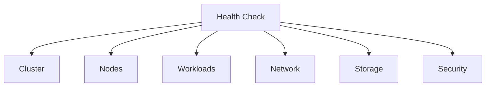

# Ops Health Check

Comprehensive AWS/EKS infrastructure health check skill.

## Description

Checks overall infrastructure health including cluster, nodes, workloads, network, storage, and security.

## Trigger Keywords

- "health check"
- "cluster health"
- "infrastructure check"

## Health Check Domains



### 1. Cluster Health

```bash
kubectl cluster-info
aws eks describe-cluster --name $CLUSTER_NAME --query 'cluster.{status:status,version:version,platformVersion:platformVersion}'
kubectl get componentstatuses 2>/dev/null
```

### 2. Node Health

```bash
kubectl get nodes -o wide
kubectl top nodes
kubectl get nodes -o json | jq '.items[] | {name:.metadata.name, ready:[.status.conditions[] | select(.type=="Ready") | .status][0], cpu:.status.allocatable.cpu, memory:.status.allocatable.memory}'
```

### 3. Workload Health

```bash
kubectl get pods -A --field-selector=status.phase!=Running,status.phase!=Succeeded | head -20
kubectl get deployments -A -o json | jq '.items[] | select(.status.unavailableReplicas > 0) | {name:.metadata.name, ns:.metadata.namespace, unavailable:.status.unavailableReplicas}'
kubectl get daemonsets -A -o json | jq '.items[] | select(.status.desiredNumberScheduled != .status.numberReady) | {name:.metadata.name, ns:.metadata.namespace, desired:.status.desiredNumberScheduled, ready:.status.numberReady}'
```

### 4. Network Health

```bash
kubectl get pods -n kube-system -l k8s-app=kube-dns -o wide
kubectl get pods -n kube-system -l k8s-app=aws-node -o wide
kubectl get svc -A --field-selector spec.type=LoadBalancer
```

### 5. Storage Health

```bash
kubectl get pvc -A --field-selector status.phase!=Bound
kubectl get pv --field-selector status.phase!=Bound,status.phase!=Released
kubectl get csidrivers
```

### 6. Security Health

```bash
kubectl get pods -A -o json | jq '[.items[] | select(.spec.containers[].securityContext.privileged==true) | {name:.metadata.name, ns:.metadata.namespace}]'
kubectl get networkpolicies -A
kubectl get podsecuritypolicies 2>/dev/null
```

---

## Threshold Tables

### Cluster Level Thresholds

| Metric | Warning | Critical | Action |
|--------|---------|----------|--------|
| `cluster_cpu_utilization` | > 70% | > 85% | Scale out nodes |
| `cluster_memory_utilization` | > 75% | > 90% | Scale out nodes |
| `cluster_failed_node_count` | > 0 | >= 2 | Investigate node issues |
| EKS version age | > 6 months | > 12 months | Plan upgrade |
| Add-on version lag | > 1 minor | > 2 minor | Update add-ons |

### Node Level Thresholds

| Metric | Warning | Critical | Action |
|--------|---------|----------|--------|
| `node_cpu_utilization` | > 80% | > 95% | Scale or optimize |
| `node_memory_utilization` | > 80% | > 95% | Scale or optimize |
| `node_filesystem_utilization` | > 80% | > 90% | Expand disk, clean images |
| Node age | > 30 days | > 90 days | Rotate nodes |
| kubelet restarts | > 2/day | > 5/day | Investigate kubelet |

### Pod Level Thresholds

| Metric | Warning | Critical | Action |
|--------|---------|----------|--------|
| `pod_cpu_utilization` | > 80% of limit | > 95% of limit | Increase limit or optimize |
| `pod_memory_utilization` | > 85% of limit | > 95% of limit | Increase limit or optimize |
| Restart count | > 3/hour | > 10/hour | Investigate crashes |
| Container age (restartless) | < 1 hour | < 10 min | CrashLoop investigation |

### Network Level Thresholds

| Metric | Warning | Critical | Action |
|--------|---------|----------|--------|
| Subnet IP availability | < 30% | < 10% | Add CIDR, prefix delegation |
| CoreDNS CPU | > 70% | > 90% | Scale CoreDNS |
| DNS latency p99 | > 100ms | > 500ms | Optimize CoreDNS, ndots |
| LB target unhealthy | > 0 | > 50% | Investigate targets |

### Storage Level Thresholds

| Metric | Warning | Critical | Action |
|--------|---------|----------|--------|
| PVC utilization | > 80% | > 90% | Expand volume |
| Unbound PVCs | > 0 | > 3 | Fix binding |
| EBS burst balance | < 30% | < 10% | Upgrade to gp3 or io2 |
| EFS burst credits | < 30% | < 10% | Switch to provisioned throughput |

### Security Level Thresholds

| Check | Warning | Critical | Action |
|-------|---------|----------|--------|
| Privileged containers | > 0 (non-system) | Any in workloads | Remove privileged flag |
| Containers as root | > 0 (non-system) | Any in workloads | Set runAsNonRoot |
| No network policies | Some namespaces | All namespaces | Create network policies |
| Secrets not rotated | > 90 days | > 180 days | Rotate secrets |

---

## Domain-specific Detailed Procedures

### 1. Cluster Health Check Procedures

#### EKS Control Plane

```bash
# API server responsiveness
time kubectl get --raw /healthz
time kubectl get --raw /readyz

# Cluster version and status
aws eks describe-cluster --name $CLUSTER_NAME --query 'cluster.{status:status,version:version,platformVersion:platformVersion,endpoint:endpoint}'

# Control plane logging status
aws eks describe-cluster --name $CLUSTER_NAME --query 'cluster.logging.clusterLogging'

# Add-on status
aws eks list-addons --cluster-name $CLUSTER_NAME --output table
for addon in $(aws eks list-addons --cluster-name $CLUSTER_NAME --output text); do
  echo "--- $addon ---"
  aws eks describe-addon --cluster-name $CLUSTER_NAME --addon-name $addon --query 'addon.{version:addonVersion,status:status,health:health.issues}'
done
```

**Interpretation**:
- API response time > 500ms: Control plane may be overloaded
- Add-on status DEGRADED: Check add-on pod logs
- Logging not enabled: Enable audit + api + authenticator at minimum

### 2. Node Health Check Procedures

```bash
# Node conditions check
kubectl get nodes -o json | jq '.items[] | {
  name: .metadata.name,
  ready: [.status.conditions[] | select(.type=="Ready") | .status][0],
  memory_pressure: [.status.conditions[] | select(.type=="MemoryPressure") | .status][0],
  disk_pressure: [.status.conditions[] | select(.type=="DiskPressure") | .status][0],
  pid_pressure: [.status.conditions[] | select(.type=="PIDPressure") | .status][0]
}'

# Node resource utilization
kubectl top nodes --sort-by=cpu
kubectl top nodes --sort-by=memory

# Node ages (find stale nodes)
kubectl get nodes -o json | jq '.items[] | {name:.metadata.name, age:.metadata.creationTimestamp, instance_type:.metadata.labels["node.kubernetes.io/instance-type"]}'
```

**Interpretation**:
- Ready=False: Node cannot schedule pods, investigate kubelet
- MemoryPressure=True: Node evicting pods, add capacity
- DiskPressure=True: Clean container images, expand disk
- Node age > 90 days: Plan node rotation for security patches

### 3. Workload Health Check Procedures

```bash
# Deployment health
kubectl get deployments -A -o json | jq '.items[] | select(.status.replicas != .status.readyReplicas) | {name:.metadata.name, ns:.metadata.namespace, replicas:.status.replicas, ready:.status.readyReplicas}'

# StatefulSet health
kubectl get statefulsets -A -o json | jq '.items[] | select(.status.replicas != .status.readyReplicas) | {name:.metadata.name, ns:.metadata.namespace, replicas:.status.replicas, ready:.status.readyReplicas}'

# DaemonSet health
kubectl get daemonsets -A -o json | jq '.items[] | select(.status.desiredNumberScheduled != .status.numberReady) | {name:.metadata.name, ns:.metadata.namespace, desired:.status.desiredNumberScheduled, ready:.status.numberReady}'

# Jobs stuck for more than 1 hour
kubectl get jobs -A -o json | jq '.items[] | select(.status.active > 0) | select(now - (.status.startTime | fromdateiso8601) > 3600) | {name:.metadata.name, ns:.metadata.namespace, active:.status.active}'
```

**Interpretation**:
- Deployment replicas mismatch: Check pod scheduling or crash issues
- DaemonSet not fully scheduled: Check node taints, resource availability
- Stuck jobs: Check pod logs, may need manual cleanup

### 4. Network Health Check Procedures

```bash
# CoreDNS health
kubectl get pods -n kube-system -l k8s-app=kube-dns -o wide
kubectl logs -n kube-system -l k8s-app=kube-dns --tail=10

# VPC CNI health
kubectl get pods -n kube-system -l k8s-app=aws-node -o wide
kubectl logs -n kube-system -l k8s-app=aws-node -c aws-node --tail=10

# Subnet IP availability
for subnet in $(aws ec2 describe-subnets --filters Name=tag:kubernetes.io/cluster/$CLUSTER_NAME,Values=owned Name=tag:kubernetes.io/cluster/$CLUSTER_NAME,Values=shared --query 'Subnets[].SubnetId' --output text 2>/dev/null); do
  aws ec2 describe-subnets --subnet-ids $subnet --query 'Subnets[].{ID:SubnetId,AZ:AvailabilityZone,Available:AvailableIpAddressCount,CIDR:CidrBlock}'
done
```

**Interpretation**:
- CoreDNS pods not Running: DNS resolution will fail cluster-wide
- aws-node errors: IP allocation will fail, pods stuck in Pending
- Subnet available IPs < 10%: Enable prefix delegation or add subnets

### 5. Storage Health Check Procedures

```bash
# PVC status
kubectl get pvc -A -o json | jq '.items[] | {ns:.metadata.namespace, name:.metadata.name, status:.status.phase, size:.spec.resources.requests.storage, storageClass:.spec.storageClassName}'

# CSI driver health
kubectl get pods -n kube-system -l app=ebs-csi-controller -o wide
kubectl get pods -n kube-system -l app=efs-csi-controller -o wide

# Unused PVs
kubectl get pv --field-selector status.phase=Released
```

**Interpretation**:
- PVC Pending: Check StorageClass exists and CSI driver running
- CSI controller not Running: Volume provisioning will fail
- Released PVs: Consider cleanup or reclaim policy change

### 6. Security Health Check Procedures

```bash
# Privileged containers
kubectl get pods -A -o json | jq '[.items[] | select(.spec.containers[].securityContext.privileged==true) | {name:.metadata.name, ns:.metadata.namespace}]'

# Pods running as root
kubectl get pods -A -o json | jq '[.items[] | select(.spec.securityContext.runAsUser==0 or .spec.containers[].securityContext.runAsUser==0) | {name:.metadata.name, ns:.metadata.namespace}]'

# Network policies coverage
kubectl get networkpolicies -A

# Secrets count (for encryption audit)
kubectl get secrets -A -o json | jq '.items | length'
```

**Interpretation**:
- Privileged containers in non-system namespaces: Security risk, review necessity
- Root containers in workloads: Implement Pod Security Standards
- No network policies: Implement default-deny policies

---

## Usage Example

```
Please check entire cluster health.
```

Health Check skill runs automatically:
1. Check all domains sequentially
2. Evaluate status per domain (OK/WARNING/CRITICAL)
3. Provide recommended actions when issues found

## Output Format

```
# Infrastructure Health Report

## Summary
- Overall: HEALTHY / WARNING / CRITICAL
- Checked: [timestamp]
- Cluster: [name] (v[version])

## Results

| Domain | Status | Details |
|--------|--------|---------|
| Cluster | OK/WARN/CRIT | [summary] |
| Nodes (N/N ready) | OK/WARN/CRIT | [summary] |
| Workloads | OK/WARN/CRIT | [N unhealthy pods] |
| Network | OK/WARN/CRIT | [summary] |
| Storage | OK/WARN/CRIT | [N unbound PVCs] |
| Security | OK/WARN/CRIT | [summary] |

## Recommendations
1. [Action item]
2. [Action item]
```

## Team Mode

"health check" requests may trigger team-based parallel checks:

| Trigger | Team Name | Composition |
|---------|-----------|-------------|
| Full check request | `ops-health-check` | eks + network + iam + storage + cloudwatch parallel |

## Reference Files

- `references/health-check-procedures.md` - Detailed procedures per domain
- `references/metrics-thresholds.md` - Warning/Critical thresholds
