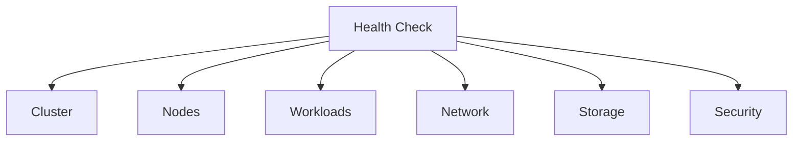

# Ops Health Check

종합적인 AWS/EKS 인프라 상태 점검 스킬입니다.

## 설명

클러스터, 노드, 워크로드, 네트워크, 스토리지, 보안을 포함한 전체 인프라 상태를 점검합니다.

## 트리거 키워드

- "health check"
- "상태 점검"
- "헬스체크"
- "cluster health"
- "인프라 점검"

## 점검 도메인



### 1. Cluster Health

```bash
kubectl cluster-info
aws eks describe-cluster --name $CLUSTER_NAME --query 'cluster.{status:status,version:version,platformVersion:platformVersion}'
kubectl get componentstatuses 2>/dev/null
```

### 2. Node Health

```bash
kubectl get nodes -o wide
kubectl top nodes
kubectl get nodes -o json | jq '.items[] | {name:.metadata.name, ready:[.status.conditions[] | select(.type=="Ready") | .status][0], cpu:.status.allocatable.cpu, memory:.status.allocatable.memory}'
```

### 3. Workload Health

```bash
kubectl get pods -A --field-selector=status.phase!=Running,status.phase!=Succeeded | head -20
kubectl get deployments -A -o json | jq '.items[] | select(.status.unavailableReplicas > 0) | {name:.metadata.name, ns:.metadata.namespace, unavailable:.status.unavailableReplicas}'
kubectl get daemonsets -A -o json | jq '.items[] | select(.status.desiredNumberScheduled != .status.numberReady) | {name:.metadata.name, ns:.metadata.namespace, desired:.status.desiredNumberScheduled, ready:.status.numberReady}'
```

### 4. Network Health

```bash
kubectl get pods -n kube-system -l k8s-app=kube-dns -o wide
kubectl get pods -n kube-system -l k8s-app=aws-node -o wide
kubectl get svc -A --field-selector spec.type=LoadBalancer
```

### 5. Storage Health

```bash
kubectl get pvc -A --field-selector status.phase!=Bound
kubectl get pv --field-selector status.phase!=Bound,status.phase!=Released
kubectl get csidrivers
```

### 6. Security Health

```bash
kubectl get pods -A -o json | jq '[.items[] | select(.spec.containers[].securityContext.privileged==true) | {name:.metadata.name, ns:.metadata.namespace}]'
kubectl get networkpolicies -A
kubectl get podsecuritypolicies 2>/dev/null
```

## 사용 예시

```
클러스터 전체 상태 점검해줘.
```

Health Check 스킬이 자동으로 실행됩니다:
1. 모든 도메인을 순차적으로 점검
2. 각 도메인별 상태 평가 (OK/WARNING/CRITICAL)
3. 문제 발견 시 권장 조치 제시

## 출력 형식

```
# Infrastructure Health Report

## Summary
- Overall: HEALTHY / WARNING / CRITICAL
- Checked: [timestamp]
- Cluster: [name] (v[version])

## Results

| Domain | Status | Details |
|--------|--------|---------|
| Cluster | OK/WARN/CRIT | [요약] |
| Nodes (N/N ready) | OK/WARN/CRIT | [요약] |
| Workloads | OK/WARN/CRIT | [N개 비정상 파드] |
| Network | OK/WARN/CRIT | [요약] |
| Storage | OK/WARN/CRIT | [N개 미바인딩 PVC] |
| Security | OK/WARN/CRIT | [요약] |

## Recommendations
1. [권장 조치]
2. [권장 조치]
```

## 팀 모드

"health check" 요청 시 팀 기반 병렬 점검이 트리거될 수 있습니다:

| 트리거 | 팀 이름 | 구성 |
|--------|---------|------|
| 전체 점검 요청 | `ops-health-check` | eks + network + iam + storage + cloudwatch 병렬 |

## 참조 파일

- `references/health-check-procedures.md` - 도메인별 상세 절차
- `references/metrics-thresholds.md` - Warning/Critical 임계값
