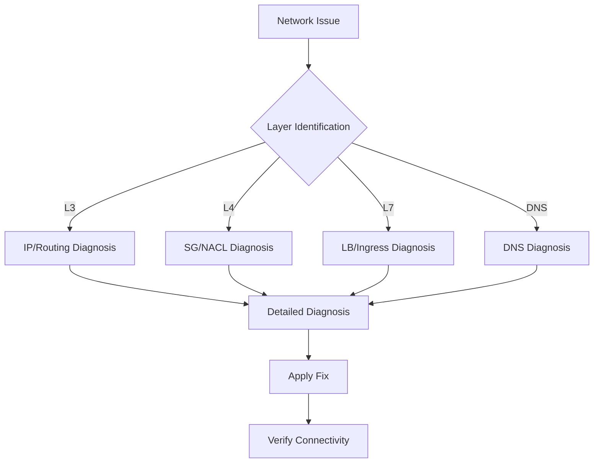

# Ops Network Diagnosis

AWS/EKS deep network diagnosis skill.

## Description

Provides deep network diagnostics for VPC CNI, load balancers, and DNS.

## Trigger Keywords

- "network issue"
- "network error"
- "connectivity"
- "DNS failure"

## Diagnosis Workflow



### Step 1: Layer Identification

- **L3 (IP)**: IP exhaustion, subnet, routing, VPC peering
- **L4 (Transport)**: Security Groups, NACLs, port connectivity
- **L7 (Application)**: Load Balancer, Ingress, target health
- **DNS**: CoreDNS, Route 53, external-dns

### Step 2: Layer-specific Diagnosis

Use detailed commands and decision trees for each layer.

### Step 3: Resolution Verification

Test end-to-end connectivity after applying fixes.

## Quick Connectivity Tests

```bash
# Pod-to-pod
kubectl exec -it <pod1> -- curl -s <pod2-ip>:<port>

# Pod-to-service
kubectl exec -it <pod> -- curl -s <service>.<namespace>.svc.cluster.local:<port>

# DNS resolution
kubectl exec -it <pod> -- nslookup <service>.<namespace>.svc.cluster.local

# External connectivity
kubectl exec -it <pod> -- curl -s -o /dev/null -w "%{http_code}" https://aws.amazon.com
```

---

## VPC CNI Deep Guide

### Architecture Overview

VPC CNI assigns real VPC IP addresses to each Pod via two components:
- **IPAMD (L-IPAM Daemon)**: Pre-allocates and manages ENIs and IPs on each node
- **CNI Binary**: Called by kubelet to assign IPs and configure pod network namespaces

### IP Allocation Modes

| Mode | Allocation Unit | Pod Density | Recommended For |
|------|-----------------|-------------|-----------------|
| Secondary IP | Individual IPs | Limited by IPs per ENI | Small clusters |
| Prefix Delegation | /28 prefix (16 IPs) | Much higher | Large clusters |

### Instance Type Limits

| Instance Type | Max ENIs | IPv4 per ENI | Max Pods (secondary IP) |
|---------------|----------|--------------|-------------------------|
| t3.medium | 3 | 6 | 17 |
| t3.large | 3 | 12 | 35 |
| m5.large | 3 | 10 | 29 |
| m5.xlarge | 4 | 15 | 58 |
| c5.4xlarge | 8 | 30 | 234 |

> Max Pods = (ENIs x IPs per ENI) - ENIs

### Key Environment Variables

| Variable | Description | Default |
|----------|-------------|---------|
| `WARM_IP_TARGET` | Spare IPs to pre-allocate | Not set |
| `MINIMUM_IP_TARGET` | Minimum IPs on node | Not set |
| `WARM_ENI_TARGET` | Spare ENIs to pre-allocate | 1 |
| `ENABLE_PREFIX_DELEGATION` | Enable prefix delegation | false |
| `AWS_VPC_K8S_CNI_CUSTOM_NETWORK_CFG` | Enable custom networking | false |

### VPC CNI Diagnostic Commands

```bash
# IPAMD logs
kubectl logs -n kube-system -l k8s-app=aws-node -c aws-node | grep -i "insufficient\|error\|failed"

# Per-node IP usage
kubectl get nodes -o json | jq '.items[] | {name:.metadata.name, allocatable_pods:.status.allocatable.pods}'

# Subnet available IPs
aws ec2 describe-subnets --subnet-ids <subnet-id> --query 'Subnets[].{ID:SubnetId,CIDR:CidrBlock,Available:AvailableIpAddressCount}'

# ENI details per node
aws ec2 describe-network-interfaces --filters Name=attachment.instance-id,Values=<instance-id> --query 'NetworkInterfaces[].{ID:NetworkInterfaceId,PrivateIPs:PrivateIpAddresses|length(@)}'

# IPAMD metrics endpoint
kubectl exec -n kube-system ds/aws-node -c aws-node -- curl -s http://localhost:61678/v1/enis 2>/dev/null | jq .
```

### IP Exhaustion Solutions

**Problem**: Pods stuck in Pending with IP allocation failure

**Solutions**:

1. **Enable Prefix Delegation**:
```bash
kubectl set env daemonset aws-node -n kube-system ENABLE_PREFIX_DELEGATION=true
```

2. **Add Secondary CIDR**:
```bash
aws ec2 associate-vpc-cidr-block --vpc-id <vpc-id> --cidr-block 100.64.0.0/16
```

3. **Tune WARM_IP_TARGET**:
```bash
kubectl set env daemonset aws-node -n kube-system WARM_IP_TARGET=2 MINIMUM_IP_TARGET=4
```

4. **Recommended Prefix Delegation Settings**:
```bash
kubectl set env daemonset aws-node -n kube-system \
  ENABLE_PREFIX_DELEGATION=true \
  WARM_PREFIX_TARGET=1 \
  WARM_IP_TARGET=5 \
  MINIMUM_IP_TARGET=2
```

### Subnet CIDR Planning Best Practice

```
VPC CIDR: 10.0.0.0/16
├── 10.0.0.0/19   - Node subnet (AZ-a)
├── 10.0.32.0/19  - Node subnet (AZ-b)
├── 10.0.64.0/19  - Node subnet (AZ-c)
└── Secondary CIDR: 100.64.0.0/16
    ├── 100.64.0.0/19  - Pod subnet (AZ-a)
    ├── 100.64.32.0/19 - Pod subnet (AZ-b)
    └── 100.64.64.0/19 - Pod subnet (AZ-c)
```

### VPC CNI Error Solutions

| Error | Solution |
|-------|----------|
| `InsufficientFreeAddressesInSubnet` | Add secondary CIDR or enable prefix delegation |
| `SecurityGroupLimitExceeded` | Clean up unused SGs or consolidate |
| `ENI limit reached` | Larger instance type or prefix delegation |
| `Failed to create ENI` | Add ENI creation permissions to node role |
| `Timeout waiting for pod IP` | Restart IPAMD: `kubectl rollout restart ds/aws-node -n kube-system` |

---

## Load Balancer Troubleshooting

### Prerequisites Checklist

1. **LB Controller installed**: `kubectl get deployment -n kube-system aws-load-balancer-controller`
2. **IRSA configured**: Service account has correct IAM role annotation
3. **Subnet tags**: Public subnets tagged `kubernetes.io/role/elb=1`, private subnets tagged `kubernetes.io/role/internal-elb=1`
4. **IngressClass**: `kubectl get ingressclass` shows `alb` class

### Key Annotations Reference

#### ALB (Ingress)

| Annotation | Description | Default |
|------------|-------------|---------|
| `alb.ingress.kubernetes.io/scheme` | internet-facing or internal | internal |
| `alb.ingress.kubernetes.io/target-type` | ip or instance | instance |
| `alb.ingress.kubernetes.io/subnets` | Subnet IDs | Auto-detect |
| `alb.ingress.kubernetes.io/certificate-arn` | ACM cert ARN | - |
| `alb.ingress.kubernetes.io/healthcheck-path` | Health check path | / |
| `alb.ingress.kubernetes.io/group.name` | Share ALB across Ingresses | - |

#### NLB (Service)

| Annotation | Description | Default |
|------------|-------------|---------|
| `service.beta.kubernetes.io/aws-load-balancer-type` | external (NLB) | - |
| `service.beta.kubernetes.io/aws-load-balancer-nlb-target-type` | ip or instance | instance |
| `service.beta.kubernetes.io/aws-load-balancer-scheme` | internet-facing or internal | internal |
| `service.beta.kubernetes.io/aws-load-balancer-ssl-cert` | ACM cert ARN | - |

### ALB Not Created - Debugging

```bash
# Check controller logs
kubectl logs -n kube-system -l app.kubernetes.io/name=aws-load-balancer-controller --tail=50

# Check Ingress events
kubectl describe ingress <name> -n <namespace>

# Common causes:
# 1. Missing IngressClass: add spec.ingressClassName: alb
# 2. Missing subnet tags
# 3. IAM permission insufficient
# 4. Invalid annotation values
```

### Targets Unhealthy - Debugging

```bash
# Check target health
aws elbv2 describe-target-health --target-group-arn <arn>

# Test health check from pod
kubectl exec -it <pod> -- curl -s localhost:<port><health-path>

# Common causes:
# 1. Health check path returns non-200
# 2. Security group blocks ALB to Pod traffic
# 3. Pod not ready/running
# 4. Wrong targetPort
```

### 502 Bad Gateway Resolution

Root causes:
1. **Pod not ready** - Check pod status and readiness probe
2. **Target deregistering** - Target group draining in progress
3. **Health check failing** - Verify health check path and timeout
4. **Security group** - ALB SG must allow traffic to pod CIDR

```bash
# Debugging steps
kubectl get pods -l app=<app>
aws elbv2 describe-target-health --target-group-arn <arn>
kubectl describe ingress <name>
```

### Subnet Tagging

```bash
# Public subnets (internet-facing LB)
aws ec2 create-tags --resources <subnet-id> --tags Key=kubernetes.io/role/elb,Value=1

# Private subnets (internal LB)
aws ec2 create-tags --resources <subnet-id> --tags Key=kubernetes.io/role/internal-elb,Value=1

# Cluster tag (optional)
aws ec2 create-tags --resources <subnet-id> --tags Key=kubernetes.io/cluster/$CLUSTER_NAME,Value=shared
```

### Cost Optimization - ALB Sharing

Share a single ALB across multiple services using Ingress groups:

```yaml
# In each Ingress:
alb.ingress.kubernetes.io/group.name: shared-alb
alb.ingress.kubernetes.io/group.order: "1"  # Priority within group
```

---

## DNS Deep Diagnosis

### CoreDNS Architecture in EKS

CoreDNS runs as a Deployment in kube-system namespace and provides:
- Service discovery (`.svc.cluster.local`)
- Pod DNS (`.pod.cluster.local`)
- External DNS forwarding (to VPC DNS resolver at 169.254.169.253)

### DNS Diagnostic Commands

```bash
# CoreDNS status
kubectl get pods -n kube-system -l k8s-app=kube-dns -o wide
kubectl get svc -n kube-system kube-dns

# CoreDNS logs
kubectl logs -n kube-system -l k8s-app=kube-dns --tail=30

# CoreDNS config
kubectl get configmap coredns -n kube-system -o yaml

# DNS resolution test
kubectl run -it --rm dns-test --image=busybox:1.28 --restart=Never -- nslookup kubernetes.default.svc.cluster.local

# DNS latency test
kubectl run -it --rm dns-test --image=busybox:1.28 --restart=Never -- sh -c 'for i in $(seq 1 10); do time nslookup kubernetes.default 2>&1 | grep real; done'
```

### DNS Resolution Timeout Solutions

**Symptoms**: `nslookup: can't resolve`, `dial tcp: lookup: no such host`

| Cause | Solution |
|-------|----------|
| CoreDNS not running | `kubectl rollout restart deployment/coredns -n kube-system` |
| CoreDNS overloaded | Scale replicas or enable autoscaling |
| ndots too high | Set ndots=2 in pod spec (see below) |
| VPC DNS throttling | VPC resolver has 1024 packets/sec/ENI limit |

**ndots Optimization** (default ndots=5 causes 5 DNS lookups for external names):

```yaml
# Pod spec optimization
spec:
  dnsConfig:
    options:
      - name: ndots
        value: "2"
```

### CoreDNS Scaling

```bash
# Check current replicas
kubectl get deployment coredns -n kube-system

# Manual scale
kubectl scale deployment coredns -n kube-system --replicas=3

# Enable autoscaling (proportional-autoscaler)
kubectl apply -f https://raw.githubusercontent.com/kubernetes-sigs/cluster-proportional-autoscaler/master/examples/dns-autoscaler.yaml
```

### CoreDNS ConfigMap Customization

```yaml
apiVersion: v1
kind: ConfigMap
metadata:
  name: coredns
  namespace: kube-system
data:
  Corefile: |
    .:53 {
        errors
        health
        kubernetes cluster.local in-addr.arpa ip6.arpa {
          pods insecure
          fallthrough in-addr.arpa ip6.arpa
        }
        prometheus :9153
        forward . /etc/resolv.conf
        cache 30
        loop
        reload
        loadbalance
    }
    # Custom zone forwarding
    example.com:53 {
        forward . 10.0.0.2
        cache 30
    }
```

### External DNS Not Resolving from Pods

```bash
# Check pod's resolv.conf
kubectl exec -it <pod> -- cat /etc/resolv.conf

# Expected:
# nameserver 172.20.0.10  (kube-dns service IP)
# search <namespace>.svc.cluster.local svc.cluster.local cluster.local
# options ndots:5

# If nameserver is wrong, check kubelet --cluster-dns setting
```

### Route 53 Integration - external-dns

```bash
# Check external-dns status
kubectl get pods -n kube-system -l app=external-dns
kubectl logs -n kube-system -l app=external-dns --tail=20

# Verify DNS record created
aws route53 list-resource-record-sets --hosted-zone-id <zone-id> --query "ResourceRecordSets[?Name=='<domain>.']"
```

### DNS Error Solutions

| Symptom | Likely Cause | Solution |
|---------|--------------|----------|
| All DNS fails | CoreDNS down | Restart CoreDNS |
| External DNS slow | High ndots | Set ndots=2 in pod spec |
| Service discovery fails | Wrong namespace | Use FQDN: `svc.namespace.svc.cluster.local` |
| Route53 record not created | external-dns IAM | Fix IRSA for external-dns |
| Intermittent failures | DNS throttling | Scale CoreDNS, use NodeLocal DNSCache |

---

## Layer-specific Diagnosis Guide

### L3 - IP/Routing

```bash
# Subnet available IPs
aws ec2 describe-subnets --subnet-ids <subnet-id> --query 'Subnets[].{CIDR:CidrBlock,Available:AvailableIpAddressCount}'

# VPC CNI IP usage
kubectl exec -n kube-system ds/aws-node -c aws-node -- curl -s http://localhost:61678/v1/enis | jq .

# Route table
aws ec2 describe-route-tables --filters Name=vpc-id,Values=<vpc-id>
```

### L4 - Security Groups

```bash
# Node SG
aws ec2 describe-instances --instance-ids <id> --query 'Reservations[].Instances[].SecurityGroups'

# SG rules check
aws ec2 describe-security-group-rules --filter Name=group-id,Values=<sg-id>

# Pod Security Groups
kubectl get securitygrouppolicies -A
```

### L7 - Load Balancer

```bash
# LB Controller status
kubectl get deployment -n kube-system aws-load-balancer-controller
kubectl logs -n kube-system -l app.kubernetes.io/name=aws-load-balancer-controller --tail=30

# Target health
aws elbv2 describe-target-health --target-group-arn <tg-arn>
```

---

## Usage Examples

### IP Exhaustion Issue

```
Pod is Pending and IP allocation fails. Please diagnose network.
```

Network Diagnosis skill runs automatically:
1. Identify as L3 layer
2. Check subnet available IPs
3. Verify VPC CNI IPAMD status
4. Recommend Prefix Delegation or Secondary CIDR

### ALB 502 Error

```
ALB returns 502 errors.
```

Network Diagnosis performs:
1. Identify as L7 layer
2. Check target group health
3. Verify Security Group rules
4. Check pod readiness status

## Reference Files

- `references/vpc-cni-troubleshooting.md` - IP management, ENI, Prefix Delegation
- `references/load-balancer-troubleshooting.md` - ALB/NLB setup, target health
- `references/dns-troubleshooting.md` - CoreDNS, Route 53, resolution issues
