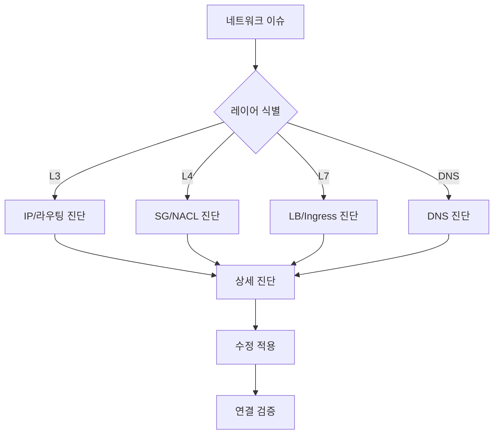

# Ops Network Diagnosis

AWS/EKS 심층 네트워크 진단 스킬입니다.

## 설명

VPC CNI, 로드 밸런서, DNS에 대한 심층 네트워크 진단을 제공합니다.

## 트리거 키워드

- "network issue"
- "네트워크 오류"
- "연결 문제"
- "connectivity"
- "DNS failure"

## 진단 워크플로우



### Step 1: 레이어 식별

- **L3 (IP)**: IP 고갈, 서브넷, 라우팅, VPC 피어링
- **L4 (Transport)**: Security Groups, NACLs, 포트 연결성
- **L7 (Application)**: Load Balancer, Ingress, 타겟 헬스
- **DNS**: CoreDNS, Route 53, external-dns

### Step 2: 레이어별 진단

각 레이어에 맞는 상세 명령어와 의사결정 트리를 사용하여 진단합니다.

### Step 3: 해결 검증

수정 적용 후 종단간 연결성을 테스트합니다.

## 빠른 연결 테스트

```bash
# Pod-to-pod
kubectl exec -it <pod1> -- curl -s <pod2-ip>:<port>

# Pod-to-service
kubectl exec -it <pod> -- curl -s <service>.<namespace>.svc.cluster.local:<port>

# DNS 해석
kubectl exec -it <pod> -- nslookup <service>.<namespace>.svc.cluster.local

# 외부 연결성
kubectl exec -it <pod> -- curl -s -o /dev/null -w "%{http_code}" https://aws.amazon.com
```

## 레이어별 진단 가이드

### L3 - IP/라우팅

```bash
# 서브넷 가용 IP
aws ec2 describe-subnets --subnet-ids <subnet-id> --query 'Subnets[].{CIDR:CidrBlock,Available:AvailableIpAddressCount}'

# VPC CNI IP 사용량
kubectl exec -n kube-system ds/aws-node -c aws-node -- curl -s http://localhost:61678/v1/enis | jq .

# 라우트 테이블
aws ec2 describe-route-tables --filters Name=vpc-id,Values=<vpc-id>
```

### L4 - Security Groups

```bash
# 노드 SG
aws ec2 describe-instances --instance-ids <id> --query 'Reservations[].Instances[].SecurityGroups'

# SG 규칙 확인
aws ec2 describe-security-group-rules --filter Name=group-id,Values=<sg-id>

# Pod Security Groups
kubectl get securitygrouppolicies -A
```

### L7 - Load Balancer

```bash
# LB Controller 상태
kubectl get deployment -n kube-system aws-load-balancer-controller
kubectl logs -n kube-system -l app.kubernetes.io/name=aws-load-balancer-controller --tail=30

# 타겟 헬스
aws elbv2 describe-target-health --target-group-arn <tg-arn>
```

### DNS

```bash
# CoreDNS 상태
kubectl get pods -n kube-system -l k8s-app=kube-dns
kubectl logs -n kube-system -l k8s-app=kube-dns --tail=30

# DNS 테스트
kubectl run -it --rm dns-test --image=busybox:1.28 --restart=Never -- nslookup kubernetes.default
```

## 사용 예시

### IP 고갈 문제

```
파드가 Pending이고 IP 할당이 안 돼. 네트워크 진단해줘.
```

Network Diagnosis 스킬이 자동으로 실행됩니다:
1. L3 레이어로 식별
2. 서브넷 가용 IP 확인
3. VPC CNI IPAMD 상태 검증
4. Prefix Delegation 또는 Secondary CIDR 권장

### ALB 502 오류

```
ALB에서 502 오류가 발생해.
```

Network Diagnosis가 다음을 수행합니다:
1. L7 레이어로 식별
2. 타겟 그룹 헬스 확인
3. Security Group 규칙 검증
4. 파드 readiness 상태 확인

## 참조 파일

- `references/vpc-cni-troubleshooting.md` - IP 관리, ENI, Prefix Delegation
- `references/load-balancer-troubleshooting.md` - ALB/NLB 설정, 타겟 헬스
- `references/dns-troubleshooting.md` - CoreDNS, Route 53, 해석 이슈
