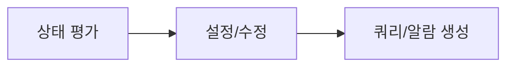

# Ops Observability

AWS/EKS 관측성 설정 및 분석 스킬입니다.

## 설명

CloudWatch 설정, PromQL, 로그 분석을 포함한 관측성 워크플로우를 제공합니다.

## 트리거 키워드

- "monitoring"
- "모니터링"
- "로그 분석"
- "알람"
- "observability"
- "logs insights"

## 워크플로우



### Step 1: 현재 상태 평가

```bash
# 메트릭 수집 현황
kubectl get pods -n amazon-cloudwatch
kubectl get pods -n monitoring
kubectl get pods -n prometheus

# 로그 그룹 확인
aws logs describe-log-groups --log-group-name-prefix /aws/containerinsights/$CLUSTER_NAME --query 'logGroups[].{name:logGroupName,retention:retentionInDays,size:storedBytes}'

# 알람 현황
aws cloudwatch describe-alarms --state-value ALARM --query 'MetricAlarms[].{name:AlarmName,state:StateValue,metric:MetricName}'
```

### Step 2: 설정/수정

문제 발견 시 적절한 참조 파일을 사용하여 설정 절차를 안내합니다.

### Step 3: 쿼리 및 알람 생성

참조 파일의 템플릿과 임계값 가이드라인을 활용합니다.

## 빠른 참조

### Container Insights 활성화

```bash
aws eks create-addon --cluster-name $CLUSTER_NAME --addon-name amazon-cloudwatch-observability --addon-version v1.5.0-eksbuild.1
```

### 필수 Logs Insights 쿼리

```sql
fields @timestamp, @message
| filter @message like /error/i
| sort @timestamp desc
| limit 50
```

### 필수 알람

```bash
aws cloudwatch put-metric-alarm \
  --alarm-name "$CLUSTER_NAME-high-cpu" \
  --namespace ContainerInsights \
  --metric-name cluster_cpu_utilization \
  --dimensions Name=ClusterName,Value=$CLUSTER_NAME \
  --statistic Average \
  --period 300 \
  --evaluation-periods 2 \
  --threshold 80 \
  --comparison-operator GreaterThanThreshold \
  --alarm-actions <sns-topic-arn>
```

## 주요 Logs Insights 쿼리 템플릿

### API 서버 오류

```sql
fields @timestamp, @message
| filter @logStream like /kube-apiserver/
| filter @message like /error|Error|ERROR/
| sort @timestamp desc
| limit 50
```

### 인증 실패

```sql
fields @timestamp, @message
| filter @logStream like /authenticator/
| filter @message like /AccessDenied|Forbidden|unauthorized/
| sort @timestamp desc
```

### 파드 재시작 탐지

```sql
fields @timestamp, @message, kubernetes.pod_name
| filter @message like /Back-off restarting failed container/
| stats count(*) as restart_count by kubernetes.pod_name
| sort restart_count desc
```

### 네임스페이스별 오류율

```sql
fields @timestamp, @message, kubernetes.namespace_name
| filter @message like /error/i
| stats count(*) as error_count by kubernetes.namespace_name
| sort error_count desc
```

## 사용 예시

### Container Insights 설정

```
Container Insights를 설정해줘.
```

Observability 스킬이 자동으로 실행됩니다:
1. 현재 설정 상태 확인
2. CloudWatch 애드온 설치 명령 제공
3. IRSA 권한 설정 안내
4. 메트릭 수집 검증 방법 안내

### 로그 분석

```
최근 1시간 오류 로그를 분석해줘.
```

Observability 스킬이 다음을 수행합니다:
1. 사용 가능한 로그 그룹 확인
2. 적절한 Logs Insights 쿼리 작성
3. 오류 패턴 분석 및 분류
4. 원인 추적 가이드 제공

## 참조 파일

- `references/cloudwatch-setup.md` - Container Insights, 로그 그룹, 대시보드
- `references/prometheus-queries.md` - EKS용 PromQL 알람 규칙
- `references/log-analysis-queries.md` - CloudWatch Logs Insights 쿼리 템플릿
