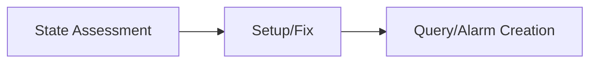

# Ops Observability

AWS/EKS observability setup and analysis skill.

## Description

Provides observability workflows including CloudWatch setup, PromQL queries, and log analysis.

## Trigger Keywords

- "monitoring"
- "log analysis"
- "alarm"
- "observability"
- "logs insights"

## Workflow



### Step 1: Current State Assessment

```bash
# Metrics collection status
kubectl get pods -n amazon-cloudwatch
kubectl get pods -n monitoring
kubectl get pods -n prometheus

# Log groups check
aws logs describe-log-groups --log-group-name-prefix /aws/containerinsights/$CLUSTER_NAME --query 'logGroups[].{name:logGroupName,retention:retentionInDays,size:storedBytes}'

# Alarm status
aws cloudwatch describe-alarms --state-value ALARM --query 'MetricAlarms[].{name:AlarmName,state:StateValue,metric:MetricName}'
```

### Step 2: Setup/Fix

Route to appropriate reference for setup procedures when issues found.

### Step 3: Query and Alarm Creation

Use reference files for query templates and threshold guidelines.

## Quick Reference

### Enable Container Insights

```bash
aws eks create-addon --cluster-name $CLUSTER_NAME --addon-name amazon-cloudwatch-observability --addon-version v1.5.0-eksbuild.1
```

---

## PromQL Alarm Rules Extended

### Alert Severity Levels

| Severity | Response Time | Examples | Notification |
|----------|---------------|----------|--------------|
| **critical** | < 5 min | Node down, API unreachable | PagerDuty + Slack |
| **warning** | < 30 min | High CPU, memory pressure | Slack |
| **info** | Next business day | Scaling events | Email/Log |

### Node Alerts

```yaml
# Node Not Ready
- alert: NodeNotReady
  expr: kube_node_status_condition{condition="Ready",status="true"} == 0
  for: 5m
  labels:
    severity: critical
  annotations:
    summary: "Node {{ $labels.node }} is NotReady"

# Node Memory Pressure
- alert: NodeHighMemoryUsage
  expr: (1 - node_memory_MemAvailable_bytes / node_memory_MemTotal_bytes) > 0.9
  for: 5m
  labels:
    severity: warning
  annotations:
    summary: "Node {{ $labels.instance }} memory usage above 90%"

# Node Disk Pressure
- alert: NodeHighDiskUsage
  expr: (1 - node_filesystem_avail_bytes{mountpoint="/"} / node_filesystem_size_bytes{mountpoint="/"}) > 0.85
  for: 5m
  labels:
    severity: warning
  annotations:
    summary: "Node {{ $labels.instance }} disk usage above 85%"

# Node CPU High
- alert: NodeHighCPU
  expr: (1 - avg by(instance)(rate(node_cpu_seconds_total{mode="idle"}[5m]))) > 0.9
  for: 10m
  labels:
    severity: warning
  annotations:
    summary: "Node {{ $labels.instance }} CPU above 90%"
```

### Pod Alerts

```yaml
# Pod CrashLoopBackOff
- alert: PodCrashLooping
  expr: rate(kube_pod_container_status_restarts_total[15m]) * 60 * 15 > 3
  for: 5m
  labels:
    severity: warning
  annotations:
    summary: "Pod {{ $labels.namespace }}/{{ $labels.pod }} restarting frequently"

# Pod OOMKilled
- alert: PodOOMKilled
  expr: kube_pod_container_status_last_terminated_reason{reason="OOMKilled"} == 1
  for: 0m
  labels:
    severity: warning
  annotations:
    summary: "Pod {{ $labels.namespace }}/{{ $labels.pod }} was OOMKilled"

# Pod Pending Too Long
- alert: PodPendingTooLong
  expr: kube_pod_status_phase{phase="Pending"} == 1
  for: 15m
  labels:
    severity: warning
  annotations:
    summary: "Pod {{ $labels.namespace }}/{{ $labels.pod }} pending for 15+ minutes"

# Container CPU Throttling
- alert: ContainerCPUThrottling
  expr: rate(container_cpu_cfs_throttled_periods_total[5m]) / rate(container_cpu_cfs_periods_total[5m]) > 0.5
  for: 10m
  labels:
    severity: warning
  annotations:
    summary: "Container {{ $labels.container }} in {{ $labels.pod }} is being throttled > 50%"
```

### Deployment Alerts

```yaml
# Deployment Replica Mismatch
- alert: DeploymentReplicaMismatch
  expr: kube_deployment_spec_replicas != kube_deployment_status_ready_replicas
  for: 10m
  labels:
    severity: warning
  annotations:
    summary: "Deployment {{ $labels.namespace }}/{{ $labels.deployment }} has replica mismatch"

# StatefulSet Not Ready
- alert: StatefulSetNotReady
  expr: kube_statefulset_status_replicas_ready != kube_statefulset_status_replicas
  for: 15m
  labels:
    severity: warning
  annotations:
    summary: "StatefulSet {{ $labels.namespace }}/{{ $labels.statefulset }} not fully ready"

# DaemonSet Not Scheduled
- alert: DaemonSetNotScheduled
  expr: kube_daemonset_status_desired_number_scheduled - kube_daemonset_status_current_number_scheduled > 0
  for: 10m
  labels:
    severity: warning
  annotations:
    summary: "DaemonSet {{ $labels.namespace }}/{{ $labels.daemonset }} not fully scheduled"
```

### VPC CNI Alerts

```yaml
# High IP Utilization
- alert: HighIPUtilization
  expr: awscni_assigned_ip_addresses / awscni_total_ip_addresses > 0.9
  for: 5m
  labels:
    severity: warning
  annotations:
    summary: "VPC CNI IP utilization above 90% on {{ $labels.instance }}"

# ENI Allocation Failures
- alert: ENIAllocationFailure
  expr: increase(awscni_aws_api_error_count[5m]) > 0
  for: 5m
  labels:
    severity: warning
  annotations:
    summary: "VPC CNI API errors detected on {{ $labels.instance }}"
```

### PVC and Network Alerts

```yaml
# Persistent Volume Usage High
- alert: PVCUsageHigh
  expr: kubelet_volume_stats_used_bytes / kubelet_volume_stats_capacity_bytes > 0.85
  for: 5m
  labels:
    severity: warning
  annotations:
    summary: "PVC {{ $labels.persistentvolumeclaim }} usage above 85%"

# Pod Network Receive Errors
- alert: PodNetworkReceiveErrors
  expr: rate(container_network_receive_errors_total[5m]) > 0
  for: 5m
  labels:
    severity: warning
  annotations:
    summary: "Pod {{ $labels.pod }} experiencing network receive errors"
```

---

## Dashboard Configuration Guide

### Container Insights Collected Metrics

#### Cluster Level
- `cluster_node_count` - Node count
- `cluster_failed_node_count` - Failed node count
- `cluster_cpu_utilization` - CPU utilization
- `cluster_memory_utilization` - Memory utilization

#### Node Level
- `node_cpu_utilization` - Node CPU utilization
- `node_memory_utilization` - Node memory utilization
- `node_network_total_bytes` - Total network bytes
- `node_filesystem_utilization` - Filesystem utilization

#### Pod/Container Level
- `pod_cpu_utilization` - Pod CPU utilization
- `pod_memory_utilization` - Pod memory utilization
- `pod_network_rx_bytes` - Received bytes
- `pod_network_tx_bytes` - Transmitted bytes

### Container Insights Setup

#### Method 1: EKS Add-on (Recommended)

```bash
# Create IRSA for CloudWatch Agent
eksctl create iamserviceaccount \
  --name cloudwatch-agent \
  --namespace amazon-cloudwatch \
  --cluster $CLUSTER_NAME \
  --attach-policy-arn arn:aws:iam::aws:policy/CloudWatchAgentServerPolicy \
  --approve

# Install add-on
aws eks create-addon \
  --cluster-name $CLUSTER_NAME \
  --addon-name amazon-cloudwatch-observability \
  --service-account-role-arn <role-arn>

# Verify
aws eks describe-addon --cluster-name $CLUSTER_NAME --addon-name amazon-cloudwatch-observability
kubectl get pods -n amazon-cloudwatch
```

### EKS Control Plane Logging

```bash
# Enable all log types
aws eks update-cluster-config \
  --name $CLUSTER_NAME \
  --logging '{"clusterLogging":[{"types":["api","audit","authenticator","controllerManager","scheduler"],"enabled":true}]}'

# Recommended: Enable at minimum
# - api: API server logs
# - audit: Audit logs (security)
# - authenticator: IAM authentication logs
```

### Log Group Structure

```
/aws/eks/$CLUSTER_NAME/cluster
├── kube-apiserver-*           # API server
├── kube-apiserver-audit-*     # Audit logs
├── authenticator-*            # IAM auth
├── kube-controller-manager-*  # Controller manager
└── kube-scheduler-*           # Scheduler

/aws/containerinsights/$CLUSTER_NAME/application   # App stdout/stderr
/aws/containerinsights/$CLUSTER_NAME/host          # Node system logs
/aws/containerinsights/$CLUSTER_NAME/dataplane     # kubelet, kube-proxy
/aws/containerinsights/$CLUSTER_NAME/performance   # Performance metrics
```

### Essential CloudWatch Alarms

```bash
# High CPU
aws cloudwatch put-metric-alarm \
  --alarm-name "$CLUSTER_NAME-high-cpu" \
  --namespace ContainerInsights \
  --metric-name cluster_cpu_utilization \
  --dimensions Name=ClusterName,Value=$CLUSTER_NAME \
  --statistic Average --period 300 --evaluation-periods 2 \
  --threshold 80 --comparison-operator GreaterThanThreshold \
  --alarm-actions $SNS_TOPIC_ARN

# High Memory
aws cloudwatch put-metric-alarm \
  --alarm-name "$CLUSTER_NAME-high-memory" \
  --namespace ContainerInsights \
  --metric-name cluster_memory_utilization \
  --dimensions Name=ClusterName,Value=$CLUSTER_NAME \
  --statistic Average --period 300 --evaluation-periods 2 \
  --threshold 85 --comparison-operator GreaterThanThreshold \
  --alarm-actions $SNS_TOPIC_ARN

# Node Failures
aws cloudwatch put-metric-alarm \
  --alarm-name "$CLUSTER_NAME-node-failure" \
  --namespace ContainerInsights \
  --metric-name cluster_failed_node_count \
  --dimensions Name=ClusterName,Value=$CLUSTER_NAME \
  --statistic Maximum --period 60 --evaluation-periods 2 \
  --threshold 0 --comparison-operator GreaterThanThreshold \
  --alarm-actions $SNS_TOPIC_ARN
```

### Cost Optimization Strategies

| Strategy | Savings | Effort |
|----------|---------|--------|
| Set log retention (vs. forever) | 50-80% | Low |
| Use Infrequent Access log class | 50% | Low |
| Filter health check logs | 10-30% | Low |
| Reduce metric collection interval (60s vs 30s) | 30% | Low |
| Disable Enhanced Container Insights when not needed | 20-40% | Low |
| Consolidate dashboards (3 free) | 100% per dashboard | Low |

---

## Log Analysis Queries Extended

### Control Plane Queries

#### API Server Errors

```sql
fields @timestamp, @message
| filter @logStream like /kube-apiserver/
| filter @message like /error|Error|ERROR/
| sort @timestamp desc
| limit 50
```

#### Audit Log - User Activity

```sql
fields @timestamp, @message
| filter @logStream like /kube-apiserver-audit/
| parse @message '"user":{"username":"*"' as username
| filter username != "system:serviceaccount:*"
| stats count(*) as actions by username
| sort actions desc
```

#### Audit Log - Resource Changes

```sql
fields @timestamp, @message
| filter @logStream like /kube-apiserver-audit/
| filter @message like /"verb":"create"/ or @message like /"verb":"delete"/ or @message like /"verb":"update"/
| filter @message like /"resource":"pods"/ or @message like /"resource":"deployments"/ or @message like /"resource":"services"/
| sort @timestamp desc
| limit 100
```

#### Authentication Failures

```sql
fields @timestamp, @message
| filter @logStream like /authenticator/
| filter @message like /AccessDenied|Forbidden|unauthorized|error/
| sort @timestamp desc
| limit 50
```

#### Scheduler Issues

```sql
fields @timestamp, @message
| filter @logStream like /kube-scheduler/
| filter @message like /error|failed|unable/i
| sort @timestamp desc
| limit 30
```

### Application Log Queries

#### Error Rate by Namespace

```sql
fields @timestamp, @message, kubernetes.namespace_name
| filter @message like /error/i
| stats count(*) as error_count by kubernetes.namespace_name
| sort error_count desc
```

#### Pod Restart Detection

```sql
fields @timestamp, @message, kubernetes.pod_name
| filter @message like /Back-off restarting failed container/
| stats count(*) as restart_count by kubernetes.pod_name
| sort restart_count desc
```

#### OOMKilled Events

```sql
fields @timestamp, @message, kubernetes.pod_name, kubernetes.namespace_name
| filter @message like /OOMKilled|oom-kill|Out of memory/
| sort @timestamp desc
| limit 30
```

#### Log Volume by Time

```sql
fields @timestamp
| stats count(*) as log_count by bin(1h)
| sort @timestamp
```

#### Top Error Messages

```sql
fields @timestamp, @message
| filter @message like /error/i
| stats count(*) as count by @message
| sort count desc
| limit 10
```

#### Response Time Analysis (JSON Logs)

```sql
fields @timestamp, @message
| filter kubernetes.container_name = "api"
| parse @message '{"response_time":*,' as response_time
| filter response_time > 1000
| stats avg(response_time) as avg_rt, max(response_time) as max_rt, percentile(response_time, 95) as p95_rt by bin(5m)
```

### Infrastructure Queries

#### VPC CNI Errors

```sql
-- Log group: /aws/containerinsights/$CLUSTER_NAME/dataplane
fields @timestamp, @message
| filter kubernetes.container_name = "aws-node"
| filter @message like /error|failed|insufficient/i
| sort @timestamp desc
| limit 30
```

#### kubelet Issues

```sql
-- Log group: /aws/containerinsights/$CLUSTER_NAME/dataplane
fields @timestamp, @message
| filter @message like /kubelet/
| filter @message like /error|failed|unable/i
| sort @timestamp desc
| limit 30
```

#### Node System Issues

```sql
-- Log group: /aws/containerinsights/$CLUSTER_NAME/host
fields @timestamp, @message
| filter @message like /oom-kill|kernel|panic|error/i
| sort @timestamp desc
| limit 30
```

### Cost Analysis Queries

#### Log Volume by Container

```sql
fields @timestamp, kubernetes.container_name, kubernetes.namespace_name
| stats count(*) as log_lines by kubernetes.container_name, kubernetes.namespace_name
| sort log_lines desc
| limit 20
```

#### Identify Noisy Containers

```sql
fields @timestamp, kubernetes.container_name, kubernetes.namespace_name
| stats count(*) as log_count by kubernetes.container_name, kubernetes.namespace_name
| filter log_count > 10000
| sort log_count desc
```

---

## Usage Examples

### Container Insights Setup

```
Please set up Container Insights.
```

Observability skill runs automatically:
1. Check current setup status
2. Provide CloudWatch addon installation command
3. Guide IRSA permission setup
4. Provide metrics collection verification method

### Log Analysis

```
Analyze error logs from the last hour.
```

Observability skill performs:
1. Check available log groups
2. Write appropriate Logs Insights query
3. Analyze and categorize error patterns
4. Provide cause tracing guide

## Reference Files

- `references/cloudwatch-setup.md` - Container Insights, log groups, dashboards
- `references/prometheus-queries.md` - PromQL alert rules for EKS
- `references/log-analysis-queries.md` - CloudWatch Logs Insights query templates
