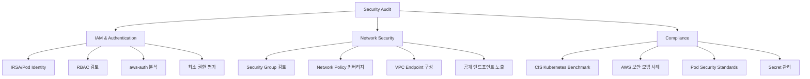

# Ops Security Audit

AWS/EKS 보안 감사 스킬입니다.

## 설명

IAM, 네트워크 보안, 컴플라이언스를 포함한 종합 보안 감사를 수행합니다.

## 트리거 키워드

- "security audit"
- "보안 점검"
- "compliance"
- "security review"
- "보안 감사"

## 감사 도메인



### 1. IAM & Authentication

- IRSA/Pod Identity 구성 감사
- RBAC Role 및 Binding 검토
- aws-auth ConfigMap 분석
- 최소 권한 평가

### 2. Network Security

- Security Group 규칙 검토
- Network Policy 커버리지
- VPC Endpoint 구성
- 공개 엔드포인트 노출

### 3. Compliance

- CIS Kubernetes Benchmark 점검
- AWS 보안 모범 사례
- Pod Security Standards
- Secret 관리

## 빠른 감사 명령어

```bash
# 권한 있는 컨테이너
kubectl get pods -A -o json | jq '[.items[] | select(.spec.containers[].securityContext.privileged==true) | {name:.metadata.name,ns:.metadata.namespace}]'

# root로 실행되는 파드
kubectl get pods -A -o json | jq '[.items[] | select(.spec.securityContext.runAsUser==0 or .spec.containers[].securityContext.runAsUser==0) | {name:.metadata.name,ns:.metadata.namespace}]'

# Network Policy 커버리지
kubectl get networkpolicies -A
kubectl get namespaces -o json | jq '.items[].metadata.name' | while read ns; do echo "$ns: $(kubectl get networkpolicies -n $(echo $ns | tr -d '"') 2>/dev/null | wc -l) policies"; done

# 공개 서비스
kubectl get svc -A -o json | jq '[.items[] | select(.spec.type=="LoadBalancer") | {name:.metadata.name,ns:.metadata.namespace,type:.spec.type}]'
```

## 팀 모드

"security audit" 요청 시 팀 기반 병렬 감사가 트리거될 수 있습니다:

| 트리거 | 팀 이름 | 구성 |
|--------|---------|------|
| 보안 감사 요청 | `ops-security-audit` | iam + network + storage 병렬 감사 |

## 사용 예시

### 전체 보안 감사

```
클러스터 보안 감사를 실행해줘.
```

Security Audit 스킬이 자동으로 실행됩니다:
1. IAM/RBAC 구성 검토
2. 네트워크 보안 검토
3. 컴플라이언스 체크리스트 검증
4. 위험도별 발견사항 보고

### 특정 도메인 감사

```
IRSA 설정을 감사해줘.
```

Security Audit이 다음을 수행합니다:
1. OIDC 프로바이더 검증
2. Service Account 어노테이션 확인
3. Trust Policy 분석
4. IAM Policy 권한 검토

## 출력 형식

```
# Security Audit Report

## Summary
- Audit Date: [timestamp]
- Cluster: [name]
- Overall Risk: LOW / MEDIUM / HIGH / CRITICAL

## Findings

| # | Severity | Domain | Finding | Recommendation |
|---|----------|--------|---------|----------------|
| 1 | CRITICAL | IAM | [발견사항] | [수정 방법] |
| 2 | HIGH | Network | [발견사항] | [수정 방법] |

## Compliance Checklist
- [ ] 워크로드에 권한 있는 컨테이너 없음
- [ ] 모든 파드가 non-root로 실행
- [ ] 모든 네임스페이스에 Network Policy 적용
- [ ] 모든 AWS 접근에 IRSA/Pod Identity 사용
- [ ] KMS로 Secret 암호화
- [ ] Control Plane 감사 로깅 활성화
- [ ] AWS 서비스용 VPC Endpoint 구성
- [ ] 클러스터 엔드포인트 Private Access
```

## 참조 파일

- `references/iam-audit.md` - IAM, IRSA, Pod Identity, RBAC 감사
- `references/network-security.md` - Security Groups, Network Policies, VPC Endpoints
- `references/compliance-checklist.md` - CIS Benchmark, 모범 사례 체크리스트
