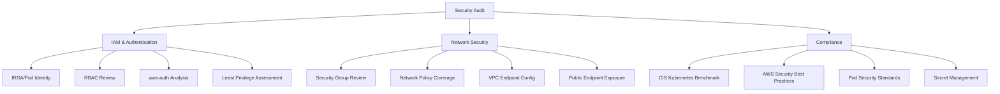

# Ops Security Audit

AWS/EKS security audit skill.

## Description

Performs comprehensive security audits including IAM, network security, and compliance.

## Trigger Keywords

- "security audit"
- "security check"
- "compliance"
- "security review"

## Audit Domains



### 1. IAM & Authentication

- IRSA/Pod Identity configuration audit
- RBAC Role and Binding review
- aws-auth ConfigMap analysis
- Least privilege assessment

### 2. Network Security

- Security Group rules review
- Network Policy coverage
- VPC Endpoint configuration
- Public endpoint exposure

### 3. Compliance

- CIS Kubernetes Benchmark checks
- AWS security best practices
- Pod Security Standards
- Secret management

## Quick Audit Commands

```bash
# Privileged containers
kubectl get pods -A -o json | jq '[.items[] | select(.spec.containers[].securityContext.privileged==true) | {name:.metadata.name,ns:.metadata.namespace}]'

# Pods running as root
kubectl get pods -A -o json | jq '[.items[] | select(.spec.securityContext.runAsUser==0 or .spec.containers[].securityContext.runAsUser==0) | {name:.metadata.name,ns:.metadata.namespace}]'

# Network policy coverage
kubectl get networkpolicies -A
kubectl get namespaces -o json | jq '.items[].metadata.name' | while read ns; do echo "$ns: $(kubectl get networkpolicies -n $(echo $ns | tr -d '"') 2>/dev/null | wc -l) policies"; done

# Public services
kubectl get svc -A -o json | jq '[.items[] | select(.spec.type=="LoadBalancer") | {name:.metadata.name,ns:.metadata.namespace,type:.spec.type}]'
```

---

## CIS Benchmark Checklist Detail

### Control Plane (AWS Managed)

AWS manages these for EKS - verify they're enabled:

| # | Check | Verification Command |
|---|-------|---------------------|
| 1.1 | API server audit logging | `aws eks describe-cluster --name $CLUSTER_NAME --query 'cluster.logging'` |
| 1.2 | RBAC enabled | Always enabled on EKS |
| 1.3 | Admission controllers | PodSecurity, ResourceQuota active |

### Worker Nodes

| # | Check | Command | Expected |
|---|-------|---------|----------|
| 4.1 | kubelet authentication | Check kubelet config | anonymous-auth=false |
| 4.2 | kubelet authorization | Check kubelet config | mode=Webhook |
| 4.3 | Protect kubelet certificates | `kubectl get nodes -o json \| jq '.items[].status.daemonEndpoints'` | Port 10250 only |

### Workload Security

| # | Check | Command | Expected |
|---|-------|---------|----------|
| 5.1 | No privileged containers | `kubectl get pods -A -o json \| jq '[.items[] \| select(.spec.containers[].securityContext.privileged==true)]'` | Empty (except system) |
| 5.2 | No root containers | Check securityContext | runAsNonRoot=true |
| 5.3 | No hostNetwork | Check pod spec | hostNetwork=false |
| 5.4 | No hostPID | Check pod spec | hostPID=false |
| 5.5 | No hostIPC | Check pod spec | hostIPC=false |
| 5.6 | Read-only root FS | Check securityContext | readOnlyRootFilesystem=true |
| 5.7 | Drop ALL capabilities | Check securityContext | capabilities.drop=["ALL"] |

### Network Security

| # | Check | Command | Expected |
|---|-------|---------|----------|
| 6.1 | Network policies | `kubectl get networkpolicies -A` | All namespaces covered |
| 6.2 | Private endpoint | Check cluster config | privateAccess=true |
| 6.3 | Restricted public access | Check publicAccessCidrs | Not 0.0.0.0/0 |

---

## IAM Audit Detail

### IRSA Verification

#### Check All Service Account Annotations

```bash
# List all IRSA-annotated service accounts
kubectl get sa -A -o json | jq '.items[] | select(.metadata.annotations["eks.amazonaws.com/role-arn"] != null) | {namespace:.metadata.namespace, name:.metadata.name, role:.metadata.annotations["eks.amazonaws.com/role-arn"]}'
```

#### Verify Trust Policies

```bash
# For each IRSA role, verify trust policy is scoped correctly
ROLE_NAME=<role-name>
aws iam get-role --role-name $ROLE_NAME --query 'Role.AssumeRolePolicyDocument'

# Trust policy should:
# 1. Limit to specific OIDC provider
# 2. Limit to specific namespace:serviceaccount
# 3. Use StringEquals (not StringLike) where possible
```

#### Check IRSA Permissions

```bash
# List all policies attached to an IRSA role
aws iam list-attached-role-policies --role-name $ROLE_NAME
aws iam list-role-policies --role-name $ROLE_NAME

# Check for overly permissive policies
aws iam get-role-policy --role-name $ROLE_NAME --policy-name <policy> | jq '.PolicyDocument.Statement[] | select(.Action=="*" or .Resource=="*")'
```

### Pod Identity Checks

```bash
# List all Pod Identity associations
aws eks list-pod-identity-associations --cluster-name $CLUSTER_NAME

# Check each association
for assoc_id in $(aws eks list-pod-identity-associations --cluster-name $CLUSTER_NAME --query 'associations[].associationId' --output text); do
  aws eks describe-pod-identity-association --cluster-name $CLUSTER_NAME --association-id $assoc_id
done
```

### RBAC Analysis Commands

#### Overly Permissive Roles

```bash
# Find cluster-admin bindings
kubectl get clusterrolebindings -o json | jq '.items[] | select(.roleRef.name=="cluster-admin") | {name:.metadata.name, subjects:.subjects}'

# Find roles with wildcard permissions
kubectl get clusterroles -o json | jq '.items[] | select(.rules[].verbs[] == "*" or .rules[].resources[] == "*") | .metadata.name'

# Check specific user/SA permissions
kubectl auth can-i --list --as=system:serviceaccount:<ns>:<sa>
```

#### aws-auth ConfigMap Audit

```bash
# View current mappings
kubectl get configmap aws-auth -n kube-system -o yaml

# Check for:
# 1. Unnecessary admin mappings
# 2. Stale role ARNs
# 3. Overly broad group mappings (system:masters)
```

#### Access Entry Audit (EKS API)

```bash
# List all access entries
aws eks list-access-entries --cluster-name $CLUSTER_NAME

# Check each entry
for principal in $(aws eks list-access-entries --cluster-name $CLUSTER_NAME --query 'accessEntries[]' --output text); do
  echo "=== $principal ==="
  aws eks list-associated-access-policies --cluster-name $CLUSTER_NAME --principal-arn $principal
done
```

### IAM Security Best Practices Checklist

| Check | Command | Expected |
|-------|---------|----------|
| No wildcard IAM policies | Check IRSA role policies | No `*` in Action/Resource |
| Trust policy scoped | Check AssumeRolePolicyDocument | Specific namespace:SA |
| No stale IRSA roles | Cross-reference SA and roles | All roles have active SAs |
| Minimal cluster-admin | Check ClusterRoleBindings | Only essential bindings |
| Pod Identity preferred | Check associations vs IRSA | Migrated where possible |
| Audit logging enabled | Check cluster config | authenticator + audit enabled |

---

## Pod Security Standards Guide

### Comparison Table

| Feature | Privileged | Baseline | Restricted |
|---------|------------|----------|------------|
| **hostNetwork** | Allowed | Not allowed | Not allowed |
| **hostPID** | Allowed | Not allowed | Not allowed |
| **hostIPC** | Allowed | Not allowed | Not allowed |
| **privileged** | Allowed | Not allowed | Not allowed |
| **capabilities** | All allowed | Drop some | Must drop ALL, only add NET_BIND_SERVICE |
| **hostPath** | Allowed | Limited | Not allowed |
| **runAsNonRoot** | No requirement | No requirement | Required (true) |
| **runAsUser** | No requirement | No requirement | Must be non-zero |
| **seccompProfile** | No requirement | No requirement | RuntimeDefault or Localhost |
| **allowPrivilegeEscalation** | No requirement | No requirement | Must be false |

### Enforcement Commands

```bash
# Check namespace labels for Pod Security Standards
kubectl get ns -o json | jq '.items[] | {name:.metadata.name, labels:.metadata.labels}' | grep -A3 "pod-security"

# Apply restricted policy to namespace
kubectl label namespace <ns> pod-security.kubernetes.io/enforce=restricted
kubectl label namespace <ns> pod-security.kubernetes.io/warn=restricted
kubectl label namespace <ns> pod-security.kubernetes.io/audit=restricted
```

### Recommended Pod Security Context

```yaml
apiVersion: v1
kind: Pod
spec:
  securityContext:
    runAsNonRoot: true
    runAsUser: 1000
    fsGroup: 1000
    seccompProfile:
      type: RuntimeDefault
  containers:
  - name: app
    securityContext:
      allowPrivilegeEscalation: false
      readOnlyRootFilesystem: true
      capabilities:
        drop:
          - ALL
```

---

## Network Security Audit

### Security Group Audit

#### EKS Cluster Security Groups

```bash
# Get cluster security group
CLUSTER_SG=$(aws eks describe-cluster --name $CLUSTER_NAME --query 'cluster.resourcesVpcConfig.clusterSecurityGroupId' --output text)

# Check rules
aws ec2 describe-security-group-rules --filter Name=group-id,Values=$CLUSTER_SG --query 'SecurityGroupRules[].{Direction:IsEgress,Protocol:IpProtocol,FromPort:FromPort,ToPort:ToPort,Source:CidrIpv4,SourceSG:ReferencedGroupInfo.GroupId}'
```

#### Node Security Groups

```bash
# Find node security groups
aws ec2 describe-instances \
  --filters Name=tag:eks:cluster-name,Values=$CLUSTER_NAME \
  --query 'Reservations[].Instances[].SecurityGroups[].GroupId' --output text | sort -u | while read sg; do
  echo "=== $sg ==="
  aws ec2 describe-security-group-rules --filter Name=group-id,Values=$sg --query 'SecurityGroupRules[?!IsEgress].{Protocol:IpProtocol,FromPort:FromPort,ToPort:ToPort,Source:CidrIpv4,SourceSG:ReferencedGroupInfo.GroupId}'
done
```

#### Security Group Red Flags

| Finding | Risk | Remediation |
|---------|------|-------------|
| Inbound 0.0.0.0/0 on non-443/80 | HIGH | Restrict to specific CIDRs |
| Outbound 0.0.0.0/0 all ports | MEDIUM | Restrict to necessary services |
| SSH (22) open to 0.0.0.0/0 | CRITICAL | Use SSM Session Manager instead |
| Unused security groups | LOW | Clean up stale SGs |

### Network Policy Audit

#### Coverage Assessment

```bash
# Namespaces without network policies
for ns in $(kubectl get ns -o jsonpath='{.items[*].metadata.name}'); do
  policies=$(kubectl get networkpolicies -n $ns 2>/dev/null | tail -n +2 | wc -l)
  if [ "$policies" -eq "0" ]; then
    echo "WARNING: $ns has no network policies"
  fi
done
```

#### Default Deny Policy Template

```yaml
# Apply to every namespace for zero-trust
apiVersion: networking.k8s.io/v1
kind: NetworkPolicy
metadata:
  name: default-deny-all
spec:
  podSelector: {}
  policyTypes:
    - Ingress
    - Egress
```

### VPC Endpoint Audit

```bash
# List existing VPC endpoints
aws ec2 describe-vpc-endpoints --filters Name=vpc-id,Values=<vpc-id> --query 'VpcEndpoints[].{Service:ServiceName,Type:VpcEndpointType,State:State}'

# Recommended endpoints for EKS
# - com.amazonaws.REGION.ec2
# - com.amazonaws.REGION.ecr.api
# - com.amazonaws.REGION.ecr.dkr
# - com.amazonaws.REGION.s3
# - com.amazonaws.REGION.sts
# - com.amazonaws.REGION.logs
# - com.amazonaws.REGION.elasticloadbalancing
```

### Cluster Endpoint Access

```bash
# Check endpoint access configuration
aws eks describe-cluster --name $CLUSTER_NAME --query 'cluster.resourcesVpcConfig.{publicAccess:endpointPublicAccess,privateAccess:endpointPrivateAccess,publicCIDRs:publicAccessCidrs}'

# Best practice: Private access + restricted public CIDRs
# Never: Public access from 0.0.0.0/0 in production
```

---

## AWS EKS Security Best Practices

### Identity & Access

- [ ] Use IRSA or Pod Identity (never node IAM role for workloads)
- [ ] Scope IRSA trust policies to specific namespace:serviceaccount
- [ ] Minimize cluster-admin ClusterRoleBindings
- [ ] Enable EKS access entries (migrate from aws-auth)
- [ ] Rotate IAM credentials regularly
- [ ] Enable MFA for human users

### Network

- [ ] Enable VPC endpoints for AWS services
- [ ] Use private cluster endpoint (or restrict public CIDRs)
- [ ] Deploy network policies in all namespaces
- [ ] Use Security Groups for Pods where needed
- [ ] Enable VPC Flow Logs for audit

### Data Protection

- [ ] Enable EKS secrets encryption with KMS
- [ ] Use encrypted EBS volumes (gp3 with KMS)
- [ ] Use IRSA for Secrets Manager/Parameter Store access
- [ ] Never store secrets in ConfigMaps
- [ ] Use external-secrets-operator for secret rotation

### Monitoring & Audit

- [ ] Enable control plane logging (api + audit + authenticator)
- [ ] Enable Container Insights
- [ ] Set up CloudTrail for AWS API auditing
- [ ] Create alarms for security events
- [ ] Enable GuardDuty EKS protection

### Runtime Security

- [ ] Use Bottlerocket or AL2023 (minimal OS)
- [ ] Enable Pod Security Standards (Restricted)
- [ ] Deploy admission webhooks (OPA/Kyverno)
- [ ] Scan container images (ECR scanning, Trivy)
- [ ] Use read-only root filesystems

---

## Quick Compliance Check Script

```bash
#!/bin/bash
echo "=== EKS Security Quick Check ==="
CLUSTER=$1

echo "--- Endpoint Access ---"
aws eks describe-cluster --name $CLUSTER --query 'cluster.resourcesVpcConfig.{public:endpointPublicAccess,private:endpointPrivateAccess,cidrs:publicAccessCidrs}'

echo "--- Logging ---"
aws eks describe-cluster --name $CLUSTER --query 'cluster.logging.clusterLogging[?enabled==`true`].types[]'

echo "--- Encryption ---"
aws eks describe-cluster --name $CLUSTER --query 'cluster.encryptionConfig'

echo "--- Privileged Containers ---"
kubectl get pods -A -o json | jq '[.items[] | select(.spec.containers[].securityContext.privileged==true) | {name:.metadata.name,ns:.metadata.namespace}] | length'

echo "--- Root Containers ---"
kubectl get pods -A -o json | jq '[.items[] | select(.spec.securityContext.runAsUser==0) | {name:.metadata.name,ns:.metadata.namespace}] | length'

echo "--- Network Policies ---"
kubectl get networkpolicies -A --no-headers | wc -l

echo "--- cluster-admin Bindings ---"
kubectl get clusterrolebindings -o json | jq '[.items[] | select(.roleRef.name=="cluster-admin") | .metadata.name]'
```

---

## Team Mode

"security audit" requests may trigger team-based parallel audits:

| Trigger | Team Name | Composition |
|---------|-----------|-------------|
| Security audit request | `ops-security-audit` | iam + network + storage parallel audit |

## Usage Examples

### Full Security Audit

```
Please run a cluster security audit.
```

Security Audit skill runs automatically:
1. IAM/RBAC configuration review
2. Network security review
3. Compliance checklist verification
4. Report findings by risk level

### Specific Domain Audit

```
Please audit IRSA configuration.
```

Security Audit performs:
1. OIDC provider verification
2. Service Account annotation check
3. Trust Policy analysis
4. IAM Policy permissions review

## Output Format

```
# Security Audit Report

## Summary
- Audit Date: [timestamp]
- Cluster: [name]
- Overall Risk: LOW / MEDIUM / HIGH / CRITICAL

## Findings

| # | Severity | Domain | Finding | Recommendation |
|---|----------|--------|---------|----------------|
| 1 | CRITICAL | IAM | [Finding] | [Fix] |
| 2 | HIGH | Network | [Finding] | [Fix] |

## Compliance Checklist
- [ ] No privileged containers in workloads
- [ ] All pods run as non-root
- [ ] Network policies in all namespaces
- [ ] IRSA/Pod Identity for all AWS access
- [ ] Secrets encrypted with KMS
- [ ] Control plane audit logging enabled
- [ ] VPC endpoints for AWS services
- [ ] Cluster endpoint private access
```

## Reference Files

- `references/iam-audit.md` - IAM, IRSA, Pod Identity, RBAC audit
- `references/network-security.md` - Security Groups, Network Policies, VPC Endpoints
- `references/compliance-checklist.md` - CIS Benchmark, best practices checklist
