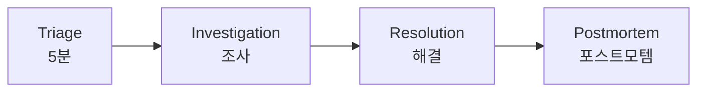

# Ops Troubleshoot

체계적인 AWS/EKS 트러블슈팅 워크플로우 스킬입니다.

## 설명

5분 트리아지 → 조사 → 해결 → 포스트모템의 체계적인 워크플로우를 제공합니다.

## 트리거 키워드

- "troubleshoot"
- "debug"
- "장애"
- "문제 해결"
- "incident"

## 워크플로우



### Phase 1: Triage (5분)

1. **클러스터 상태** - `kubectl cluster-info`, `kubectl get nodes -o wide`
2. **실패한 워크로드** - `kubectl get pods -A --field-selector=status.phase!=Running`
3. **최근 이벤트** - `kubectl get events -A --sort-by='.lastTimestamp' | tail -50`
4. **시스템 파드** - `kubectl get pods -n kube-system`
5. **리소스 사용량** - `kubectl top nodes`, `kubectl top pods -A --sort-by=memory | head -20`
6. **AWS 상태** - `aws eks describe-cluster --name $CLUSTER_NAME --query 'cluster.status'`

### Phase 2: Investigation

1. 증상 도메인 식별 (network, auth, storage, compute, observability)
2. 적절한 전문 에이전트로 라우팅
3. 도메인별 진단 명령어로 데이터 수집
4. 알려진 오류 패턴과 대조

### Phase 3: Resolution

1. 수정 적용 (설정 변경, 스케일링, 재시작 등)
2. 수정이 증상을 해결하는지 검증
3. 회귀 모니터링 (5-15분)

### Phase 4: Postmortem

1. 인시던트 문서화 (타임라인, 영향, 근본원인)
2. 예방 조치 식별
3. 새로운 패턴 발견 시 런북 업데이트

## 심각도 분류

| 레벨 | 대응 | 기준 |
|------|------|------|
| P1 Critical | < 5분 | 서비스 중단, 데이터 손실 위험 |
| P2 High | < 30분 | 주요 기능 저하, 높은 오류율 |
| P3 Medium | < 4시간 | 경미한 영향, 단일 컴포넌트 |
| P4 Low | 다음 영업일 | 경고, 최적화 |

## 사용 예시

```
파드가 계속 CrashLoopBackOff 상태야. 트러블슈팅 해줘.
```

워크플로우가 자동으로 시작됩니다:
1. 5분 트리아지로 전체 상황 파악
2. eks-agent로 라우팅하여 파드 로그 분석
3. 근본원인 파악 후 해결책 제시
4. 검증 및 재발 방지 권장

## 참조 파일

- `references/troubleshooting-framework.md` - 체계적 접근법 및 명령어
- `references/incident-response.md` - 5분 체크리스트, 심각도 매트릭스
- `references/decision-trees.md` - 일반적인 시나리오를 위한 Mermaid 의사결정 트리
- `references/common-errors.md` - 오류 메시지 → 해결책 매핑
