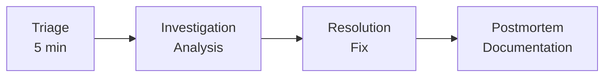
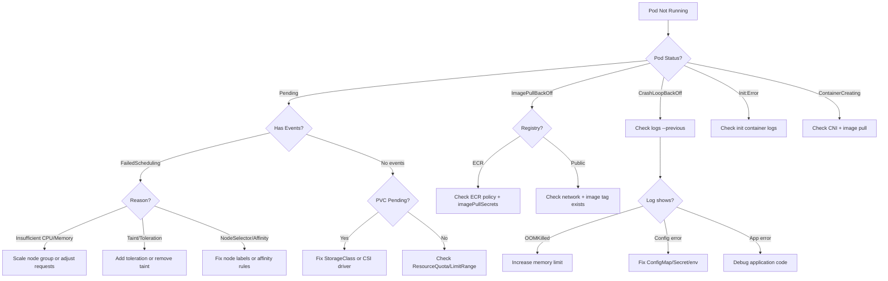
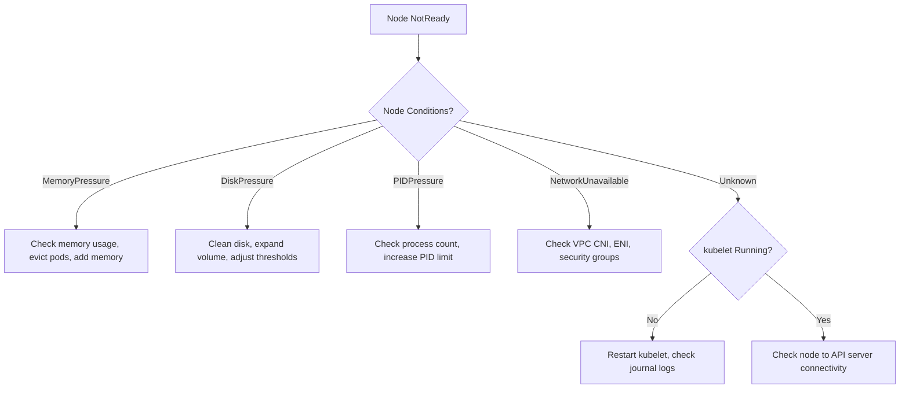
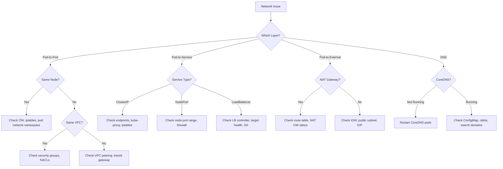
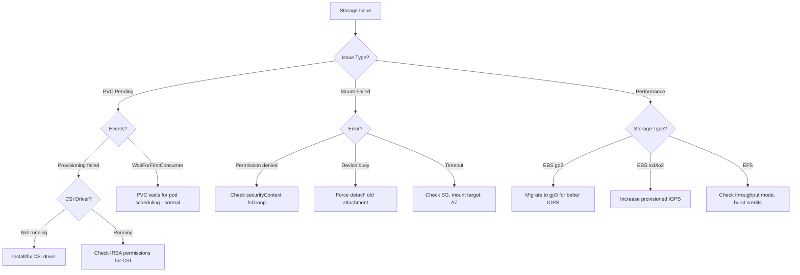

# Ops Troubleshoot

Systematic AWS/EKS troubleshooting workflow skill.

## Description

Provides a systematic workflow: 5-minute triage → investigation → resolution → postmortem.

## Trigger Keywords

- "troubleshoot"
- "debug"
- "incident"
- "problem solving"

## Workflow Overview



### Phase 1: Triage (5 minutes)

1. **Cluster Status** - `kubectl cluster-info`, `kubectl get nodes -o wide`
2. **Failed Workloads** - `kubectl get pods -A --field-selector=status.phase!=Running`
3. **Recent Events** - `kubectl get events -A --sort-by='.lastTimestamp' | tail -50`
4. **System Pods** - `kubectl get pods -n kube-system`
5. **Resource Usage** - `kubectl top nodes`, `kubectl top pods -A --sort-by=memory | head -20`
6. **AWS Status** - `aws eks describe-cluster --name $CLUSTER_NAME --query 'cluster.status'`

### Phase 2: Investigation

1. Identify symptom domain (network, auth, storage, compute, observability)
2. Route to appropriate specialist agent
3. Collect diagnostic data using domain-specific commands
4. Cross-reference with known error patterns

### Phase 3: Resolution

1. Apply fix (configuration change, scaling, restart, etc.)
2. Verify fix resolves the symptom
3. Monitor for regression (5-15 minutes)

### Phase 4: Postmortem

1. Document incident (timeline, impact, root cause)
2. Identify preventive measures
3. Update runbooks if new pattern discovered

## Severity Classification

| Level | Response | Criteria |
|-------|----------|----------|
| P1 Critical | < 5 min | Service outage, data loss risk |
| P2 High | < 30 min | Major degradation, high error rate |
| P3 Medium | < 4 hr | Minor impact, single component |
| P4 Low | Next business day | Warning, optimization |

---

## Decision Trees (Extended)

### Pod Not Starting Decision Tree



### Node Not Ready Decision Tree



### Network Connectivity Decision Tree



### Storage Issue Decision Tree



---

## Error to Solution Mapping Table

### Cluster Errors

| Error Message | Root Cause | Solution |
|---------------|------------|----------|
| `Unable to connect to the server` | API server unreachable | Check VPC endpoint, SG, kubeconfig |
| `error: the server doesn't have a resource type` | API version mismatch | Update kubectl version |
| `Unauthorized` | Invalid/expired token | `aws eks update-kubeconfig --name <cluster>` |
| `certificate signed by unknown authority` | Wrong CA | Update kubeconfig with correct cluster |

### Node Errors

| Error Message | Root Cause | Solution |
|---------------|------------|----------|
| `NodeNotReady` | kubelet stopped, network issue | Check kubelet: `journalctl -u kubelet -n 100` |
| `MemoryPressure` | Node memory exhaustion | Evict pods, increase node size |
| `DiskPressure` | Disk full | Clean images: `crictl rmi --prune`, expand disk |
| `PIDPressure` | Too many processes | Increase PID limit, check for fork bombs |
| `NetworkUnavailable` | CNI plugin failure | Restart aws-node DaemonSet |
| `Taint node.kubernetes.io/not-ready` | Node not ready | Fix underlying condition |
| `node has insufficient CPU/memory` | Resource exhaustion | Scale out node group |

### Pod Errors

| Error Message | Root Cause | Solution |
|---------------|------------|----------|
| `CrashLoopBackOff` | App crash, OOM, config error | `kubectl logs <pod> --previous` |
| `ImagePullBackOff` | Wrong image/tag, auth failure | Check image name, imagePullSecrets |
| `ErrImagePull` | ECR login expired, network | Refresh ECR token, check SG |
| `OOMKilled` | Container exceeded memory limit | Increase memory limit |
| `Evicted` | Node resource pressure | Set resource limits, increase node capacity |
| `CreateContainerConfigError` | Missing ConfigMap/Secret | Verify ConfigMap/Secret exists |
| `FailedScheduling: Insufficient cpu` | No node has enough CPU | Scale out or reduce resource requests |
| `FailedScheduling: pod has unbound PVCs` | PVC not bound | Check StorageClass, CSI driver |

### Network Errors

| Error Message | Root Cause | Solution |
|---------------|------------|----------|
| `InsufficientFreeAddressesInSubnet` | IP exhaustion | Add secondary CIDR, enable prefix delegation |
| `ENI limit reached` | Instance type ENI limit | Use larger instance or prefix delegation |
| `dial tcp: lookup <service>: no such host` | DNS failure | Check CoreDNS, ndots setting |
| `connection refused` | Service not listening | Check pod port, targetPort, service selector |
| `context deadline exceeded` | Timeout | Check SG rules, network policy, routing |
| `502 Bad Gateway` (ALB) | Target unhealthy | Check pod readiness, health check path |
| `503 Service Temporarily Unavailable` | No healthy targets | Check target group registration |

### Storage Errors

| Error Message | Root Cause | Solution |
|---------------|------------|----------|
| `FailedAttachVolume` | AZ mismatch, volume busy | Match PV AZ, force detach old |
| `FailedMount` | Mount point error, SG | Check mount target SG (EFS), device path |
| `MountVolume.SetUp failed for volume` | Filesystem error | Check fsType, securityContext |
| `volume already attached to another node` | Stale attachment | Delete VolumeAttachment, force detach |

### IAM/Auth Errors

| Error Message | Root Cause | Solution |
|---------------|------------|----------|
| `AccessDenied` | Missing IAM permission | Add policy to role |
| `Forbidden: User "system:anonymous"` | Authentication failed | Fix aws-auth ConfigMap or access entries |
| `could not get token` (IRSA) | OIDC provider issue | Verify OIDC provider, trust policy |
| `WebIdentityErr` | Trust policy mismatch | Fix condition in IAM trust policy |
| `AccessDenied when calling AssumeRoleWithWebIdentity` | IRSA misconfigured | Check SA annotation, OIDC, trust policy |

---

## Real-world Scenarios

### Scenario 1: CrashLoopBackOff

**Symptom**: Pod keeps restarting with CrashLoopBackOff status.

**Diagnosis Steps**:

```bash
# 1. Check pod status and restart count
kubectl get pod <pod-name> -n <namespace>

# 2. Check pod events
kubectl describe pod <pod-name> -n <namespace> | grep -A 20 "Events:"

# 3. Check current container logs
kubectl logs <pod-name> -n <namespace>

# 4. Check previous container logs (crashed container)
kubectl logs <pod-name> -n <namespace> --previous

# 5. Check for OOMKilled
kubectl get pod <pod-name> -n <namespace> -o jsonpath='{.status.containerStatuses[*].lastState.terminated.reason}'
```

**Common Causes and Resolutions**:

| Cause | Log Pattern | Resolution |
|-------|-------------|------------|
| OOMKilled | Exit code 137, "OOMKilled" in terminated reason | Increase `resources.limits.memory` |
| Config error | "file not found", "env variable not set" | Fix ConfigMap/Secret mounting |
| Dependency failure | "connection refused", "ECONNREFUSED" | Check dependent service availability |
| App bug | Application-specific stack trace | Fix application code |
| Health check fail | "Liveness probe failed" in events | Adjust probe timing or fix health endpoint |

**Resolution Example (OOMKilled)**:

```yaml
# Before: Insufficient memory
resources:
  limits:
    memory: "128Mi"

# After: Increased memory with buffer
resources:
  limits:
    memory: "512Mi"
  requests:
    memory: "256Mi"
```

### Scenario 2: ImagePullBackOff

**Symptom**: Pod stuck in ImagePullBackOff or ErrImagePull status.

**Diagnosis Steps**:

```bash
# 1. Check pod events for specific error
kubectl describe pod <pod-name> -n <namespace> | grep -A 5 "Events:"

# 2. Verify image name and tag
kubectl get pod <pod-name> -n <namespace> -o jsonpath='{.spec.containers[*].image}'

# 3. For ECR, check node IAM permissions
aws sts get-caller-identity  # Run from node via SSM

# 4. Check imagePullSecrets
kubectl get pod <pod-name> -n <namespace> -o jsonpath='{.spec.imagePullSecrets}'

# 5. Test ECR login manually
aws ecr get-login-password --region <region> | docker login --username AWS --password-stdin <account>.dkr.ecr.<region>.amazonaws.com
```

**Common Causes and Resolutions**:

| Cause | Resolution |
|-------|------------|
| Image doesn't exist | Verify image:tag in registry |
| ECR permissions | Add `ecr:GetDownloadUrlForLayer`, `ecr:BatchGetImage` to node role |
| Private registry no secret | Create imagePullSecret and reference in pod spec |
| Network blocked | Check security groups allow outbound 443 to registry |

### Scenario 3: OOMKilled Investigation

**Symptom**: Container terminates with OOMKilled reason.

**Full Diagnosis Walkthrough**:

```bash
# 1. Confirm OOMKilled
kubectl get pod <pod> -n <ns> -o json | jq '.status.containerStatuses[] | {name:.name, restartCount:.restartCount, lastState:.lastState}'

# 2. Check current memory usage
kubectl top pod <pod> -n <ns> --containers

# 3. Check memory limits
kubectl get pod <pod> -n <ns> -o json | jq '.spec.containers[] | {name:.name, limits:.resources.limits}'

# 4. Check node memory pressure
kubectl describe node <node> | grep -A 5 "Conditions:"

# 5. Historical memory usage (if metrics-server available)
kubectl get --raw "/apis/metrics.k8s.io/v1beta1/namespaces/<ns>/pods/<pod>" | jq '.containers[].usage'
```

**Resolution Strategy**:

1. **Short-term**: Increase memory limit to 1.5-2x current peak usage
2. **Medium-term**: Profile application to find memory leaks
3. **Long-term**: Implement proper memory management in application

```yaml
# Recommended resource configuration
resources:
  requests:
    memory: "256Mi"   # Average usage
    cpu: "100m"
  limits:
    memory: "512Mi"   # Peak usage + 25% buffer
    cpu: "500m"       # Allow burst
```

---

## Usage Example

```
Pods keep CrashLoopBackOff. Please troubleshoot.
```

Workflow starts automatically:
1. 5-minute triage for overall situation assessment
2. Route to eks-agent for pod log analysis
3. Identify root cause and propose solution
4. Verify and recommend recurrence prevention

## Reference Files

- `references/troubleshooting-framework.md` - Systematic approach and commands
- `references/incident-response.md` - 5-minute checklist, severity matrix
- `references/decision-trees.md` - Mermaid decision trees for common scenarios
- `references/common-errors.md` - Error message to solution mapping
