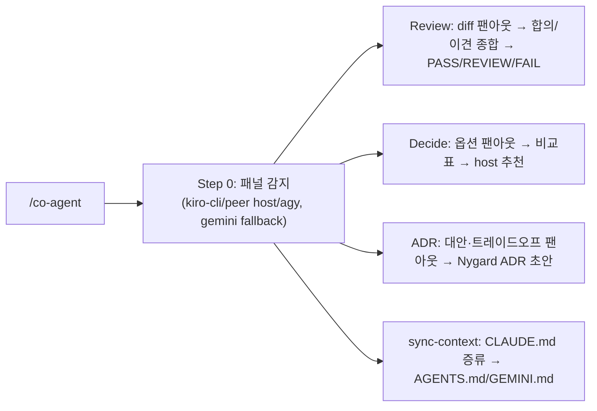

# co-agent 개요

co-agent는 **다른 AI 에이전트(Kiro CLI, peer host CLI, Agy 우선/Gemini fallback)와 협업**해 second opinion을 받고, **현재 host가 의장(chair)으로 최종 종합**하는 플러그인입니다. Claude Code에서는 Claude가, Codex에서는 Codex가 의장입니다. 네 가지 모드를 제공합니다: 멀티-AI 리뷰, 의사결정 보조, ADR 협업, AI 컨텍스트 동기화.

## 구성 요소

### 에이전트 (1개)

| 에이전트 | 설명 | 출력물 |
|----------|------|--------|
| `co-agent` | 멀티-AI 패널 의장 — 리뷰/의사결정/ADR 프롬프트를 외부 AI에 팬아웃하고 현재 host가 종합 | 리뷰 보고서 / 의사결정표 / ADR |

### 스킬 (1개)

| 스킬 | 설명 |
|------|------|
| `co-agent` | 4-모드 멀티-AI 협업 (review · decide · adr · sync-context) |

### 명령 (2개)

| 명령 | 설명 |
|------|------|
| `/co-agent:configure` | host-aware 패널 설정 — AI별 `model`, 지원되는 `effort`, `enabled`, `timeout`, `autosync` 토글 |
| `/co-agent:sync-context` | `CLAUDE.md` 증류 → `AGENTS.md`(Codex) + `GEMINI.md`(Gemini fallback) 생성 |

## 사전 요구사항 (선택적 — 있는 것만 사용)

외부 AI CLI 중 **설치된 것만** 패널로 활용합니다. 하나도 없으면 현재 host 단독 수행 + 그 사실을 명시 (절대 hard-fail 안 함).

| AI | CLI | 비고 |
|----|-----|------|
| Kiro | `kiro-cli` | 인터랙티브 로그인 **또는** `KIRO_API_KEY`로 헤드리스 인증 (둘 중 하나). 미인증 시 호출 시점에 에러→스킵 |
| Claude | `claude` | Codex host에서 peer reviewer로 사용 |
| Codex | `codex` | Claude Code host에서 `codex exec -s read-only`로 사용 |
| Agy | `agy` | 우선 사용 |
| Gemini | `gemini` | `agy`가 없을 때만 legacy fallback |

## 네 가지 모드

| 모드 | 트리거 | 동작 |
|------|--------|------|
| **Review** | "다른 AI로 리뷰", "second opinion", "멀티 AI" | 같은 리뷰 프롬프트를 패널에 병렬 팬아웃 → host가 합의/이견 종합 + Well-Architected → PASS/REVIEW/FAIL |
| **Decide** | "잘 모르겠어", "의사결정 도와", "협업해서 결정" | 결정+옵션을 패널에 질의 → 비교표(옵션×AI) → host 단일 추천 + 결정 트레이드오프 |
| **ADR** | "ADR 협업" | 패널에서 대안·트레이드오프·리스크 수집 → host가 Nygard ADR 초안 (project-init `/add-adr` 연동) |
| **sync-context** | `/co-agent:sync-context`, "AI 컨텍스트 동기화" | `CLAUDE.md`를 증류해 Codex(`AGENTS.md`)·Gemini fallback(`GEMINI.md`)용 컨텍스트 파일 생성 (Kiro는 `CLAUDE.md` 직접 사용) |

## 의장 원칙 (Chair Principle)

- 외부 AI는 **자문**, **현재 host가 최종 결정·작성**.
- 핵심 포인트는 **출처 표기**("Agy가 지적함"), **이견은 숨기지 않고 표면화**.
- CLI 누락/에러 → 해당 AI 스킵·기록 후 진행. 단일 AI에 차단되지 않음.
- 모든 AI에 **동일 프롬프트** → 답변 비교 가능.

## 판정 기준 (Review 모드)

| 판정 | 조건 | 결과 |
|------|------|------|
| **PASS** | CRITICAL 0개, HIGH ≤ 2개 | 통과 |
| **REVIEW** | CRITICAL 0개, HIGH ≥ 3개 | 수동 승인 필요 |
| **FAIL** | CRITICAL ≥ 1개 | 머지 차단 + 수정 권고 |

## 패널 설정 (`/co-agent:configure`)

패널을 레이어드 설정으로 튜닝합니다 — `co-agent.defaults.json`(커밋) ← `.claude/co-agent.local.json`(gitignore). **CLI가 헤드리스로 실제 받는 것만** 노출합니다 (죽은 설정 없음).

| 설정 | kiro | claude | codex | agy | gemini fallback |
|------|------|--------|-------|-----|-----------------|
| `model` | `--model` | `--model` | `-m` | `--model` | `-m` |
| `effort` | — | `--effort` | `-c model_reasoning_effort` | — | — |
| `enabled` / `timeout` | yes | yes | yes | yes | yes |
| `autosync` (글로벌, on/off) | `CLAUDE.md` 변경 시 `/co-agent:sync-context` 자동 실행 (옵트인, 기본 off) |

> `effort`는 헤드리스 effort 플래그가 있는 CLI(Claude/Codex)에만 노출합니다. 팬아웃이 설정값을 실시간으로 읽어 `enabled false`는 패널에서 제외되고 model/effort 플래그가 주입됩니다.

## AI 컨텍스트 동기화 (`/co-agent:sync-context`)

외부 AI가 프로젝트 컨벤션으로 리뷰하도록, `CLAUDE.md`를 **증류**해 각 CLI가 자동 로드하는 컨텍스트 파일을 생성합니다 (그대로 복사 ❌).

| AI | 파일 | 생성 |
|----|------|------|
| Kiro | `CLAUDE.md` 직접 | — |
| Codex | `AGENTS.md` (~32 KiB 캡) | ✅ |
| Gemini fallback | `GEMINI.md` (가볍게 유지) | ✅ |

생성 마커(`claude-md-sha`)로 staleness를 추적하고, 마커 없는 수기 파일은 보호합니다. `CLAUDE.md` 편집 시 PostToolUse 훅이 drift를 알리며, `autosync on`이면 재동기화를 지시합니다.

## Auto-Invocation 키워드

| 한국어 | English |
|--------|---------|
| 다른 AI / 다른 AI로 리뷰 | second opinion / multi-AI review |
| AI 협업 / AI 패널 / 멀티 AI | collaborate with other AI |
| 잘 모르겠어 / 의사결정 도와 | help me decide |
| ADR 협업 | co-author ADR |
| AI 컨텍스트 동기화 | sync-context |
